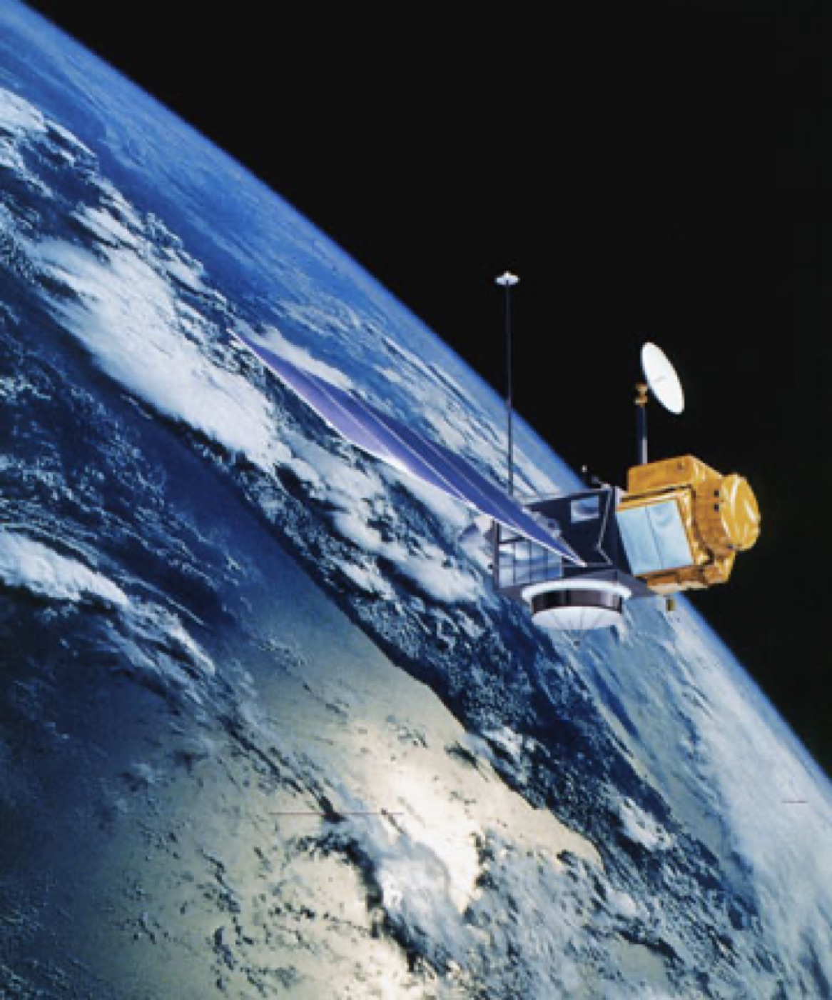
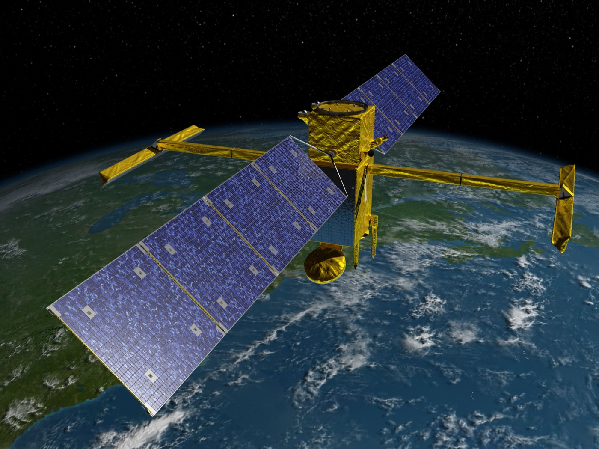
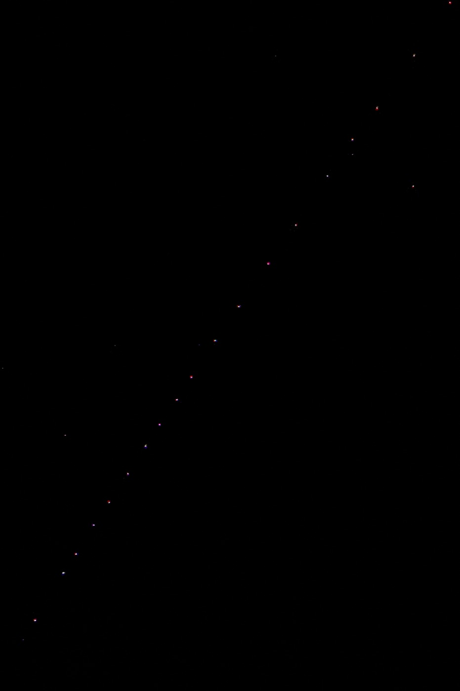

# 위성 기동 라벨 1,134건에 증거 등급이 하나씩 붙었다

_TLE·정밀 궤도·레이저 측거를 대조해 754건은 세 겹, 186건은 하나가 빈 채로 공개됐다_

## Executive Summary

> [!callout]
> 위성이 궤도를 바꾼 시각을 기계가 알아서 찾아내게 하려면, 진짜 기동이 언제 있었는지 적힌 라벨이 먼저 있어야 한다. 그런데 공개된 궤도 데이터에는 그런 라벨이 드물다. 대부분은 독립적인 근거가 딸려 있지 않거나, 탐지 알고리즘이 스스로 내놓은 출력이라 정답으로 쓸 수 없다. 9월 8일 arXiv에 올라온 MAD-LEO는 그 빈자리를 겨냥한 공개 데이터셋이다.

> 눈에 띄는 것은 라벨을 담는 방식이다. 연구진은 미션이 직접 보고한 기동 1,134건을 라벨로 삼되, 라벨 옆 칸에 그 사건을 뒷받침하는 독립 관측이 몇 겹인지를 A·B·C 등급으로 따로 적었다. 세 관측이 모두 확보된 것은 754건이고, 나머지 380건은 한두 겹이 빈 채로 그대로 공개됐다. 뒷받침이 얇다고 해서 그 라벨을 지우지는 않았다는 것이 이 설계의 뼈대다.

> 등급이 낮은 쪽이 실제로 나쁜 데이터인지는 저자들이 직접 쟀다. 5절까지는 논문이 잰 것과 저자가 스스로 밝힌 유보를 따라가고, 6절에서 데이터 라벨링 일반으로 옮겨 적는 부분은 논문에 없는 이 글의 해석이다.

### 주요 수치

출처: Guo 외 8인, [MAD-LEO: A Maneuver-Annotated Orbital Dataset for LEO Satellites with Tiered Multi-Source Evidence](https://arxiv.org/abs/2609.08556), arXiv:2609.08556(2026) Data Records·Technical Validation 절

<!-- stat-card -->
**1,134건** — 미션이 보고한 기동 라벨 — 측지·고도계 위성 11기, 1992년부터 2026년까지

<!-- stat-card -->
**754 / 194 / 186** — 증거 등급 A·B·C의 이벤트 수 — 세 관측 전부 / 레이저 측거 부족 / 주요 관측 하나 없음

<!-- stat-card -->
**91.8% vs 91.7%** — A등급과 B등급의 3시그마 커버리지 — 등급이 갈려도 잴 수 있는 지표에서는 거의 같다

<!-- stat-card -->
**92.6%** — 따로 만들어진 목록과 겹친 비율 — 선행 벤치마크 742건 가운데 687건이 대응

## 공개 데이터의 기동 라벨은 정답 노릇을 못 한다

저궤도는 빠르게 붐비고 있다. 논문이 인용한 집계로 스페이스X는 2025년 말까지 스타링크 위성을 9,000기 넘게 올렸고, 이 회사 한 곳이 6개월 보고 기간마다 충돌 회피 기동을 수만 번 수행한다. 규모가 이쯤 되면 궤도 유지와 회피가 일상 업무가 되고, 보고되지 않은 기동 하나가 충돌 위험 평가에 쓰는 예측 궤적을 통째로 무효로 만든다.

그래서 기동을 자동으로 찾아내려는 연구는 오래됐지만, 그 방법을 학습시키고 채점할 재료가 부족하다. 가장 널리 쓰이는 공개 궤도 데이터인 TLE는 시간 해상도가 낮고 오차 정보가 없어 정밀한 기동 분석에 한계가 있다. 센티미터급 정밀 궤도 산출물은 소수의 측지·고도계 임무에만 존재한다. 많은 연구가 결국 시뮬레이션 궤적으로 돌아가는데, 시뮬레이션은 실제 운용 조건을 다 담지 못한다.

남은 라벨의 사정도 좋지 않다. 저자들이 배경 절에서 정리한 진단은 간결하다. 공개된 기동 라벨은 대부분 독립적인 근거가 없거나, 그 자체가 탐지 방법의 출력이다. 그런 라벨은 평가의 정답 노릇을 할 수 없다. 가장 가까운 선행 자료도 위성 15기의 긴 TLE 이력에 기동 시각을 붙여 놓았을 뿐, 사건마다 어떤 독립 관측이 그 시각을 받쳐 주는지는 담고 있지 않다.

## 미션이 직접 보고한 것만 라벨로 썼다

MAD-LEO의 라벨은 탐지 결과가 아니라 운영 기관이 발행한 기동 이력에서 왔다. 국제 DORIS 서비스가 공개하는 미션 기동 이력을 파싱해 1,134건을 뽑았고, 대상은 DORIS 수신기를 실은 측지·고도계 위성 11기다. 1992년 8월 토펙스/포세이돈의 첫 기동에서 시작해 제이슨 1·2·3호, 크라이오샛-2, HY-2A, 사랄/알티카, 센티널-3A·3B, 센티널-6A를 거쳐 가장 최근의 SWOT까지, 2026년 7월 기록이 마지막이다. 라벨 표에는 `truth_status` 같은 상태 칸이 있어, 이 라벨이 탐지 알고리즘이 만든 값이 아니라 미션 보고임을 기록한다.

*▲ 토펙스/포세이돈 — MAD-LEO 라벨의 첫 기동(1992년 8월)이 기록된 위성 | Source: [NASA/JPL, Wikimedia Commons (Public Domain)](https://commons.wikimedia.org/wiki/File:TOPEX;Poseidon.jpg)*

각 기동에는 30시간짜리 분석 창이 붙는다. 보고된 시각 6시간 전부터 24시간 뒤까지로, 앞뒤가 다른 이유는 카탈로그 기록이 기동보다 늦게 따라오는 변화를 잡기 위해서다. 창을 어느 시각에 걸었는지도 표에 남는다. 1,134건 가운데 1,089건은 보고된 첫 점화 시각에 걸렸고, 나머지 45건은 그 기록이 가진 유일한 시각인 운용 종료 시각을 썼다. 반응이란 창 앞뒤로 궤도 장반경이 얼마나 달라졌는지를 미터로 잰 값이다. 이 45건의 반응 중앙값은 3.3m로 첫 점화 기준 20.7m보다 한참 작은데, 구간 단위 시각만 남긴 초기 토펙스/포세이돈 기록이 대부분이기 때문이다. 공개 라벨 어휘는 `event`, `no_event`, `ignore` 세 값인데 이번 릴리스에 `ignore`는 한 건도 없다. 유효한 UTC 시각을 정할 수 없거나 원본 기록과 충돌이 풀리지 않은 경우를 위해 남겨 둔 값이고, 여기에 한 문장이 붙는다. 증거가 부족하다는 것은 미션이 보고한 사건을 무시할 근거가 되지 않는다.

기동이 없었던 구간도 함께 만들었다. 위성마다 30시간 격자 위에서 기동 창과 겹치지 않는 구간을 골라 1,139개의 무기동 대조군을 세웠고, 그중 증거 구성을 이벤트 쪽과 맞춘 274개를 균형 평가용으로 권한다. 대조군 1,139개 가운데 14개 창은 TLE로 계산한 반응이 20m를 넘어 보고되지 않은 궤도 변화가 의심된다는 표시가 붙은 채 남아 있다. 그 가운데 7개는 2023년 초 SWOT이 궤도를 끌어올리던 시기에 걸쳐 있는데, DORIS 기동 이력이 그 기간을 담고 있지 않다. 지우는 대신 표시를 달아 두고, 검증 절에서 이 14개를 하나씩 들여다봤다.

*▲ SWOT — 열한 기 가운데 가장 최근 위성, 2023년 초 궤도 상승 구간이 대조군 14개 창 중 7개와 겹친다 | Source: [NASA/JPL, Wikimedia Commons (Public Domain)](https://commons.wikimedia.org/wiki/File:Surface_Water_and_Ocean_Topography_(SWOT).jpg)*

### 2.1. 스타링크 6,785기에는 라벨을 달지 않았다

데이터셋의 두 번째 축은 스타링크다. 운영자가 공개한 예측 궤도력과 같은 기간의 카탈로그 TLE를 짝지어 위성 6,785기, 2024년 11월 26일 06시부터 30일 17시(UTC)까지 107시간을 연속으로 담았다. 예측 상태만 4,336만 개가 넘고 간격은 60초다. 규모로 보면 앞의 1,134건과 비교가 되지 않는다.

*▲ 대열을 이룬 스타링크 위성들 — 이 서브셋 6,785기에는 검증된 기동 라벨이 없다 | Source: [Jakub Hałun, Wikimedia Commons (CC BY 4.0)](https://commons.wikimedia.org/wiki/File:Starlink_satellites_seen_from_Poland,_20241102_1749_2657.jpg)*

그런데 이쪽에는 라벨이 없다. 운영자가 공개하는 궤도력은 실시간 관측이 아니라 예측 궤적이어서 실제 운동과 다를 수 있고, 개별 위성의 검증된 기동 기록은 공개되지 않는다. 논문은 이 서브셋을 기동 정답으로 써서는 안 된다고 못 박고, 앞 서브셋에서 개발한 방법을 실제 운용 규모에서 시험하는 용도로 쓰라고 적었다. 라벨이 없다는 사실 자체를 데이터셋의 공개 항목으로 다룬 셈이다.

그렇다고 이 구간에 궤도 변화가 없었다고 적은 것은 아니다. 공개된 TLE 표에서 이웃한 두 시각 사이에 장반경이 100m 넘게 튀는 지점이 위성 2,909기에 걸쳐 10,498번 나타나고, 그 크기의 중앙값은 338m다. 다만 그중 57%는 고도 480km 아래 배치·전이 구간에 몰려 있어 공기 저항만으로도 비슷한 크기가 나온다는 단서가 함께 달렸다. 노라드 45184호의 경우 2024년 11월 26일 22시(UTC)에 장반경이 4.3km 내려앉아, 조용한 시기의 8시간치 감쇠인 0.28km보다 열다섯 배쯤 큰 변화가 잡혔다. 이런 자리를 본문에 적고도 라벨 칸은 비워 두었다.

## 같은 라벨에 A·B·C가 붙었다

1,134건은 모두 `event` 라벨을 달고 있지만, 각 창이 어떤 독립 관측으로 뒷받침되는지는 제각각이다. 연구진은 창 하나하나에서 세 관측원의 확보 여부를 판정했다. TLE는 창 시작 이전과 끝 이후에 카탈로그 시각이 각각 하나 이상 있어야 하고, 정밀 궤도 산출물은 창과 시간이 겹쳐야 하며, 위성레이저측거는 관측이 성겨서 창 앞뒤로 하루씩 늘린 구간에서 판정한다. 그 결과가 신뢰 등급 칸에 A·B·C로 들어간다.

*▲ 마운트 스트롬로 위성레이저측거 관측소 — A등급 판정에 필요한 세 관측원 가운데 가장 성긴 자원이다 | Source: [Mitch Ames, Wikimedia Commons (CC BY-SA 4.0)](https://commons.wikimedia.org/wiki/File:Mount_Stromlo_satellite_laser_ranging_facility_01.jpg)*

| 등급 | 확보된 관측 | 기동 이벤트 | 무기동 대조군 |
| --- | --- | --- | --- |
| A | TLE · 정밀 궤도 · 레이저 측거 세 가지 모두 | 754건 | 204개 |
| B | TLE와 정밀 궤도는 있으나 레이저 측거가 부족하거나 없음 | 194건 | 83개 |
| C | 주요 관측 가운데 하나 이상이 아예 없음 | 186건 | 852개 |

공개된 1,134개 이벤트와 1,139개 무기동 대조군의 등급 구성. 대조군 가운데 274개는 이벤트 쪽 증거 구성에 맞춘 균형 평가용 부분집합이다. 출처: arXiv:2609.08556 Data Records 절 및 그림 2.

센티널-6A는 예외 처리를 받았다. 이 위성에는 완성된 정밀 궤도 산출물이 없어 일일 GNSS 추적 파일이 궤도 확보의 자리를 대신한다. 그래서 라벨 수준 분석에는 들어가되, 궤도 상태가 필요한 지표에서는 아예 빠진다. 부분적으로만 갖춰진 자료를 버리지 않고 어디까지 쓸 수 있는지를 창 단위로 적은 사례다.

> [!callout]
> 신뢰 등급은 그 사건을 뒷받침하는 다중 관측이 얼마나 두꺼운지를 나타낼 뿐, 미션이 보고한 기동 라벨 자체가 얼마나 믿을 만한지를 나타내지 않는다. 저자들이 등급 정의 끝에 붙여 둔 문장이다. 라벨이 맞았는지는 등급으로 다시 판정하지 않고, 등급은 오직 근거의 두께만 기록한다.

세 관측이 다 갖춰지지 않은 창은 380개다. 그 하나하나에 어떤 원천이 빠졌는지가 기계가 읽을 수 있는 표시로 정렬 표에 들어 있다. 등급 한 글자로 뭉개지 않고 무엇이 없는지까지 남긴 것이라, 사용자는 자기 분석에 꼭 필요한 원천 기준으로 다시 거를 수 있다.

## 등급이 갈리는 자리는 관측 시대였다

등급을 붙여 놓았으면 그다음 질문은 하나다. 등급이 낮은 창은 실제로 품질이 낮은가. 일곱 개 검증 묶음 가운데 여섯 번째가 이 물음을 정면으로 다룬다.

궤도를 기준으로 삼는 두 지표는 정밀 궤도가 있어야 계산되므로 A와 B에서만 비교할 수 있다. 그 집합에서 두 등급은 거의 붙어 있다. 3시그마 커버리지가 91.8%(A)와 91.7%(B), 부호 일치가 96.4%와 94.9%, 주기 평균 궤도 반응의 중앙값이 22.0m와 28.0m다. 반면 모든 창에서 계산되는 TLE 반응은 등급별로 중앙값이 20.2m(A), 15.5m(B), 31.8m(C)로 움직이고, C등급 분포는 75퍼센타일이 1.87km에 이르는 두꺼운 꼬리를 단다. A등급과의 콜모고로프-스미르노프 거리는 0.30이고 p값은 3.5×10⁻¹²다. A와 B의 반응 분포도 통계적으로는 갈리지만(거리 0.13, p값 0.014), C등급 쪽과 견주면 차이의 폭이 작다.
