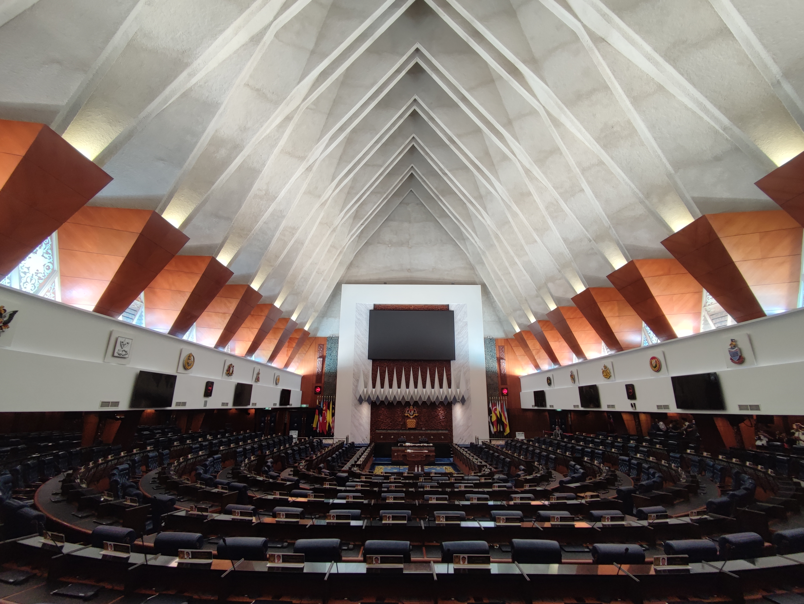
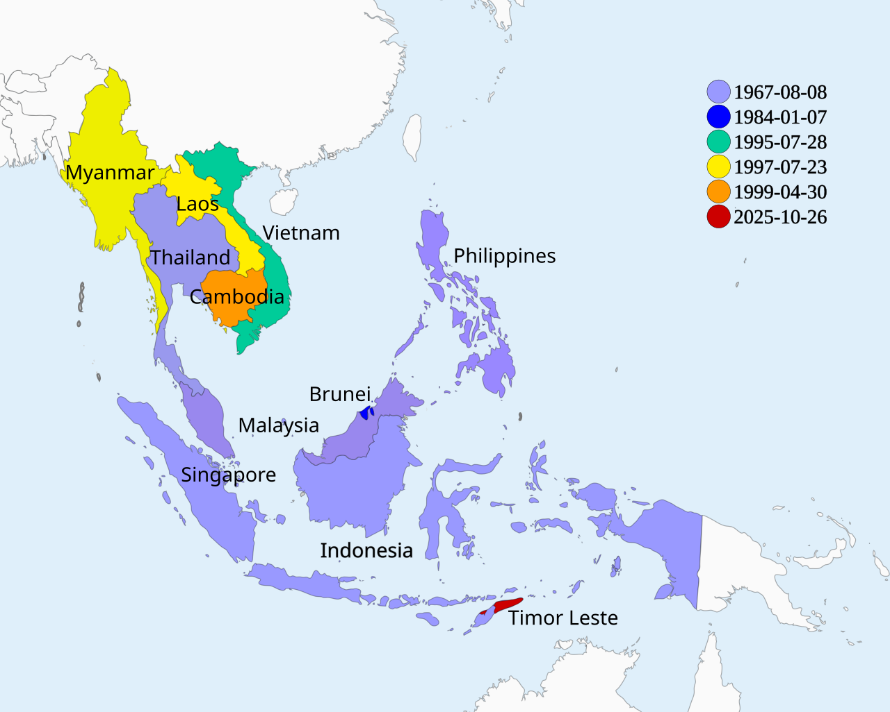
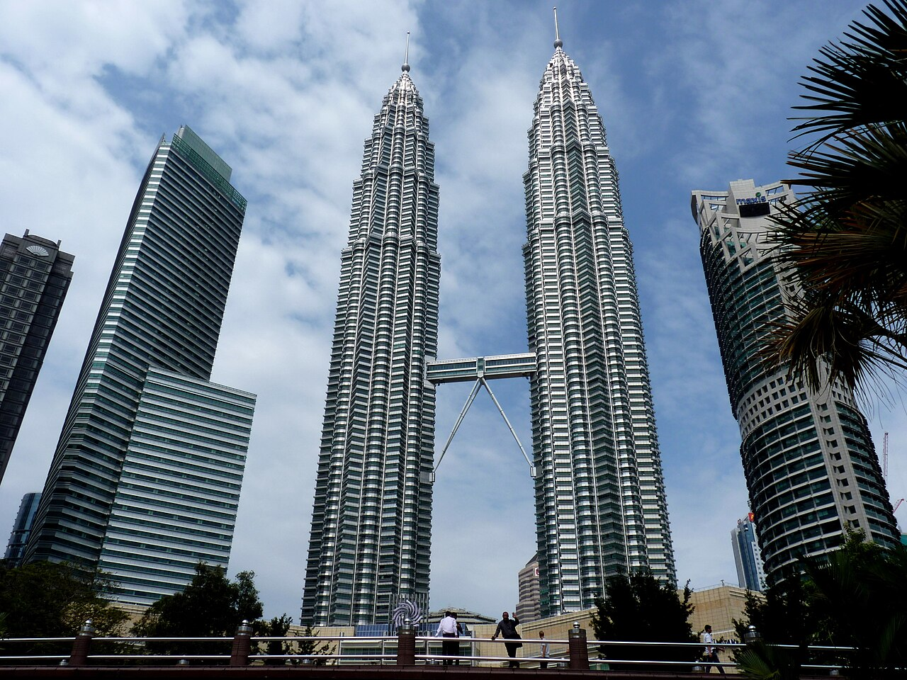

# Malaysia Isn

_ASEAN_

## Executive Summary

> [!callout]
> In June 2026, Malaysia brings an AI governance bill to cabinet. The schedule comes from the Digital Ministry, and Prime Minister Anwar Ibrahim pointed to the heart of the bill himself in parliament: ethical use, civil rights, and intellectual property. For anyone who works with data, the heaviest of the three is the last one. The bill proposes to protect both the input data fed into AI training and the output an AI produces as intellectual property. Bundling input and output into one, this dual structure is what sets Malaysia apart from how other countries regulate AI.

> The leading Western model, the EU AI Act, starts by sorting AI into risk tiers and banning or restricting the dangerous uses. Malaysia changes the starting point. Before asking what to block, it asks who owns this data and how its value should be protected. Two laws can carry the same name, "AI regulation," yet one governs behavior while the other defines ownership.

> For people who handle data, that difference is more than legal vocabulary. Into a habit of reading regulation as a list of "don'ts," Malaysia inserts a different sentence: "this is your asset." The moment the provenance and rights around training data gain legal standing, the work of organizing and tracking that data stops being a cost and becomes asset management. The moment you read regulation as a signal of asset-making rather than a cost, the center of gravity of data work shifts with it.

*▲ Malaysia's Dewan Rakyat (lower house of parliament) chamber — where the AI governance bill will be debated | Source: [Wikimedia Commons](https://commons.wikimedia.org/wiki/File:Dewan_Rakyat,_Parliament_of_Malaysia_(symmetrical_composition).jpg)*

### Key Numbers

Sources: [The Edge Malaysia](https://theedgemalaysia.com/node/782523), [New Straits Times](https://www.nst.com.my/news/nation/2026/02/1384142/pm-ai-governance-bill-tackle-accountability-and-ethics-ai-use), [Marketing-Interactive](https://www.marketing-interactive.com/malaysias-ai-governance-bill-to-reportedly-focus-on-ethics-accountability-and-ip)

Four numbers show where this bill stands. It reaches cabinet in June 2026, and its protection spans two axes: training-data inputs and AI outputs. At the same time, Malaysia has allocated RM2 billion (about USD 490 million) to its own AI infrastructure and set a deadline to become an AI-driven nation by 2030. The point folded into these four numbers is that regulation and investment point the same way.

<!-- stat-card -->
**June 2026** — Headed to cabinet — When the Digital Ministry brings the AI governance bill to cabinet

<!-- stat-card -->
**Input + Output** — Dual IP protection — Both training data and AI-generated content treated as intellectual property

<!-- stat-card -->
**RM2B** — Sovereign AI cloud budget — About USD 490M, allocated to domestic AI infrastructure in the 2026 budget

<!-- stat-card -->
**2030** — AI-driven nation target — The deadline Malaysia has set for its national AI transition

## Inputs and Outputs, Both as IP

At the center of the bill sits an idea that fits in a single sentence: the data that went into building an AI and the results an AI produces are both treated as someone's property. Prime Minister Anwar Ibrahim referred to this structure directly during parliamentary questions on 24 February 2026. One side is the input, the copyrighted works used to train the model: text, images, audio, video. The other side is the output, the content an AI system generates. Rather than keeping these apart, the bill treats the two as a single intellectual-property question.

The input question is familiar. Who holds the rights to the works a model learned from, and was that use legitimate? It is the very point that copyright disputes over generative AI are fighting out around the world. The output question is relatively new. Who owns the copyright to the writing, pictures, and music an AI produces? The Malaysian bill puts both in its sights at once, with enforcement designed to fall to the Intellectual Property Corporation of Malaysia (MyIPO). It leans on the existing Copyright Act 1987 as its base, with the new law supplementing it in the AI context.

*▲ Prime Minister Anwar Ibrahim of Malaysia (2024) | Source: [Wikimedia Commons](https://commons.wikimedia.org/wiki/File:Anwar_Ibrahim_(2024-05-23).jpg) / Cabinet Secretariat of Japan*

IP is not the only thing the bill addresses, of course. It also brings an AI risk-classification framework, full-lifecycle oversight from development through deployment and monitoring, and mandatory incident reporting. The picture is meant to cover the whole AI ecosystem, data centers included. Even so, the mark that sets this bill apart from other regulation is the dual IP structure. Clauses for managing risk exist in other countries too, but the attempt to define both inputs and outputs in the language of property rights is uncommon.

> [!callout]
> **The core**: this bill moves training data from "raw material for building a model" to "an asset with rights attached." By bundling input and output together, it shifts the regulatory question one notch, from "is this AI safe?" to "whose are this data and these results?"

## Vietnam Was First. Malaysia Plants a Different Flag: IP

"Southeast Asia's first" is a phrase to use carefully. The country that passed a binding AI law earliest is Vietnam. It finalized its law in December 2025, began phasing it in from March 2026, and bundled in amendments to its intellectual-property and cybersecurity laws as well. Singapore takes a different road. Instead of compelling through law, it builds trust through voluntary frameworks like AI Verify, and in January 2026 it became the first in the world to release a governance framework for agentic AI.

*▲ ASEAN member states (colors indicate year of accession) — Malaysia, Vietnam, and Singapore each take a distinct AI regulatory strategy | Source: [Wikimedia Commons](https://commons.wikimedia.org/wiki/File:Map_of_ASEAN_member_states.svg)*

So Malaysia's "first" has to be stated more narrowly and precisely than Vietnam's. It means the first case where dedicated AI-governance legislation puts IP protection for both training-data inputs and AI outputs at the center of its frame. Vietnam included IP amendments too, but did not make them the law's headline. Malaysia raises IP not as a side branch but as a pillar. Even within Southeast Asia, the emphasis differs.

That emphasis binds together with Malaysia's other moves in one direction. Kuala Lumpur secured the secretariat of the ASEAN AI Safety Network, allocated RM2 billion to sovereign AI cloud infrastructure in the 2026 budget, and runs ILMU, its own AI model trained on domestically licensed data, inside sovereign infrastructure. It even halted new permits for non-AI data centers and redirected them toward AI use only. An IP-centered bill sits atop a current that aims to bring the ownership and control of data into the national fold.

Set beside the EU AI Act, the contrast comes into focus. The EU bans or restricts high-risk uses on a risk basis and begins enforcement in August 2026. Its center of gravity is "what should we prevent." Malaysia asks first, "whose are this data and these results?" Anwar himself says his country's approach differs from the West's. He describes it as weighing moral considerations alongside legal detail, which, translated into the language of data, comes close to putting ownership ahead of control.

> [!callout]
> **To be precise**: Southeast Asia's first binding AI law is Vietnam's. Malaysia's place is different. By putting input-and-output IP protection at the center of dedicated AI-governance legislation, it takes "what should we treat as an asset?" rather than "what should we ban?" as its starting point.

## Regulation That Creates Data Value

If the bill passes, where does the weight of day-to-day data work move? The most direct change is that managing the provenance of training data becomes an obligation rather than a choice. Once training data falls within the reach of intellectual property, where you sourced it and what rights govern it become basic items of compliance. A model trained on data with possible copyright infringement carries legal risk by that very fact. Data quality stops being a matter of model performance alone and connects to a matter of legal risk.

Change follows on the output side as well. Once the copyright ownership of AI-generated work is spelled out, you have to settle in advance, within contracts and workflows, who holds the rights to those results. At the same time, the position of those who supply data shifts. When rights attach clearly to the data used in training, the bargaining power of whoever holds that data rises. Data gets a price when it becomes something to trade, and to be priced, its ownership has to be clear. Making that ownership clear is exactly what the bill sets out to do.

*▲ Petronas Twin Towers, Kuala Lumpur — Malaysia has allocated RM2 billion to sovereign AI infrastructure and aims to be an AI-driven nation by 2030 | Source: [Wikimedia Commons](https://commons.wikimedia.org/wiki/File:The_Petronas_Twin_Towers_in_Kuala_Lumpur_(Malaysia).JPG)*

Here the familiar equation "regulation equals prohibition" begins to wobble. Read regulation only as a list of burdens, and this bill looks like one more constraint. Yet regulation that establishes ownership is also regulation that creates assets. The structure resembles how land became a tradable asset once title registration appeared. The more the owner of data is fixed by law, the more an unsorted heap of data gains room to turn into a sorted data asset. Malaysia's choice leans toward using regulation as a tool for creating data value.

The bill is still at the draft stage, of course, and its clauses can change as it passes through cabinet and parliament. How the principle of protecting both inputs and outputs as IP actually works in enforcement also remains to be seen. Even so, the direction is clear. The regulatory question around AI is widening past "is it safe?" to "whose is it?", and those who handle data need their provenance and rights organized well enough to answer either one. Whether regulation demands prohibition or proof of ownership, the kit is the same: well-organized, traceable data.

> [!callout]
> **To close**: Malaysia's bill rewrites regulation in the language of asset-making rather than prohibition. The moment rights attach to training data, organizing and tracking it becomes asset management instead of a compliance cost. What those who handle data should prepare now is the record that lets them prove, at any time, what they built their AI from.

## References

### News & Media

- 1.New Straits Times. (24 February 2026). "PM: AI governance bill to tackle accountability and ethics of AI use." [nst.com.my](https://www.nst.com.my/news/nation/2026/02/1384142/pm-ai-governance-bill-tackle-accountability-and-ethics-ai-use)
- 2.The Edge Malaysia. (2026). "AI Legislative Framework To Be Presented To Cabinet In June 2026 – Gobind." [theedgemalaysia.com](https://theedgemalaysia.com/node/782523)
- 3.Marketing Interactive. (2026). "Malaysia's AI Governance Bill to reportedly focus on ethics, accountability and IP." [marketing-interactive.com](https://www.marketing-interactive.com/malaysias-ai-governance-bill-to-reportedly-focus-on-ethics-accountability-and-ip)

### Industry & Policy Reports

- 4.KPMG Malaysia. (April 2026). _From Capacity to Capability: Malaysia's AI Governance Imperative._ KPMG Malaysia.
- 5.ISEAS–Yusof Ishak Institute. (2026). "ASEAN AI Governance: Navigating a Patchwork of Approaches." _ISEAS Perspective (FULCRUM)._
