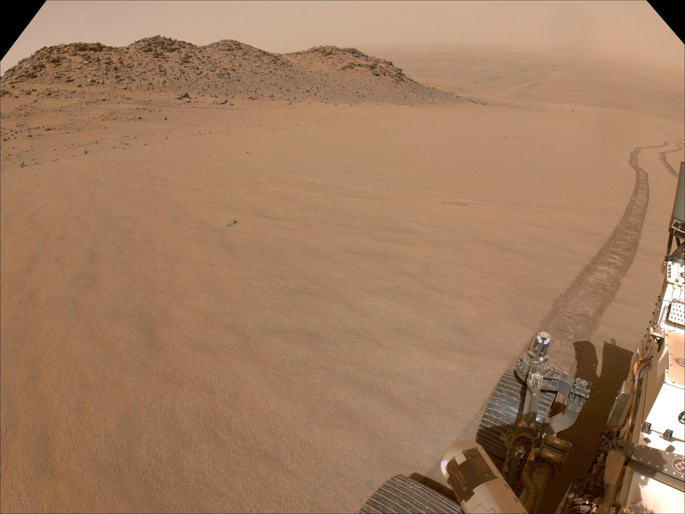

# A Mars Rover Learns Which Ground Is Safe by Slipping on It

_Perseverance drove 45 km on Mars, and a Jet Propulsion Laboratory team used the wheel slip recorded along the way to tell dangerous ground from safe_

## Executive Summary

> [!callout]
> Since it set down in Jezero Crater, the Perseverance rover has driven across sand dunes, rocky patches and flat bedrock alike. Over roughly 500 sols and 45 km of that driving, how badly its wheels spun in place was computed aboard the vehicle and written to the record. A paper released on September 21 by the Jet Propulsion Laboratory and two universities put that record into the slot a human annotator would normally fill. This article looks at how an answer key gets built for ground no person has ever walked on.

> Asked to pick out the dangerous pixels from photographs alone, the model reached an AUROC of 0.874. That is 0.058 above the strongest method published before it. The margin came from tying the photographs to the chassis tilt, the suspension angles and the vibration, all pulled into one shared space; strip that piece out and the score falls to 0.723. Two caveats travel with the number. The grading key itself was derived from the same slip measurements, and the Earth demonstration carries no figures at all.

> Sections 1 through 4 follow what the paper says. Section 5 asks whether the traces a factory leaves behind every day could serve as the answer key for its next model, and that question is this article's. The paper never mentions factories or logistics.

### Key figures

Source: Chiu et al., [Learning to Drive on Mars](https://arxiv.org/abs/2609.24952), arXiv:2609.24952 (2026-09-21). Tables I and II, and section 3.

<!-- stat-card -->
**0.874** — AUROC for spotting hazardous terrain — The strongest published method reached 0.816. On F1 it is 0.758 against 0.602

<!-- stat-card -->
**45 km** — Real driving distance behind the training set — Accumulated over about 500 sols, with 43,000 grayscale images attached to it

<!-- stat-card -->
**0.874 → 0.723** — With the tilt and vibration alignment removed — Photographs alone do not account for slip. Of the two training objectives, this one cost the most when dropped

<!-- stat-card -->
**Zero finetuning** — Model carried onto an Earth test site as-is — Trained only on Martian imagery, it steered around boulders in a terrestrial rock field. The paper reports no success rate

## Ground No One Can Label

Communication between Earth and Mars is slow and expensive. Nobody can sit at a screen turning the wheels one command at a time, so the rover has to look at the ground with its own eyes and choose a path for itself. Perseverance does this with an onboard autonomy system called ENav. From the disparity between what its two navigation cameras see, ENav builds a height map of the terrain, assigns each cell a cost from features such as slope, roughness and time to traverse, and searches for the cheapest route. Most of the distance Perseverance has covered was driven this way.

The trouble is that elevation does not tell the whole story. On a stretch of sand ripples that looks flat and free of obstacles, the wheels turn and the vehicle covers less than half of what it was told to cover. Terrain that appears geometrically traversable, the paper writes, may produce substantial wheel slip, unexpected vehicle motion, or unfavorable interactions with the rover's mobility system. For a planetary vehicle the stakes are unusual. If it gets stuck, nobody is coming to pull it out.

*▲ Captured by Perseverance's navigation cameras on Nov. 11, 2024 (Sol 1326), climbing toward the crater rim. The wheel track trailing behind runs across a 10-degree average slope of sand | Source: [NASA/JPL-Caltech, PIA26479](https://images.nasa.gov/details/PIA26479)*

The obvious fix is to teach a model which ground is actually dangerous, and that is where the labels run out. Manual labeling of terrain according to rover mobility, the paper notes, is impractical. You cannot gather driving footage and parcel it out to annotators the way terrestrial self-driving programs do, and in any case nobody has ever set foot on the terrain in question.

That is not to say Martian imagery has never been labeled. AI4MARS took roughly 35,000 photographs from Spirit, Opportunity and Curiosity and attached 326,000 hand-drawn segmentation labels to them, telling you pixel by pixel whether you are looking at sand, rock or bedrock. This is exactly the line the new paper draws. Those annotations say what the terrain looks like; they do not directly encode how a six-wheeled rover physically interacted with it. The word "sand" and the fact that the wheels spun 30 percent of the way through that sand are two different pieces of information.

Trying to read future slip off a photograph is not a new idea. A 2007 study involving the Jet Propulsion Laboratory already posed the problem of learning and predicting slip from rover imagery, and in 2017 a method appeared that used terrain slope as a label and Gaussian processes to forecast locally varying slip. What changed this time is not the idea but the material. The training data is not a course built at a test facility. It is the whole operational record of a mission, some 500 sols of it.

## How Much the Wheels Spun Becomes the Answer Key

The value the researchers placed in the answer slot is slip. The arithmetic is plain. One estimate of how far the rover moved comes from counting wheel rotations. Another comes from stitching stereo photographs together and measuring how far the scenery slid past. The first is the distance the vehicle meant to travel; the second is the distance it actually traveled. Slip is the difference between the two divided by the commanded distance, and it lands somewhere between 0 and 1. The paper calls it the unrealized commanded displacement. A value of 0.3 means three tenths of the commanded distance never happened, and the sand dune on Sol 1327 that the model flagged as hazardous sat right about there.
