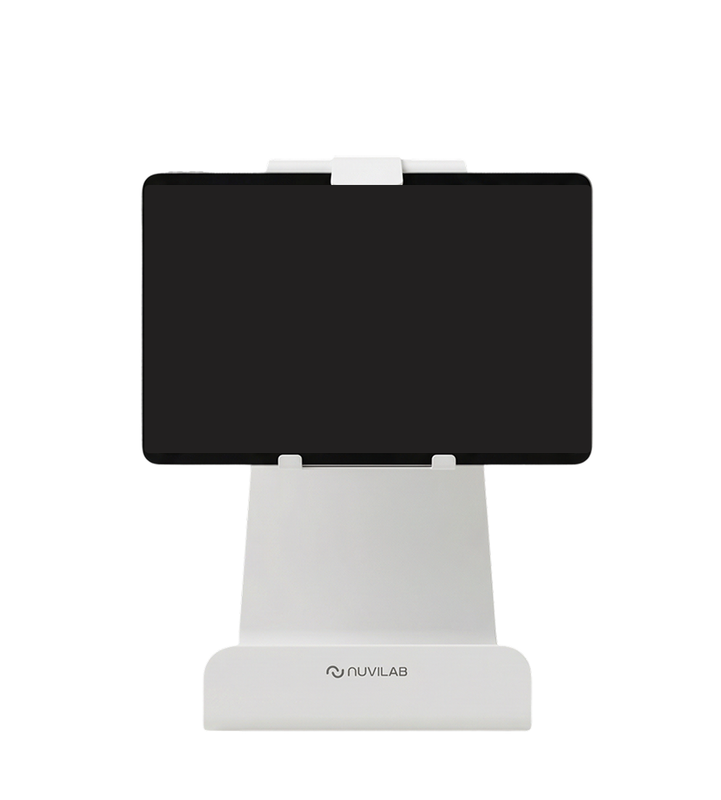

# 어린이집 식판 사진은 그냥 기록일까, 연구 자료일까?

_연세대·누비랩, 창원 어린이집 12곳 급식 기록 13만여 건 분석 — 절반도 안 먹던 아동 섭취율 1년 새 8.8%포인트_

## Executive Summary

> [!callout]
> 이 글은 어린이집에서 급식을 운영하다 저절로 쌓인 기록이 학술 논문의 분석 자료로 쓰인 사례를 본다. 연세대 식품영양학과 함선옥 교수팀과 푸드테크 기업 누비랩이 9월 15일 발표한 공동 연구다. 경남 창원시 어린이집 12곳 영유아 170명의 음식 기록 13만 6,517건으로 같은 아이의 이용 초기와 약 1년 뒤를 비교했고, 결과는 한국연구재단 등재 학술지 Culinary Science & Hospitality Research 32권 8호에 실렸다. 논문은 그보다 보름 앞선 8월 31일에 나와 있었다.

> 가장 많이 인용된 수치는 8.8%포인트다. 처음 제공된 음식의 절반도 먹지 않았던 아동 집단의 평균 섭취율이 1년 뒤 그만큼 높아졌다. 논문 초록이 앞세운 수치는 따로 있다. 아동 전체의 평균 섭취율은 63.9%에서 68.5%로 올랐다. 그런데 연구팀은 이 연구가 대조군을 두지 않은 관찰연구라고 스스로 밝혔고, 발표를 다룬 AI타임스 보도도 연구의 초점이 인과관계를 규명하는 데 있지 않다고 적었다. 새로 생긴 것은 효과의 증거가 아니라 같은 아이를 1년간 같은 기준으로 재어 놓은 자료다.

> 3절까지는 발표를 다룬 보도와 누비랩이 앞서 낸 보도자료, 그리고 논문 초록에 적힌 것만 따라간다. 4절과 5절에서 데이터 품질 쪽으로 옮겨 적는 부분은 그 문서들에 없는 이 글의 해석이다.

### 주요 수치

출처: [머니투데이](https://www.mt.co.kr/future/2026/09/15/2026091510414269169), [AI타임스](https://www.aitimes.com/news/articleView.html?idxno=215296) 2026년 9월 15일 보도. 전체 평균 섭취율은 [논문 초록](https://doi.org/10.20878/cshr.2026.32.8.011).

<!-- stat-card -->
**13만 6,517건** — 분석에 쓰인 음식 기록 — 창원시 어린이집 12곳 영유아 170명의 기록을 같은 아동 단위로 이어 붙였다

<!-- stat-card -->
**8.8%포인트** — 저섭취 집단의 섭취율 상승 — 처음 제공된 음식의 절반도 먹지 않았던 아동의 1년 뒤 평균값

<!-- stat-card -->
**68.5%** — 1년 뒤 전체 평균 섭취율 — 이용 초기 63.9%에서 올랐다. 초록이 앞세운 값이고, 8.8%포인트는 그 안의 저섭취 집단 값이다

<!-- stat-card -->
**0개** — 대조군 — 연구팀이 스스로 밝힌 한계다. 같은 기간 비교할 집단 없이 전후만 봤다

## 무엇을 발표했나

누비랩의 어린이용 AI 푸드스캐너 '냠냠키즈'는 식사 전후의 식판 이미지를 분석해 음식별 제공량과 남은 양을 추정하고, 그 둘로 섭취율을 계산한다. 어린이집에서 점심을 차리고 치우는 동안 장치가 알아서 남기는 기록이다. 연구팀은 이 기록을 새로 모으지 않았다. 이미 쌓여 있던 것을 꺼내 같은 아동의 서비스 이용 초기와 약 1년 뒤를 짝지었다. 회사 집계로 누비랩이 모델 개발에 써 온 푸드 데이터는 1억 건이 넘는데, 이 논문에 들어간 것은 그 가운데 13만여 건이다.

*▲ 식사 전후 식판 이미지를 분석해 섭취율을 계산하는 '냠냠키즈' 스캐너 | Source: [누비랩](https://www.nuvilab.com/ko/kids)*

분석 결과에서 변화가 뚜렷하게 나타난 쪽은 처음에 잘 먹지 않던 아이들이었다. 초기 섭취 수준이 낮거나 중간이었던 집단에서 섭취율이 오르는 경향이 상대적으로 분명했고, 처음 제공된 음식의 절반도 먹지 않았던 아동은 1년 뒤 평균 섭취율이 8.8%포인트 높아졌다. 채소류를 거의 먹지 않은 기록의 비율도 낮아졌다. 연구진이 강조한 대목은 이 수치 자체가 아니었다.

“영유아가 실제로 얼마나 먹는지를 장기간 추적하기 위해 직접 관찰, 실측, 회상조사 등 여러 방법이 활용돼 왔지만 표본과 관찰 기간을 함께 늘리는 데는 현실적인 어려움이 있었다.”
                        함선옥 연세대 식품영양학과 교수, 2026년 9월 15일 머니투데이 보도

함 교수는 이번 연구를 "AI 푸드스캐너를 통해 13만건이 넘는 실제 급식 기록을 동일한 기준으로 확보하고 같은 영유아의 1년간 변화를 관찰했다는 점에서 영유아 식생활 연구의 방법론적 진전"이라고 설명했다. 류제윤 누비랩 이사는 "그동안 영유아 급식에서 아이 한 명이 실제로 무엇을 얼마나 먹는지를 장기간 대규모로 확인하기는 어려웠다"고 말했다. 두 사람이 성과로 든 것은 하나다. 이 변화를 따져 볼 기록이 같은 기준으로 1년치 남았다는 사실이다.

쓰임새로 제시된 것은 두 방향이다. 어린이집 같은 급식기관은 섭취율이 반복해서 낮은 식품군과 메뉴를 찾아 식단 구성과 보호자 상담에 참고할 수 있다. 지자체는 참여 기관 수나 만족도 조사에 더해 실제 섭취 양상을 보육·급식 사업 점검에 쓸 수 있다. 연구팀은 다음 단계로 대조군을 포함한 연구, 무게 측정법을 활용한 현장 검증, 다지역·다기관 확대 연구를 예고했다.

### 초록에는 더 적혀 있다

발표문과 그것을 옮긴 보도는 게재지와 권호까지만 밝혔다. 논문 제목도 저자 명단도 없다. 그 권호를 따라가 서지와 초록을 찾아보면 나머지가 나온다. 논문 제목은 「어린이집 영유아의 급식 섭취율과 편식 유사 기록률 변화: AI 푸드 스캐너 자료를 활용한 후향적 관찰 분석」이다. 저자는 다섯이고, 함선옥과 백선영이 연세대 소속, 류제윤과 노진영과 신희태가 누비랩 소속이다. 발표문이 공동연구라고 밝힌 그대로다. 논문은 8월 31일 발행된 32권 8호 121~133쪽에 영문으로 실렸다.

초록에는 보도에 나오지 않은 것이 여럿 있다. 비교 구간이 날짜로 적혀 있고, 아동 전체의 평균값이 있고, '편식 유사 기록'이라는 지표의 정의가 있다. 저자들이 스스로 붙인 단서도 초록 안에 있다.

| 항목 | 논문 초록에 적힌 것 |
| --- | --- |
| 비교 구간 | 이용 초기는 첫 60일, 1년 뒤는 300일에서 360일 사이. 두 구간 사이는 약 12개월이다 |
| 전체 평균 섭취율 | 63.9%에서 68.5%로 상승(윌콕슨 검정 p=.002, dz=0.31) |
| 편식 유사 기록의 정의 | 음식 기록 하나의 섭취율이 10%에 못 미치면 그렇게 셌다. 임상 지표가 아니라 운영상의 지표라고 적었다 |
| 편식 유사 기록률 | 22.9%에서 19.2%로 하락(p<.001, dz=−0.32) |
| 식품군별 | 채소·콩류·육류·곡류에서 편식 유사 기록률이 낮아졌고, 어류에서는 낮아지지 않았다 |
| 시간에 따른 추세 | 달이 하나 지날 때마다 편식 유사 기록이 나올 오즈가 낮아졌다(보정 오즈비 0.970, 95% 신뢰구간 0.957~0.984) |
| 저자들이 붙인 단서 | 대조군 없는 단일군 관찰 분석이라 인과는 말할 수 없고, 초기 섭취가 낮거나 중간이던 집단의 변화는 평균으로의 회귀 가능성과 함께 읽어야 한다 |

표의 값은 모두 논문 초록에서 옮겼다. p는 두 구간의 차이가 우연으로 보기 어려운 정도를, dz는 그 차이의 크기를 나타내는 값이다. 오즈비 0.970은 비율이 아니라 오즈의 비이므로 "매달 3%씩 줄었다"로 읽으면 뜻이 달라진다.

보도가 앞세운 8.8%포인트는 초록에 없다. 초록은 초기 섭취가 낮거나 중간이던 집단에서 변화가 더 뚜렷했다고만 적었고, 그 집단의 값을 숫자로 내놓지 않았다. 8.8%포인트는 9월 15일 발표문이 밝힌 값이다. 반대로 전체 평균이 63.9%에서 68.5%로 올랐다는 대목은 초록이 결과로 가장 먼저 적은 값인데, 발표를 다룬 국내 보도에서는 찾지 못했다.

논문 서지와 초록은 DBpia에 수록된 기록(DOI 10.20878/cshr.2026.32.8.011)에서 확인했다. 이 글을 쓰는 시점에 KCI 색인에는 아직 이 호가 올라오지 않았고, 학술지 홈페이지의 발행 공지도 5월호에서 멈춰 있다. 본문 13쪽은 읽지 못했으므로, 초록 밖의 수치는 모두 9월 15일 발표와 그것을 다룬 보도에서 온 것이다.

## 기억에 기대는 조사가 못 하던 일

영양학에서 식이섭취를 조사할 때 오래 쓰여 온 방법 가운데 하나가 '24시간 회상법'이다. 조사 대상자나 보호자에게 지난 24시간 동안 무엇을 얼마나 먹었는지 묻는다. 어른에게는 이 방법이 통하지만, 영유아는 자기가 먹은 것을 정확히 보고하기 어렵다. 그래서 기록의 출처가 아이에서 어른으로 옮겨 간다. 어린이집 교사가 기억하는 점심과 부모가 기억하는 저녁이 한 아이의 하루로 합쳐지는 식이다.

더 큰 걸림돌은 반복이다. 한 번 묻는 것과 같은 아이에게 1년간 계속 묻는 것은 다른 일이다. AI타임스 보도는 같은 아이의 음식별 섭취를 수개월에서 1년간 반복해 기록하려면 인력과 시간이 크게 늘어난다고 적었다. 함 교수가 표본을 늘리는 것과 관찰 기간을 늘리는 것을 동시에 하기 어려웠다고 말한 것도 이 때문이다. 영유아 식생활 연구에서 종단 자료가 드문 이유가 여기에 있다.

논문 초록이 앞선 연구를 정리한 문장도 같은 곳을 짚는다. 기존 연구는 주로 설문에 기댔고, 한 시점에서 한 번 재는 방식이었다는 것이다. 기억에 기대는 문제와 한 번만 재는 문제는 따로 있다. 한 번 잰 값이 아무리 정확해도 그 아이가 지난 1년 동안 어떻게 달라졌는지는 알려 주지 않는다.

| 방법 | 기록을 남기는 사람 | 1년을 반복할 때의 걸림돌 |
| --- | --- | --- |
| 24시간 회상법 | 보호자나 조사자가 지난 하루를 떠올려 답한다 | 영유아는 스스로 정확히 보고하기 어려워 남의 기억에 의존한다 |
| 식사 기록법·직접 계량 | 조사자나 보호자가 그때그때 적거나 잰다 | 같은 아이의 음식별 섭취를 수개월에서 1년간 반복하려면 인력과 시간이 크게 늘어난다 |
| 직접 관찰·실측 | 조사자가 현장에서 지켜보며 잰다 | 표본과 관찰 기간을 함께 늘리기 어렵다 |
| AI 푸드스캐너 | 급식 운영 중에 장치가 식사 전후 식판 이미지를 남긴다 | 기록이 업무의 부산물이라 반복에 사람 손이 더 붙지 않는다 |

앞 세 줄은 AI타임스 보도와 함선옥 교수 인용에 적힌 내용이다. 넷째 줄 마지막 칸은 그 대비를 이 글이 한 문장으로 정리한 것이다.

이 연구는 새 측정 도구를 만들지 않았다. 재는 방식은 이미 상품 안에서 돌아가고 있었다. 급식 운영 화면에 뜨던 숫자가 종단 분석의 관측값 자리로 옮겨 앉은 것이 이번에 일어난 일이다.

## 보도자료의 수치와 논문의 수치는 왜 다른가

같은 장치가 낸 섭취율 수치는 이번이 처음 공개된 것이 아니다. 누비랩은 2024년 12월 16일 냠냠키즈가 전국 어린이집과 유치원 400곳에 도입됐다고 알리면서, 경북 안동에서 보건복지부와 어린이집 12곳을 대상으로 시행한 스마트 사회서비스 시범사업의 성과를 함께 내놨다. 전체 섭취율 5.6% 증가, 김치 9.2% 증가, 채소류 11.9% 증가였다. 당시 김대훈 누비랩 대표는 냠냠키즈로 "아이들의 식습관 변화를 데이터로 처음 증명"했다고 말했다. 1년 뒤인 2025년 12월에는 누적 도입 1,100곳을 돌파했다고 밝혔다.

안동 시범사업과 이번 창원 연구는 지역도 사업도 다르다. 두 수치를 이어 붙여 읽으면 사실관계가 틀어진다. 그래도 둘을 나란히 놓아 볼 값은 있다. 각 수치 옆에 무엇이 함께 적혀 있는지가 한눈에 드러나기 때문이다.

| 항목 | 2024년 12월 보도자료 | 2026년 9월 논문 발표 |
| --- | --- | --- |
| 대상 | 경북 안동 어린이집 12곳, 보건복지부 스마트 사회서비스 시범사업 | 경남 창원시 어린이집 12곳, 영유아 170명 |
| 기록 수 | 밝히지 않았다 | 13만 6,517건 |
| 기간 | 밝히지 않았다 | 같은 아동의 이용 초기와 약 1년 뒤 |
| 수치 | 전체 섭취율 5.6% 증가, 김치 9.2% 증가, 채소류 11.9% 증가 | 절반도 먹지 않았던 집단의 평균 섭취율 8.8%포인트 상승 |
| 단위 | 증가율(%) | 퍼센트포인트 |
| 실린 곳 | 회사 보도자료 | 한국연구재단 등재 학술지 32권 8호 |
| 한계 표기 | 없다 | 대조군 없는 관찰연구라고 밝혔다 |

왼쪽 열은 2024년 12월 16일 누비랩 보도자료, 오른쪽 열은 2026년 9월 15일 발표를 다룬 세 매체 보도에 적힌 것이다. "밝히지 않았다"는 그 보도자료에 해당 항목이 없다는 뜻이다.

먼저 단위부터 갈린다. 5.6%는 증가율이고 8.8%포인트는 차이값이다. 증가율만 적힌 수치는 무엇에서 얼마나 올랐는지를 알 수 없다. 기준선이 30%였는지 70%였는지에 따라 같은 5.6%가 전혀 다른 변화를 가리킨다. 반대로 퍼센트포인트로 적힌 수치는 어느 집단의 어느 값에서 재었는지가 따라붙는다. 이번 발표에서 그 집단은 "처음 제공된 음식의 절반도 먹지 않았던 아동"으로 명시됐다.

이번 논문이 쓴 지표의 이름에는 세는 규칙까지 딸려 있다. 초록은 '편식 유사 기록'이라는 말을 쓰면서 그것을 섭취율 10% 미만인 음식 기록으로 정의하고, 임상 지표가 아니라 운영상의 지표라고 못 박았다. 편식이라는 낱말을 쓰되 아이를 편식으로 판정한 것은 아니라는 선 긋기다. 이 두 줄이 붙어 있으면 다음 사람이 같은 기준으로 다시 셀 수 있다. 보도가 옮긴 "채소류를 거의 먹지 않은 기록의 비율"이라는 표현은 이 지표를 풀어 쓴 말이다.

데이터가 달라진 것이 아니다. 같은 장치가 같은 방식으로 재던 값이다. 달라진 것은 그 값에 대상과 기간과 집단 구분과 한계가 함께 적혔다는 점이고, 그것이 보도자료와 학술지에 실린 논문을 가른다.

## 넘은 문턱 셋, 넘지 못한 문턱 둘

여기서부터는 발표문을 떠나, 운영 중에 쌓인 기록을 연구나 학습에 돌려쓸 때 무엇이 필요한지를 이 사례에 대어 본다. 문턱이라는 구분은 발표문에 없는 이 글의 정리다.

넘어선 쪽부터 본다. 첫째, 같은 잣대로 쟀다. 기관마다 다른 사람이 다른 방식으로 적은 기록이었다면 앞뒤를 견줄 수 없다. 여기서는 같은 장치가 같은 규칙으로 산출한 값이 쌓였다. 함 교수가 "동일한 기준으로 확보"했다고 말한 부분이 이것이다. 둘째, 같은 아이를 다시 찾을 수 있었다. 종단 분석은 기록이 많다고 되는 일이 아니다. 초기의 한 아이와 1년 뒤의 그 아이가 같은 사람으로 이어져야 성립한다. 셋째, 규모와 기간이 질문에 맞았다. 13만여 건이라는 수는 인상적이지만, 실제로 질문에 답하게 한 것은 그 기록이 170명에게 1년치 쌓였다는 구조다.

남은 문턱은 둘이고, 둘 다 연구팀이 먼저 밝혔다. 하나는 비교할 상대가 없다는 점이다. 대조군을 두지 않았으니 같은 기간 자연스러운 성장이나 어린이집의 식단 개선만으로도 섭취율은 오를 수 있다. 다른 하나는 잰 값이 실제 값인지다. 섭취량은 식판 이미지에서 추정한 값이라 무게를 직접 달아 맞춰 보는 검증이 아직 남아 있다.

비교할 상대가 없다는 쪽에는 갈래가 하나 더 있고, 이것도 저자들이 초록에 직접 적어 두었다. 처음 잴 때 유난히 낮게 나온 값은 아이가 달라지지 않아도 다시 재면 평균 쪽으로 올라오기 쉽다. 그래서 초기 섭취가 낮거나 중간이던 집단에서 변화가 더 뚜렷했다는 대목은 그 가능성과 함께 읽어야 한다고 저자들은 썼다. 보도가 앞세운 8.8%포인트가 바로 그 집단의 값이다.
