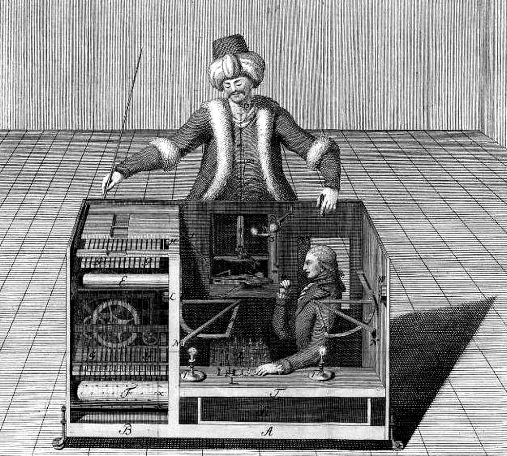

# 메커니컬 터크가 문을 닫는다, 인간 라벨은 이미 AI였다

_아마존이 20년 만에 신규 고객을 받지 않는 사이, 크라우드워커의 최대 46%가 LLM으로 과제를 처리했다는 연구가 남긴 것_

## Executive Summary

> [!callout]
> 아마존이 2026년 7월 30일부터 메커니컬 터크(MTurk)의 신규 고객 등록을 받지 않는다. 같은 날 SageMaker Ground Truth와 Amazon Augmented AI도 신규 서비스를 닫는다. 2005년 "인공 인공지능(Artificial Artificial Intelligence)"이라는 슬로건으로 출발한 크라우드소싱 라벨링의 원조가, 20년 만에 사실상 유지보수 모드로 물러난다. 그리고 이 퇴장은 서비스 하나의 폐업을 넘어, AI 학습 데이터의 출처를 정면으로 건드리는 사건이다.

> 핵심은 종료 자체가 아니라 그 배경에 있다. 2023년 한 연구는 메커니컬 터크 워커의 33~46%가 글쓰기 과제를 LLM으로 처리한 것으로 추정했다. 사람에게 판단을 맡겨 인간의 신호를 모은다고 믿었지만, 실은 기계의 추측을 다시 모으고 있었다는 뜻이다. 인간이 AI인 척하던 자리를, 이번엔 진짜 AI가 조용히 대신했다.

> 그래서 이 사건이 던지는 질문은 데이터 품질이 아니라 데이터 출처(provenance)에 있다. 라벨이 정확한지를 따지기 전에, 그 라벨을 누가 또는 무엇이 만들었는지를 증명할 수 없게 되면, 정확도나 일치율 같은 품질 지표 자체가 의미를 잃는다. 출처가 품질보다 먼저 무너진다. 메커니컬 터크의 퇴장은 그 순서를 눈앞에서 보여 준다.

<!-- stat-card -->
**33~46%** — 워커의 LLM 사용 추정 — 초록 요약 과제 · Veselovsky 외 (2023)

<!-- stat-card -->
**20년** — 메커니컬 터크 존속 기간 — 2005년 '인공 인공지능'으로 출시

<!-- stat-card -->
**7/30** — 신규 고객 등록 중단일 — Ground Truth · A2I도 동시 종료

<!-- stat-card -->
**2022.11** — 출처 오염의 분기점 — ChatGPT 공개 후 수집분에 물음표

## 20년 만의 퇴장

아마존은 2026년 7월 30일부터 메커니컬 터크의 신규 고객(requester)을 받지 않겠다고 밝혔다. 기존 고객은 계속 쓸 수 있지만 신규 기능을 추가할 계획은 없다. 사실상 유지보수 모드다. 같은 날, 데이터 주석 서비스인 SageMaker Ground Truth와 사람이 개입하는 검수 파이프라인 Amazon Augmented AI(A2I)도 신규 고객 대상 운영을 종료한다. 메커니컬 터크 한 곳의 문제가 아니라, 아마존이 '인간 라벨링'이라는 사업 라인 전체를 정리하는 장면이다.

메커니컬 터크는 2005년에 나왔다. 슬로건이 "Artificial Artificial Intelligence", 우리말로 옮기면 "인공 인공지능"이었다. 이 표현은 제프 베조스가 직접 쓴 것으로, 서비스의 성격을 한마디로 압축했다. 기계가 하기 어려운 잘게 쪼갠 일을 소액 보상으로 사람에게 위탁하는 구조였고, 하나의 작업 단위를 HIT(Human Intelligence Task)라 불렀다. 겉으로는 자동화 서비스처럼 보이지만 그 뒤에서 실제로 답을 다는 것은 사람이었다는, 이름에 담긴 반전이 그대로 사업 모델이었다.

*▲ 아마존이 이름을 빌려온 원조 '터크' — 1770년대 체스를 두는 자동인형으로 화제를 모았지만, 실은 상자 안에 사람이 숨어 있었다 | Source: [Wikimedia Commons (Public Domain)](https://commons.wikimedia.org/wiki/File:Turk-with-person.jpg)*
