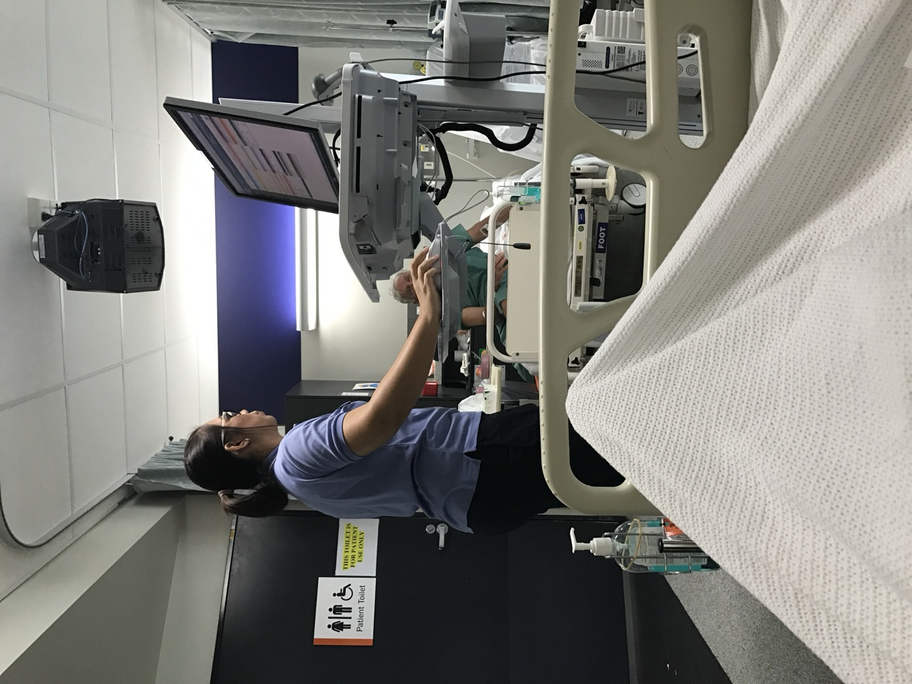

# Did Note-Writing AI Pass the Same Test as Scan-Reading AI?

_A Wolters Kluwer survey — weekly AI use among US doctors nearly doubled to three in four, while only 27% of doctors and nurses know their hospital_

## Executive Summary

> [!callout]
> On September 20 the Financial Times ran a piece on medical AI. Its point was that clinicians are putting the brakes on AI once it moves past diagnosis and image reading. The survey behind that piece is a poll of 355 US doctors and nurses that Wolters Kluwer commissioned from Ipsos and fielded in March, and inside it two figures sit side by side pointing in opposite directions. The group using these tools doubled in two years, and the group worried about them is larger still. This article looks at what went missing between those two figures.

> The quietest number in the survey is 27%. That is the share of clinicians who say they know how their own organization handles AI, up six points from 21% last year. Over the same two years, the share of doctors reaching for AI every week doubled. When the pace of use and the pace of knowing the rules split that far apart, almost nobody in the clinic is holding the record of which tool cleared which review. That does not mean clinicians have let go of the wheel. Close to four in five say they check AI answers against other sources.

> Sections 1 through 4 follow what the survey release and the outlets covering it put on the record. Section 5 widens the argument to diagnostic tools and section 6 reads the whole thing as a data quality problem; neither is in the survey. The full Financial Times article is paywalled, so this piece was written by matching the public summaries against the Wolters Kluwer primary material.

### Key Figures

Source: the Wolters Kluwer [2026 Future Ready Healthcare survey](https://www.wolterskluwer.com/en/news/future-ready-healthcare-ai-adoption-patient-clinician-insights) release and [Healthcare Dive](https://www.healthcaredive.com/news/healthcare-ai-adoption-accelerates-provider-worries-deskilling-wolters-kluwer/821653/). Ipsos ran the fieldwork.

<!-- stat-card -->
**38% → 3 in 4** — Doctors using AI at least weekly — The same question in 2025 and 2026. This year's figure is reported as nearly three in four; nurses went from 46% to 70%

<!-- stat-card -->
**21% → 27%** — Clinicians who know how their workplace handles AI — Six points while weekly use doubled. Both years asked the same question

<!-- stat-card -->
**35%** — Also know the accuracy-checking guidelines — The denominator is the 27% who knew the policies. Across everyone it works out to about one in ten

<!-- stat-card -->
**44%** — Doctors letting AI draft clinical notes — An audit of that same class of tool found a verified failure in one note out of three

## Doctors and Nurses Already Use AI Every Week

The survey is a plain instrument. Wolters Kluwer handed the fieldwork to Ipsos, which polled 203 US doctors, 152 nurses and 254 patients through online panels between March 11 and 14. The clinician sample is 355. A sample that size will not settle rankings that hinge on a few percentage points, and its value lies elsewhere: the same questions were put two years running.

That continuity exposed a large shift. Doctors saying they use AI for work at least once a week stood at 38% last year, and this year the figure is close to three in four. The coverage gives no exact percentage, only that wording. Nurses went from 46% to 70%. At the other end, 9% of doctors and 18% of nurses had never used AI tools at work. In a single year AI moved from something a minority sampled to something most clinicians touch weekly.

*▲ A digital workstation at the point of care — an illustrative photo of documentation tools entering daily clinical work (not a scene from this survey) | Source: [Wikimedia Commons (Kgbo, CC BY-SA 4.0)](https://commons.wikimedia.org/wiki/File:Princess_Alexandra_Hospital_nurse_with_mobile_computer_work_station.jpg)*

One thing belongs next to any two-year comparison here. Last year's respondents included pharmacists, allied health professionals, administrators and medical librarians alongside doctors and nurses, and that year's release states neither a sample size nor a fielding window. This year narrowed the pool to 355 doctors and nurses and named four days in March. The year-over-year figures are breakouts of the doctors and nurses within each year's sample, so the comparison does not break, but the size of last year's breakout was never published.

Peter Bonis, chief medical officer at Wolters Kluwer Health, put the speed this way to Healthcare Dive: "I think it's a combination of increased exposure, increased familiarity. But really importantly, it's addressing an unmet need." In a setting where the appointment stayed the same length while the paperwork grew, AI got adopted first and evaluated afterward.

The Financial Times piece by Sarah Neville, published on September 20, laid the clinicians' pushback on top of that speed. The full article is for subscribers, and public summaries posted the same day by Techmeme and AI Weekly carry the same thrust. There are two claims in it. First, clinician skepticism shows up where AI travels beyond the settled uses of diagnosis and image reading. Second, the technical progress has not yet turned into measurable improvement in patient care, and the clinical and performance data to support that expansion is thin. Where this article cites the Financial Times below, the claim stays inside what those summaries and the Wolters Kluwer release jointly support.

## The Worry Is Shared, the Safeguards Are Personal

Rising use did not settle anyone's nerves. Some 74% of clinicians named deskilling as one of the greatest risks of AI. The survey does not leave the word vague. It defines deskilling as an increasing overreliance on AI tools that reduces clinicians' own ability to identify inaccuracies or poor recommendations. Healthcare Dive added that the worry sharpens as clinical decision support tools automate more diagnostic and treatment tasks.

The same survey puts hallucinations at 74% as well. Two separate items landed on the same value, which is a good reason to keep them apart when citing either. One is a risk on the human side, the other on the tool side. Worry that ad-sponsored AI content could push bias into medical decisions came in at 72% of clinicians and 61% of patients.

Clinicians are meanwhile drawing their own lines. A share of 77% double-check AI answers against original sources or trusted databases like PubMed and UpToDate, and 73% are somewhat or very confident they can spot an answer that is wrong. Another 56% say they review the AI material patients bring in and explain where it lines up with evidence-based clinical resources and where it does not. Faced with rising worry and rising use at once, clinicians chose to look again themselves rather than put the tools down.

> [!callout]
> Those three numbers show where the line is drawn: at individual habit, not at the institution. The 77% who double-check, the 73% who trust themselves to catch an error and the 56% who walk patients through what they brought in are all acts resting on one clinician's hands, and they are the first acts to slip on a busy day. The release does not string these figures together. The word line is this article's.

Evidence that deskilling is more than a worry is already on the record. A study in which colonoscopists lost adenoma detection rate after AI assistance was switched off ran in [an earlier piece here](/story/ai-deskilling-human-in-the-loop/en/). What this article is after is not that mechanism but what the people who keep using the tools, knowing that risk, are asking for.

## Which Tools Actually Cleared a Trial?

What clinicians want is not a halt. Following the summaries of the Financial Times report, skepticism concentrates where AI expands past diagnosis and image reading, and the reason given is a shortage of the clinical and performance data that would support that expansion. Tools carrying the same name have crossed very different thresholds.

The survey asked about that spot too. About half of clinicians, 53%, say they want AI to be required to show the detailed reasoning behind its responses. That request is a layer above the double-checking habit from the previous section. Double-checking is something an individual does after the answer arrives; requiring the reasoning is a condition set before the tool is brought into the clinic. Half of them wanted that condition written into a rule instead of left to personal diligence.

On one side are tools whose yardstick was fixed before they were built. Finding something in an image has a verifiable answer, which is why sensitivity and specificity carry it into journals and through review. On the other side are tools that draft the clinical note, answer patient messages and suggest a course of treatment. Nobody has an answer key for that work, because clinicians do not even agree on what a good clinical note looks like.

*▲ Image reading has a verifiable answer, which is why it has passed through journals and review (illustrative photo) | Source: [The Medical Futurist / Wikimedia Commons (CC BY 4.0)](https://commons.wikimedia.org/wiki/File:Radiologist_interpreting_MRI.jpg)*

The survey shows the second group is no longer a handful of pilots. Among doctors, 44% say they use an AI scribe to draft clinical notes. Four in ten are already standing on the layer with no answer key.

A study that audited that layer directly was covered on [this blog](/report/ai-scribe-error-rate-instrument-2026-09/en/) earlier this month. Three commercial scribes were run over the same 142 consultations to produce 565 notes, and every note was audited; 177 of them carried at least one verified failure. That is one note in three. It shows what the clinical and performance data clinicians are asking for looks like once it reaches this layer.

The part of that study likely to outlive the 31.3%, though, is elsewhere. Holding the model, the evidence and the settings fixed over the same 1,295 candidate errors, the researchers changed one line of the instruction given to reviewers, and the share of errors confirmed swung from 9.3% to 79.0%. Asking for evidence therefore carries a second demand: settle first what counts as an error. Trade error rates without agreeing on the yardstick, and the same product collects report cards that differ by more than tenfold. Laying the survey and the audit study in one paragraph is this article's doing.

## Fewer Than Three in Ten Know the Rules

Sorting out which tool crossed which threshold is not an individual's job. An organization decides it and has to say so. The survey has an item on exactly that, and the answer was 27%: the share of doctors and nurses who say they know how their workplace is addressing AI governance issues. The same question a year earlier returned 21%.

Neither figure shows the size of the gap on its own. Doctors using AI weekly went from 38% to nearly three in four, while clinicians who know how their hospital manages AI went from 21% to 27%. One doubled; the other moved six points. The release groups this item under a governance gap and notes that execution inside healthcare organizations may have fallen behind the pace of adoption.

On what they want, there is no split at all. More than 90% of clinicians and 89% of patients said human experts should be validating the sources behind AI-generated healthcare content used for patient care. Nine in ten raised a hand for that validation, and barely more than one in four knows how their own organization performs it.

Go one layer inside that 27% and the ground narrows further. Among those who knew about their organization's policies, 63% said they understood how privacy regulations apply to AI use. Just 35% said they knew about guidelines for checking the accuracy and reliability of AI information, and 22% reported their employer had policies describing the responsibilities of clinicians and AI products. The denominator for all three is not the full clinician sample but the 27% who knew the policies.

Converted to the whole clinician group, about one in ten has a grip on the accuracy-checking guidelines and roughly one in twenty reports a policy that sets out responsibility. The diagram below is that conversion. It is worth reading alongside the fact that these are products of two percentages rather than values printed in the release.
