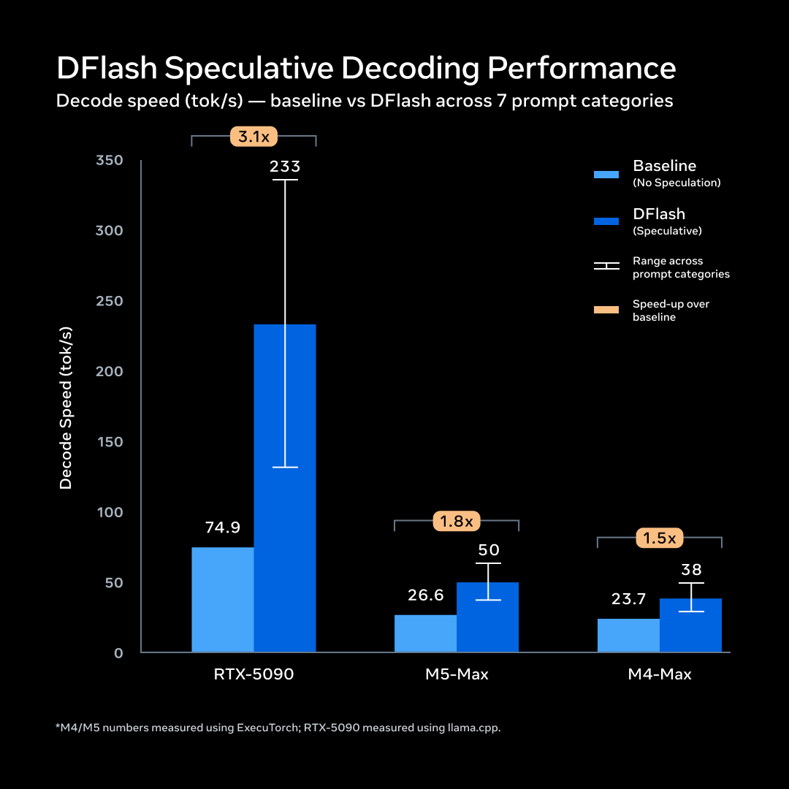

# 개인 파일을 읽고 일하는 메타의 온디바이스 에이전트

_300억 파라미터 뮤즈 글리머와 로컬 데이터 준비도라는 새 변수_

## Executive Summary

> [!callout]
> 메타가 2026년 8월 10일 뮤즈 글리머(Muse Glimmer)를 공개했습니다. 300억 파라미터 모델을 4비트로 줄여 그래픽 카드 한 장이 꽂힌 개인 PC나 맥에서 돌아가게 만든 오픈 웨이트 모델입니다. 발표문이 밝힌 용도는 분명합니다. 일정을 관리하고 메시지를 초안하고 파일을 정리하는 에이전트는 개인 컨텍스트에 깊이 접근해야 하니, 그 추론을 기기 밖으로 내보내지 않겠다는 것입니다.

> 이 배치가 바꾸는 것은 성능 그래프가 아니라 입력의 출처입니다. 클라우드 API를 부를 때 모델의 실력은 공급자가 모아 놓은 사전학습 데이터에서 나왔고, 그 데이터는 우리가 손댈 수 없는 영역이었습니다. 기기 위 에이전트가 매 요청에서 실제로 읽는 것은 그 기기에 쌓인 파일과 일정과 메시지입니다. 손댈 수 없던 변수가 손댈 수 있는 변수로 바뀌었고, 동시에 관리 책임도 함께 넘어왔습니다.

> 발표문이 말한 사실과 그 위에서 우리가 끌어낸 해석은 구분해 적었습니다. 1~2절이 사실이고, 3절부터가 해석입니다.

### 주요 수치

앞의 두 숫자는 이 모델이 개인 기기 안에 들어앉을 수 있게 된 조건입니다. 뒤의 두 숫자는 같은 체급 오픈 모델과 견줬을 때 이 모델이 이기는 항목과 지는 항목입니다.

출처: [Meta AI Research](https://research.meta.ai/blog/introducing-muse-glimmer-open-agentic-model), [MarkTechPost](https://www.marktechpost.com/2026/08/10/meta-ai-releases-muse-glimmer/)

<!-- stat-card -->
**55GB → 18GB** — 4비트 양자화 후 모델 크기 — 24GB VRAM 소비자 GPU 한 장에 올라갑니다

<!-- stat-card -->
**12만+ 토큰** — 한 번에 읽을 수 있는 컨텍스트 — 기기 안 문서와 일정을 통째로 넣기 위한 크기

<!-- stat-card -->
**75.5 vs 62.5** — MCP-Atlas 도구 호출 점수 — 같은 체급 오픈 모델 Qwen3.6-27B와 비교

<!-- stat-card -->
**65.9 vs 75.6** — OSWorld 컴퓨터 조작 점수 — 화면을 직접 다루는 작업은 같은 비교군에 밀립니다

## 노트북 한 대에 올라간 300억 파라미터

뮤즈 글리머는 메타 초지능 연구소(Meta Superintelligence Labs)가 공개한 300억 파라미터 밀집형 멀티모달 모델입니다. 라이선스는 아파치 2.0이고 가중치가 그대로 공개됐습니다. 메타의 최상위 비공개 모델 뮤즈 스파크의 출력을 교사 신호로 삼아 증류한 결과물이라, 계보로 보면 스파크의 축소판에 가깝습니다. 텍스트와 이미지를 받고 텍스트를 내놓으며, 지식 컷오프는 2026년 1월 4일입니다.

기기 안에 들어앉을 수 있게 된 조건은 크기입니다. 전정밀도로는 55GB가 넘어 소비자 하드웨어에 올라가지 않지만, 4비트 양자화 빌드는 18GB에서 20GB 사이로 내려옵니다. 메타는 두 종류를 함께 냈습니다. 32GB VRAM을 쓰는 빌드는 평균 성능 저하가 0.2%, 24GB에 맞춘 17GB 빌드는 1.0%입니다. 생성 속도는 DFlash라는 초안 생성기가 한 번에 16토큰을 예측하는 방식으로 1.5배에서 3.1배까지 끌어올립니다. RTX 5090에서 초당 74.9토큰이 233.4토큰이 됐고, 애플 M5 Max에서는 26.6토큰이 50.2토큰으로 올라갑니다.

*▲ DFlash 초안 생성기가 RTX 5090에서 3.1배, 애플 M5·M4 Max에서 1.5~1.8배 생성 속도를 끌어올린다 | Source: [Meta AI Research](https://research.meta.ai/blog/introducing-muse-glimmer-open-agentic-model)*

내려받는 경로도 함께 열렸습니다. 허깅페이스에 BF16 원본과 GGUF 양자화 빌드, 모바일과 임베디드용 ExecuTorch 빌드, 속도를 올리는 DFlash 초안 생성기가 같이 올라갔습니다. llama.cpp와 MLX 통합은 곧 붙는다고 예고했고, 지원 언어는 100개가 넘습니다. 특정 회사의 앱을 거치지 않고도 각자 기기에 직접 올려 돌려 볼 수 있는 상태라는 뜻입니다.

벤치마크는 이 모델이 무엇을 위해 만들어졌는지 그대로 드러냅니다. 도구를 부르고 여러 단계를 이어 붙이는 작업에서는 비교 대상을 크게 앞섭니다. MCP-Atlas 75.5는 Gemma4-31B의 54.2, Qwen3.6-27B의 62.5와 견주면 상당한 격차입니다. DeepSearch QA 74.6, AIME 2026 94.7도 같은 방향입니다. 반면 화면을 보고 마우스와 키보드를 직접 다루는 OSWorld-Verified는 65.9로 Qwen의 75.6에 밀리고, 터미널 작업과 SWE-Bench Verified에서도 열세입니다. 계획을 세우고 도구를 호출하는 쪽은 강하고, 손으로 화면을 조작하는 쪽은 아직 약합니다.

## 메타는 왜 이 모델을 기기 안에 두려 하나

메타는 그 이유를 발표문 앞머리에서 밝혀 뒀습니다. 일정을 관리하고 메시지를 초안하고 파일을 정리하며 사용자가 일하는 방식을 학습하는 에이전트라면 개인 컨텍스트에 깊이 접근해야 하고, 그 컨텍스트에는 개인 파일과 대화 기록, 자격증명, 사내 문서가 들어 있다는 것입니다. 이런 자료를 다루는 워크플로에서는 추론이 기기를 떠나지 않는 것이 전제 조건이라는 설명이 따라붙습니다.

[테크크런치](https://techcrunch.com/2026/08/10/metas-new-glimmer-ai-model-offers-a-hint-at-zuckerbergs-personal-intelligence-vision/)는 이 발표를 마크 저커버그가 말해 온 개인 초지능(personal superintelligence) 구상의 첫 실물로 읽었습니다. 눈여겨볼 대목은 메타가 그은 선입니다. 사람들이 직접 소유하고 돌리는 모델은 열어 두고, 회사가 통제권을 쥐는 더 강력한 지능은 닫아 둡니다. 글리머는 열려 있고 스파크는 닫혀 있습니다. 기술 매체 [마크테크포스트](https://www.marktechpost.com/2026/08/10/meta-ai-releases-muse-glimmer/)는 여기에 규제 산업과 망 분리 환경, 데이터 상주 요건을 덧붙였습니다. 네트워크 호출이 아예 없으니 데이터가 국경을 넘지 않는다는 논리입니다.

이 설계에는 조건이 하나 더 따라옵니다. 추론이 기기 안에서 끝나니 인터넷 연결 여부와 상관없이 동작합니다. 테크크런치가 전한 저커버그의 발언도 같은 방향입니다. 초지능이 소수의 서버에 모여 있지 않고 개인에게 흩어질 때 개인의 역량이 커지는 시대가 열린다는 이야기입니다.

여기까지가 발표문과 보도가 말한 내용입니다. 그런데 이 배치를 데이터 쪽에서 보면 조용히 자리를 바꾸는 것이 하나 있습니다. 클라우드 API를 부르던 시절, 답변의 품질을 좌우한 것은 공급자가 모아 놓은 사전학습 데이터였습니다. 그 데이터가 어떻게 수집되고 정제됐는지는 우리 소관이 아니었고, 우리가 보내는 것은 프롬프트 몇 줄이었습니다. 기기 위 에이전트가 매 요청에서 읽는 것은 다릅니다. 어제 받은 첨부파일, 지난주 회의록, 캘린더에 남아 있는 일정, 다운로드 폴더에 쌓인 PDF입니다.

아래 도식의 왼쪽은 지금까지의 배치입니다. 실력의 근거가 공급자 쪽에 있고, 우리는 그 결과를 받아 씁니다. 오른쪽은 글리머가 상정한 배치입니다. 모델 가중치는 누구에게나 같지만, 그 위에 얹히는 입력은 기기마다 다릅니다.
