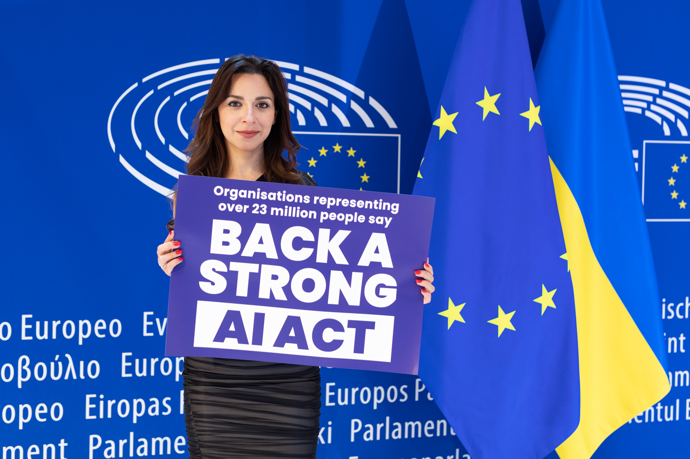

# Meta Opened Llama and Locked Muse Spark for the Same Reason

_DeepSeek cloning and biochemical safety — two reasons pointing to training-data governance and EU AI Act enforcement_

## Executive Summary

> [!callout]
> On April 8, 2026, Meta released **Muse Spark**, its first proprietary model. The company that once raised the open-source AI flag by releasing Llama's full weights to the world has locked its new model behind an API. Peel back one layer, and the two reasons Meta gave for closing the door converge on a single problem: data governance.

> Meta offers two reasons. One is "cloning" — DeepSeek built its own models on top of Llama's architecture. The other is "safety" — once weights are released, they cannot be recalled. Both reasons reach the same question: what did the model learn, and what risk does it carry? Closing the model also closes off the answer — the transparency of its training data.

> But closing the door does not end the matter. On August 2, 2026, the EU AI Act activates full enforcement powers over the training-data disclosure duty for general-purpose AI models. A closed model cannot escape this duty; it may even carry a heavier burden, having lost the open-source exemption. As the model's moat shifts from openness to data and safety control, what does Meta gain — and what does it lose?

### Key Figures

Four numbers capture this shift most concisely. Performance jumped to nearly three times its open-weights level, but the cost of building such a model nearly doubled in a single year. Meanwhile, leadership in open weights passed to Chinese models, and how training data is disclosed grew heavy enough to put a percentage of revenue on the line as a penalty. The weight behind Meta's decision to close the door lives inside the numbers below.

Source: [The Batch](https://www.deeplearning.ai/the-batch/with-muse-spark-meta-pivots-away-from-its-open-weights-llama-strategy) · [Steptoe (EU AI Act)](https://www.steptoe.com/en/news-publications/steptechtoe-blog/eu-ai-act-obligations-for-gpai-models-now-applicable.html)

<!-- stat-card -->
**52 vs 18** — A leap in the performance index — Muse Spark vs Llama 4 Maverick (Artificial Analysis Index)

<!-- stat-card -->
**$135B** — Top of 2026 capex — A sharp rise from $72.2B in 2025 — monetization pressure

<!-- stat-card -->
**41%** — Share of Chinese open models — Of late-2025 Hugging Face downloads — DeepSeek, Qwen, and others

<!-- stat-card -->
**3%** — EU AI Act penalty ceiling — €15M or 3% of global annual revenue, whichever is greater

## Muse Spark, Meta's First Locked Model

For years, Meta was the standard-bearer of open-source AI. It released Llama down to the weights, letting anyone download it, bolt it onto their own service, fine-tune it, and redistribute it. Countless startup and lab pipelines grew on top of that openness. Muse Spark, released on April 8, 2026, marks the end of that road.

Muse Spark was built by Meta Superintelligence Labs. The lab is led by Alexandr Wang as chief AI officer, brought in when Meta paid $14.3 billion for a 49% stake in Scale AI in June 2025. It is a multimodal reasoning model that handles text, image, and voice together, with a 262,000-token context window and three reasoning modes — instant, thinking, and deep — that tune how far an answer goes. It also includes domain-specific training, such as health reasoning developed in collaboration with more than a thousand physicians.

Its performance is hard to compare with the open-weights era. On the Artificial Analysis Index, which aggregates model performance, Muse Spark scored 52. That is nearly triple the 18 of Llama 4 Maverick, the previous open-weights model, putting it on the same front line as Claude Opus 4.6 (53) and Gemini 3.1 Pro (57). But the decisive difference is not the score — it is the access model. Muse Spark releases neither weights nor architecture. It exists only behind the Meta AI app and a private API preview.

*▲ Meta Platforms headquarters in Menlo Park, California. In April 2026, Meta Superintelligence Labs — housed under this parent company — launched Muse Spark, Meta's first closed-weight AI model. | Source: [Wikimedia Commons](https://commons.wikimedia.org/wiki/File:Meta_Platforms_Headquarters_Menlo_Park_California.jpg) (CC BY-SA 4.0)*

> [!callout]
> What changed is not only the model's performance. The relationship a user has with the model changed too. In the Llama era, you could hold the model in your hand and take it apart. In the Muse Spark era, only inputs and outputs pass between you. The first thing to vanish in that gap is what the model was made of — its training data.

## Meta's Two Stated Reasons

Meta and those around it explain the turn from open to closed along two broad lines. One is rivals' "cloning"; the other is uncontrollable "safety" risk. The two have different textures, but seen from behind, they point to the same place.

### 2.1. Cloning — the architecture they gave away raised a competitor

DeepSeek built its reasoning models by distilling them on top of the Llama 3.1 and 3.3 architectures. DeepSeek-R1-Distill-Llama-70B is based on Llama-3.3-70B-Instruct, and the 8B version on Llama 3.1-8B. The investment firm Stifel judged that this distillation appears to violate Meta's license terms. In effect, the fruit of the ecosystem Meta grew through openness was carried off by Chinese labs that contributed nothing to it. As of late 2025, Chinese models such as DeepSeek and Alibaba Qwen accounted for 41% of Hugging Face downloads, and the default of open weights had quietly shifted to Qwen 3.5 and DeepSeek.

*▲ DeepSeek logo. By distilling reasoning models from Llama 3.1 and 3.3 architectures, DeepSeek helped Chinese open models account for 41% of Hugging Face downloads by late 2025. | Source: [Wikimedia Commons](https://commons.wikimedia.org/wiki/File:DeepSeek_logo.svg)*

### 2.2. Safety — weights, once released, cannot be recalled

On July 31, 2025, Mark Zuckerberg changed his position in an essay laying out his superintelligence roadmap: "Superintelligence will raise novel safety concerns, and we need to be careful about what we choose to open source." It was a clear retreat from his 2024 argument that "open source is safer." The core logic is simple. The moment weights are published, they are released forever. If high-risk capabilities such as biochemical (CBRN) knowledge sit inside the model, no control can be applied retroactively after release.

On top of this comes the weight of the business. Meta's capital expenditure (capex) for 2026 runs to $115–135 billion, a sharp jump from $72.2 billion in 2025. A strategy of releasing a model built with that much money for free — and handing it to competitors — no longer explains itself. Cloning and safety alike converge on the same conclusion: the cost of openness has grown too large.

## Both Reasons Are One Data Problem

Taken apart, cloning sounds like a competition problem and safety like an ethics problem. But peel back one more layer on both reasons and the same question remains: what did this model learn, and what capabilities and risks sit inside it?

The essence of the cloning problem is that opening the architecture lets anyone distill on top of it. And distillation is not merely copying the architecture. It is the process of pulling back, out of a model's outputs, what it learned and how. Leaving the weights open is close to leaving open the shadow of the training data as well.

The safety problem is the same. Releasing weights is dangerous because it is irreversible. But how large that danger actually is depends on what the model learned. RAND's research finds that today's models do not dramatically raise bioweapon risk compared with an internet search. In the end, gauging the size of the risk requires knowing what went into the training data. Safety evaluation begins with data evaluation.

> [!callout]
> The common root of both reasons is training-data governance: what went in, and what comes out. When Meta closes the model, it also makes the answer to that question invisible from the outside. It blocks competitors' reverse-engineering, but it also closes off the verifiability that regulators and society would otherwise have.

## The EU AI Act Opens Its Doors in August

Closing the model also hides the training data. But another force begins to operate over it: the EU AI Act. From August 2, 2025, every general-purpose AI (GPAI) provider must publish a "sufficiently detailed" summary of its training data. And on August 2, 2026, the EU AI Office gains full enforcement powers, including investigation, assessment, and penalties. The timing is striking — the summer of the very year Meta closed its model.

*▲ Campaign at the European Parliament in Strasbourg calling for a strong AI Act. Full enforcement powers for the EU AI Act's training-data disclosure duty come into effect on August 2, 2026. | Source: [Wikimedia Commons](https://commons.wikimedia.org/wiki/File:EKO_-_AI_ACT_-_Strasbourg_Parliament.jpg) (CC BY 2.0, EKO)*

### 4.1. Closing the door does not let you dodge it

The core of the duty has nothing to do with whether the model is open or closed. Open source or closed source, a provider must disclose the types of training data, a list of major datasets, and a list of scraped internet domains. The intent is to let rights holders exercise their rights. Locking the weights leaves this summary duty fully intact. The penalty for violation is €15 million or 3% of global annual revenue, whichever is greater.

### 4.2. The paradox: closing it makes the burden heavier

There is a more ironic point. The EU AI Act exempts GPAI distributed under a free open-source license from some obligations. Where there is no systemic risk, such a model needs only a copyright policy and a training-data summary. A closed model, by contrast, gets no such exemption. Duties such as model evaluation, adversarial testing, serious-incident tracking and reporting, and cybersecurity all attach to it. At least measured by the weight of EU regulation, closing the model is not the lighter path but the heavier one.

> [!callout]
> One fact becomes clear here. Closing the model weights and disclosing the training data are separate matters. A company can control the former, but the latter is increasingly moving beyond its control. Closing the model can hide the shadow of the data from competitors, yet before regulators a company must still open the ledger of its training data.

## The Moat Moves: Gained and Lost

The pivot to Muse Spark is a decision to move Meta's moat. In the past, Meta's differentiator was openness itself: release the strongest model for free, dominate the ecosystem, and hold the standard from above. Now Meta sets openness down and chooses to fight on the same front as OpenAI and Google — with a closed API and control over data and safety. That choice carries both gains and losses.

#### Gained

- •Protected architecture secrets — blocking competitors' distillation and cloning
- •An API revenue model — a direct income source to recoup enormous capex
- •Control over data and safety — the company manages what goes in and what comes out

#### Lost

- •Developer-ecosystem trust — pipelines built on Llama drift away
- •Open-source AI leadership — the default moves to Qwen and DeepSeek
- •External transparency of training data — a retreat in verifiability

*▲ Aerial view of the Facebook (now Meta) campus in Menlo Park, California, 2019. Meta is building its new moat on 3 billion users and real-time data touchpoints such as its Ray-Ban glasses. | Source: [Wikimedia Commons](https://commons.wikimedia.org/wiki/File:Aerial_view_of_Facebook_campus_in_Menlo_Park,_September_2019.JPG) (CC BY-SA 3.0, Coolcaesar)*

The new moat is not the openness of weights but control over data and safety. Meta holds three billion users and real-time data touchpoints such as its Ray-Ban glasses, and Muse Spark can run that data at roughly 2.7 times the token efficiency of Claude Opus 4.6. The structure favors whoever holds control. Yet that control turns straight into obligation before the EU AI Act. To say you control what was learned is to say you bear the responsibility of explaining what was learned.

So this event goes beyond one company's change of strategy. It signals that a model's value is shifting from "how open is it?" to "how well do you know and answer for its training data?" Whether you open the model or close it, the question you must answer stays the same: what was your model made of?

## References

### R.1. Industry & Press

- 1.The Batch (DeepLearning.AI). (2026). "[With Muse Spark, Meta Pivots Away From its Open-Weights Llama Strategy](https://www.deeplearning.ai/the-batch/with-muse-spark-meta-pivots-away-from-its-open-weights-llama-strategy)." — Artificial Analysis Index 52 vs Llama 4 Maverick 18.
- 2.CNBC. (2026). "[Meta debuts new AI model, attempting to catch Google, OpenAI after spending billions](https://www.cnbc.com/2026/04/08/meta-debuts-first-major-ai-model-since-14-billion-deal-to-bring-in-alexandr-wang.html)." — Muse Spark launch (2026-04-08), Alexandr Wang.
- 3.Fortune. (2025). "[Zuckerberg walks back open source risks of superintelligence](https://fortune.com/2025/07/31/zuckerberg-meta-open-source-risks-superintelligence)." — "careful about what we choose to open source".
- 4.Bloomberg. (2025). "[Inside Meta's Pivot from Open Source to Money-Making AI Model](https://www.bloomberg.com/news/articles/2025-12-10/inside-meta-s-pivot-from-open-source-to-money-making-ai-model)." (paywall)
- 5.The Next Web. (2026). "[Meta's Muse Spark is here – and it's closed source](https://thenextweb.com/news/meta-muse-spark-msl-first-model)."
- 6.Cryptopolitan. (2026). "[Meta pivots AI strategy with Muse Spark model](https://www.cryptopolitan.com/meta-pivots-ai-strategy-muse-spark-model/)."
- 7.AI News. (2026). "[Did Meta Sacrifice Its Open-Source Identity for a Competitive AI Model?](https://www.artificialintelligence-news.com/news/meta-muse-spark-ai-model-open-source/)"

### R.2. Policy & Analysis

- 8.WilmerHale. (2025). "[European Commission Releases Mandatory Template for Public Disclosure of AI Training Data](https://www.wilmerhale.com/en/insights/blogs/wilmerhale-privacy-and-cybersecurity-law/european-commission-releases-mandatory-template-for-public-disclosure-of-ai-training-data)." — GPAI training-data disclosure template (2025-07-24).
- 9.Steptoe. (2025). "[EU AI Act Obligations for GPAI Models Now Applicable](https://www.steptoe.com/en/news-publications/steptechtoe-blog/eu-ai-act-obligations-for-gpai-models-now-applicable.html)." — duty in force 2025-08-02, full enforcement 2026-08-02.
- 10.University of Michigan News. (2025). "[Unpacking DeepSeek: Distillation, ethics and national security](https://news.umich.edu/unpacking-deepseek-distillation-ethics-and-national-security/)." — DeepSeek's Llama distillation and governance.

Thank you for reading. Whether a model is open or closed, we believe the ground of trust lies in whether you can explain what it was made of. If you have thoughts or counterarguments on this question of the source of and accountability for training data, we would love to hear them.

**Pebblous Data Communication Team**  
June 19, 2026
