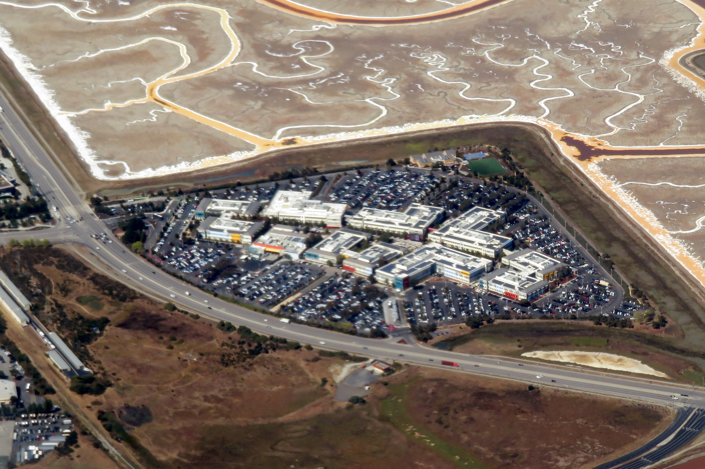

# 메타가 Llama를 공개한 이유와 Muse Spark를 잠근 이유는 같다

_DeepSeek 복제와 생화학 안전, 두 명분이 가리키는 학습 데이터 거버넌스와 EU AI법 집행_

## Executive Summary

> [!callout]
> 2026년 4월 8일, 메타는 첫 비공개 모델 **Muse Spark**를 내놓았다. Llama를 가중치째 세상에 풀며 오픈소스 AI의 깃발을 들던 회사가, 새 모델은 API 뒤로 잠갔다. 문을 닫으며 메타가 든 두 명분은, 한 겹만 벗기면 결국 하나의 데이터 거버넌스 문제로 모인다.

> 메타가 든 이유는 두 가지다. DeepSeek가 Llama 구조를 베이스로 자기 모델을 만든 '복제', 그리고 가중치를 한번 공개하면 회수할 수 없다는 '안전'이다. 두 명분 모두 "무엇을 학습했고 어떤 위험이 있는가"라는 같은 질문에 닿는다. 모델을 닫으면 그 답, 곧 학습 데이터의 투명성도 함께 닫힌다.

> 그런데 닫는 것만으로는 끝나지 않는다. 2026년 8월 2일, EU AI법은 범용 AI 모델의 학습 데이터 공개 의무에 대한 완전 집행 권한을 발동한다. 폐쇄 모델이라고 이 의무를 피할 수 없고, 오히려 오픈소스 면제를 잃어 더 무거운 부담을 질 수도 있다. 모델의 해자가 공개성에서 데이터·안전 통제로 옮겨가는 지금, 메타는 무엇을 얻고 무엇을 잃는가.

### 주요 수치

이 전환을 가장 압축적으로 보여 주는 건 네 개의 숫자다. 성능은 오픈웨이트 시절의 세 배 가까이 뛰었지만, 그 모델을 만드는 비용은 한 해 만에 거의 두 배로 불었다. 그사이 오픈웨이트의 주도권은 중국 모델로 넘어갔고, 학습 데이터를 어떻게 공개하느냐가 매출의 일정 비율을 벌칙으로 걸 만큼 무거워졌다. 메타가 왜 문을 닫기로 했는지, 그 무게가 아래 숫자들 안에 들어 있다.

출처: [The Batch](https://www.deeplearning.ai/the-batch/with-muse-spark-meta-pivots-away-from-its-open-weights-llama-strategy) · [Steptoe (EU AI Act)](https://www.steptoe.com/en/news-publications/steptechtoe-blog/eu-ai-act-obligations-for-gpai-models-now-applicable.html)

<!-- stat-card -->
**52 vs 18** — 성능 지수의 도약 — Muse Spark vs Llama 4 Maverick (Artificial Analysis Index)

<!-- stat-card -->
**$1,350억** — 2026년 capex 상단 — 2025년 $722억에서 대폭 증가 — 수익화 압박

<!-- stat-card -->
**41%** — 중국 오픈모델 비중 — 2025년 말 Hugging Face 다운로드 중 DeepSeek·Qwen 등

<!-- stat-card -->
**3%** — EU AI법 벌칙 상한 — 위반 시 €1,500만 또는 전 세계 연매출의 3% 중 큰 금액

## Muse Spark, 메타의 첫 잠긴 모델

메타는 지난 몇 년 동안 오픈소스 AI의 대표 주자였다. Llama를 가중치까지 공개하며 누구나 내려받아 자기 서비스에 붙이고, 미세조정하고, 다시 배포하게 했다. 그 개방성 위에서 수많은 스타트업과 연구실의 파이프라인이 자랐다. 2026년 4월 8일에 나온 Muse Spark는 그 노선의 끝을 알린 모델이다.

Muse Spark는 메타 슈퍼인텔리전스 랩(Meta Superintelligence Labs)이 만들었다. 2025년 6월 메타가 Scale AI 지분 49%를 143억 달러에 사들이며 영입한 Alexandr Wang이 최고 AI 책임자로 이 조직을 이끈다. 텍스트·이미지·음성을 함께 다루는 멀티모달 추론 모델이고, 컨텍스트 창은 26만 2천 토큰, 답의 깊이를 조절하는 즉시·사고·심층 세 가지 추론 모드를 갖췄다. 1천 명 넘는 의사와 협업한 헬스 추론처럼, 특정 영역에 맞춘 학습도 들어갔다.

성능은 오픈웨이트 시절과 비교가 어렵다. 모델 성능을 종합한 Artificial Analysis Index에서 Muse Spark는 52점을 받았다. 직전 오픈웨이트 모델인 Llama 4 Maverick의 18점에서 세 배 가까이 뛴 수치로, Claude Opus 4.6(53)이나 Gemini 3.1 Pro(57)와 같은 전선에 올랐다. 다만 결정적 차이는 점수가 아니라 접근 방식이다. Muse Spark는 가중치도, 아키텍처도 공개되지 않는다. 메타AI 앱과 프라이빗 API 프리뷰 뒤에만 있다.

*▲ 캘리포니아 멘로파크 메타 플랫폼스 본사. 2026년 4월, 이 회사의 메타 슈퍼인텔리전스 랩이 첫 비공개 모델 Muse Spark를 출시했다. | Source: [Wikimedia Commons](https://commons.wikimedia.org/wiki/File:Meta_Platforms_Headquarters_Menlo_Park_California.jpg) (CC BY-SA 4.0)*

> [!callout]
> 바뀐 것은 모델의 성능만이 아니다. 사용자가 모델과 맺는 관계가 바뀌었다. Llama 시대에는 모델을 손에 쥐고 뜯어볼 수 있었다. Muse Spark 시대에는 입력과 출력만 오간다. 그 사이에서 가장 먼저 보이지 않게 되는 것이 모델이 무엇으로 만들어졌는가, 즉 학습 데이터다.

## 메타가 든 두 가지 명분

개방에서 폐쇄로 돌아선 이유를 메타와 그 주변은 크게 두 갈래로 설명한다. 하나는 경쟁사의 '복제'이고, 다른 하나는 통제할 수 없는 '안전' 위험이다. 두 가지는 결이 다르지만, 뒤에서 보면 같은 곳을 가리킨다.

### 2.1. 복제 — 풀어 준 구조가 경쟁자를 키웠다

DeepSeek는 Llama 3.1과 3.3 아키텍처를 베이스로 자사의 추론 모델을 증류(distillation)해 내놓았다. DeepSeek-R1-Distill-Llama-70B는 Llama-3.3-70B-Instruct를, 8B 버전은 Llama 3.1-8B를 토대로 한다. 투자분석사 Stifel은 이 증류가 메타의 라이선스 정책을 위반한 것으로 보인다고 평가했다. 메타가 개방으로 키운 생태계의 과실을, 생태계에 기여하지 않은 중국 연구소들이 가져간 셈이다. 2025년 말 기준 Hugging Face 다운로드의 41%를 DeepSeek·Alibaba Qwen 같은 중국 모델이 차지했고, 오픈웨이트의 기본값은 어느새 Qwen 3.5와 DeepSeek로 옮겨가 있었다.

*▲ DeepSeek 로고. Llama 3.1·3.3 아키텍처를 베이스로 추론 모델을 증류해, 2025년 말 Hugging Face 다운로드의 41%를 중국 오픈 모델이 차지하는 데 기여했다. | Source: [Wikimedia Commons](https://commons.wikimedia.org/wiki/File:DeepSeek_logo.svg)*

### 2.2. 안전 — 한번 공개한 가중치는 회수할 수 없다

2025년 7월 31일, 마크 저커버그는 슈퍼인텔리전스 로드맵을 담은 에세이에서 입장을 바꿨다. "슈퍼인텔리전스는 새로운 안전 우려를 일으킬 것이고, 우리는 무엇을 오픈소스로 공개할지 신중해야 한다"는 문장이다. 2024년 "오픈소스가 더 안전하다"던 주장에서 분명히 물러선 것이다. 핵심 논리는 단순하다. 가중치를 공개하는 순간 그것은 영구히 풀려난다. 생화학(CBRN)처럼 위험이 큰 능력이 모델에 들어 있다면, 공개 후에는 어떤 통제도 소급해 적용할 수 없다.

여기에 사업의 무게가 더해진다. 2026년 메타의 설비 투자(capex)는 1,150억~1,350억 달러로, 2025년의 722억 달러에서 크게 뛴다. 그만한 돈을 쏟은 모델을 무료로 풀어 경쟁자에게 넘기는 전략은 더 이상 설명되지 않는다. 복제도 안전도, 결국 "공개의 비용이 너무 커졌다"는 같은 결론으로 수렴한다.

## 두 명분은 결국 같은 데이터 문제다

복제와 안전을 따로 떼어 보면 하나는 경쟁 문제, 하나는 윤리 문제처럼 들린다. 그러나 두 명분을 한 겹 더 벗기면 같은 질문이 남는다. 이 모델은 무엇을 학습했고, 그 안에 어떤 능력과 위험이 들어 있는가.

복제 문제의 본질은 구조를 공개하면 누구나 그 위에서 증류할 수 있다는 데 있다. 그리고 증류는 단순히 아키텍처만 베끼는 일이 아니다. 모델이 무엇을 어떻게 배웠는지, 그 학습의 결과를 출력에서 역으로 빨아들이는 과정이다. 가중치를 열어 둔다는 것은 학습 데이터의 그림자까지 함께 열어 두는 것에 가깝다.

안전 문제도 마찬가지다. 가중치 공개가 위험한 이유는 회수 불가능성 때문인데, 그 위험이 실제로 얼마나 큰지는 모델이 무엇을 학습했는가에 달려 있다. RAND의 연구는 현재 수준의 모델이 인터넷 검색에 견줘 생물무기 위험을 극적으로 높이지는 않는다고 본다. 결국 위험의 크기를 가늠하려면 학습 데이터에 무엇이 들어갔는지를 알아야 한다. 안전 평가는 데이터 평가에서 시작된다.

> [!callout]
> 두 명분의 공통 뿌리는 학습 데이터 거버넌스다. 무엇이 들어갔고 무엇이 나오는가. 메타가 모델을 닫는 것은 이 질문에 대한 답을 외부에 보이지 않게 만드는 일이기도 하다. 경쟁자의 역추론도 막지만, 동시에 규제 기관과 사회의 검증 가능성도 함께 닫힌다.

## 8월에 문을 여는 EU AI법

모델을 닫으면 학습 데이터도 함께 가려진다. 그러나 그 위로 다른 힘이 작동하기 시작한다. EU AI법이다. 2025년 8월 2일부터 모든 범용 AI(GPAI) 제공자는 학습 데이터의 "충분히 상세한" 요약을 공개해야 한다. 그리고 2026년 8월 2일, EU AI Office가 조사·평가·벌칙을 포함한 완전 집행 권한을 갖는다. 시점이 공교롭다. 메타가 모델을 막 닫은 해의 여름이다.

*▲ EU 스트라스부르 의회에서 AI 법 강화를 촉구하는 캠페인. EU AI법은 2026년 8월 2일부터 완전 집행 권한을 갖추고 학습 데이터 공개 의무를 실질적으로 집행하기 시작한다. | Source: [Wikimedia Commons](https://commons.wikimedia.org/wiki/File:EKO_-_AI_ACT_-_Strasbourg_Parliament.jpg) (CC BY 2.0, EKO)*

### 4.1. 닫는다고 피해지지 않는다

의무의 핵심은 모델이 열려 있느냐 닫혀 있느냐와 무관하다. 오픈소스든 폐쇄 소스든, 학습 데이터의 유형, 주요 데이터셋 목록, 스크랩한 인터넷 도메인 목록을 공개해야 한다. 저작권 보유자가 자기 권리를 행사할 수 있게 하려는 취지다. 가중치를 잠가도 이 요약 의무는 그대로 남는다. 위반 시 벌칙은 €1,500만 또는 전 세계 연매출의 3% 중 큰 금액이다.

### 4.2. 닫아서 오히려 무거워지는 역설

더 아이러니한 지점이 있다. EU AI법은 자유 오픈소스 라이선스로 배포된 GPAI에는 일부 의무를 면제한다. 시스템적 위험이 없는 경우, 저작권 정책과 학습 데이터 요약만 갖추면 된다. 반대로 폐쇄 모델은 그 면제를 받지 못한다. 모델 평가, 적대적 테스트, 심각한 사고 추적·보고, 사이버보안 같은 의무가 따라붙는다. 메타가 모델을 닫는 선택은, 적어도 EU 규제의 무게로만 보면 더 가벼운 길이 아니라 더 무거운 길이다.

> [!callout]
> 여기서 분명해지는 사실이 하나 있다. 모델 가중치를 닫는 것과 학습 데이터를 공개하는 것은 별개의 문제다. 기업은 전자를 통제할 수 있지만, 후자는 점점 통제 밖으로 나가고 있다. 모델을 닫아 경쟁자에게서 데이터의 그림자를 감출 수는 있어도, 규제 기관 앞에서는 학습 데이터의 장부를 펼쳐 보여야 한다.

## 해자의 이동, 얻은 것과 잃은 것

Muse Spark로의 전환은 메타의 해자(moat)를 옮기는 결정이다. 과거 메타의 차별점은 개방성 그 자체였다. 가장 강한 모델을 공짜로 풀어 생태계를 장악하고, 그 위에서 표준을 쥐는 전략이었다. 이제 메타는 개방을 내려놓고, OpenAI·구글과 같은 전선에서 폐쇄 API와 데이터·안전 통제로 싸우기로 했다. 그 선택에는 얻는 것과 잃는 것이 함께 있다.

#### 얻은 것

- •아키텍처 비밀 보호 — 경쟁자의 증류·복제 차단
- •API 수익 모델 — 막대한 capex를 회수할 직접 매출원
- •데이터·안전 통제권 — 무엇이 들어가고 나가는지 기업이 관리

#### 잃은 것

- •개발자 생태계 신뢰 — Llama 위에 쌓던 파이프라인의 이탈
- •오픈소스 AI 리더십 — 기본값이 Qwen·DeepSeek로 이동
- •학습 데이터의 대외 투명성 — 검증 가능성의 후퇴

*▲ 2019년 멘로파크 메타(전 페이스북) 캠퍼스 항공사진. 메타는 30억 사용자와 Ray-Ban 글라스 같은 실시간 데이터 접점을 새로운 해자의 기반으로 삼고 있다. | Source: [Wikimedia Commons](https://commons.wikimedia.org/wiki/File:Aerial_view_of_Facebook_campus_in_Menlo_Park,_September_2019.JPG) (CC BY-SA 3.0, Coolcaesar)*

새로운 해자는 가중치의 개방성이 아니라 데이터와 안전의 통제권이다. 메타는 30억 사용자와 Ray-Ban 글라스 같은 실시간 데이터 접점을 쥐고 있고, Muse Spark는 Claude Opus 4.6의 약 2.7배에 이르는 토큰 효율로 그 데이터를 돌릴 수 있다. 통제권을 쥔 쪽이 더 강해지는 구조다. 그러나 그 통제권은 EU AI법 앞에서 곧바로 의무로 바뀐다. 무엇을 학습했는지 통제한다는 말은, 무엇을 학습했는지 설명할 책임을 진다는 말과 같다.

그래서 이 사건은 메타 한 회사의 전략 변경을 넘어선다. 모델의 가치가 "얼마나 열려 있는가"에서 "학습 데이터를 얼마나 잘 알고 책임질 수 있는가"로 옮겨가는 신호다. 모델을 열든 닫든, 결국 답해야 할 질문은 그대로 남는다. 당신의 모델은 무엇으로 만들어졌는가.

## 참고문헌

### R.1. 업계·보도

- 1.The Batch (DeepLearning.AI). (2026). "[With Muse Spark, Meta Pivots Away From its Open-Weights Llama Strategy](https://www.deeplearning.ai/the-batch/with-muse-spark-meta-pivots-away-from-its-open-weights-llama-strategy)." — Artificial Analysis Index 52 vs Llama 4 Maverick 18.
- 2.CNBC. (2026). "[Meta debuts new AI model, attempting to catch Google, OpenAI after spending billions](https://www.cnbc.com/2026/04/08/meta-debuts-first-major-ai-model-since-14-billion-deal-to-bring-in-alexandr-wang.html)." — Muse Spark 출시(2026-04-08), Alexandr Wang.
- 3.Fortune. (2025). "[Zuckerberg walks back open source risks of superintelligence](https://fortune.com/2025/07/31/zuckerberg-meta-open-source-risks-superintelligence)." — "careful about what we choose to open source".
- 4.Bloomberg. (2025). "[Inside Meta's Pivot from Open Source to Money-Making AI Model](https://www.bloomberg.com/news/articles/2025-12-10/inside-meta-s-pivot-from-open-source-to-money-making-ai-model)." (페이월)
- 5.The Next Web. (2026). "[Meta's Muse Spark is here – and it's closed source](https://thenextweb.com/news/meta-muse-spark-msl-first-model)."
- 6.Cryptopolitan. (2026). "[Meta pivots AI strategy with Muse Spark model](https://www.cryptopolitan.com/meta-pivots-ai-strategy-muse-spark-model/)."
- 7.AI News. (2026). "[Did Meta Sacrifice Its Open-Source Identity for a Competitive AI Model?](https://www.artificialintelligence-news.com/news/meta-muse-spark-ai-model-open-source/)"

### R.2. 정책·분석

- 8.WilmerHale. (2025). "[European Commission Releases Mandatory Template for Public Disclosure of AI Training Data](https://www.wilmerhale.com/en/insights/blogs/wilmerhale-privacy-and-cybersecurity-law/european-commission-releases-mandatory-template-for-public-disclosure-of-ai-training-data)." — GPAI 학습 데이터 공개 템플릿(2025-07-24).
- 9.Steptoe. (2025). "[EU AI Act Obligations for GPAI Models Now Applicable](https://www.steptoe.com/en/news-publications/steptechtoe-blog/eu-ai-act-obligations-for-gpai-models-now-applicable.html)." — 의무 발효 2025-08-02, 완전 집행 2026-08-02.
- 10.University of Michigan News. (2025). "[Unpacking DeepSeek: Distillation, ethics and national security](https://news.umich.edu/unpacking-deepseek-distillation-ethics-and-national-security/)." — DeepSeek의 Llama 증류와 거버넌스.

읽어주셔서 감사합니다. 모델이 열려 있든 닫혀 있든, 결국 신뢰의 근거는 "무엇으로 만들어졌는가"를 설명할 수 있느냐에 있다고 믿습니다. 학습 데이터의 출처와 책임을 다루는 이 주제에 생각이나 반론이 있으시면 언제든 나눠 주세요.

**(주)페블러스 데이터 커뮤니케이션팀**  
2026년 6월 19일
