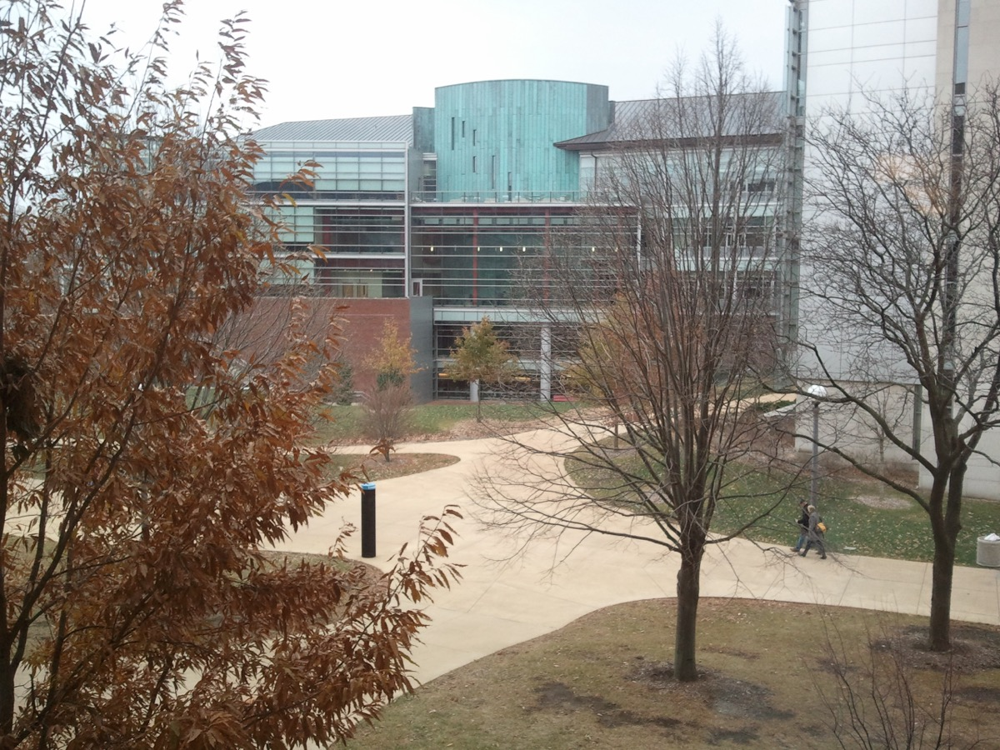

# Meta

_Meta hired three of Virtue AI_

## Executive Summary

> [!callout]
> This article reads one short news item, published by Semafor on October 2, 2026. Meta is parting ways with the people it brought in from Virtue AI, an AI security company, back in June. The three co-founders who made the move leave after four months. Andy Stone, a Meta spokesperson, offered close to a single sentence: unfortunately, the arrangement didn't work out as planned.

> The reason this does not stay a staffing story sits in what Meta actually bought in June. It took no company, no intellectual property and no customer contracts. Only people moved. The testing system left behind, along with the records that system produces, went to the security vendor Fortinet before two months had passed. People and records ended up at two different companies, and four months later the people side scattered again.

> Sections 1 through 3 are what the reporting and the official announcements say. Sections 4 and 5 are this article's own reading of those facts, from the point of view of people who work with data.

### Key Numbers

The numbers attached to this story come down to four. The first two say how long the people stayed; the last two say where the thing they were building ended up.

Sources: [Semafor (2026-10-02)](https://www.semafor.com/article/10/02/2026/meta-parts-ways-with-virtue-ai), [Help Net Security (2026-08-17)](https://www.helpnetsecurity.com/2026/08/17/fortinet-virtue-ai-acquisition/).

<!-- stat-card -->
**4 months** — From hire to split — Joined June 25, 2026; split reported October 2

<!-- stat-card -->
**3 founders** — Co-founders who went to Meta — Three of four: Bo Li, Dawn Song, Sanmi Koyejo. The company and its technology stayed behind

<!-- stat-card -->
**2 months** — From the hire to the sale of the technology — Fortinet acquired Virtue AI itself on August 17

<!-- stat-card -->
**50+** — Test environments Fortinet acquired — Sandboxed spaces for attacking AI across 14 high-stakes domains

## A Hire That Lasted Four Months

On June 25, 2026, Meta brought three Virtue AI co-founders and key staff into Meta Superintelligence Labs. Bo Li is an associate professor at the University of Illinois Urbana-Champaign, Dawn Song a professor at UC Berkeley, and Sanmi Koyejo an assistant professor of computer science at Stanford. Song received the title of VP of AI Research at Meta.

Reporting lines split in two. Li and Song reported to Nat Friedman inside Superintelligence Labs, while Koyejo reported to Rob Fergus, who leads Meta's fundamental research group, FAIR. The three were not grouped into one team but placed in two organizations.

Virtue AI was founded in 2024. It handled security for the AI that companies run in production, and it built two things: testing that attacks a model on purpose to find its weak points, and a layer that stops the model in real time from producing answers it should not. The industry calls the first red-teaming and the second guardrails. The company has worked on both with Anthropic, OpenAI, and the National Institute of Standards and Technology at the US Department of Commerce.

The founding team was four people. Bo Li served as CEO alongside Dawn Song, Carlos Guestrin and Sanmi Koyejo. The company came into public view in April 2025 with $30 million in combined seed and Series A funding, co-led by Lightspeed Venture Partners and Walden Catalyst Ventures. Uber applied its technology to content safety and Glean used it to secure its own AI. The three people Meta hired in June are three of those four founders, and Guestrin's name was not on the list.

The Siebel School of Computing and Data Science at Illinois, where Bo Li teaches, posted news of the hire on September 17. Two weeks later, on October 2, Ashley Gold at Semafor broke the story of the split. The span from joining to the report of the split runs just under four months.

*▲ The Siebel School of Computing and Data Science at the University of Illinois Urbana-Champaign, where news of Bo Li's hire first appeared. | Source: [Wikimedia Commons](https://commons.wikimedia.org/wiki/File:Thomas_M._Siebel_Center_for_Computer_Science.jpg)*

## The Reason Meta Gave: "Clashing Work Styles"

Andy Stone, a Meta spokesperson, did not say much. "Unfortunately, the arrangement didn't work out as planned," he said, and gave clashing work styles as the reason. He added that Superintelligence Labs continues to focus on AI safety, on alignment, and on the risks that more capable models create.

Four months earlier, the internal memo read differently. "As we ship AI products to billions of people and build increasingly capable agents, keeping those systems safe, reliable, and trustworthy is foundational," it said. The people brought in to do that foundational work leave after four months.

*▲ Meta's headquarters entrance at 1 Hacker Way, Menlo Park, California, where spokesperson Andy Stone's comment originated. | Source: [Wikimedia Commons](https://commons.wikimedia.org/wiki/File:Meta_Headquarters_Sign.jpg) (CC BY-SA 4.0)*

> [!callout]
> Nobody outside can know what actually passed between the three and Meta. The company has disclosed a duration and a one-sentence sentiment, and none of the three has spoken publicly. This article does not guess at the content of the falling-out either. Two things are confirmed. The hire ended in four months, and there is no way from outside to see what was built during them.

## In Under Two Months, Fortinet Bought the Technology

The June deal was never a deal to buy a company. Meta did not take the legal entity called Virtue AI, the intellectual property it had built, or the contracts it held with customers. The people moved and nothing else did. The industry has a name for this arrangement, the acqui-hire: it looks like an acquisition, but what changes hands is hiring.

The company that stayed behind was sold separately. On August 17, 2026, the security vendor Fortinet announced that it had acquired Virtue AI. Terms were not disclosed, and Fortinet said the amount it paid was immaterial to its business. Fewer than two months had passed since the co-founders joined Meta.

The list of what Fortinet acquired shows what the body of this company was. Its platform tests autonomous agents for exploitable weaknesses across more than 50 sandboxed environments and 14 high-stakes domains, carries test items tuned to those domains, and reruns the same battery at every model update and policy fine-tune. At the end of all that testing sits audit-ready evidence a security or compliance team can take straight into a review, rather than a score.

The announcement also names the attacks. Simulated prompt injection, where an instruction is slipped into a prompt to steer the model, and attacks on MCP, the protocol an agent goes through when it calls outside tools, both run against leading agent frameworks. The automated red-teaming covers hundreds of attack vectors and more than 1,000 risk categories, with multimodal testing and on-demand reporting for security, risk and compliance teams. Because an algorithm invents the attacks instead of a person, the same battery can run again whenever the model changes.

▲ Sources: Semafor's report (2026-10-02) and security-trade coverage of Fortinet's acquisition announcement (2026-08-17).

Fortinet said it will fold the technology into FortiAIGate, its protection product for large language models, and into its wider security portfolio. The forecast the announcement leans on is attributed to Gartner: the market for securing AI ecosystems and AI agents grows from $2.8 billion in 2026 to $16.4 billion by 2030. Ken Xie, who founded Fortinet and chairs it, wrote in the release that AI is fundamentally changing enterprise computing and security must evolve just as quickly.

Put side by side, the two deals show one company coming apart along a visible seam. One side bought safety as people; the other bought safety as technology and records. Four months on, the side that scattered is the side that bought people. What Fortinet bought runs inside its security products.

## Red-Teaming Only Counts If It Leaves a Record

Attacking a model to find its weak points is not a one-time exam. Which version got which attack, what broke, and whether the same attack still worked after the fix all have to sit on the record before anyone can say the next version improved or regressed. That is why the core of the product Fortinet bought was evidence and not a score. A test is worth what its accumulated record is worth.

The three built the same kind of thing while working with Anthropic, OpenAI and NIST: a sense of which attacks actually land, of what counts as a pass and what counts as a failure, and of which way to rule on an ambiguous answer. This sense accumulates in people before it accumulates in documents, and it takes time to be written across into an organization's procedures and data.

Bo Li pointed at the same place in September, in the university news item. Security and trust would become one of the most important bottlenecks to deploying increasingly powerful AI systems in the real world, and the most important AI advances would come not only from making models more intelligent but from making intelligent systems more secure, reliable and trustworthy. The safety being described there is not a gate you pass once. It is work that has to run again every time the model changes, and work of that kind counts as done only when the run leaves a trace.

Four months is short for that writing-across. A quarter goes by on mapping the model inventory and release calendar of the organization you just joined, deciding where to hook the tests in, and rewriting the pass criteria in the company's own language. On top of that, the three were not grouped as one team; they reported into two organizations. That is not a structure that favors pulling the criteria into a single set.

When people leave, their skill is not the only thing that goes. What they were measuring, and by what standard, goes with them. The organization can hire the next person and still have to start from scratch, and for the models that shipped in between, there is no record of what they were tested against. No one outside can check which tests ran inside Meta during these four months, or what those tests caught.

## Why Pebblous Is Watching This Split

Securing safety through talent is fast. One contract, and a well-known researcher is inside the organization next month with a name you can put on a slide. An individual's capability comes in that way, though, not an organizational asset. It leaves when the individual leaves.

The slow route is data and procedure. Listing attack scenarios, writing the pass criteria down, storing test results bound to the model version: none of it is visible work. What accumulates this way stays with the organization after the people change. The next person does not have to set the criteria from scratch, and there is something to show when a regulator asks for the basis.

Pebblous repeats one line whenever it talks about AI-Ready Data. On top of data whose origin and history were never recorded, verification is not verification. Model evaluation works the same way. If what was measured and with which ruler is never left as data, a good result cannot be told apart from a loosened test. Safety evaluation records, attack histories and pass criteria therefore belong in managed data rather than in documents.

Where the three go next is a clue to the nature of this episode. A return to places they have worked with, such as Anthropic, OpenAI or NIST, would put the weight on a mismatch between individuals and an organization. One thing holds either way. The records they were building sit at Fortinet now, and whatever Meta accumulated over four months has not been published anywhere.

Thanks for reading this far. The split and the spokesperson's comment come from [Semafor's report](https://www.semafor.com/article/10/02/2026/meta-parts-ways-with-virtue-ai), and the details of Fortinet's acquisition of Virtue AI from [Help Net Security](https://www.helpnetsecurity.com/2026/08/17/fortinet-virtue-ai-acquisition/). Count how many of the model tests your team ran last quarter left results as data you can hold up against the next version, and let us know the number.

## References

### Coverage of the split

- 1.Gold, A. (2026). "[Meta parts ways with Virtue AI](https://www.semafor.com/article/10/02/2026/meta-parts-ways-with-virtue-ai)." Semafor, 2026-10-02.
- 2.AI Weekly. (2026). "[Meta Parts Ways With Virtue AI Team Hired Four Months Ago](https://aiweekly.co/alerts/meta-parts-ways-with-virtue-ai-team-hired-four-months-ago)."
- 3.roic.ai. (2026). "[Meta Parts Ways With Virtue AI in Sudden Reversal of AI-Security Acqui-Hire](https://www.roic.ai/news/meta-parts-ways-with-virtue-ai-in-sudden-reversal-of-ai-security-acqui-hire-10-02-2026)." 2026-10-02.

### Coverage of the June hire

- 4.AI Weekly. (2026). "[Meta Hires Three Virtue AI Founders Into Superintelligence Labs](https://aiweekly.co/alerts/meta-hires-three-virtue-ai-founders-into-superintelligence-labs)." 2026-06.
- 5.Dealroom. (2026). "[Meta hires Virtue AI founders to boost agent security amid scrutiny](https://app.dealroom.co/news/feed/meta-hires-virtue-ai-founders-to-boost-agent-security-amid-scrutiny)."

### Fortinet's acquisition of Virtue AI

- 6.Fortinet. (2026). "[Fortinet Advances Continuous AI Protection with the Acquisition of Virtue AI](https://investor.fortinet.com/news-releases/news-release-details/fortinet-advances-continuous-ai-protection-acquisition-virtue-ai)." Press release, 2026-08-17.
- 7.Help Net Security. (2026). "[Fortinet expands AI security portfolio with Virtue AI acquisition](https://www.helpnetsecurity.com/2026/08/17/fortinet-virtue-ai-acquisition/)." 2026-08-17.
- 8.Industrial Cyber. (2026). "[Fortinet acquires Virtue AI to strengthen security for agentic AI systems, expand AI runtime protection](https://industrialcyber.co/news/fortinet-acquires-virtue-ai-to-strengthen-security-for-agentic-ai-systems-expand-ai-runtime-protection/)."
- 9.MSSP Alert. (2026). "[Fortinet acquires Virtue AI to expand security for AI agents](https://www.msspalert.com/brief/fortinet-acquires-virtue-ai-to-expand-security-for-ai-agents)."

### Virtue AI company background

- 10.The SaaS News. (2025). "[Virtue AI Raises $30 Million in Funding](https://www.thesaasnews.com/news/virtue-ai-raises-30-million-in-funding/)." 2025-04. Confirms the four founders and the customers Uber and Glean.
- 11.Pulse 2.0. (2025). "[Virtue AI: $30 Million Secured For AI Safety And Security Platform](https://pulse2.com/virtue-ai-30-million-secured-for-ai-safety-and-security-platform/)." 2025-04-19.
- 12.SecurityWeek. (2025). "[Virtue AI Attracts $30M Investment to Address Critical AI Deployment Risks](https://www.securityweek.com/virtue-ai-attracts-30m-investment-to-address-critical-ai-deployment-risks/)."
- 13.Siebel School of Computing and Data Science, University of Illinois. (2026). "[Bo Li and her Virtue AI team hired by Meta](https://siebelschool.illinois.edu/news/bo-li-virtue-ai-meta)." 2026-09-17. Source of the Bo Li remarks.
