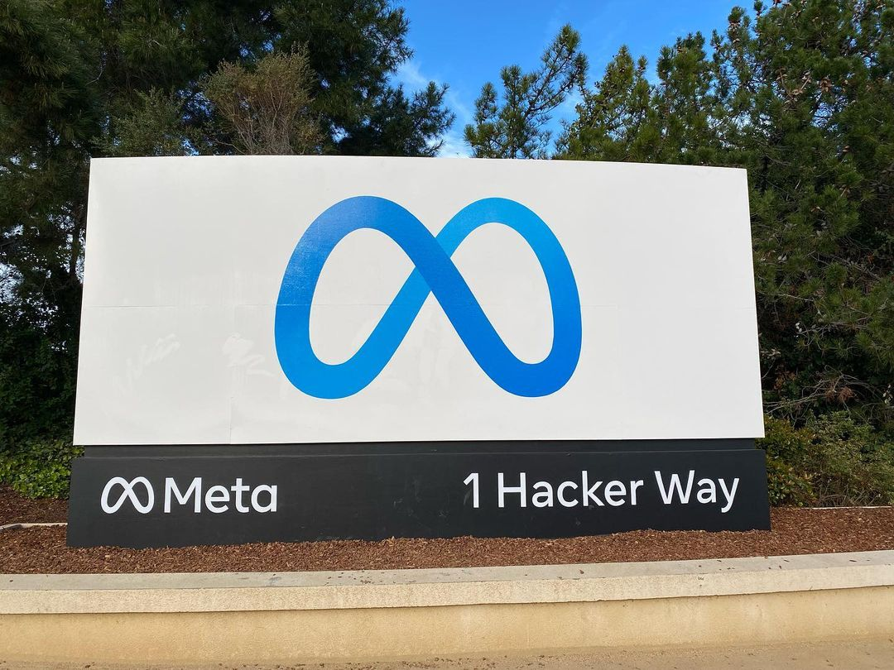

# 메타가 데려간 Virtue AI 안전팀, 넉 달 만에 결별

_메타가 6월에 데려간 것은 Virtue AI 창업자 세 명뿐이고, 약점을 찾는 검사 기술은 두 달도 안 돼 포티넷이 사 간다_

## Executive Summary

> [!callout]
> 이 글은 2026년 10월 2일 세마포가 단독으로 전한 짧은 소식 하나를 읽는다. 메타가 6월에 영입한 AI 보안 회사 Virtue AI 출신 인력과 갈라선다는 내용이다. 메타로 옮겼던 공동창업자 세 명은 넉 달 만에 자리를 뜬다. 메타 대변인 앤디 스톤이 내놓은 설명은 이 방식이 계획대로 되지 않았다는 한 문장이 거의 전부다.

> 이 소식이 인사 뉴스에서 끝나지 않는 이유는 메타가 6월에 산 것이 무엇이었는지에 있다. 메타는 회사도, 지적재산도, 고객 계약도 사지 않고 사람만 데려갔다. 회사에 남아 있던 검사 체계와 그것이 만들어 내는 기록은 두 달이 채 지나기 전에 보안 회사 포티넷이 통째로 사 갔다. 같은 조직에서 사람과 기록이 서로 다른 회사로 갈라진 셈이고, 넉 달 뒤 사람 쪽만 다시 흩어진다.

> 1절부터 3절까지는 보도와 공식 발표에 적힌 사실이다. 4절과 5절은 그 사실을 데이터를 다루는 사람의 눈으로 다시 읽은 이 글의 해석이다.

### 주요 수치

이 사건에 붙는 숫자는 네 개로 추릴 수 있다. 앞의 두 개는 사람이 얼마나 머물렀는지를, 뒤의 두 개는 그 사람들이 만들던 것이 어디로 갔는지를 말한다.

출처: [Semafor(2026-10-02)](https://www.semafor.com/article/10/02/2026/meta-parts-ways-with-virtue-ai), [Help Net Security(2026-08-17)](https://www.helpnetsecurity.com/2026/08/17/fortinet-virtue-ai-acquisition/).

<!-- stat-card -->
**넉 달** — 영입에서 결별까지 — 2026년 6월 25일 합류, 10월 2일 결별 보도

<!-- stat-card -->
**세 명** — 메타로 간 공동창업자 — 창업자 넷 가운데 보 리·던 송·산미 코예조. 회사와 기술은 따라가지 않았다

<!-- stat-card -->
**두 달** — 합류와 기술 매각 사이 — 8월 17일 포티넷이 Virtue AI 본체를 인수했다

<!-- stat-card -->
**50개 이상** — 포티넷이 가져간 시험 환경 — 위험이 큰 14개 분야에서 AI를 공격해 보는 격리 공간이다

## 넉 달 만에 끝난 영입

2026년 6월 25일 메타는 Virtue AI의 공동창업자 세 명과 핵심 인력을 메타 슈퍼인텔리전스 랩스로 데려갔다. 보 리는 일리노이대 어배너섐페인 캠퍼스 부교수, 던 송은 UC 버클리 교수, 산미 코예조는 스탠퍼드대 컴퓨터과학과 조교수다. 던 송은 메타에서 AI 리서치 부사장 직함을 받았다.

보고 구조는 둘로 갈렸다. 리와 송은 슈퍼인텔리전스 랩스의 냇 프리드먼에게, 코예조는 메타의 기초 연구 조직 FAIR를 이끄는 롭 퍼거스에게 보고했다. 세 사람이 한 팀으로 묶이지 않고 두 조직에 나뉘어 들어간 셈이다.

Virtue AI는 2024년에 세워진 회사다. 기업이 쓰는 AI의 보안을 맡아 왔고, 모델을 일부러 공격해 약점을 찾아내는 검사와 모델이 해서는 안 될 답을 내지 않도록 실시간으로 막는 장치를 만들었다. 앞의 것을 업계에서는 레드티밍, 뒤의 것을 가드레일이라 부른다. 이 회사는 앤트로픽, 오픈AI, 그리고 미국 상무부 산하 표준기술연구소(NIST)와 그 작업을 함께 해 온 이력이 있다.

회사를 세운 사람은 넷이다. 보 리가 대표를 맡았고 던 송, 카를로스 게스트린, 산미 코예조가 함께 창업했다. 2025년 4월 시드와 시리즈A를 묶은 3천만 달러를 받으며 바깥에 모습을 드러냈고, 라이트스피드 벤처 파트너스와 월든 카탈리스트 벤처스가 투자를 공동으로 이끌었다. 우버는 콘텐츠 안전 장치에, 글린(Glean)은 자사 AI 보안에 이 회사 기술을 가져다 썼다. 메타가 6월에 데려간 세 사람은 창업자 넷 가운데 셋이고, 게스트린의 이름은 그 명단에 없었다.

보 리의 소속 대학인 일리노이대 시벨 컴퓨팅·데이터사이언스 스쿨이 이 영입을 알리는 글을 학교 소식란에 올린 날은 9월 17일이다. 10월 2일 세마포의 애슐리 골드가 결별 소식을 단독으로 전했다. 합류부터 결별 보도까지 걸린 시간은 넉 달이 채 되지 않는다.

*▲ 일리노이대 어배너섐페인 캠퍼스의 시벨 컴퓨팅·데이터사이언스 스쿨. 보 리의 메타 영입 소식이 처음 공개된 곳이다. | Source: [Wikimedia Commons](https://commons.wikimedia.org/wiki/File:Thomas_M._Siebel_Center_for_Computer_Science.jpg)*

## 메타가 밝힌 사유는 '업무 방식 충돌' 한마디다

메타 대변인 앤디 스톤이 내놓은 설명은 길지 않다. "안타깝게도 이 방식이 계획대로 되지 않았다"는 문장이 전부이고, 사유로 보도에 적힌 말은 업무 방식이 서로 부딪혔다는 한마디뿐이다. 스톤은 그러면서 슈퍼인텔리전스 랩스가 AI 안전과 정렬, 그리고 앞선 모델이 만들어 낼 위험에 계속 집중한다고 덧붙였다.

넉 달 전 메타가 사내에 돌린 메모의 어조는 달랐다. 수십억 명에게 AI 제품을 내놓고 점점 더 유능해지는 에이전트를 만드는 지금, 그 시스템을 안전하고 믿을 수 있게 지키는 일이 기초적인 일이라고 적혀 있었다. 기초적인 일을 맡기려고 데려온 사람들이 넉 달 만에 떠난다.

*▲ 캘리포니아 멘로파크 1 Hacker Way, 메타 본사 입구. 대변인 앤디 스톤의 설명이 나온 곳이다. | Source: [Wikimedia Commons](https://commons.wikimedia.org/wiki/File:Meta_Headquarters_Sign.jpg) (CC BY-SA 4.0)*

> [!callout]
> 세 사람과 메타 사이에 실제로 무슨 일이 있었는지는 바깥에서 알 수 없다. 회사가 밝힌 것은 기간과 한 문장짜리 소회뿐이고, 당사자들은 공개 발언을 하지 않았다. 이 글도 불화의 내용을 추측하지 않는다. 분명한 사실은 둘이다. 영입이 넉 달 만에 끝났다는 것, 그리고 그동안 무엇이 만들어졌는지를 밖에서 알아볼 방법이 없다는 것이다.

## 기술은 두 달도 안 돼 다른 회사로 갔다

6월의 거래는 처음부터 회사를 사는 거래가 아니었다. 메타는 Virtue AI라는 법인도, 그 회사가 만든 지적재산도, 고객과 맺은 계약도 가져가지 않았다. 사람만 옮겨 왔다. 업계에서는 이런 방식을 애퀴하이어라고 부르는데, 인수처럼 보이지만 실제로 손에 쥐는 것은 채용뿐이다.

남은 회사는 따로 팔렸다. 2026년 8월 17일 보안 기업 포티넷이 Virtue AI를 인수한다고 발표했다. 금액은 공개하지 않았고, 포티넷은 자사 사업에 영향을 줄 만한 규모가 아니라고만 밝혔다. 공동창업자들이 메타로 간 지 두 달이 채 되지 않은 때다.

포티넷이 가져간 목록을 보면 이 회사의 본체가 무엇이었는지가 드러난다. 스스로 판단해 움직이는 AI를 공격해 보는 50개가 넘는 격리된 시험 환경, 사고가 나면 피해가 크게 번지는 14개 고위험 분야에 맞춘 검사 항목, 모델을 고치거나 다시 학습시킬 때마다 같은 검사를 되풀이하는 체계가 함께 넘어갔다. 그리고 이 모든 검사가 마지막에 내놓는 것은 점수가 아니라 보안팀과 심사 담당자가 그대로 쓸 수 있는 증거 묶음이다.

어떤 공격을 걸어 보는지도 발표에 적혀 있다. 프롬프트에 몰래 명령을 끼워 넣어 모델을 조종하는 수법, 그리고 에이전트가 바깥 도구를 불러 쓸 때 거치는 연결 규약인 MCP를 노린 공격을 널리 쓰이는 에이전트 프레임워크에 실제로 걸어 본다. 자동 레드티밍은 수백 가지 공격 경로와 1,000개가 넘는 위험 범주를 훑는다. 사람이 아니라 알고리즘이 공격을 지어내는 방식이라 모델이 바뀔 때마다 같은 검사를 다시 돌릴 수 있다.

▲ 출처: 세마포(2026-10-02) 보도와 포티넷 인수 발표(2026-08-17)를 전한 보안 매체 보도를 옮겼다.

포티넷은 이 기술을 자사의 대규모 언어모델 보호 제품 FortiAIGate와 보안 제품군에 붙여 쓴다고 밝혔다. 발표문이 근거로 든 가트너 전망은 AI 생태계와 에이전트를 지키는 제품 시장이 2026년 28억 달러에서 2030년 164억 달러로 커진다는 것이다. 포티넷을 세운 켄 시에 회장은 AI가 기업 전산을 바꾸고 있으니 보안도 그만큼 빨리 움직여야 한다고 발표문에 적었다.

그래서 두 거래를 나란히 놓으면 한 회사가 두 갈래로 갈라진 모양이 보인다. 한쪽은 안전을 사람으로 샀고, 다른 쪽은 안전을 기술과 기록으로 샀다. 넉 달 뒤 흩어진 것은 사람을 산 쪽이다. 포티넷이 사 간 쪽은 자사 보안 제품에 그대로 들어가 돌아간다.

## 검사는 한 번이 아니라 기록으로 쌓인다

모델을 공격해 약점을 찾는 일은 한 번의 시험으로 끝나지 않는다. 어떤 판본에 어떤 공격을 걸었고 무엇이 뚫렸으며 고친 뒤에 같은 공격이 다시 통했는지가 줄줄이 남아야, 다음 판본이 나아졌는지 퇴보했는지를 말할 수 있다. 포티넷이 사 간 제품의 핵심이 점수가 아니라 증거 묶음이었던 이유도 여기에 있다. 검사의 값어치는 그날의 결과가 아니라 누적된 기록에서 나온다.

세 사람이 앤트로픽과 오픈AI, 표준기술연구소와 일하며 쌓은 것도 같은 종류다. 어떤 공격이 실제로 통했는지, 무엇을 통과로 보고 무엇을 실패로 볼지, 애매한 답을 어느 쪽으로 판정할지에 대한 감각이다. 이런 감각은 문서보다 사람 안에 먼저 쌓이고, 조직의 절차와 데이터로 옮겨 적히기까지 시간이 걸린다.

보 리가 9월 대학 소식란에 남긴 말도 같은 자리를 가리킨다. 점점 강력해지는 AI를 실제로 쓰는 길목에서 보안과 신뢰가 가장 큰 병목이 될 것이고, 앞으로 중요한 진전은 모델을 더 똑똑하게 만드는 데서만 나오는 것이 아니라 똑똑해진 시스템을 더 안전하게 만드는 데서 나온다는 것이다. 여기서 말하는 안전은 한 번 통과시키면 끝나는 관문이 아니다. 모델이 바뀔 때마다 다시 돌려야 하는 일이고, 그런 일은 돌린 자취가 남아야 돌렸다고 말할 수 있다.

넉 달은 그 옮겨 적기를 끝내기에 짧다. 들어온 조직의 모델 목록과 배포 일정을 파악하고, 어디에 검사를 걸지 정하고, 판정 기준을 사내 언어로 다시 쓰는 일만 해도 한 분기가 지나간다. 더구나 세 사람은 한 팀으로 묶이지 않고 두 조직에 나뉘어 보고했다. 기준을 한 벌로 모으기에 유리한 구조는 아니었다.

사람이 떠날 때 함께 사라지는 것은 그 사람의 실력만이 아니다. 무엇을 어떤 기준으로 재고 있었는지도 같이 나간다. 남은 조직이 다음 사람을 뽑아도 처음부터 다시 정해야 하고, 그 사이에 나온 모델은 어떤 잣대로 검사됐는지 되짚을 수 없다. 메타 안에서 이 넉 달 동안 어떤 검사가 돌았고 무엇이 걸렸는지는, 적어도 바깥에서는 확인할 길이 없다.

## 페블러스가 이 사건을 주목하는 이유

안전을 인재로 확보하는 방식은 빠르다. 계약서 한 장이면 다음 달부터 이름난 연구자가 조직 안에 있고, 발표 자료에 그 이름을 적을 수 있다. 다만 이 방식으로 들어온 것은 조직의 자산이 아니라 개인의 역량이다. 개인이 나가면 함께 나간다.

안전을 데이터와 절차로 확보하는 방식은 느리다. 공격 시나리오를 목록으로 만들고, 판정 기준을 글로 적고, 검사 결과를 모델 판본과 묶어 저장하는 일은 눈에 띄지 않는다. 대신 이렇게 쌓인 것은 사람이 바뀌어도 조직에 남는다. 다음 사람이 처음부터 기준을 다시 정하지 않아도 되고, 규제 기관이 근거를 물을 때 내보일 것이 있다.

페블러스가 AI-Ready Data를 이야기할 때 되풀이하는 말이 있다. 출처와 이력이 기록되지 않은 데이터 위에서는 검증도 검증이 아니다. 모델 평가도 다르지 않다. 어떤 잣대로 무엇을 쟀는지가 데이터로 남아 있지 않으면, 좋은 결과가 나와도 그것이 모델이 좋아진 덕인지 검사가 느슨해진 덕인지 가릴 수 없다. 안전 평가 기록과 공격 이력, 판정 기준은 그래서 문서가 아니라 관리 대상 데이터로 다뤄야 한다.

세 사람이 다음에 어디로 가는지는 이 일의 성격을 가늠할 단서가 된다. 앤트로픽이나 오픈AI, 또는 표준기술연구소처럼 그들이 함께 일해 온 곳으로 돌아간다면 개인과 조직이 맞지 않았다는 쪽에 무게가 실린다. 어디로 가든 한 가지는 바뀌지 않는다. 그들이 만들던 기록은 지금 포티넷에 있고, 메타가 넉 달 동안 무엇을 쌓았는지는 어디에도 공개되지 않았다.

여기까지 읽어 주셔서 감사하다. 결별 소식과 대변인 발언은 [세마포 보도](https://www.semafor.com/article/10/02/2026/meta-parts-ways-with-virtue-ai)에서, 포티넷의 Virtue AI 인수 내용은 [Help Net Security](https://www.helpnetsecurity.com/2026/08/17/fortinet-virtue-ai-acquisition/)에서 확인할 수 있다. 여러분의 팀이 지난 분기에 돌린 모델 검사 가운데 결과가 데이터로 남아 다음 판본과 맞대어 볼 수 있는 것이 몇 건인지 한번 세어 보시고 알려 주시면 좋겠다.

## 참고문헌

### 결별 보도

- 1.Gold, A. (2026). "[Meta parts ways with Virtue AI](https://www.semafor.com/article/10/02/2026/meta-parts-ways-with-virtue-ai)." Semafor, 2026-10-02.
- 2.AI Weekly. (2026). "[Meta Parts Ways With Virtue AI Team Hired Four Months Ago](https://aiweekly.co/alerts/meta-parts-ways-with-virtue-ai-team-hired-four-months-ago)."
- 3.roic.ai. (2026). "[Meta Parts Ways With Virtue AI in Sudden Reversal of AI-Security Acqui-Hire](https://www.roic.ai/news/meta-parts-ways-with-virtue-ai-in-sudden-reversal-of-ai-security-acqui-hire-10-02-2026)." 2026-10-02.

### 6월 영입 보도

- 4.AI Weekly. (2026). "[Meta Hires Three Virtue AI Founders Into Superintelligence Labs](https://aiweekly.co/alerts/meta-hires-three-virtue-ai-founders-into-superintelligence-labs)." 2026-06.
- 5.Dealroom. (2026). "[Meta hires Virtue AI founders to boost agent security amid scrutiny](https://app.dealroom.co/news/feed/meta-hires-virtue-ai-founders-to-boost-agent-security-amid-scrutiny)."

### 포티넷의 Virtue AI 인수

- 6.Fortinet. (2026). "[Fortinet Advances Continuous AI Protection with the Acquisition of Virtue AI](https://investor.fortinet.com/news-releases/news-release-details/fortinet-advances-continuous-ai-protection-acquisition-virtue-ai)." 보도자료, 2026-08-17.
- 7.Help Net Security. (2026). "[Fortinet expands AI security portfolio with Virtue AI acquisition](https://www.helpnetsecurity.com/2026/08/17/fortinet-virtue-ai-acquisition/)." 2026-08-17.
- 8.Industrial Cyber. (2026). "[Fortinet acquires Virtue AI to strengthen security for agentic AI systems, expand AI runtime protection](https://industrialcyber.co/news/fortinet-acquires-virtue-ai-to-strengthen-security-for-agentic-ai-systems-expand-ai-runtime-protection/)."
- 9.MSSP Alert. (2026). "[Fortinet acquires Virtue AI to expand security for AI agents](https://www.msspalert.com/brief/fortinet-acquires-virtue-ai-to-expand-security-for-ai-agents)."

### Virtue AI 회사 정보

- 10.The SaaS News. (2025). "[Virtue AI Raises $30 Million in Funding](https://www.thesaasnews.com/news/virtue-ai-raises-30-million-in-funding/)." 2025-04. 창업자 네 명과 고객사(우버·글린) 확인.
- 11.Pulse 2.0. (2025). "[Virtue AI: $30 Million Secured For AI Safety And Security Platform](https://pulse2.com/virtue-ai-30-million-secured-for-ai-safety-and-security-platform/)." 2025-04-19.
- 12.SecurityWeek. (2025). "[Virtue AI Attracts $30M Investment to Address Critical AI Deployment Risks](https://www.securityweek.com/virtue-ai-attracts-30m-investment-to-address-critical-ai-deployment-risks/)."
- 13.Siebel School of Computing and Data Science, University of Illinois. (2026). "[Bo Li and her Virtue AI team hired by Meta](https://siebelschool.illinois.edu/news/bo-li-virtue-ai-meta)." 2026-09-17. 보 리 발언 인용.
