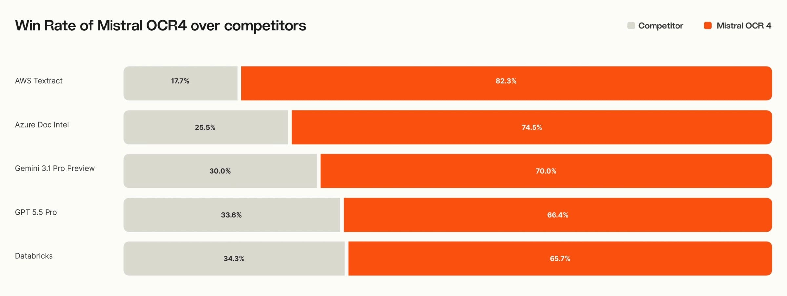

# The Mistral OCR That Gives Every Word a Confidence Score

_Extraction becomes the quality check. Every word carries a confidence score, and the document never leaves your infrastructure_

## Executive Summary

> [!callout]
> On June 23, 2026, Mistral released OCR 4 for document intelligence. What the new model outputs is not just text. Every single word carries a confidence score, each character comes with coordinates showing where it sat on the page, and every block is classified as a heading, a table, a formula, and so on. Of those signals, the one that shakes a data pipeline the most is the word-level confidence score.

> Traditional OCR told you only at the document or page level that the result was "probably trustworthy." OCR 4 scores every word. As a result, the extraction output doubles as a quality scorecard. A downstream pipeline can use a single threshold to auto-approve high-confidence text and route only low-confidence text to a human. In effect, the separate quality-validation step disappears. That said, the self-hosting price was not disclosed, and the API rate doubled compared to OCR 3.

> Add position coordinates and block classification, and a RAG answer can be traced back to a single cell of a table in the source document, while single-container self-hosting keeps sensitive documents from ever leaving your infrastructure. Extraction, quality, provenance, sovereignty — four challenges once solved separately now interlock inside one product.

<!-- stat-card -->
**Per-word** — confidence score — Confidence output for every word, not per page

<!-- stat-card -->
**170** — supported languages — 10 language families, including low-resource languages

<!-- stat-card -->
**85.20** — #1 on OlmOCRBench — 72% win rate across 600+ document evaluations

<!-- stat-card -->
**1 container** — self-hosting — On-premise deployment with no cloud transfer

## Unstructured Data Is the First Gate

Roughly 80% of the data an enterprise holds is unstructured. PDF contracts, scanned invoices, reports dense with tables, forms mixed with handwriting. To connect these documents to an LLM, there is one step you cannot skip: turning paper that people used to read into a structure a machine can handle. That is document extraction. The first gate on the road to AI-Ready Data sits right here.

The problem is that this first gate has long been the weakest. Traditional OCR simply spits out text; it never told you how much you could trust that text. Misread a blurry scanned "3" as an "8," and the output looks like a perfectly clean "8." Downstream, there is no way to know which characters are dangerous. In the end, someone had to re-check everything by hand, or give up on checking and carry the errors forward.

> [!callout]
> The "garbage in, garbage out" everyone cites in RAG starts not at the retrieval step but right here, at extraction. If you read the source document wrong, no amount of great embedding and retrieval stacked on top can push answer quality past the extraction error. The quality of the first gate is the ceiling for the entire pipeline.

## From Text to Structure

Where OCR 4 parts ways with existing tools is not the accuracy number. It is the shape of the output. Feed in the same document and what comes back is different. Where traditional OCR hands you a run of characters, OCR 4 attaches three more things to those characters: position coordinates for each text element (a bounding box), a block-type classification (heading, table, formula, signature, paragraph), and confidence scores at both the page and word level. On output format, beyond Markdown and JSON, it supports pulling fields out according to a schema you define.

The raw performance does not lag either. It took the overall top spot on OlmOCRBench with 85.20 and posted 93.07 on OmniDocBench, and in an independent-evaluator preference comparison across more than 600 documents and over 12 languages it showed a 72% win rate. It supports 170 languages across 10 language families. The fact that performance does not collapse on low-resource languages the way it does for competing tools matters especially to organizations handling multilingual documents.

*▲ In independent-evaluator preference comparisons, OCR 4 recorded 66–82% win rates against major competing models | Source: [Mistral AI](https://mistral.ai/news/ocr-4/)*

The crux is the move from "reading" to "understanding as structure." A job that used to pull out characters alone has become one that also outputs what the document looks like, what each piece is, and how trustworthy it is. That difference flows into data quality and RAG over the next two sections.

## What the Confidence Score Changes

A word-level confidence score sounds small, but its consequences are large. It means extraction and quality measurement happen at the same step. The old pipeline turned a document into text via OCR, then placed a separate quality-validation step to decide whether that text was usable, and only after a human reviewed it did the text go into the database. OCR 4 compresses this flow. Since the extraction output already has per-word scores baked in, you can branch immediately on a single threshold.
