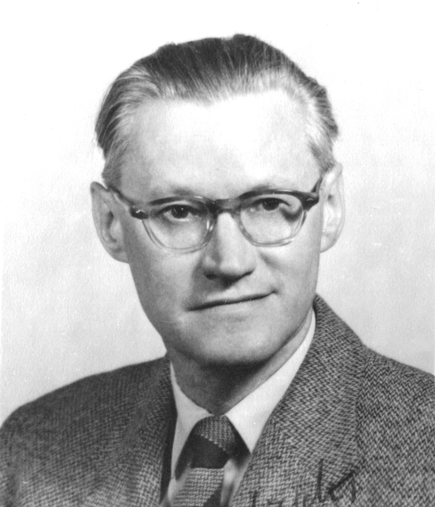

# A Single Layer of 1940s Math Steadied Scientific AI That Noise Kept Breaking

_Not a bigger neural network — a mollifier layer that smooths the data_

## Executive Summary

> [!callout]
> The place scientific AI stalls most often is not the algorithm but the data. In inverse-PDE learning, where the goal is to work backward from observations to a hidden cause, a neural network has to take high-order derivatives of noisy data — and the errors explode while memory use spikes. Instead of forcing through this bottleneck with a bigger model, a team at Penn Engineering went around it by adding a single layer that smooths the data first.

> That single layer is the Mollifier Layer. It takes a smoothing function the mathematician Kurt Otto Friedrichs devised in the 1940s and convolves it with the network's output, shaving off noise before any derivative is taken. The architecture is not touched at all. And yet, across first- through fourth-order partial differential equations, accuracy, memory, and training speed all improved together.

> The bottleneck was not the size of the model but the representation of the data. Once the data was handled, accuracy and efficiency followed without touching the model's structure. How an 80-year-old mathematical tool solved a 2025 noise problem in scientific AI is exactly that proof.

### Key Figures

Source: Bhartari et al., [arXiv:2505.11682 (2025)](https://arxiv.org/abs/2505.11682)

Four numbers compress the work. An 80-year-old mathematical tool was added as a single layer at the output, the model left untouched, and that alone stabilized derivatives from first to fourth order even amid noise — lifting accuracy, memory, and speed at once.

<!-- stat-card -->
**1940s** — When the mollifier was born — 80-year-old math solving scientific AI

<!-- stat-card -->
**1 output layer** — Module added — Network architecture unchanged

<!-- stat-card -->
**1st–4th** — Derivative orders tested — High-order derivatives stable under noise

<!-- stat-card -->
**All at once** — Accuracy · memory · speed — No trade-off among the three

## Why Did Scientific AI Break Down in the Face of Noise?

Partial differential equations (PDEs) are the language for writing down rates of change in nature. The flow of a fluid, the conduction of heat, the way matter spreads and reacts — all of it is expressed in PDEs. The thorny case among them is the inverse problem: working backward from an effect to its cause. Vivek Shenoy, who led the research, likens it to figuring out where a stone landed in a pond by looking only at the ripples that spread out. The effect is right in front of you, but the cause is hidden in the data.

The standard tool for such problems is the Physics-Informed Neural Network (PINN). A PINN repeatedly differentiates the function the network produces and tunes it to fit the equation. The key operation here is recursive automatic differentiation (recursive autodiff). It is clean in theory, but the trouble starts with a fact that never goes away: experimental data always carries noise.

Differentiation measures rates of change, and noise is change that jitters at a fine scale. So the more you differentiate, the more the noise grows relative to the signal. phys.org compared it to zooming in on a jagged line again and again. A line that turns rough after one zoom jumps out of control as you differentiate a second and a fourth time. Compute those high-order derivatives recursively and the backpropagation graph stacks up layer upon layer, so memory and training time blow up along with it.

> [!callout]
> That is why the old approach only worked properly in tidy settings with little noise and low derivative order. In the words of first author Ananyae Kumar Bhartari, after tinkering with the network this way and that, the real bottleneck turned out to be not the model but recursive automatic differentiation itself. It was a problem of how the data was handled — one that stacking deeper networks could not solve.

## 80-Year-Old Math Returns — Friedrichs' Mollifier

The solution came not from a new technique but from old mathematics. In the 1940s, the mathematician Kurt Otto Friedrichs devised a tool called the mollifier to work with PDE theory. Just as the word "mollify" means to soften, a mollifier softens functions that are sharp and rough.

*▲ Kurt Otto Friedrichs (c. 1950) — the mathematician who devised the mollifier for PDE theory in the 1940s | Source: [Wikimedia Commons](https://commons.wikimedia.org/wiki/File:Kurt-Friedrichs-abt-1950-O.jpg) (Public Domain)*

The way it works is convolution. It replaces a point of a function not with that point alone but with a weighted average of its neighbors. A spike gets pressed down by the values on either side; a dip gets pulled up by what surrounds it. Finely jittering components like noise cancel one another out in this averaging and disappear. The crucial part is that this smoothing preserves the function's mathematical properties — its continuity and differentiability.

*▲ The mollifier bump function — smooth, zero outside a finite region, serving as the convolution kernel | Source: [Wikimedia Commons](https://commons.wikimedia.org/wiki/File:Mollifier_movie.gif) (Public Domain, Oleg Alexandrov)*

In the era when Friedrichs built this tool there were no neural networks and no automatic differentiation. What he set out to solve was a problem in pure PDE theory. Yet 80 years later, scientific AI — which needs to take high-order derivatives stably from noisy data — turned out to need exactly the same property: smooth the data before differentiating, without wrecking the structure of the equation to be solved. The answer had already been written down in the 1940s.

## Mollifier Layers — One Layer That Smooths Data First

What the team did was slot this 80-year-old mathematics into the neural network. The Mollifier Layer is a lightweight module that attaches only to the network's output layer. When the network produces an answer, the layer convolves that output once with an analytically defined mollifier to smooth it before differentiation begins. Noise is filtered out at this step, and the cleaned-up function passes on to the derivative.

The crux is that it changes how differentiation is viewed. Where conventional recursive autodiff amplified the noise as-is, the Mollifier Layer redefines differentiation as an integral operation combined with convolution. As a result, noise does not propagate into the differentiation process. Seen as a flow, it looks like this.

Noisy output

Recursive derivative → noise explodes

Conventional approach

→

Smoothed output

Stable high-order derivatives

Mollifier Layer

The design brings three benefits together. First, it is architecture-agnostic. It attaches to the output layer of any neural network, with no need to alter the existing model structure. Second, it is light: the added compute is negligible. Third, it is robust to noise, working stably even on data pulled fresh out of the lab with jitter in it.

*▲ Mollifier Layer architecture — (a) time and error explosion in conventional autodiff, (b) Laplacian actual vs. predicted, (d) PhiML with the mollifier integrated at the output | Source: [Bhartari et al., arXiv:2505.11682](https://arxiv.org/abs/2505.11682)*

> [!callout]
> What deserves attention is where the change was made. The team did not touch the network's brain — its model structure. Instead they added a layer at the gateway where data enters and leaves the model. They left the model alone and changed only the representation of the data, and the results changed. That choice of location is the real message of this work.

## Accuracy, Memory, Speed, and Into the Cell

Validation proceeded by climbing the orders. Across PDE benchmarks from first to fourth order — Langevin dynamics, heat diffusion, reaction-diffusion systems and more — the model with a Mollifier Layer lifted three metrics together. Accuracy in recovering hidden parameters rose, the memory that high-order derivatives demanded fell, and training sped up as the recursive-derivative stack thinned out.

*▲ Langevin dynamics inverse problem — the Mollified PINN (green) converges faster and recovers parameters stably under noise, where the conventional PINN (blue) diverges | Source: [Bhartari et al., arXiv:2505.11682](https://arxiv.org/abs/2505.11682)*

Normally, getting one of the three means giving up another. Push accuracy up and memory and time go up too; make it lighter and accuracy drops. The reason the Mollifier Layer sidesteps this familiar trade-off is simple: it eliminates the root of the problem, the noise amplification itself. Remove the cause instead of patching the symptoms one by one, and all three metrics resolve at once.

Where the effect is most striking is not an abstract benchmark but inside a cell. The team applied the technique to super-resolution chromatin imaging data to infer epigenetic reaction rates that vary from place to place. It is a way of looking at how 100-nanometer DNA packaging domains regulate gene expression — work that leads directly into research on cancer, aging, and disease treatment. What matters is that it worked on real biological data, where noise is intrinsic.

> [!callout]
> The same principle spreads beyond chromatin. Reverse-engineering the hidden properties of materials, tracing fluid flow backward, recovering atmospheric state from observations in weather forecasting — every field that has to solve an inverse PDE from noisy data gains from the same single layer.

## Data Before the Model — The Most Mathematical Proof

What makes this work special for data practitioners is the shape of its conclusion. When scientific AI stalls, the common prescription is a deeper network, more parameters, more compute. Yet here what brought the wall down was not the model. It was a single step: handling the noise in the data the network receives, first.

Look at the structure again and it is clear. The Mollifier Layer does not change a single line of the model architecture. The only place it touches is the gateway where data flows. And yet accuracy, memory, and speed all followed. The claim that improving data quality lifts performance without scaling the model has been proven — not as a guess or an anecdote, but on benchmarks running from first- to fourth-order PDEs.

Practical AI pipelines share the same structure. Before agonizing over model choice, you should first ask what noise is mixed into the input data and how it gets amplified in downstream operations. Just as scientific AI's bottleneck was data noise rather than the algorithm, AI in the field too is decided first by the representation of the data, not the model. A good share of the problems people try to paper over with a bigger model are solved more cheaply and accurately by placing a thin layer on the data side.

> [!callout]
> That 80-year-old mathematics solved a cutting-edge 2025 problem is no accident. It is because the principle came before the tool. The principle of smoothing away noise held regardless of era, and the neural network was merely a new vessel to hold it. To say data comes before the model is, in the end, to say that the principle for handling data comes before the technology.

## FAQ

## References

### R.1. Academic Papers

- 1.Bhartari AK, Vinayak V, Shenoy VB. (2025). "[Mollifier Layers: Enabling Efficient High-Order Derivatives in Inverse PDE Learning](https://arxiv.org/abs/2505.11682)." _Transactions on Machine Learning Research_ / NeurIPS 2026. arXiv:2505.11682.

### R.2. Press & Institutional

- 2.University of Pennsylvania School of Engineering and Applied Science. (2026). "[AI Method Tackles One of Science's Hardest Math Problems](https://www.seas.upenn.edu/stories/ai-method-tackles-one-of-sciences-hardest-math-problems/)."
- 3.phys.org. (2026.05). "[AI tackles math's brutal problems](https://phys.org/news/2026-05-ai-tackles-math-brutal-problems.html)."

Thank you for reading. Each time you meet news that AI performance has stalled, the habit of asking "which representation of the data is holding us back?" alongside "do we need a bigger model?" will often open a path to a cheaper, more accurate solution. If you have thoughts or counterarguments on this topic, we would love to hear them.

**Pebblous Data Communication Team**  
June 21, 2026
