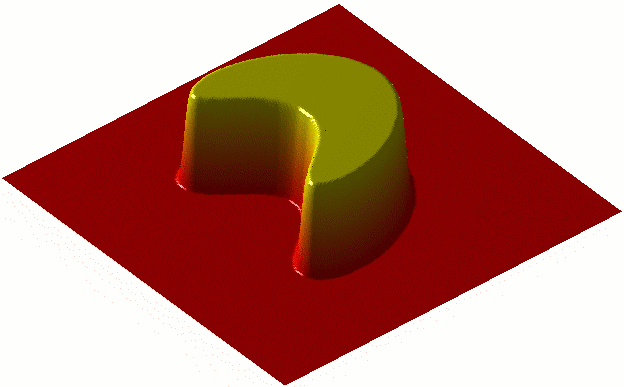
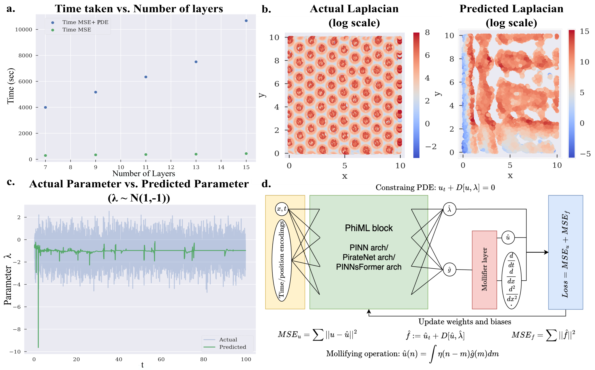
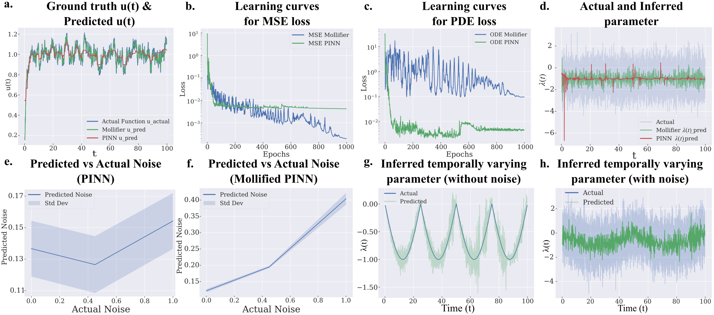

# 노이즈에 흔들리던 과학 AI를 1940년대 수학 한 겹이 붙잡았다

_더 큰 신경망이 아니라 데이터의 노이즈를 먼저 다듬는 몰리파이어 레이어가 답이었다_

## Executive Summary

> [!callout]
> 과학 AI가 가장 자주 막히는 지점은 알고리즘이 아니라 데이터였다. 관측값에서 숨은 원인을 역산하는 역 편미분방정식(inverse PDE) 학습에서, 신경망은 노이즈가 섞인 데이터로 고차 미분을 구하다가 오차가 폭발하고 메모리가 치솟았다. 펜실베이니아대 공과대학 연구팀은 이 병목을 더 큰 모델로 뚫는 대신, 데이터를 먼저 부드럽게 만드는 한 겹을 붙여 우회했다.

> 그 한 겹이 몰리파이어 레이어(Mollifier Layers)다. 수학자 쿠르트 오토 프리드릭스가 1940년대에 만든 평활 함수를 신경망 출력에 합성곱으로 얹어, 미분하기 전에 노이즈를 먼저 깎는다. 아키텍처는 한 줄도 바꾸지 않는다. 그런데도 1차부터 4차 편미분방정식까지 정확도와 메모리, 학습 속도가 함께 좋아졌다.

> 병목은 모델의 크기가 아니라 데이터의 표현이었다. 데이터를 손보자 모델 구조를 건드리지 않고도 정확도와 효율이 따라왔다. 80년 된 수학 도구가 2025년 과학 AI의 노이즈 문제를 푼 과정이 바로 그 증거다.

### 주요 수치

출처: Bhartari et al., [arXiv:2505.11682 (2025)](https://arxiv.org/abs/2505.11682)

아래 네 숫자가 이 연구를 압축한다. 80년 된 수학 도구를 모델은 그대로 둔 채 출력층에 한 겹만 더했고, 그것만으로 1차부터 4차까지의 미분을 노이즈 속에서도 안정시켜 정확도와 메모리, 속도를 한꺼번에 끌어올렸다.

<!-- stat-card -->
**1940년대** — 몰리파이어의 출생연도 — 80년 된 수학이 과학 AI를 풀다

<!-- stat-card -->
**출력층 1겹** — 추가한 모듈 — 신경망 아키텍처는 그대로

<!-- stat-card -->
**1~4차** — 검증한 미분 차수 — 노이즈에도 고차 미분이 안정

<!-- stat-card -->
**동시 개선** — 정확도·메모리·속도 — 셋 사이 트레이드오프 없이

## 과학 AI는 왜 노이즈 앞에서 무너졌나

편미분방정식(PDE)은 자연의 변화율을 적는 언어다. 유체의 흐름, 열의 전도, 물질이 퍼지고 반응하는 과정이 모두 PDE로 표현된다. 그중에서도 까다로운 것이 역문제(inverse PDE)다. 결과를 보고 원인을 거꾸로 알아내는 일이다. 연구를 이끈 비벡 셰노이는 연못에 떨어진 돌의 위치를, 퍼져 나간 물결만 보고 알아내는 일에 비유한다. 결과는 눈앞에 있지만 원인은 데이터 속에 숨어 있다.

이런 문제에 표준으로 쓰이는 도구가 물리 정보 신경망(Physics-Informed Neural Networks, PINN)이다. PINN은 신경망이 만든 함수를 반복해서 미분하며 방정식을 맞춰 나간다. 이때 핵심 연산이 재귀 자동 미분(recursive autodiff)이다. 이론상으로는 깔끔하지만, 실험에서 얻은 데이터에는 언제나 노이즈가 섞여 있다는 데서 문제가 시작된다.

미분은 변화율을 재는 일이고, 노이즈는 잘게 흔들리는 변화다. 그래서 미분할수록 노이즈가 신호보다 더 커진다. phys.org는 이것을 울퉁불퉁한 선을 자꾸 확대하는 일에 비유했다. 한 번 확대하면 거칠어진 선이, 2차·4차로 미분을 거듭할수록 걷잡을 수 없이 튀어 오른다. 거기에 고차 미분을 재귀로 계산하면 역전파 그래프가 층층이 쌓여 메모리와 학습 시간까지 함께 폭증한다.

> [!callout]
> 그래서 기존 방식은 노이즈가 적고 차수가 낮은, 잘 정돈된 설정에서만 제대로 작동했다. 제1저자 아난야에 쿠마르 바르타리의 표현을 빌리면, 네트워크를 이리저리 손보다 보니 진짜 병목은 모델이 아니라 재귀 자동 미분 그 자체였다. 더 깊은 신경망을 쌓는 것으로는 풀리지 않는, 데이터를 다루는 방식의 문제였다.

## 80년 전 수학의 귀환 — 프리드릭스의 몰리파이어

해법은 새 기술이 아니라 오래된 수학에서 나왔다. 1940년대, 수학자 쿠르트 오토 프리드릭스(Kurt Otto Friedrichs)는 PDE 이론을 다루기 위해 몰리파이어(mollifier)라는 도구를 고안했다. 영어 mollify가 누그러뜨린다는 뜻이듯, 몰리파이어는 뾰족하고 거친 함수를 부드럽게 다듬는 역할을 한다.

*▲ 쿠르트 오토 프리드릭스 (Kurt Otto Friedrichs, 약 1950년) — 1940년대 몰리파이어를 고안한 수학자 | Source: [Wikimedia Commons](https://commons.wikimedia.org/wiki/File:Kurt-Friedrichs-abt-1950-O.jpg) (Public Domain)*

작동 방식은 합성곱(convolution)이다. 함수의 어느 한 점을 그 점 혼자가 아니라 주변값의 가중 평균으로 바꾼다. 튀어 오른 한 점은 양옆에 눌려 내려앉고, 패인 곳은 주변에 끌려 올라온다. 노이즈처럼 잘게 흔들리는 성분이 이 평균 과정에서 서로 상쇄되며 사라진다. 중요한 점은, 이렇게 다듬어도 원래 함수의 수학적 성질, 곧 연속성과 미분 가능성이 보존된다는 것이다.

*▲ 몰리파이어 범프 함수 — 유한한 영역에서만 값을 가지고 외부는 0인 이 매끄러운 함수가 합성곱의 기저가 된다 | Source: [Wikimedia Commons](https://commons.wikimedia.org/wiki/File:Mollifier_movie.gif) (Public Domain, Oleg Alexandrov)*

프리드릭스가 이 도구를 만든 시대에는 신경망도, 자동 미분도 없었다. 그가 풀려던 것은 순수한 PDE 이론의 문제였다. 그런데 80년 뒤, 노이즈 데이터에서 고차 미분을 안정적으로 구해야 하는 과학 AI가 정확히 같은 성질을 필요로 하게 됐다. 미분 전에 데이터를 부드럽게 만들되, 풀어야 할 방정식의 구조는 망가뜨리지 않는 것. 답은 이미 1940년대에 적혀 있었다.

## 몰리파이어 레이어 — 데이터를 먼저 다듬는 한 겹

연구팀이 한 일은 이 80년 된 수학을 신경망에 끼워 넣는 것이었다. 몰리파이어 레이어는 신경망의 출력 레이어에만 붙는 경량 모듈이다. 신경망이 답을 내놓으면, 미분에 들어가기 전에 분석적으로 정의된 몰리파이어로 그 출력을 한 번 합성곱해 부드럽게 만든다. 노이즈는 이 단계에서 걸러지고, 깨끗해진 함수가 미분으로 넘어간다.

핵심은 미분을 보는 관점을 바꿨다는 데 있다. 기존 재귀 자동 미분이 노이즈까지 그대로 증폭했다면, 몰리파이어 레이어는 미분을 합성곱과 결합된 적분 연산으로 다시 정의한다. 그 결과 노이즈가 미분 과정에 전파되지 않는다. 흐름으로 보면 다음과 같다.

노이즈 있는 출력

재귀 미분 → 노이즈 폭발

기존 방식

→

평활화 후 출력

안정적 고차 미분

몰리파이어 레이어

설계가 주는 이점은 세 가지로 모인다. 첫째, 아키텍처에 무관하다. 어떤 신경망이든 출력 레이어에 붙이면 되고, 기존 모델 구조를 고칠 필요가 없다. 둘째, 가볍다. 추가되는 연산의 부담이 미미하다. 셋째, 노이즈에 강하다. 실험실에서 막 뽑아낸, 잡음이 섞인 데이터에서도 안정적으로 작동한다.

*▲ 몰리파이어 레이어 아키텍처 — (a) 기존 자동 미분의 시간·오차 폭발, (b) 라플라시안 실제 vs. 예측, (c-d) PhiML에 몰리파이어를 결합한 전체 구조 | Source: [Bhartari et al., arXiv:2505.11682](https://arxiv.org/abs/2505.11682)*

> [!callout]
> 주목할 대목은 손을 댄 위치다. 연구팀은 신경망의 뇌, 곧 모델 구조를 건드리지 않았다. 대신 데이터가 모델로 들어가고 나오는 길목에 한 겹을 더했다. 모델은 그대로 두고 데이터의 표현만 바꿨는데 결과가 달라졌다. 이 위치 선택이 이 연구의 진짜 메시지다.

## 정확도·메모리·속도, 그리고 세포 안으로

검증은 차수를 높여 가며 진행됐다. 랑주뱅 동역학, 열 확산, 반응-확산 시스템 등 1차부터 4차에 이르는 편미분방정식 벤치마크에서 몰리파이어 레이어를 붙인 모델은 세 지표를 함께 끌어올렸다. 숨은 파라미터를 복원하는 정확도가 올랐고, 고차 미분에 들던 메모리가 줄었으며, 재귀 미분 스택이 얇아지면서 학습 속도도 빨라졌다.

*▲ 랑주뱅 동역학 역문제 — 몰리파이어 PINN(초록)이 기존 PINN(파랑)보다 빠르게 수렴하고 노이즈 환경에서도 파라미터를 안정적으로 추론한다 | Source: [Bhartari et al., arXiv:2505.11682](https://arxiv.org/abs/2505.11682)*

보통은 셋 중 하나를 얻으려면 다른 하나를 내준다. 정확도를 높이면 메모리와 시간이 더 들고, 가볍게 만들면 정확도가 떨어진다. 몰리파이어 레이어가 이 익숙한 트레이드오프를 비켜 간 이유는 단순하다. 문제의 뿌리인 노이즈 증폭 자체를 없앴기 때문이다. 증상을 따로 막는 대신 원인을 제거하니 세 지표가 동시에 풀렸다.

효과가 가장 인상적인 곳은 추상적 벤치마크가 아니라 세포 안이었다. 연구팀은 초해상도 크로마틴 이미징 데이터에 이 기법을 적용해, 공간마다 다르게 진행되는 후성유전 반응 속도를 추론했다. 100나노미터 크기의 DNA 패키징 도메인이 유전자 발현을 어떻게 조절하는지를 들여다보는 작업으로, 암과 노화, 질병 치료 연구로 곧장 이어진다. 노이즈가 본질인 실제 생물 데이터에서 작동했다는 점이 중요하다.

> [!callout]
> 같은 원리는 크로마틴 너머로 번진다. 재료의 숨은 물성을 역설계하는 일, 유체의 흐름을 거꾸로 추적하는 일, 관측에서 대기 상태를 복원하는 날씨 예보까지, 노이즈 섞인 데이터로 역 PDE를 풀어야 하는 모든 분야가 같은 한 겹의 이득을 본다.

## 모델보다 데이터가 먼저 — 가장 수학적인 증거

이 연구가 데이터 실무자에게 각별한 이유는 결론의 모양 때문이다. 과학 AI가 막혔을 때 흔한 처방은 더 깊은 신경망, 더 많은 파라미터, 더 큰 연산이다. 그런데 여기서 벽을 무너뜨린 것은 모델이 아니었다. 신경망이 받는 데이터의 노이즈를 먼저 다루는 것, 그 한 단계였다.

구조를 다시 보면 명확하다. 몰리파이어 레이어는 모델 아키텍처를 한 줄도 바꾸지 않는다. 손을 댄 곳은 오직 데이터가 흐르는 길목이다. 그런데 정확도와 메모리, 속도가 모두 따라왔다. 데이터의 품질을 손보면 모델을 키우지 않고도 성능이 오른다는 명제가, 추측이나 사례가 아니라 1차부터 4차 PDE까지의 벤치마크로 증명된 셈이다.

실무 AI 파이프라인도 구조가 같다. 모델 선택을 고민하기 전에, 입력 데이터에 어떤 노이즈가 섞여 있고 그것이 후속 연산에서 어떻게 증폭되는지를 먼저 물어야 한다. 과학 AI의 병목이 알고리즘이 아니라 데이터 노이즈였듯, 현장의 AI도 모델보다 데이터의 표현에서 먼저 갈린다. 더 큰 모델로 덮으려던 문제의 상당수는, 데이터 쪽에 얇은 한 겹을 두는 것으로 더 싸고 정확하게 풀린다.

> [!callout]
> 80년 전의 수학이 2025년의 첨단 문제를 푼 것은 우연이 아니다. 도구가 아니라 원리가 먼저였기 때문이다. 노이즈를 다듬는다는 원리는 시대와 무관하게 유효했고, 신경망은 그 원리를 담을 새 그릇이었을 뿐이다. 모델보다 데이터가 먼저라는 말은, 결국 기술보다 데이터를 다루는 원리가 먼저라는 뜻이기도 하다.

## FAQ

## 참고문헌

### R.1. 학술 논문

- 1.Bhartari AK, Vinayak V, Shenoy VB. (2025). "[Mollifier Layers: Enabling Efficient High-Order Derivatives in Inverse PDE Learning](https://arxiv.org/abs/2505.11682)." _Transactions on Machine Learning Research_ / NeurIPS 2026. arXiv:2505.11682.

### R.2. 보도·기관 자료

- 2.University of Pennsylvania School of Engineering and Applied Science. (2026). "[AI Method Tackles One of Science's Hardest Math Problems](https://www.seas.upenn.edu/stories/ai-method-tackles-one-of-sciences-hardest-math-problems/)."
- 3.phys.org. (2026.05). "[AI tackles math's brutal problems](https://phys.org/news/2026-05-ai-tackles-math-brutal-problems.html)."

읽어주셔서 감사합니다. AI 성능이 막혔다는 소식을 만날 때마다 "모델을 키워야 하나"보다 "데이터의 어떤 표현이 발목을 잡는가"를 함께 묻는 습관이, 더 싸고 정확한 해법으로 가는 길을 자주 열어 줄 것입니다. 이 주제에 대한 생각이나 반론이 있으시면 언제든 나눠 주세요.

**(주)페블러스 데이터 커뮤니케이션팀**  
2026년 6월 21일
