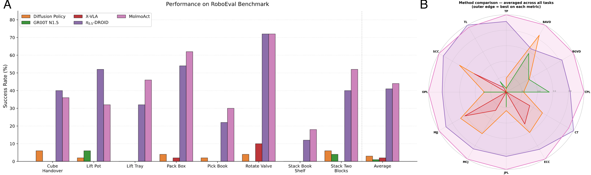
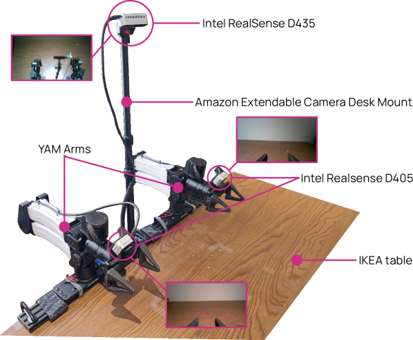

# Ai2 Open-Sourced 720 Hours of Robot Training Data, Not Just the Weights

_While GR00T and π0.5 keep their data closed, Ai2 opened a 720-hour bimanual manipulation dataset_

## Executive Summary

> [!callout]
> In May 2026, the nonprofit Allen Institute for AI (Ai2) released MolmoAct 2, a robot foundation model. What drew attention was not the performance numbers but what came with them. Most robot models ship only the weight files and keep their training data closed; MolmoAct 2 opened the weights along with 720 hours of bimanual manipulation data, the training code, and the full evaluation procedure. It is, in effect, the first robot model anyone can rerun and rebuild from scratch.

> The number 720 hours matters because bimanual robotics has long been starved of data. Movements where two arms must watch and coordinate with each other cannot be learned simply by doubling single-arm data. The dataset MolmoAct 2 released consists of 34,500 real-world demonstrations, roughly 30 times larger than the first generation, and it is the largest bimanual manipulation dataset opened to date. That scale translated directly into performance: on real-world robot arm tests it scored an average 87.1% success rate with no per-task fine-tuning.

> The real shift, then, is clear: the front line of the robot foundation model race is moving from architecture to data openness. Releasing weights has become common; releasing data remains rare. The question of who holds the data and who opens it is the variable that will shape this market and the matter of data sovereignty in the years ahead.

### Key Numbers

Source: [Ai2, MolmoAct 2 official announcement](https://allenai.org/blog/molmoact2)

MolmoAct 2 comes down to four numbers. How much was opened (720 hours of data), how well it then worked in the real world (87.1% success rate), how much faster it became than the first generation (37×), and how quickly it spread right after release (400,000+ downloads). The breadth of the opening and its results are compressed into these four figures.

<!-- stat-card -->
**720 hrs** — Bimanual data opened — 34,500 real demonstrations — largest open bimanual manipulation dataset

<!-- stat-card -->
**87.1%** — Real-world success rate — Recorded zero-shot on a Franka arm, no per-task fine-tuning

<!-- stat-card -->
**37×** — Faster inference — Action call cut from 6,700 ms to 180 ms vs. gen 1

<!-- stat-card -->
**400K+** — Downloads after launch — Cumulative downloads within weeks of release

## The Blank Where Data Should Be

Over the past two years, the phrase "open-source robot model" has grown common. NVIDIA's GR00T, Physical Intelligence's π0.5, and Google DeepMind's Gemini Robotics arrived one after another, kicking the robot foundation model race into full gear. But peel back a layer on what they mean by "open," and what was usually released is only the weight files. How those weights were trained, and how that data was gathered and curated, is almost without exception closed.

The difference is bigger than it sounds. With only the weights you can run a model as-is, but it is hard to ask why it behaves the way it does, or to retrain it from scratch for your own setting. Without the training data you cannot reproduce the results, diagnose the weaknesses, or improve on it with a better version. The weights are the finished dish; the data is the recipe and the ingredients. With only the dish, you cannot cook the same flavor again.

Lay the openness of the major models side by side and you can see at a glance where the blanks cluster. The weights column is filled in, but the data column is mostly empty.

| Model | Developer | Weights | Training data | Code & eval |
| --- | --- | --- | --- | --- |
| MolmoAct 2 | Ai2 (nonprofit) | Fully open | Fully open (720h) | Fully open |
| GR00T N1.7/N2 | NVIDIA | Commercial license | Closed | Partial |
| π0.5 | Physical Intelligence | Partial (openpi) | Closed | Partial |
| Gemini Robotics 1.5 | Google DeepMind | API only | Closed | Closed |
| OpenVLA · Octo | Stanford · UC Berkeley | Fully open | Open (Open X-Embodiment) | Fully open |

NVIDIA GR00T is the textbook case. It is reported to have trained on EgoScale, a vast dataset on the order of 20,000 hours, yet that data was never released publicly. You can get the model, but the ingredients that shaped it stay out of reach. Academic efforts like OpenVLA and Octo set a precedent by opening their data too, but among recent models carrying commercial weight, a case that opened the data in full had until now been missing.

*▲ The MolmoAct 2 model family — from open-source robot data to real-world deployment | Source: [Gu et al., arXiv:2605.02881, Ai2](https://arxiv.org/abs/2605.02881)*

> [!callout]
> **The takeaway**: the assumption that "open weights = open source" has a blank in it. Close the data, and reproduction, diagnosis, and improvement are all blocked. The real measure of openness is not the weights but whether the data behind those weights is opened along with them.

## What MolmoAct 2 Actually Opened

The heart of the dataset MolmoAct 2 released is 720 hours of bimanual manipulation demonstrations. Bimanual manipulation refers to tasks where two arms must move together, each aware of the other. Folding clothes, untangling cables, clearing a dining table, packaging medication — easy for a person, tricky for a robot. Because one arm has to move in precise time with the other while it holds something, no amount of single-arm data teaches this coordination.

*▲ Real bimanual robot tasks in the BimanualYAM dataset | Source: [Gu et al., arXiv:2605.02881, Ai2](https://arxiv.org/abs/2605.02881)*

That is why bimanual manipulation has always been bottlenecked by a lack of data. MolmoAct 2's dataset captures 34,500 real robot demonstrations across more than 28 everyday tasks, making it more than 30 times larger than the first generation's 22-hour set. It is not simply a matter of volume: it released, free to anyone, a kind of data that had been hard to obtain even for a price.

The volume of data showed up as performance. On simulated household tasks the MolmoAct 2 family recorded a 20.6% success rate, nearly double π0.5's 10.3%, and even when moved to a real Franka arm it reached an average 87.1% with no per-task fine-tuning. Moving an apple to a plate scored 100%; picking up a red cube, 93.3%. In third-party evaluation it took first place on 7 of 8 bimanual tasks, beating OpenVLA, π0.5, and X-VLA alike.

*▲ RoboEval benchmark — MolmoAct (purple) outperforms competing models across most tasks | Source: [Gu et al., arXiv:2605.02881, Ai2](https://arxiv.org/abs/2605.02881)*

Speed improved alongside it. Where the first generation took 6,700 milliseconds to decide on a single action, MolmoAct 2 does the same in 180. That is a 37-fold speedup, and it clears a threshold a robot has to pass to move in real time. The finished model was integrated straight into Hugging Face's LeRobot and downloaded more than 400,000 times within weeks of release.

Worth noting, too, is that it did not stop at lab demos. A lab at Stanford School of Medicine tested MolmoAct 2 on automating repetitive manipulation in CRISPR gene-editing experiments. Limits such as camera occlusion and fine manipulation remained, but it is an early case confirming the model's promise on real work outside a controlled lab.

## Why Only Ai2 Could Open the Data

For a for-profit company, training data is the most expensive asset there is. Gathering a single hour of bimanual manipulation data takes real robots and human hands, and stacking up hundreds of quality-controlled hours costs enormously. To release that data is, in effect, to help competitors line up at the same starting line. Behind GR00T's and π0.5's decision to open some weights while keeping the data closed lies a simple calculation: data is the competitive edge.

Ai2 sits in a position free from that calculation. As a nonprofit research institute, it has little incentive to guard data commercially; if anything, transparency and reproducibility are closer to its reason for existing. Open the data, and other researchers can rebuild the same results to verify them, find the weaknesses, and fix them in a better direction. This is not a cost but the fulfillment of a mission.

*▲ BimanualYAM data collection rig — the physical infrastructure behind 720 hours of robot data | Source: [Gu et al., arXiv:2605.02881, Ai2](https://arxiv.org/abs/2605.02881)*

Opening training data carries a particular value: it exposes not only the successes but the failures. Where a model gets stuck, and which tasks were short on data, are left plainly in the data itself. Someone who received only the weights can merely guess at why a model went wrong; someone who received the data too can trace the cause and address it. Reproducibility is improvability, and improvability is the speed of the ecosystem.

> [!callout]
> **The asymmetry of incentives**: for a for-profit company, opening data is surrendering a competitive edge. For the nonprofit Ai2, it is fulfilling a mission. That the same act is a loss for one and a purpose for the other explains why models that opened the data too have been so rare.

## When Data Becomes the Moat

Pebblous has previously compared the robot foundation model architectures of GR00T, Gemini, and π ([VLA architecture comparison](/report/vla-architecture-comparison/en/)). Where that piece dealt with "how you design a robot's brain," the question MolmoAct 2 raises belongs to the next chapter. As much as how the brain is wired, what you teach it with has come to matter. Architectures are shared quickly through papers; training data is not.

So in the robot AI market the real moat is shifting from model structure to data. A similar architecture gets caught up with quickly, but gathering hundreds of hours of high-quality manipulation data turns time and cost themselves into a barrier to entry. Who holds the data leads straight to who can build the better robot. MolmoAct 2's data release is an event that lowered that barrier once, in plain sight.

From here the question of data sovereignty follows naturally. Who owns and who controls robot training data is, at its core, the same problem as the dispute over the provenance and rights of training data in large language models. If a country's or a company's robotics industry depends solely on closed models received from outside, it cannot know what those models were trained on, nor reshape them to fit its own environment. Opening data is not mere kindness; it is a question of who can build the future of robot AI on their own.

A single decision by Ai2 will not overturn the whole industry's habits at once. But simply by showing that a model that opened its data too can lead on performance, it has cracked the premise that "data is naturally something you keep closed." The question we ask when evaluating the next robot model will move a notch as well. Not "did it open the weights," but "did it open the data behind those weights too."

<!-- stat-card -->
**Editor's Note** — Pebblous has long approached AI-Ready Data from the view that data makes the model. The quality and sovereignty of robot training data share a root with language-model data governance. The value of "data openness" that MolmoAct 2 demonstrated meets our own concern directly: that how you gather, refine, and reliably manage data is itself the source of competitiveness.

## References

### Academic Papers

- 1.Gu, J. et al. (2026). "[MolmoAct 2: Action Reasoning Models for Real-world Deployment](https://arxiv.org/abs/2605.02881)." arXiv:2605.02881. Allen Institute for AI.
- 2.NVIDIA Research. (2025). "[GR00T N1: An Open Foundation Model for Generalist Humanoid Robots](https://arxiv.org/abs/2503.14734)." arXiv:2503.14734.

### Official Sources

- 3.Allen Institute for AI. (2026, May 5). "[MolmoAct 2: Open Robot Foundation Model](https://allenai.org/blog/molmoact2)." Ai2 Official Blog.
- 4.Allen Institute for AI. (2026). "[allenai/molmoact2](https://github.com/allenai/molmoact2)." GitHub.

### Press Coverage

- 5.SiliconAngle. (2026, May 5). "[AI2 releases MolmoAct 2, enhancing robot intelligence for real-world tasks](https://siliconangle.com/2026/05/05/ai2-releases-molmoact-2-enhancing-robot-intelligence-real-world/)."
- 6.TechTimes. (2026, May 25). "[Open-Source Robotics Model MolmoAct2 from AI2 Beats π0.5, Releases 720-Hour Bimanual Dataset](https://www.techtimes.com/articles/317145/20260525/open-source-robotics-model-molmoact2-ai2-beats-05-releases-720-hour-bimanual-dataset.htm)."
