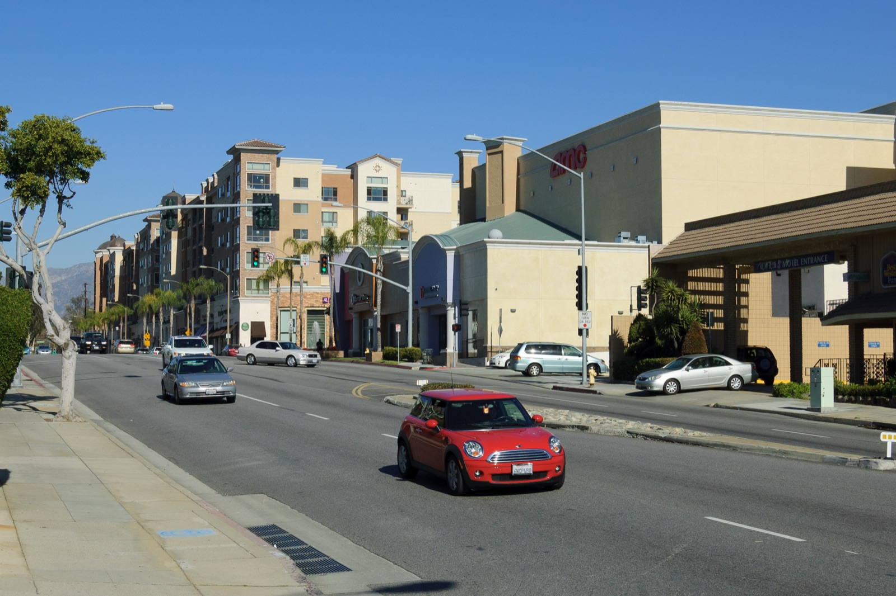
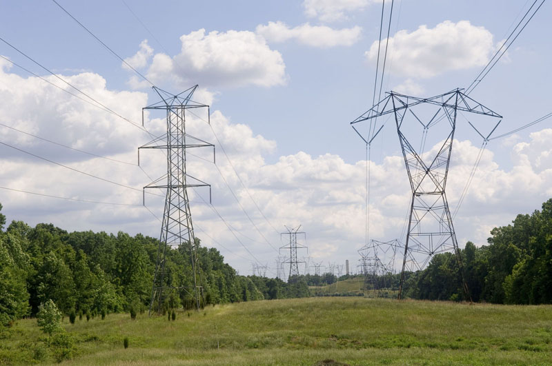

# Monterey Park Bans Data Centers by Ballot

_A city of 65,000 voted 86% to permanently bar a 250,000-sq-ft facility that opponents said would triple its power use_

## Executive Summary

> [!callout]
> On June 2, 2026, in Monterey Park, a small city just east of Los Angeles, residents voted **86% in favor and 14% against** on **Measure NDC**, a measure that permanently bans new data centers within city limits. Temporary pauses on data centers already exist in dozens of jurisdictions nationwide, but this is the first city where residents locked in a _permanent_ ban directly at the ballot box.

> The trigger was a plan for a 250,000-square-foot data center of up to 50MW on the site of a former shopping mall. The developer countered that the facility would account for less than 1% of the city's total power demand and would manage noise and water concerns with sound walls and closed-loop cooling. Nine in ten residents opposed it anyway. What makes the case interesting is that the side losing the numbers argument won. The problem was not the figures but the trust.

> The heart of the matter is that the benefits of AI computation scatter thinly across the cloud, while its physical bill (power, water, and noise) lands squarely on the one neighborhood where the facility goes up. Monterey Park's 86% was the first vote to refuse that bill. With similar moves now following in Wisconsin, Maine, Ohio, and Nevada, whether this is a single city's exception or the signal of a larger shift has become a question for everyone building AI infrastructure.

### Key Figures

Sources: Ballotpedia (Measure NDC), CalMatters, ABC7, U.S. Data Center Moratorium Tracker

<!-- stat-card -->
**86%** — Yes vote on Measure NDC — 14% opposed; a landslide

<!-- stat-card -->
**50MW** — Planned facility capacity — 250,000 sq ft on Saturn Street

<!-- stat-card -->
**69** — Temporary moratoriums nationwide — Permanent + by ballot is a first here

<!-- stat-card -->
**3×** — Estimated rise in city power use — Opponents' claim (developer disputes)

## What Passed, and by How Much

Measure NDC is an ordinance that permanently prohibits building new data centers within Monterey Park's city limits. It passed in the June 2, 2026 election with 86% in favor and 14% against. The margin was clear from early returns, and after the Los Angeles County registrar's 30-day canvass, the measure was certified in early July and takes effect ten days after certification.

This vote did not appear out of nowhere. In March 2026, the city council unanimously decided two things: to extend the existing data center moratorium, and to put a permanent ban before voters. After that decision, the developer behind the disputed project withdrew its plan, and the June vote settled the remaining process.

*▲ Monterey Park, population 65,000. 86% of residents voted to permanently ban data centers | Source: [Wikimedia Commons (King of Hearts, CC BY-SA 3.0)](https://commons.wikimedia.org/wiki/File:Monterey_Park_January_2013_002.jpg)*

### 1.1. What "First in the U.S." Actually Means

The phrase "first U.S. city to ban data centers" can be misleading. Temporary moratoriums that pause new data centers already existed in 69 jurisdictions nationwide as of April 2026. Where Monterey Park is first is in meeting two conditions at once: a ban with no expiration date, and one confirmed by a public vote rather than a council decision.

A comparison shows why that combination is rare.

- •**Maine** pursued a statewide temporary moratorium (LD 307), but Governor Janet Mills vetoed it, ending the effort. In her veto letter, Mills acknowledged that given the impact large data centers in other states have had on the environment and electricity rates, a pause had merit, yet she sent the bill back out of concern that it could also block specific projects with strong local support. The effort then scattered, with individual towns such as Scarborough, Brunswick, and Warren enacting their own moratoriums.
- •**Ohio** attempted a citizen initiative (a state constitutional amendment) to ban data centers of 25MW or more, but gathered only about 70,000 of the roughly 410,000 signatures required and failed to make the 2026 ballot. Organizers signaled another attempt in 2027.

> [!callout]
> That is why the precise framing matters. Monterey Park is not "the first city to regulate data centers" but **the first city to lock a permanent ban in by direct public vote**. The distinction may look minor, but it carries weight. A council decision can be reversed by the next council; a ban etched in by ballot is far harder to undo.

## The Numbers Behind 250,000 Sq Ft

At the center of the dispute was a concrete plan. HMC StratCap, an Australian asset manager, proposed a data center of about 250,000 square feet and up to 50MW on the site of a former shopping mall on Saturn Street in Monterey Park. Residents and the developer put forward completely different numbers for the facility, and only by placing those numbers side by side does the character of the vote come into view.

*▲ Server racks like these would have filled the proposed 250,000-sq-ft facility (illustrative) | Source: [Wikimedia Commons (Carl Lender, CC BY 2.0)](https://commons.wikimedia.org/wiki/File:Datacenter_Server_Racks_(22370909788).jpg)*

### 2.1. The Numbers Residents Saw

Steve Kung, co-founder of the opposition group No Data Center MPK, argued that a single facility could triple the entire city of Monterey Park's power use, with higher electricity bills and air pollution to follow. Power was not the only concern residents raised.

- •**Noise**: According to studies they cited, data centers can produce noise above 90dB, and prolonged exposure to sound above 85dB can damage hearing.
- •**Diesel backup generators**: Generators that run during outages emit particulate matter and nitrogen oxides, raising health risks such as asthma and lung cancer (per Meredith Stevenson of the Center for Biological Diversity).
- •**Water bills**: Residents also worried that water used for cooling would push up local water rates.

### 2.2. The Numbers the Developer Offered

StratCap's rebuttal was equally specific. The gist was that the facility would not be as burdensome as feared.

- •It would use **less than 1%** of Southern California Edison's (SCE) total projected power demand, and the developer would fully fund the dedicated power infrastructure rather than pass it on to residents' bills.
- •Per the noise impact assessment, expected noise at nearby homes would be **48.6–52.0 dBA**, actually lower than the existing background noise of 54–61 dBA. The plan included an 18-foot sound wall and acoustic enclosures.
- •Closed-loop cooling would reduce water use, and water rates are set by the local water utility based on system-wide costs, independent of any individual commercial facility.

> [!callout]
> Whether the developer's figures were accurate or not, the result was 86% opposed. What deserves attention is that **the claim of technical safety failed to earn trust**. From residents' point of view, "less than 1%" was a future promise with no way to verify it, while noise, generators, and rate hikes were realities already witnessed elsewhere. Data practitioners will recognize the pattern: however precise a metric may be, it loses persuasive force once trust in the party presenting it collapses.

## Intelligence in the Cloud, the Bill in the Neighborhood

The output of AI computation is everywhere. A chatbot's answer, a recommendation algorithm, a self-driving decision all feel as though they emerge from the abstract space we call the cloud. But the electricity and water that computation consumes, and the noise and heat it produces, always accumulate at some physical coordinate. What Monterey Park revealed is that the coordinate is always someone's neighborhood.

*▲ AI computation may live in the cloud, but its power travels through specific transmission lines and substations to reach one neighborhood | Source: [Wikimedia Commons (USEPA, Public Domain)](https://commons.wikimedia.org/wiki/Category:Power_lines)*

This is not an accident but a structure. The logic hyperscalers use to pick data center sites converges on places close to the power grid, where land is relatively cheap and a water source for cooling is available. Power is a local resource, so load concentrates on particular substations and transmission lines, and authority over land use and zoning rests with local governments, not the federal government. So the benefits of AI expansion spread thinly across users worldwide, while the costs are billed thickly to the one city where the facility lands.

The scale the industry cites only sharpens this mismatch. Across California, 287 data center facilities generated an estimated 665,000 jobs and $14.1 billion in state and local tax revenue as of 2024. Kara Boender, state policy lead at the Data Center Coalition, criticized the ban as signaling that "this region is closed for business." The industry's economic contribution overall is large. But the root of the conflict is that the unit in which the benefits are counted (the whole state) differs from the unit in which the costs are billed (one neighborhood).

> [!callout]
> For those designing AI infrastructure, this mismatch is a new kind of risk. However steep the compute demand curve, for that demand to actually stand up it must pass the "consent" of local resources such as power, water, and zoning. Monterey Park is the first case to show that consent can be denied explicitly, and overwhelmingly.

## Exception, or Signal?

It is too early to call the result of one city of 65,000 a trend. But Monterey Park was not the only place in motion. Over the course of 2026, at least five local data center-related ballot measures were scheduled or held in states including California, Michigan, Nevada, and Wisconsin.

- •**Port Washington, Wisconsin**: An ordinance requiring a public vote before granting tax breaks to large developments passed 2 to 1. It does not, however, apply retroactively to the already-underway $15 billion OpenAI–Oracle project.
- •**Janesville, Wisconsin**: The city is weighing a measure that would require a public vote for data center projects of $450 million or more.
- •**Boulder City, Nevada**: Whether to allow data centers on city-owned land goes to a public vote in fall 2026.
- •**Individual towns in Maine**: After the statewide moratorium failed, Scarborough, Brunswick, Warren, and others moved with their own moratoriums.

There are, of course, cases pointing the other way. City of Industry, near Monterey Park, is actively courting data centers instead. This is where the counterargument arises that "a ban doesn't stop development, it just pushes it to the next town over." When one city closes its doors, operators move to a neighboring city with looser rules, and the total stays the same. This objection deserves to be taken seriously. A single city's ban does not reduce the nationwide burden on power and the environment.

Still, the key point is that the same question recurs wherever the development is pushed. Monterey Park Mayor Elizabeth Yang, noting that residents knocked on doors, put up signs, and poured hours into fundraising and campaigning, predicted that "other cities will follow." Council member Jose Sanchez said he hoped "the model Monterey Park residents built will inspire other communities as well." Pushing development elsewhere only works while the next neighborhood has yet to ask this question.

## Is Expansion Without Consent Sustainable?

The question Monterey Park leaves behind ultimately narrows to one: how long can AI infrastructure expansion last without local consent? Federal legislation moves slowly, and market overinvestment takes time to correct itself. In the meantime, the fastest and most decisive answer came from the ballot of a city of 65,000.

The fact that an explanation of technical safety was powerless against 86% opposition adds a new variable to future expansion plans. Local consent has become as decisive as securing power and land. A project that fails to secure consent either halts before construction or carries ongoing political risk even after it breaks ground.

<!-- stat-card -->
**Editor's Note** — Pebblous has so far covered data center regulation from a "top-down" view, through federal moratorium debates and compute overinvestment. Monterey Park adds the "bottom-up" view. When calculating AI infrastructure risk, we now have to weigh not only power prices and latency but also how the neighborhood where a facility will land is likely to answer. Where and to whom the physical cost of data is billed is no longer a secondary footnote.

**Pebblous Data Communication Team**  
July 16, 2026

## References

### R.1. Official Vote Data

- 1.Ballotpedia. (2026). "[Monterey Park, California, Measure NDC, Prohibit Data Centers Measure (June 2026)](https://ballotpedia.org/Monterey_Park,_California,_Measure_NDC,_Prohibit_Data_Centers_Measure_(June_2026))." Ballotpedia.

### R.2. Industry & Press

- 2.CalMatters. (2026). "[A California city just banned data centers. More might follow.](https://calmatters.org/newsletter/data-center-monterey-park-ban/)" CalMatters Newsletter.
- 3.ABC7 Los Angeles. (2026). "[Monterey Park voters approve Measure NDC banning power-hungry data centers within city limits](https://abc7.com/post/monterey-park-voters-approve-measure-ndc-banning-power-hungry-data-centers-within-city-limits/19229466/)." ABC7.
- 4.ABC7 Los Angeles. (2025). "[Monterey Park neighbors push back on proposed data center, citing environmental, health concerns](https://abc7.com/post/monterey-park-neighbors-push-back-proposed-data-center-citing-environmental-health-concerns/18445805/)." ABC7.
- 5.Common Dreams. (2026). "[Voters in California City Become First in US to Approve Permanent Ban on Data Centers](https://www.commondreams.org/news/monterey-park-data-centers)." Common Dreams.
- 6.Nikkei Asia. (2026). "[How an Asian-majority city passed the US' first permanent data center ban](https://asia.nikkei.com/business/technology/artificial-intelligence/how-an-asian-majority-city-passed-the-us-first-permanent-data-center-ban)." Nikkei Asia.
- 7.MultiState. (2026). "[Voters Target Data Centers With Local and Statewide Ballot Measures](https://www.multistate.us/insider/2026/5/7/voters-target-data-centers-with-local-and-statewide-ballot-measures)." MultiState Insider.
