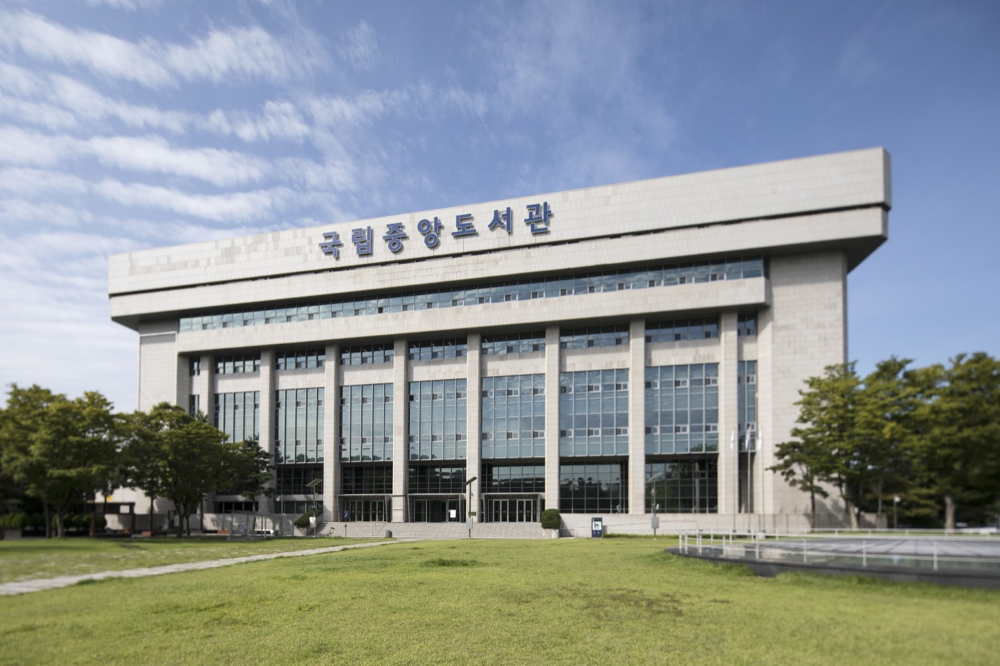

# A Library Opened Its AI Training Data. Most of the Count Is Single Letters.

_The National Library of Korea has opened old magazines and school textbooks as AI training data, with 3,974 works released as text and the remaining 38.3 million items images of single characters_

## Executive Summary

> [!callout]
> The National Library of Korea opened the AI training data it built from the national collection to the public for the first time on September 17. The venue is a site called Gongyuseojae, the Shared Library, and it can be searched and downloaded from without registering an account. The release holds modern magazines of the 1930s and 1940s, government publications and textbooks issued between the 1940s and the 1960s, the library's own publications, and open access scholarly articles cleared for AI training. This article looks at what the figure attached to that announcement, 38.33 million items, actually counted.

> The total written on the Shared Library's front page is 38,332,587. Of that, 38,307,128 sits under the label "character dataset," and 99.9 percent of the whole comes from there. The material released as text is 3,974 works. The three figures use different units, and the announced number is those three added together as they stand. The search page on the same platform puts the same holdings at 25,459.

> Sections 1 and 2 follow what the library stated and what the Shared Library's own screens record. The reading from section 3 onward is one this article sets up.

### Key Numbers

Sources: National Library of Korea, [Shared Library](https://nl.go.kr/aiocr/) data status panel (checked 2026-09-26) · [Ajunews](https://www.ajunews.com/view/20260917085905005) (2026-09-17).

<!-- stat-card -->
**3,974 works** — Material released as text — The share of the announced figure counted in books or articles. More than half of it, 2,114, is open access scholarly articles, while textbooks and government publications stand at 49 between them

<!-- stat-card -->
**38.3 million** — Items in the character dataset — 38,307,128 precisely, and 99.9 percent of the announced total comes from here. The user guide files this under image data

<!-- stat-card -->
**21,485 items** — Tables, illustrations, photos, ads — 7,030 tables, 7,444 illustrations, 4,680 photographs and 2,331 advertisements added together. Pictures lifted off the page

<!-- stat-card -->
**About 300 works** — Due to follow at year's end — Ttakjibon, the cheap Korean popular novels printed in the early twentieth century, with the volume announced at roughly 30,000 pages

## Most of the Text Is Scholarly Articles

The announcement the National Library of Korea made on September 17 says a short thing. The AI training data it built while digitizing its holdings goes out to the public for the first time. This is the first time a national library here has packaged its own collection into a form an AI can learn from and opened it. The venue, the Shared Library, began as a site for a citizen participation project, and its screens were rebuilt this time around AI training data.

Four strands of material went in. Modern magazines from the 1930s and 1940s, government publications and school textbooks from the 1940s through the 1960s, material the National Library of Korea published itself, and open access scholarly articles whose rights holders permitted use in AI training. Break the text down by resource type on the Shared Library's own screens and two more categories appear alongside those, monographs and serials. The modern magazines, the serials and the open access articles are split by article rather than by volume.

*▲ The National Library of Korea, which opened this AI training data release | Source: [Wikimedia Commons (CC BY-SA 4.0)](https://commons.wikimedia.org/wiki/File:190902_%EA%B5%AD%EB%A6%BD%EC%A4%91%EC%95%99%EB%8F%84%EC%84%9C%EA%B4%80_%EB%B3%B8%EA%B4%80_%EC%A0%84%EA%B2%BD002.jpg)*

How many items sit in each strand is something the resource type filter on the search page states outright. The order in which the announcement introduced the material and the order of actual volume are not the same.

| Resource type | Text | Images |
| --- | --- | --- |
| Open access scholarly articles (by article) | 2,114 | 0 |
| Modern magazines (by article) | 998 | 1,186 |
| Serials (by article) | 565 | 291 |
| Monographs | 200 | 10,377 |
| National Library of Korea publications | 48 | 6,794 |
| School textbooks | 29 | 1,284 |
| Government publications | 20 | 1,553 |
| Total | 3,974 | 21,485 |

Source: [Shared Library integrated search](https://www.nl.go.kr/aiocr/search?tab=text), counts per resource type filter (checked 2026-09-26). Each column adds up to the total printed on the screen.

More than half the text, 2,114 items, is open access scholarly articles. The textbooks and government publications the announcement put up front stand at 29 and 20, which is 49 for the two together. On the image side the order changes again. The 10,377 items drawn from monographs and the 6,794 from the library's own publications account for most of it. Count the same release by text or by image and the material at the head of the list is swapped wholesale.

The formats are published too. Text comes as PDFs with the characters hidden underneath, plus XML, TXT and JSON. A PDF that lays the recognized characters over the scanned image suits a human reader, while XML and JSON suit a machine that will ingest them directly. On the image side, tables, illustrations, photographs and advertisements are cut out by type and each carries contextual information. The library states that it went through a cycle of reviewing the recognized text, correcting errors and feeding the corrections back into the model.

The threshold for downloading is low. No account registration stands in the way, and an individual item can be taken straight from its detail screen once a format is picked. The full dataset download does ask whether you are an institution or an individual and what you intend to use it for. Options such as AI training, service development, academic research, content production and education are laid out, and once a choice is made the material arrives as a single compressed file.

> [!callout]
> This release did not arrive out of nowhere. In February 2026 the library stated that it would build AI training data centered on material whose copyright had expired or been cleared, hand that data to the Ministry of Science and ICT for its sovereign AI foundation model project, and open the Shared Library so the same data reached the public as well. September delivered the latter half of a plan set earlier in the same year.

The next step has been announced as well. Before the year is out, the text of about 300 Hangul ttakjibon novels follows. Ttakjibon were popular novels printed cheaply in the early twentieth century with gaudy covers, and the volume announced this time runs to roughly 30,000 pages. Lee Hyun-ju, head of the library's digital information planning division, called the opening "an important starting point in converting the library's vast knowledge resources into core infrastructure for the age of artificial intelligence."

## One Figure, Three Units

The figure that reached the headlines is 38.33 million items. Where that value came from is laid out on the Shared Library's front page. The data status panel there lists text 3,974, tables 7,030, illustrations 7,444, photographs 4,680, advertisements 2,331 and character dataset 38,307,128, and puts the total 38,332,587 underneath. The six add up to that total exactly. The headline figure is that value rounded to the nearest ten thousand.

Nothing is wrong with the addition. The things being added do not share a unit. Text 3,974 counts books and articles. Tables, illustrations, photographs and advertisements, 21,485 of them, count fragments of picture lifted off a page. And 38,307,128 counts characters. Books, pictures and characters added together on one line produce a number that is hard to give a name to. That number went into headlines as the value standing for the size of this release.

Divide 38,307,128 by 38,332,587 and you get 99.93 percent. Almost the entirety of the announced figure comes out of the character dataset alone. Text and images together fall short of 0.07 percent of the whole.
