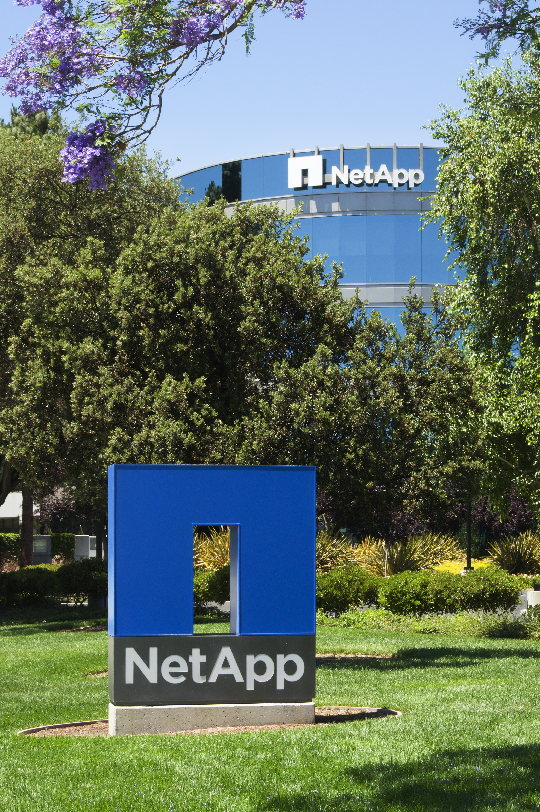

# NetApp Plants an AI-Ready Data Engine Inside the Storage Layer

_With the DataPelago acquisition, NetApp_

## Executive Summary

> [!callout]
> On July 16, 2026, NetApp acquired DataPelago, an AI data infrastructure startup. The price was not disclosed, and DataPelago will operate as a wholly owned subsidiary. With the deal, NetApp cast itself as the company that delivers "true zero-copy activation of enterprise data." The premise is clear: the real bottleneck in the AI era is not the GPU but the speed at which data can be prepared, governed, and made usable. If that diagnosis holds, what gets unsettled is not a single storage product but the whole order in which data is handled.

> DataPelago's Nucleus engine queries and transforms data across CPUs and GPUs where it already lives, instead of shipping it off to a separate compute cluster. And NetApp is not moving alone. Dell, HPE, VAST Data, and Everpure are each heading in the same direction by different routes. Storage spending in the first quarter of 2026 jumped 22.7% year over year, and that money flowed toward platforms that make data "AI can use immediately."

> For Pebblous readers, this event is more than an acquisition headline. It is the moment when "AI-ready data" — this blog's signature theme — is promoted from a single step inside a pipeline to a property of the storage layer itself. This piece traces that promotion and asks what it hands off from data quality and governance work, and what it still leaves to people.

### Key Numbers

Sources: [NetApp press release](https://www.netapp.com/newsroom/press-releases/news-rel-20260716-210092/) · benchmarks via [Blocks&Files](https://www.blocksandfiles.com/ai-ml/2026/07/17/netapp-buys-datapelago-to-become-full-stack-ai-data-infrastructure-provider/5274250) · spending figure via [Forbes](https://www.forbes.com/sites/stevemcdowell/2026/07/24/enterprise-storage-is-rebuilding-itself-around-ai-ready-data/)

These four numbers are the spine of this piece. The first two show what processing data at the storage layer means for performance and cost; the last two show that this is an industry-wide structural shift, not one vendor's marketing.

<!-- stat-card -->
**Up to 10x** — Nucleus speedup — vs. NVIDIA cuDF: 10.5x project, 10.1x filter

<!-- stat-card -->
**1/2 to 1/3** — Processing cost — vs. legacy compute, per DataPelago

<!-- stat-card -->
**+22.7%** — Storage spending surge — Q1 2026 year over year (Forbes)

<!-- stat-card -->
**$75M+** — DataPelago funding raised — Founded 2021, through acquisition

## NetApp Acquires DataPelago

NetApp, which calls itself the "intelligent data infrastructure company," announced its acquisition of DataPelago on July 16, 2026. Based in Mountain View, California, DataPelago is an AI data infrastructure startup known for an approach that removes the data-processing bottleneck in AI and analytics workloads. The price was not disclosed, and DataPelago becomes a wholly owned subsidiary of NetApp. The company framed the deal as the latest in a run of expansions that includes partnerships with Cisco, Google Cloud, Red Hat, and SK Telecom.

*▲ NetApp's headquarters in Sunnyvale, California, where the DataPelago acquisition was announced. | Source: [Wikimedia Commons](https://commons.wikimedia.org/wiki/File:NetApp_Headquarters_Sunnyvale.jpg)*

NetApp's own framing of the problem captures the character of the deal. "AI is the defining platform shift of our time, yet enterprises are realizing the biggest bottleneck lies in preparing, governing, and activating data fast enough to feed it into AI." The bottleneck, in other words, is not compute capacity but the speed of getting data into a usable state.

Sham Nair, NetApp's chief product officer, described the heart of the deal this way: DataPelago's Nucleus engine brings software-defined acceleration directly to the storage layer, processing data across CPUs and GPUs so that enterprises can prepare, govern, and activate data for AI without moving it. He called this "true zero-copy activation." Rajan Goyal, DataPelago's founder and CEO, responded that the deal was a chance to combine "our mission to remove the data-processing bottlenecks that hold AI innovation back from its potential" with the industry's leading data infrastructure portfolio.

> [!callout]
> The key phrase is "without moving it." Until now, enterprise data has sat in storage while AI had to bulk-copy it over to wherever the GPUs are before training or analysis could begin. What NetApp bought is the technology that erases that copy step, letting data be used by AI right where it already sits.

## Inside Zero-Copy Activation

DataPelago unveiled Nucleus when it came out of stealth in October 2024, calling it "the world's first universal data-processing engine." Its structure splits into two layers. One is an accelerated-computing virtual machine that uses an instruction set specialized for data operations to unify heterogeneous hardware like CPUs and GPUs under a single abstraction. The other is DataOS, which places each operation on whichever hardware resource fits it best at that moment. Regardless of whether data is structured, semi-structured, or unstructured, it queries and transforms the data where it is stored — rather than moving it to a separate compute cluster — and prepares it for AI.

The performance claims are specific. DataPelago says it runs up to 10x faster than legacy compute at half to one-third the cost. In benchmarks against NVIDIA cuDF, it reported up to 10.5x acceleration on project operations, 10.1x on filter, and 4.3x on aggregate. In March 2026, before the acquisition, Fast Company ranked DataPelago fourth among the "world's most innovative companies" in the data science category.

Placing the two data paths side by side makes it plain what the word "zero-copy" erases.
