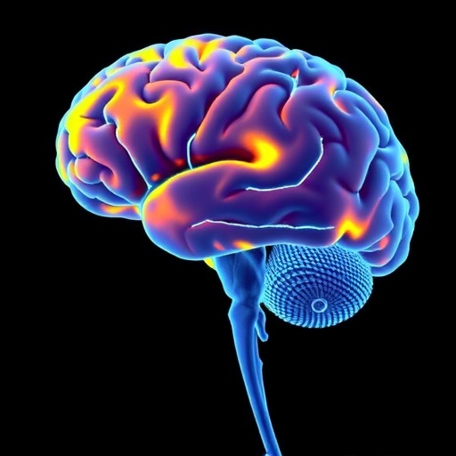
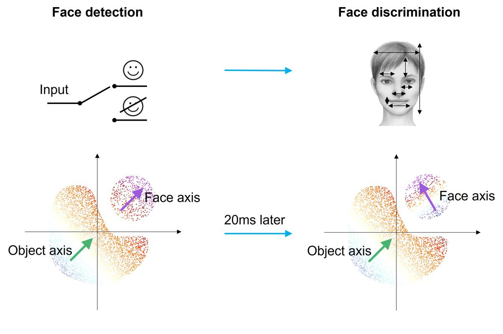
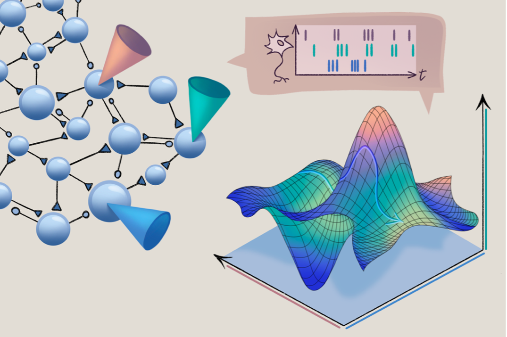
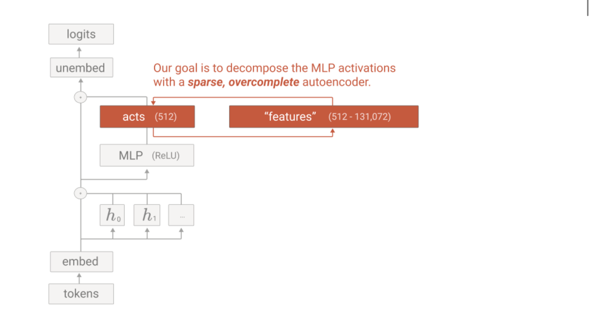
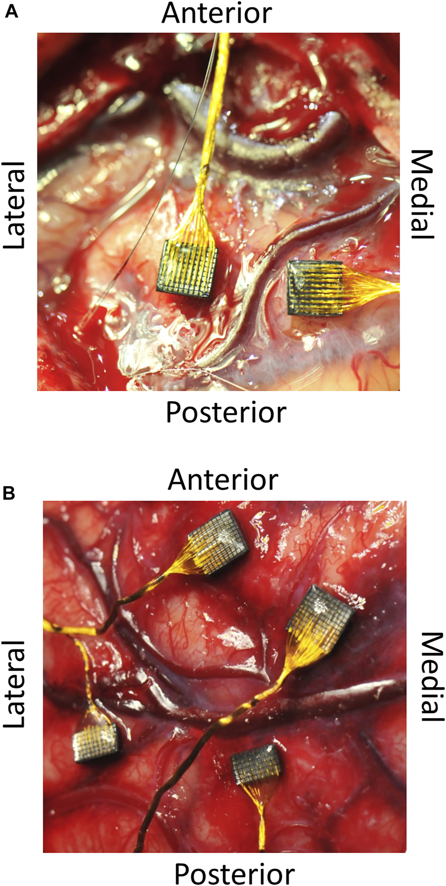

## Executive Summary

> [!callout]
> 2026년 5월, Nature는 신경과학의 오래된 전제가 흔들리고 있다고 보도했다. "한 뉴런이 한 가지 자극에 반응한다"는 깔끔한 그림이 실제 데이터 앞에서 무너지고 있다는 것이다. 해마의 장소세포는 같은 환경에서도 수 주에 걸쳐 발화 패턴을 바꾸고, 시각 피질의 뉴런은 20밀리초 만에 코딩 방식을 전환한다. 이 현상을 **표상 드리프트(representational drift)**라 부른다.

> 이 문제는 뇌에만 국한되지 않는다. 대규모 언어 모델(LLM) 내부에서도 비슷한 난제가 발견되고 있다. 하나의 인공 뉴런이 의미적으로 무관한 여러 개념에 동시에 반응하는 **polysemantic neuron** 현상이 그것이다. 뇌에서는 시간 축을 따라, LLM에서는 의미 공간을 따라, "한 단위 = 한 의미"라는 직관이 동시에 붕괴하고 있다.

> 이 글은 Nature 기사를 출발점으로 삼아, 표상 드리프트의 신경과학적 증거와 LLM의 mechanistic interpretability 연구를 나란히 놓는다. 개별 구성 요소의 불안정에도 불구하고 시스템 수준의 안정성이 유지되는 메커니즘을 추적하고, 그것이 BCI(뇌-컴퓨터 인터페이스)와 AI 설계에 어떤 실질적 함의를 갖는지 살핀다.

### 주요 수치

출처: Nature 2026, Anthropic, Climer et al. 2025

<!-- stat-card -->
**~20ms** — 코드 스위칭 속도 — IT cortex 뉴런, Tsao 2026

<!-- stat-card -->
**70%** — SAE monosemantic 비율 — Anthropic, GPT-2 layer 6

<!-- stat-card -->
**15일** — 시각 피질 연속 추적 — 시간 코딩 안정성 입증

<!-- stat-card -->
**~80명** — 영구 BCI 이식자 — 2025년 기준 전 세계

## "이 뉴런은 할머니를 인식한다"

1960년대, 신경과학자 제리 레트빈(Jerry Lettvin)은 반쯤 농담으로 **할머니 세포(grandmother cell)**라는 개념을 제안했다. 뇌 어딘가에 당신의 할머니에게만 반응하는 뉴런이 하나 있다는 것이다. 농담이었지만, 이 아이디어의 매력은 강력했다. 복잡한 뇌를 이해하는 가장 깔끔한 방법은 각 뉴런에 하나의 역할을 배정하는 것이니까.

실제로 2005년, UCLA의 연구자들은 영화배우 제니퍼 애니스턴의 사진에만 반응하는 뉴런을 발견해 세계적 뉴스가 되었다. "제니퍼 애니스턴 뉴런"은 할머니 세포 가설에 실제 증거를 제공하는 것처럼 보였다. 하나의 뉴런, 하나의 개념. 깔끔하고, 직관적이고, 교과서에 실리기에 완벽한 이야기였다.

그러나 2026년 5월, Nature가 보도한 것은 이 깔끔한 이야기의 균열이다. "뇌의 코드는 끊임없이 변동하고 있는 것으로 보인다. 신경과학자들은 당혹스러워한다." 같은 뉴런이 같은 자극에 대해 어제와 오늘 다르게 반응한다. 한 뉴런이 한 가지만 한다는 전제 자체가 틀렸을 수 있다.

> [!callout]
> 이것은 단순한 측정 오류가 아니다. 여러 실험실에서 독립적으로 확인된 현상이며, 해마, 시각 피질, 후각 피질, 하측두엽 등 뇌 전역에서 관찰된다. 신경과학이 반세기 동안 의지해온 "고정된 튜닝 함수"라는 가정이 재검토를 요구받고 있다.

## 표상 드리프트 — 다시 쓰이는 뇌의 코드

이 현상에 이름이 있다. **표상 드리프트(representational drift)**. 뉴런이 특정 자극에 반응하는 방식이 시간에 따라 점진적으로 변하는 것을 가리킨다. 같은 환경, 같은 행동, 같은 실험 조건인데 뉴런의 활동 패턴이 수 일에서 수 주에 걸쳐 재구성된다.

### 2.1. Driscoll의 랜드마크 발견

이 분야의 기초를 놓은 것은 Laura Driscoll(현재 Allen Institute)의 2017년 연구다. 그녀는 마우스가 가상 미로를 반복해서 탐색하는 동안 두정엽(PPC) 뉴런의 활동을 추적했다. 행동은 동일했다. 같은 미로, 같은 과제, 같은 보상. 그러나 뉴런의 활동 패턴은 수 주에 걸쳐 완전히 재구성되었다. 마치 같은 교향곡을 매번 다른 악보로 연주하는 것과 같았다.

### 2.2. 아티팩트가 아니다 — Climer et al. 2025

초기 회의론자들은 드리프트가 실험적 아티팩트일 수 있다고 주장했다. 마우스의 미세한 행동 변화, 감각 환경의 눈에 띄지 않는 차이가 뉴런 반응의 변화로 나타나는 것일 수 있다는 것이다. 2025년 7월, Climer, Davoudi, Oh, Dombeck은 Nature에 이 가능성을 정면으로 반박하는 논문을 발표했다.

그들은 다감각 가상현실 시스템을 사용해 감각 환경과 행동의 미세한 변화를 엄격하게 통제했다. 결과는 분명했다. 감각 환경이나 행동의 미묘한 차이는 드리프트 속도에 측정 가능한 영향을 미치지 않았다. 드리프트는 외부 요인의 반영이 아니라 **해마 코딩의 내재적 특성**이었다.

*▲ 해마 장소세포의 표상 드리프트 — 안정된 감각 환경에서도 뉴런 반응 패턴이 수 일에 걸쳐 재구성된다 | Source: [BioEngineer.org / Climer et al. 2025](https://bioengineer.org/hippocampal-maps-shift-despite-stable-senses/)*

### 2.3. 뇌 전역의 현상

드리프트는 해마만의 현상이 아니다. 시각 피질, 후각 피질, 하측두엽 등 연구가 이루어진 거의 모든 뇌 영역에서 관찰되었다. 다만 속도에는 차이가 있다. 해마의 장소세포는 상대적으로 빠르게 드리프트하고, 시각 피질의 뉴런은 느리게 변한다. 이 속도 차이 자체가 드리프트가 무작위한 잡음이 아니라 영역별로 조절되는 과정임을 시사한다.

## 20밀리초의 반전 — Doris Tsao의 발견

표상 드리프트가 수 일에서 수 주에 걸친 느린 변화라면, Doris Tsao의 발견은 그 시간 척도를 극적으로 압축한다. 2026년 3월 Nature에 발표된 이 연구는 뇌의 코드가 밀리초 단위에서도 급격하게 전환된다는 것을 보여주었다.

Tsao와 그녀의 연구팀(Yuelin Shi, Dasheng Bi)은 비인간 영장류의 하측두엽(IT) 피질에서 얼굴에 반응하는 뉴런을 단일 세포 수준으로 기록했다. IT 피질은 오랫동안 "딥 네트워크처럼 작동하는 뇌 영역"의 대표 사례였다. 각 뉴런이 특정 얼굴 특징에 고정적으로 반응한다고 여겨졌다.

실제로 관찰된 것은 달랐다. 이 뉴런들은 약 20밀리초 만에 코딩 방식을 완전히 전환했다. 처음에는 "이것이 얼굴인가?"를 판단하는 범용 감지(detection) 코드로 작동하다가, 순식간에 "누구의 얼굴인가?"를 식별하는 특화(identification) 코드로 바뀌었다.

> [!callout]
> "세포가 정적 튜닝 함수를 가지고 있다는 생각은 사실이 아닙니다." Tsao의 이 말은 반세기 가까이 유지되어온 가정에 대한 직접적인 도전이다. 한 뉴런이 시간에 따라 다른 계산을 수행한다는 **시간적 다중화(temporal multiplexing)**는 뇌의 정보 처리가 기존에 생각했던 것보다 훨씬 역동적임을 보여준다.

이 발견에는 아이러니가 있다. IT 피질은 "뇌가 딥 네트워크처럼 작동한다"는 주장의 대표 사례였다. 각 층의 뉴런이 점점 복잡한 특징을 추출한다는 계층적 모델이 이 영역에서 가장 잘 들어맞는 것처럼 보였다. 바로 그 영역에서, 뉴런이 단일한 역할에 고정되지 않는다는 것이 밝혀진 셈이다.

*▲ IT 피질의 시간적 코드 전환 실험 — 단일 뉴런이 20ms 내에 탐지 코드에서 식별 코드로 전환된다 | Source: [Caltech / Shi, Bi & Tsao 2026](https://www.caltech.edu/about/news/the-brains-secret-code-switching)*

## 그런데 우리는 왜 세상을 안정적으로 인지하는가

여기서 근본적인 역설이 생긴다. 뉴런의 코드가 끊임없이 변한다면, 우리는 어떻게 같은 커피숍을 매일 찾아갈 수 있는가? 어제와 오늘의 뉴런 패턴이 다른데, 어떻게 세상은 안정적으로 보이는가?

### 4.1. 집단 코딩: 기하학의 보존

가장 유력한 답은 **집단 코딩(population coding)**에 있다. 2025년 bioRxiv 프리프린트에 발표된 연구는 이를 수학적으로 보여주었다. 개별 CA1 뉴런의 공간 튜닝 함수는 시간에 따라 드리프트하지만, 그 드리프트는 집단 상태 공간에서의 이동과 회전으로 설명할 수 있다. 핵심은 이것이다. 집단 활동의 **내부 기하학**은 시간이 지나도 보존된다.

비유를 들자면, 오케스트라의 연주자가 자리를 바꿔 앉아도 교향곡의 구조는 변하지 않는 것과 같다. 바이올린을 연주하던 사람이 자리를 옮기면 소리가 나는 위치는 달라지지만, 악보의 논리적 구조, 즉 화성 진행과 멜로디 라인은 그대로다.

*▲ 신경 매니폴드 (3D state space) — 개별 뉴런이 드리프트해도 집단 활동의 기하학적 구조는 유지된다 | Source: [The Transmitter / Perich 2025](https://www.thetransmitter.org/systems-neuroscience/neural-manifolds-and-drift/)*

### 4.2. 시간 코딩의 견고함

2025년 Nature Communications에 발표된 연구는 또 다른 메커니즘을 제시한다. 연구팀은 초유연 전극 어레이를 사용해 마우스 시각 피질의 동일한 뉴런 집단을 **15일 연속** 추적했다. 발화율(firing rate) 기반의 튜닝은 날마다 변동했다. 바로 표상 드리프트다. 그러나 수십 밀리초 단위의 스파이크 타이밍 패턴, 즉 **시간 코딩(temporal coding)**은 훨씬 안정적이었다.

뇌가 "얼마나 자주 발화하는가"보다 "언제 발화하는가"에 더 신뢰할 수 있는 정보를 담고 있다는 뜻이다. 발화율이라는 표면적 지표는 흔들려도, 그 아래의 시간적 구조는 견고하게 유지된다.

### 4.3. 회의론의 목소리

물론 모든 신경과학자가 드리프트의 보편성에 동의하는 것은 아니다. UC Berkeley의 Michael Yartsev는 박쥐의 해마에서 **안정적인** 활동 패턴을 보고했다. Champalimaud Centre의 Juan Gallego는 드리프트가 실험자가 측정하지 못한 미묘한 행동 변화의 반영일 수 있다고 주장한다. 이 논쟁 자체가 드리프트 연구가 아직 초기 단계에 있음을 보여준다.

## LLM 안의 뉴런도 같은 문제를 품고 있다

뇌의 뉴런이 시간 축을 따라 의미를 바꾼다면, LLM의 뉴런은 의미 공간을 따라 여러 역할을 동시에 수행한다. 이른바 **polysemantic neuron**이다. 하나의 인공 뉴런이 "야구"와 "식료품 목록"처럼 의미적으로 무관한 여러 개념에 동시에 활성화된다.

### 5.1. Superposition: 필연적 중첩

왜 이런 일이 일어나는가? Anthropic의 연구자들은 이를 **superposition** 가설로 설명한다. 모델이 표현해야 할 feature의 수가 뉴런의 수보다 훨씬 많기 때문에, 모델은 여러 feature를 한정된 뉴런에 중첩시켜 저장한다. 이것은 설계의 결함이 아니라 자원 효율성의 결과다. 뇌가 860억 개의 뉴런으로 세상의 모든 개념을 표현해야 하는 것과 본질적으로 같은 압축 문제다.

### 5.2. SAE: 뒤엉킨 뉴런에서 깨끗한 feature로

Anthropic은 Sparse Autoencoder(SAE)를 사용해 이 문제에 접근했다. GPT-2 Small의 layer 6에서 80억 개의 잔차 스트림 활성화를 훈련 데이터로 사용하고, 16배로 확장한 결과 약 15,000개의 잠재 방향을 추출했다. 인간 평가자가 검증한 결과, 그중 **70%가 단일 개념에 깨끗하게 매핑**되었다.

2024년에는 Anthropic(Claude 3 Sonnet)과 OpenAI(GPT-4)가 최초로 자사의 최신 모델에 SAE를 적용하는 단계에 이르렀다. 2025년에는 모델 간 feature 차이를 분석하는 crosscoder와, 회로를 더 희소하고 해석 가능하게 표현하는 cross-layer transcoder가 발표되었다.

*▲ SAE 아키텍처 — 뒤엉킨 폴리시맨틱 뉴런에서 단일 개념에 매핑되는 15,000개 잠재 방향을 추출 | Source: [Oxen.ai / Anthropic Scaling Monosemanticity 2024](https://oxen.ai/blog/sparse-autoencoders-interpretability)*

### 5.3. 구조적 대칭

뇌와 LLM의 문제를 나란히 놓으면 구조적 대칭이 드러난다.

| 차원 | 생물학적 뇌 | LLM |
| --- | --- | --- |
| 핵심 문제 | 한 뉴런이 시간에 따라 다른 것을 코딩 | 한 뉴런이 여러 개념을 동시 코딩 |
| 안정성의 원천 | 집단 코딩, 시간 코딩, 기하학적 보존 | Feature-level representation (SAE로 추출) |
| 해석 도구 | 전극 기록 + 매니폴드 분석 | SAE, TransformerLens, Crosscoder |
| 핵심 교훈 | 개별 뉴런만 봐서는 뇌를 이해할 수 없다 | 개별 뉴런만 봐서는 LLM을 이해할 수 없다 |

불안정의 축이 다르다. 뇌는 시간 축이고, LLM은 의미 공간 축이다. 그러나 본질은 같다. **개별 단위를 들여다봐서는 시스템을 이해할 수 없다.** 뇌에서든 LLM에서든, 의미는 개별 뉴런이 아니라 뉴런 집단의 관계 속에 부호화되어 있다.

## 드리프트는 버그가 아니라 기능이다

표상 드리프트를 처음 접하면 뇌의 결함처럼 보인다. 코드가 흔들리는 것이 어떻게 좋을 수 있는가? 그러나 점점 더 많은 연구자들이 드리프트가 단순한 잡음이 아니라 적응적 기능을 수행한다고 보고 있다.

### 6.1. 세 가지 기능적 가설

현재 제시된 주요 가설은 세 가지다.

- •**시간 인코딩**: 드리프트의 상태가 곧 시간 정보를 담는다. "이 기억이 언제 형성되었는가"를 뉴런 패턴의 변화량으로 추정할 수 있다.
- •**경험 통합**: 새로운 경험이 기존 기억 표상에 통합되면서 코드가 재구성된다. 드리프트는 기억의 업데이트 과정이다.
- •**인지적 유연성**: 코드가 고정되면 새로운 패턴을 학습하기 어려워진다. 적절한 불안정성은 신경 회로가 경직되지 않도록 유지하는 윤활유 역할을 한다.

### 6.2. 인공 신경망에서도

인공 신경망에서도 유사한 현상이 나타난다. SGD(확률적 경사 하강법)로 훈련된 모델의 내부 표상은 해 공간을 탐색하면서 점진적으로 변한다. 이것은 continual learning 분야의 핵심 문제인 **안정성-가소성 딜레마(stability-plasticity dilemma)**와 직결된다. 과거에 배운 것을 유지하면서 새로운 것을 배우려면, 표상에 적절한 유동성이 있어야 한다.

생물학적 뇌와 인공 신경망 모두에서, 불안정함이 곧 적응력의 원천일 수 있다. 완전히 고정된 시스템은 안정적이지만 취약하고, 적절히 흔들리는 시스템은 변화하는 환경에 더 잘 대응한다.

## 실전적 함의 — BCI, AI, 해석가능성

### 7.1. BCI: 이중 드리프트의 도전

뇌-컴퓨터 인터페이스(BCI)에서 표상 드리프트는 학술적 호기심을 넘어 공학적 현실이다. 2025년 기준 전 세계 영구 BCI 이식자는 약 70~80명에 불과하다. 이들의 장치가 직면하는 문제는 이중 드리프트다. 전극 자체가 물리적으로 미세하게 움직이는 **전극 드리프트**와, 뉴런의 코딩 패턴이 변하는 **뉴런 드리프트**가 동시에 일어난다.

해결책으로 부상하고 있는 것은 on-device ML의 **few-shot 적응형 디코딩**이다. 매일 고정된 디코더를 사용하는 대신, 소량의 교정 데이터로 디코더를 빠르게 재훈련하는 방식이다. 이것은 2026년 BCI 분야의 가장 중요한 기술 진보 중 하나로 꼽힌다.

*▲ 피질 내 전극 어레이 (Utah array) — 전극·뉴런 이중 드리프트에 대응하는 few-shot 적응형 디코딩이 핵심 과제 | Source: [Frontiers in Bioengineering (CC BY 4.0)](https://www.frontiersin.org/articles/10.3389/fbioe.2021.759711)*

### 7.2. AI 설계: 시간적 다중화의 가능성

Tsao의 발견, 즉 한 뉴런이 시간에 따라 다른 계산을 수행하는 시간적 다중화는 AI 아키텍처 설계에 직접적인 영감을 줄 수 있다. 현재의 신경망은 각 뉴런이 고정된 가중치로 하나의 연산을 수행한다. 만약 뉴런이 입력의 시간적 맥락에 따라 다른 연산을 동적으로 수행할 수 있다면, 같은 수의 뉴런으로 더 많은 계산을 할 수 있다. 에너지 효율과 모델 크기 모두에서 이점이 될 수 있다.

### 7.3. 해석가능성: 개별 뉴런 너머

뇌과학과 AI 모두가 도달한 동일한 결론이 있다. **개별 뉴런이 아니라 feature와 circuit 수준에서 시스템을 이해해야 한다.** Anthropic은 2027년까지 "interpretability가 대부분의 모델 문제를 안정적으로 탐지"하는 것을 목표로 삼고 있다. 이 목표의 전제는 분석의 단위를 개별 뉴런에서 feature로 격상하는 것이다.

### 7.4. 데이터 품질의 연결고리

이 모든 논의의 바닥에는 공통된 질문이 있다. 불안정한 구성 요소에서 안정적인 패턴을 추출하려면 무엇이 필요한가? 뇌과학에서는 집단 디코딩과 매니폴드 분석이 필요하고, LLM에서는 SAE와 circuit analysis가 필요하다. 데이터 과학에서는 이것이 **데이터 품질 진단**의 문제다. 개별 데이터 포인트의 변동성을 넘어 데이터셋 전체의 구조적 특성을 이해해야 모델의 행동을 예측할 수 있다.

**_편집자의 노트._** 불안정한 구성 요소에서 안정적인 구조를 읽어내는 문제는 데이터 진단에서도 낯설지 않다. DataClinic은 개별 이미지의 결함이 아니라 데이터셋 전체의 분포, 클래스 간 관계, 내재적 구조를 측정하는 데 관심을 둔다. 뇌과학과 AI 해석가능성이 이 질문에 독립적으로 수렴하고 있다는 사실이 흥미롭다.

## 뇌와 AI가 함께 가르쳐주는 것

"한 단위 = 한 의미." 이 직관은 뇌에서도 LLM에서도 통하지 않는다. 뇌과학과 AI 연구는 서로를 모르는 채로 같은 벽에 부딪혔고, 비슷한 도구를 개발하고 있다. 뇌과학자들이 집단 코딩과 매니폴드 분석으로 드리프트 너머의 안정성을 찾는 것처럼, AI 연구자들은 SAE와 crosscoder로 polysemantic neuron 너머의 깨끗한 feature를 추출한다.

복잡한 시스템은 구성 요소의 불안정에도 불구하고 기능한다. 이것은 불안정함에도 불구하고가 아니라, 어쩌면 불안정함 **덕분에** 기능하는 것일 수 있다. 적절한 유동성이 있어야 시스템은 새로운 것을 배우고, 변화하는 환경에 적응하고, 경직되지 않는다.

다음 질문은 열려 있다. 불안정한 부품으로 어떻게 안정적 지능이 만들어지는가? 이 질문에 답할 수 있다면, 우리는 뇌와 AI 모두를 더 깊이 이해하게 될 것이다. 그리고 그 답은 아마 하나의 뉴런을 들여다보는 것이 아니라, 뉴런들이 함께 만들어내는 패턴의 기하학을 읽는 데서 나올 것이다.

**(주)페블러스 데이터 커뮤니케이션팀**  
2026년 6월 4일

## 자주 묻는 질문

## 참고문헌

### 학술 논문

- 1.Shi, Y., Bi, D. & Tsao, D. (2026). "[Rapid concerted switching of the neural code in the inferotemporal cortex](https://www.nature.com/articles/s41586-026-10267-3)." Nature.
- 2.Climer, J. R., Davoudi, H., Oh, J. Y. & Dombeck, D. A. (2025). "[Hippocampal representations drift in stable multisensory environments](https://www.nature.com/articles/s41586-025-09245-y)." Nature.
- 3.Nature Communications (2025). "[Temporal coding carries more stable cortical visual representations than firing rate over time](https://www.nature.com/articles/s41467-025-62069-2)."
- 4.bioRxiv (2025). "[Coordinated representational drift supports stable place coding in hippocampal CA1](https://www.biorxiv.org/content/10.1101/2025.02.04.636428)."
- 5.Driscoll, L. N., Duncker, L. & Harvey, C. D. (2022). "[Representational drift: Emerging theories for continual learning and experimental future directions](https://elifesciences.org/articles/82328)." eLife.
- 6.arXiv (2024). "[Learning continually with representational drift](https://arxiv.org/abs/2512.22045)."
- 7.Nature Physics (2026). "[Simple input-output dependencies explain neuronal activity](https://www.nature.com/articles/s41567-026-03306-3)."

### 업계 및 보도

- 8.Nature News (2026.05.20). "[The brain's code seems to be in constant flux. Neuroscientists are baffled](https://www.nature.com/articles/d41586-026-01554-0)."
- 9.Caltech (2026). "[Fixed or Flexible? Study Shows Vision-Related Neurons Can Rapidly Switch Codes](https://www.caltech.edu/about/news/fixed-or-flexible-study-shows-vision-related-neurons-can-rapidly-switch-codes)."
- 10.Anthropic (2025). "[Circuits Updates — July 2025](https://transformer-circuits.pub/2025/july-update/index.html)." Transformer Circuits Thread.
- 11.Anthropic (2025). "[Crosscoder Model Diffing](https://www.anthropic.com/research/crosscoder-model-diffing)."
- 12.Nanda, N. (2023). "[A Comprehensive Mechanistic Interpretability Glossary](https://www.neelnanda.io/mechanistic-interpretability/glossary)."
