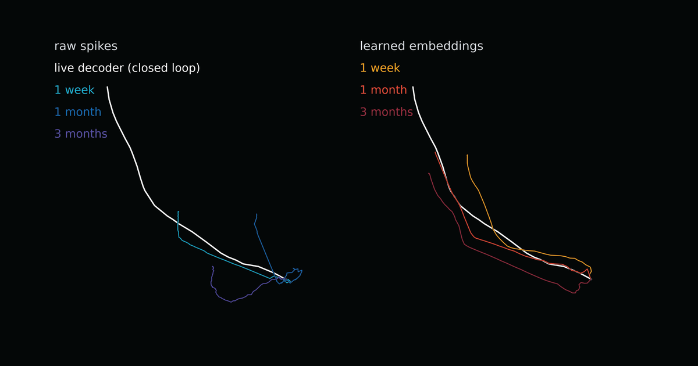

# 뉴럴링크, 그냥 흘려보낸 뇌 신호로 커서 기록 경신

_참가자들에게서 과제 없이 쌓인 신경 데이터 5만 시간 — 커서로 보낸 정보가 초당 11.32비트, 종전 기록은 10.39비트_

## Executive Summary

> [!callout]
> 이 글은 뉴럴링크가 2026년 10월 1일 올린 기술 노트 「Pretraining on 50,000 Hours of Unlabeled Brain Data」를 읽는다. 임상시험이 시작된 뒤 2년 동안 참가자들에게서 5만 시간이 넘는 신경 기록이 흘러나왔다. 대부분은 아무 과제도 주어지지 않은 상태에서 쌓인 것이고, 회사 설명으로는 최근까지 거의 쓰이지 않고 있었다. 뉴럴링크는 그 기록으로 커서 해독 모델을 먼저 가르쳤다.

> 가장 눈에 띄는 숫자는 11.32다. 참가자 P15가 커서를 조작하며 초당 11.32비트의 정보 전송률을 냈고, 종전 기록은 10.39비트였다. 주 55분에 이르던 보정도 일부 참가자에게서는 주 10분으로 줄었다. 같은 노트가 적어 둔 한계도 분명하다. 실시간 결과는 전부 참가자 한 사람의 데이터로만 학습한 모델에서 나왔고, 여러 참가자를 합친 디코더는 실시간에서 더 낫지 않았다.

> 1절부터 3절까지는 뉴럴링크 기술 노트와 이를 전한 보도, 그리고 같은 문제를 다룬 학술 논문에 적힌 사실이다. 4절은 그 사실을 데이터를 다루는 사람의 눈으로 다시 읽은 이 글의 해석이다.

### 주요 수치

아래 네 숫자 가운데 첫째는 사전학습에 들어간 기록의 양이고, 가운데 둘은 그러고 나서 달라진 성적이며, 마지막 하나는 뉴럴링크가 스스로 밝힌 한계다.

출처: [뉴럴링크 기술 노트(2026-10-01)](https://neuralink.com/updates/pretraining-on-50000-hours/), [AI타임스 보도(2026-10-05)](https://www.aitimes.com/news/articleView.html?idxno=215977).

<!-- stat-card -->
**5만 시간** — 2년간 쌓인 비라벨 신경 기록 — 첫 참가자 한 명이 9,000시간, 224억 스파이크를 보탰다

<!-- stat-card -->
**11.32비트/초** — 커서 조작 정보 전송률 — 종전 기록 10.39비트. 참가자 6명이 개인 최고치를 다시 썼다

<!-- stat-card -->
**55분 → 10분** — 주당 보정에 드는 시간 — 보통 매일 아침 10분씩 치르던 보정이 일부 참가자에게서 줄었다

<!-- stat-card -->
**개선 없음** — 여러 참가자를 합친 디코더 — 실시간에서는 단일 참가자 모델보다 낫지 않았다. 오프라인 전이만 통했다

## 아무 과제 없이 쌓인 시간

뇌 신호로 커서를 움직이려면 모델이 신호와 의도를 맞춰 볼 기회가 있어야 한다. 그래서 지금까지의 방식은 참가자에게 과제를 준다. 화면의 점을 향해 커서를 움직이게 하고, 그때 흐른 신경 활동에 "이 사람은 오른쪽 위로 가려고 했다"는 정답을 붙인다. 이 정답 붙은 기록이 라벨 데이터다. 모으려면 사람이 시간을 내서 과제를 해야 하니 비싸고, 많이 모을 수도 없다.

임플란트는 과제 시간에만 켜져 있지 않다. 참가자가 밥을 먹을 때도, TV를 볼 때도, 그냥 쉴 때도 전극은 계속 신호를 읽는다. 아무 과제가 걸려 있지 않으니 정답을 붙일 수 없고, 그래서 이 기록은 비라벨 데이터로 남는다. 임상시험이 시작된 뒤 2년 동안 이렇게 쌓인 양이 5만 시간을 넘었다. 첫 참가자 한 사람이 보탠 것만 9,000시간이 넘고, 스파이크로 세면 224억 개다. 뉴럴링크의 표현을 빌리면 이 정보는 최근까지 거의 쓰이지 않고 있었다.

버려지던 것이 또 있다. 신경 신호는 가만히 있지 않는다. 전극이 미세하게 움직이고 주변 조직이 반응하면서 같은 의도에서 나오는 신호가 날마다 조금씩 달라진다. 그래서 아무리 잘 만든 디코더도 시간이 지나면 성능이 떨어지고, 사용자는 다시 보정을 한다. 뉴럴링크가 적어 둔 비용이 평균 주 55분이다. 보통은 매일 아침 10분씩이고, 타이핑이나 게임처럼 기능마다 디코더를 따로 맞춰야 할 수도 있다. 그렇게 보정하며 만든 데이터도 쓰고 나면 버려졌다.

## 사전학습이 바꾼 세 가지

뉴럴링크가 한 일은 커서 해독을 가르치기 전에 신경 인코더부터 따로 가르친 것이다. 참가자마다 별도의 인코더를 두고, 그 사람에게서 나온 수천 시간의 기록으로 먼저 학습시켰다. 구조는 맘바2(Mamba2)를 바탕으로 하고, 스파이크를 언어 모델의 토큰처럼 다룬다. 학습 목표는 공간 마스크 오토-포아송 회귀다. 채널의 절반만 보여 주고 나머지 절반에서 무슨 일이 일어났을지 맞히게 하는 방식이라, 모델은 채널 하나하나를 외우는 대신 신경 집단이 함께 움직이는 구조를 배우게 된다.

이렇게 나온 결과물은 흔들리는 원시 신호를 더 안정적인 표현으로 바꾼 임베딩이다. 커서 해독기는 그 임베딩 위에 올라간다. 날마다 모양이 달라지는 원시 신호를 직접 받는 대신 비교적 덜 흔들리는 표현을 입력으로 받는 구조이고, 정답 붙은 기록은 그 위에 얹는 마지막 층에서만 필요해진다.

바뀐 것은 세 축이다. 첫째는 속도인데, 여기서 말하는 속도는 커서가 화면 위를 지나가는 빠르기가 아니다. 정보 전송률은 주어진 시간 안에 목표를 얼마나 빠르고 정확하게 골라냈는지를 비트로 환산한 값이라, 목표가 작고 멀수록 같은 동작에서 더 높은 값이 나온다. 참가자 P15가 초당 11.32비트를 기록해 종전 10.39비트를 넘었고, 참가자 중앙값은 10비트 안팎이다. 여섯 명이 개인 최고치를 다시 썼고 그중 셋은 종전 기록 자체를 넘겼다. 둘째는 보정 부담이다. 주 55분이던 것이 일부 참가자에게서 주 10분 수준으로 내려갔다. 셋째는 디코더 수명이다. 예전에는 며칠 단위로 다시 맞춰야 했는데, 일부는 3주 넘게 성능을 유지했고 한 참가자는 1년 반이 지난 디코더를 여전히 쓰고 있다. 같은 디코더로 닷새 연속 10비트를 낸 사례도 있다.

*▲ 오른쪽(학습된 임베딩)으로 디코딩한 궤적은 1주·1개월·3개월이 지나도 흰색 라이브 디코더 궤적에 가깝게 남고, 왼쪽(원시 스파이크)은 시간이 지날수록 멀어진다. | Source: [뉴럴링크 기술 노트](https://neuralink.com/updates/pretraining-on-50000-hours/)*

▲ 뉴럴링크 기술 노트에 적힌 수치를 이 글이 한 장으로 정리했다.

이 수치에는 단서가 붙는다. 전부 회사가 스스로 낸 것이고, 동료 심사를 거친 논문도 독립 재현도 아직 없다. 11.32비트가 비장애인 평균을 넘는다는 비교 역시 바깥에서 확인된 적이 없다. 장치 자체도 임상시험용이라 승인된 제품이 아니다. 그리고 뉴럴링크가 직접 적어 둔 한계가 하나 더 있다. 지금까지 공개된 실시간 성적은 모두 한 사람에게서 나온 데이터만으로 학습한 모델의 것이다. 여러 사람의 기록을 합쳐 만든 디코더는 실시간에서 그보다 나은 성적을 내지 못했다. 다만 한 참가자의 모델을 가중치의 99%를 얼린 채 다른 참가자에게 옮겼더니 그 사람이 쓰던 디코더보다 나았다는 오프라인 결과는 있다.

## 다른 연구들은 훨씬 앞에서 멈춘다

5만 시간이라는 숫자를 그대로 받아들이기 전에, 같은 문제를 다룬 학계 쪽 보고를 옆에 놓아 볼 만하다. 신경 디코더에 사전학습 데이터를 얼마나 부어야 성능이 오르는지를 정면으로 측정한 연구가 최근 둘 나왔다.

### 3.1. 2,000시간에서 오히려 나빠졌다

하나는 NeurIPS 2025에 실린 「A Generalist Intracortical Motor Decoder」(NDT3)다. 원숭이와 사람 30개체가 넘는 자료를 10개 실험실에서 모아 최대 2,000시간까지 사전학습 규모를 늘려 가며 측정했다. 결과가 뜻밖이다. 4,500만 파라미터 모델에서는 2,000시간으로 학습한 쪽이 200시간으로 학습한 쪽보다 성능이 떨어졌다. 모델을 3억 5,000만 파라미터로 키워야 겨우 떨어지지 않는 수준이 됐다. 저자들은 서로 성격이 다른 사전학습 데이터가 시험 과제 학습을 방해할 수 있다고 진단했고, 일부 과제는 규모에서 아무 이득도 얻지 못했다고 적었다.

### 3.2. 시간은 늘어도 다양성은 그만큼 안 는다

다른 하나는 두개내 뇌파와 스파이크를 함께 학습한 iBrain이다. 500시간, 1,000시간, 2,000시간, 7,160시간 네 구간으로 나눠 측정했더니 성능은 단조롭게 올랐다. MC-Maze 과제의 결정계수가 0.882에서 0.914로, Area2-Bump가 0.887에서 0.903으로 올라갔다. 다만 저자들 스스로 향상 폭이 크지 않고 2,000시간을 넘어서면 더 작아진다고 적었다. 이유로 제시한 설명이 이 글에서 가장 중요한 문장이다. 신경 기록에는 같은 참가자, 같은 세션 안의 중복이 많아서 실제 다양성은 기록 시간이 늘어나는 속도만큼 늘지 않는다는 것이다. 그래서 앞으로는 양을 늘리는 것과 함께 참가자와 과제, 수집 조건의 다양성을 넓히는 쪽이 도움이 될 것이라고 맺었다.

▲ 학계 두 연구가 사전학습 규모를 늘렸을 때 본 결과를 이 글이 정리했다.

> [!callout]
> 두 논문을 뉴럴링크 발표와 맞대 보면 하나는 맞물리고 하나는 아직 결판이 나지 않았다. 맞물리는 쪽은 NDT3다. 출처가 다른 기록을 섞으면 서로 방해한다는 보고와, 여러 참가자를 합친 디코더가 실시간에서는 나아지지 않았다는 뉴럴링크가 붙인 단서가 같은 벽을 가리킨다. 결판이 나지 않은 쪽은 iBrain이다. 한 사람 안에서 시간만 늘리면 중복이 쌓인다고 본 바로 그 자리에서 뉴럴링크는 5만 시간을 부어 신기록을 냈다. 포화를 경고한 구간을 한참 지난 지점에서 성적이 나온 셈이다.

그렇다고 iBrain의 경고가 깨졌다고 읽을 수는 없다. 뉴럴링크는 데이터를 구간별로 나눠 성능 곡선을 공개한 적이 없어서, 그 기록이 5만 시간에 이르러서야 나온 것인지 2,000시간에서 이미 나와 있었던 것인지를 바깥에서는 가릴 수 없다. 학계 두 연구도 뉴럴링크의 데이터셋을 들여다본 것이 아니다. 다른 사람의 뇌, 다른 전극, 다른 과제에서 나온 숫자다. 지금 확실히 말할 수 있는 것은 양을 늘리면 반드시 좋아진다는 믿음이 이 분야에서 이미 여러 번 깨졌다는 사실까지다.

## 페블러스가 이 발표를 주목하는 이유

라벨이 붙지 않은 채로 쌓여만 가는 더미는 뇌 신호에만 있지 않다. 공장의 센서 로그, 차량 주행 기록, 콜센터 녹취, 어느 조직에나 "언젠가 쓰겠지" 하고 보관 중인 폴더가 있다. 뉴럴링크 사례가 반가운 이유는 그 더미가 쓸모없지 않다는 증명이기 때문이고, 불편한 이유는 그것을 쓸 수 있게 만드는 일이 저장 용량 문제가 아니라는 점을 같이 보여 주기 때문이다.

데이터 규모를 시간으로 세는 습관부터 다시 볼 필요가 있다. 5만 시간이라는 표현은 양을 말하지만 iBrain이 지적한 대로 유효 다양성을 말하지는 않는다. 같은 사람이 같은 자세로 같은 화면을 보며 보낸 열 시간은 열 시간어치 정보가 아니다. 그런데 다양성을 늘리는 것이 자동으로 답이 되지도 않는다. NDT3가 보여 준 쪽은 정반대다. 다른 데서 모은 자료를 섞었더니 서로 방해했고, 모델 용량을 여덟 배 가까이 키우고 나서야 손해를 겨우 막았다. 다양성에도 대가가 따른다는 뜻이다.

그래서 이 발표가 데이터를 다루는 쪽에 남기는 질문은 셋이다. 쌓아 둔 비라벨 더미 안에 서로 다른 조건과 상태가 몇 가지나 들어 있는지 지금 셀 수 있는가. 사람과 장비, 시간대와 작업 종류 가운데 모델이 실제로 필요로 하는 축은 무엇인가. 늘린 다양성이 모델에게 도움이 되는지 아니면 NDT3에서처럼 방해가 되는지는 무엇을 보고 판단하는가. 페블러스가 AI-Ready Data를 말할 때 양이 아니라 준비 상태를 먼저 묻는 이유가 여기에 있다.

여기까지 읽어 주셔서 감사하다. 뉴럴링크 기술 노트 원문은 [뉴럴링크 업데이트 페이지](https://neuralink.com/updates/pretraining-on-50000-hours/)에 있고, 한국어 요약은 [AI타임스 기사](https://www.aitimes.com/news/articleView.html?idxno=215977)에서 볼 수 있다. 여러분이 보관 중인 비라벨 데이터가 몇 시간치인지 말고, 그 안에 서로 다른 조건이 몇 가지나 들어 있는지 한번 세어 보시고 알려 주시면 좋겠다.

## 참고문헌

### 1차 발표·보도

- 1.Neuralink. (2026). "[Pretraining on 50,000 Hours of Unlabeled Brain Data](https://neuralink.com/updates/pretraining-on-50000-hours/)." Neuralink Updates, 2026-10-01.
- 2.AI타임스. (2026). "[뉴럴링크, 5만시간 뇌 데이터 사전학습…BCI도 '파운데이션 모델' 시대 열렸다](https://www.aitimes.com/news/articleView.html?idxno=215977)." 2026-10-05.
- 3.Interesting Engineering. (2026). "[Neuralink brain implant sets 11.32-bit/s cursor-control record](https://interestingengineering.com/innovation/neuralink-brain-chip-cursor-control)." 2026-10.
- 4.ExplainX. (2026). "[Neuralink 50,000-Hour BCI Pretraining: 11.32 bps Record](https://explainx.ai/blog/neuralink-pretraining-50000-hours-bci-foundation-model-2026)." 2026-10.

### 학술

- 5.Ye, J., Rizzoglio, F., et al. (2025). "[A Generalist Intracortical Motor Decoder](https://papers.nips.cc/paper_files/paper/2025/file/a00000e6a2208172700510bcd69d48e9-Paper-Conference.pdf)." NeurIPS 2025. (프리프린트: [bioRxiv 2025.02.02.634313](https://www.biorxiv.org/content/10.1101/2025.02.02.634313v1.full))
- 6."[iBrain: A Unified Foundation Model Reading the Brain from Surface to Spikes](https://arxiv.org/abs/2609.06960)." arXiv:2609.06960.
- 7."[Pretraining for Sample-Efficient Neural Interfaces](https://arxiv.org/abs/2609.13507)." arXiv:2609.13507.
