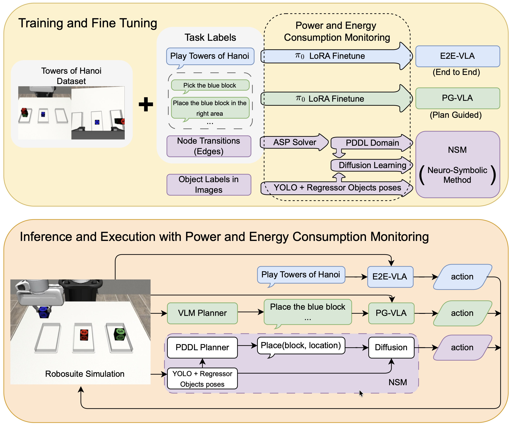
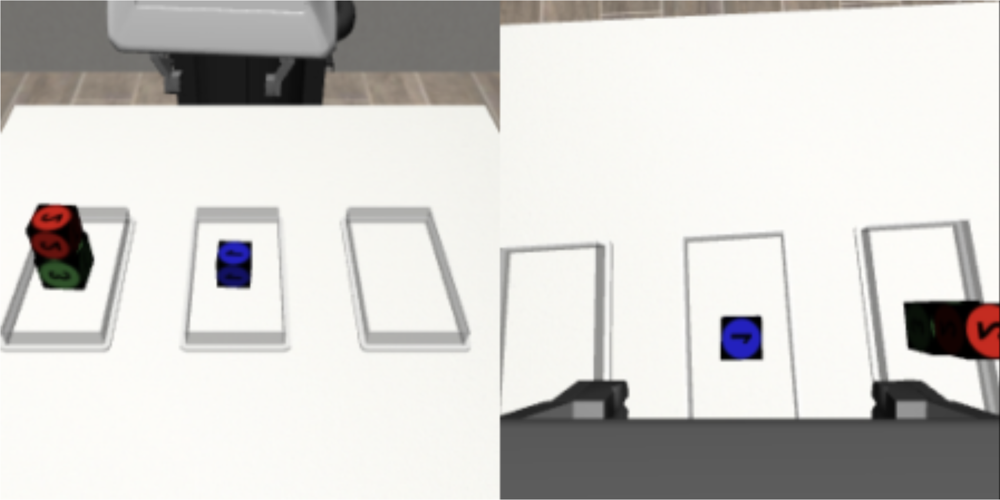

# The Robot That Knows the Rules Eats Less

_How a Tufts neuro-symbolic robot matched a VLA with 80× less energy — and won on a task it had never been trained on_

## Executive Summary

> [!callout]
> A robot was asked to solve the Tower of Hanoi, and the small one that had learned the rules beat the giant model that had been fed mountains of data. This is the story of an experiment from the Human-Robot Interaction lab at Tufts University, presented at ICRA 2026. The team pitted a neuro-symbolic model head-to-head against a VLA (Vision-Language-Action) model on the same task, and the result ran against conventional wisdom. This article walks through that experiment and the signal Pebblous reads in it.

> The number that stands out most is training energy. The VLA burned through 68.5 MJ; the neuro-symbolic model used just 0.85 MJ — roughly 80 times less. And on a four-block task it had never been trained on, it still came out ahead, 78% to 0%. The model that ate less generalized better. The reason is simple: one side extracted rules from the demonstrations, while the other memorized whole trajectories.

> How to read that result is the question this article puts on the table. One path stacks up more data and grows the model larger; the other gives the data structure so the model wanders less. Where does the next bottleneck in Physical AI actually lie?

### Key Figures

Four numbers compress the whole experiment: accuracy on the task it was trained on, generalization to a task it had never seen, the energy it took to reach that accuracy, and the number of demonstrations used in training. The side that knew the rules came out ahead on all four axes — and that is the core of the result.

Source: [Duggan et al., "The Price Is Not Right" (arXiv:2602.19260)](https://arxiv.org/abs/2602.19260)

<!-- stat-card -->
**95% vs 34%** — 3-block success rate — Neuro-symbolic ~3× ahead of the VLA

<!-- stat-card -->
**78% vs 0%** — Untrained 4-block success — Generalization split on a task never seen

<!-- stat-card -->
**80×** — Training energy gap — 68.5 MJ vs 0.85 MJ

<!-- stat-card -->
**50 vs 300** — Training demonstrations — Fewer demos, wider generalization

## What the Experiment Showed

The setup is simple. Inside a simulator (Robosuite), a Franka Panda robot arm was asked to solve the Tower of Hanoi — the classic puzzle where you can only stack a larger disk under a smaller one and move one piece at a time. Each run nudged the starting positions of the blocks by about a centimeter, so the same scene never appeared twice. Three approaches were then dropped into these identical conditions and made to compete.

On one side sat the VLA, today's mainstream in robot learning. It binds vision, language, and action into a single neural network and handles a command like "solve the Tower of Hanoi" end to end. The experiment used a π₀-class model, and also compared a variant fed step-by-step instructions from an external planner (PG-VLA). On the other side sat a neuro-symbolic model (NSM) that splits rules apart from the neural network.

*▲ Experiment overview: training and inference pipelines for VLA (E2E, PG) and the neuro-symbolic model (NSM), with power and energy consumption monitoring | Source: [Duggan et al. (2026), arXiv:2602.19260](https://arxiv.org/abs/2602.19260)*

The gap opened up on the very task they were trained on. The neuro-symbolic model succeeded 95% of the time, while the end-to-end VLA managed 34% and the planner-equipped VLA scored 0%. Even on individual block moves, the success rate ran 99% to 87% in the neuro-symbolic model's favor.

The real difference showed up on the untrained task. Models that had only learned the three-block version were handed a four-block task with one extra block on top. The neuro-symbolic model succeeded 78% of the time; both VLAs scored 0%. Faced with a longer task it had never seen, the model that had statistically memorized trajectories lost its way entirely.

> [!callout]
> Then there is the cost. Training the VLA took 68.5 MJ and a day and 16 hours; the neuro-symbolic model needed only 0.85 MJ and 34 minutes. It ate less, learned faster, and generalized further. The paper's title, "The Price Is Not Right," points squarely at that asymmetry.

## Where the Rules Came From

The first suspicion is obvious: didn't a human just hand-code the rules? If so, it would hardly be a fair comparison. But the team never specified any rules. The robot watched 50 simple stacking demonstrations and induced the rules from them on its own.

That job fell to an ASP (Answer Set Programming) solver. Analyzing the 50 demonstrations, it automatically inferred predicates such as "what sits on top of which block (on)," "is the top clear (clear)," and "which one is bigger (larger_than)," along with the preconditions and effects of each move, expressing them in a planning language called PDDL. What the humans provided was not rules but demonstrations; the rules came out of the data.

The rest is a division of labor. On top of the inferred rules, a classic planner called MetricFF works out "in what order to move things," and a Diffusion Policy neural network handles "how to actually grasp and move that one piece." Perception is filled in by two cameras and YOLOv8, which locate the blocks in 3D. Generalization is the rules' job; execution is the network's.

*▲ What the robot sees: agent-view camera (left) and wrist-mounted camera (right). YOLOv8 reads these frames in real time to determine each block's 3D position. | Source: [Duggan et al. (2026), arXiv:2602.19260](https://arxiv.org/abs/2602.19260)*

Why does this save energy? A robot that knows the rules only moves within the allowed set. It never bothers attempting the meaningless act of putting a large block on a small one. A VLA that does not know the rules, by contrast, has to grind through countless trials and errors to arrive at the same conclusion. A remark from the project lead, Professor Matthias Scheutz, gets to the heart of it.

"The neuro-symbolic VLA can apply rules that constrain the trial-and-error during training, and so it arrives at solutions much faster."
                        — Matthias Scheutz, Tufts University

## A Crack in the Scaling Orthodoxy

AI has rolled forward for the past few years on a single belief: feed in more data and grow the model larger, and performance will follow. That is the scaling law, and Physical AI is walking the same road. VLA models like π₀, RT-2, and OpenVLA reach for general-purpose manipulation through more robot data and more parameters.

*▲ The 4-disk Tower of Hanoi — trained only on the 3-block version, VLAs could not solve this unseen combination at all | Source: [Wikimedia Commons (CC BY-SA 2.5)](https://commons.wikimedia.org/wiki/File:Tower_of_Hanoi_4.gif)*

This experiment holds up a counterexample to that belief. A VLA trained on 300 complete Tower-of-Hanoi trajectories scored 0% on a task with just one more block. The model that had seen more collapsed in front of a slightly different situation. The signal is clear: you can grow what a model has memorized, but the ability to step outside what it memorized cannot be bought with data volume alone.

The reality of energy adds weight to the debate. U.S. electricity consumption from AI and data centers hit 415 TWh in 2024, more than 10% of the total, and the IEA expects it to double by 2030. "Just make the model bigger" is becoming an increasingly expensive answer. If you can solve the same task better with 80 times less energy, the cost curve itself changes shape.

The Tower of Hanoi is, of course, a structured task with clear rules. Whether the same advantage holds in open environments where the rules are vague or absent is still an open question. But at least across the broad territory of "long-horizon tasks that have structure," it has become clear that a design which separates out the rules can beat a model grown by brute force.

## The Real Bottleneck Is Structure

The most important part of this experiment may be neither the 95% nor the 80×. It is the fact that the robot did not have the rules "injected" — it "pulled them out" of 50 demonstrations. Relations and constraints like on, clear, and larger_than were already present inside the data; the solver simply read them off.

Put the other way around, what decided performance was not the volume of data but whether the data had structure. The demonstrations made the relations between blocks, the preconditions of each move, and the allowed and forbidden states clear, and that is why 50 were enough. Had those same 50 been full of noise, no rules would have emerged.

Carry that lesson over to the data pipeline of Physical AI and the question sharpens. Are we spending our resources collecting ever more robot demonstrations, or on giving the data we have collected the relations, constraints, and ontology that let a model wander less? How we define the labels, the relations, and the constraints sets the ceiling on the generalization the same data can reach.

> [!callout]
> **Editor's Note.** This is exactly where Pebblous's focus on data quality and structure connects. For rules to come out of data, the data first has to have a structure in which rules can be read. Giving the data structure before scaling up its volume — that is the order this experiment demonstrated through the fingertips of one small robot.

The robot that knows the rules eats less. And the robot that ate less goes further. The next time you hear someone say "we need more data," it is a question worth asking back: is what we really need more of volume, or structure? Thank you for reading to the end.

**Pebblous Data Communication Team**  
June 18, 2026

## References

### R.1. Academic Papers

- 1.Duggan, T., Lorang, P., Lu, H., & Scheutz, M. (2026). "[The Price Is Not Right: Neuro-Symbolic Methods Outperform VLAs on Structured Long-Horizon Manipulation Tasks with Significantly Lower Energy Consumption](https://arxiv.org/abs/2602.19260)." arXiv:2602.19260. (ICRA 2026)
- 2."[NS-VLA: Towards Neuro-Symbolic Vision-Language-Action Models](https://arxiv.org/abs/2603.09542)." (2026). arXiv:2603.09542.

### R.2. Industry & Press

- 3.Tufts University. (2026, March 17). "[New AI Models Could Slash Energy Use While Dramatically Improving Performance](https://now.tufts.edu/2026/03/17/new-ai-models-could-slash-energy-use-while-dramatically-improving-performance)." Tufts Now.
- 4.Science Daily. (2026, April 5). "[Neuro-symbolic AI slashes energy use while improving robot performance](https://www.sciencedaily.com/releases/2026/04/260405003952.htm)."
