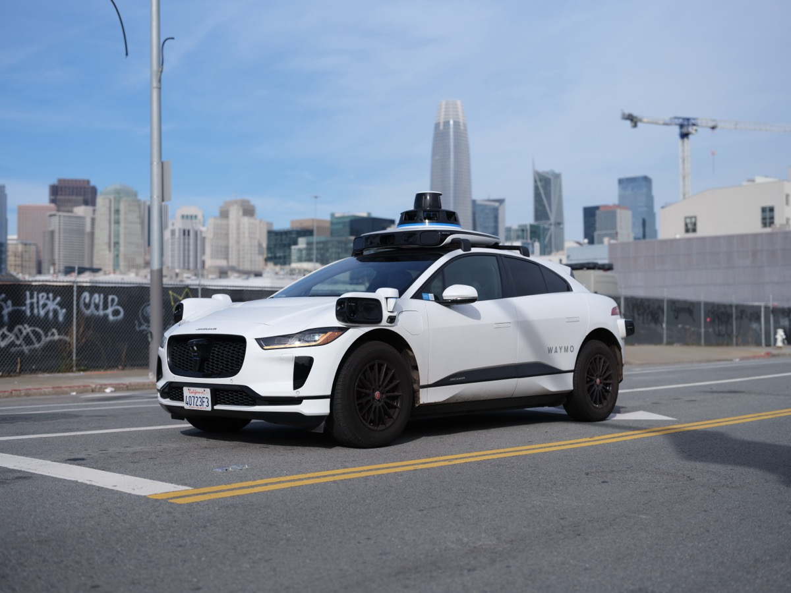
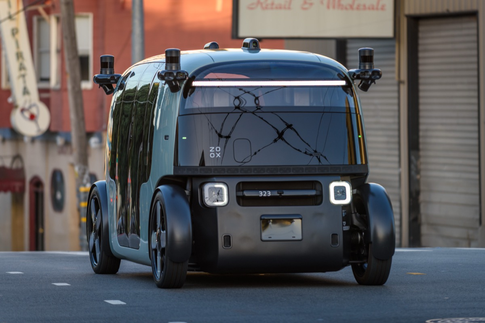

# NHTSA Moves to Define Self-Driving Car Behavior as a Scorable Test

_After Waymo_

## Executive Summary

> [!callout]
> On July 16, 2026, Jonathan Morrison, head of the U.S. National Highway Traffic Safety Administration (NHTSA), said the agency will define the behavioral competencies of self-driving cars and develop performance tests to measure them. The aim, he said, is an objective standard that lets manufacturers know for certain whether their vehicles meet the requirements. On its surface this reads like a routine regulatory preview, but inside it sits an unfamiliar assignment: to regulate a robot driver, you first have to write the test it must pass.

> What pushed this debate forward is Waymo's string of recalls. The company recalled 3,067 vehicles over a defect that drove them past stopped school buses with their stop-arms extended, yet more than 20 repeat violations were confirmed in Austin alone. It then recalled roughly 3,900 more over a defect that sent cars through highway construction zones without slowing down. A company that has driven 170 million cumulative miles with no human behind the wheel, and is safer than humans on average, kept tripping over the same long-tail situations: school buses, construction zones, and emergency vehicles.

> So what regulators actually wrestle with is not the statute but the test set. Which edge cases get curated into test items defines the scope of the safety standard, and any situation that never makes it into the test cannot be regulated. Regulating Physical AI, then, is in practice the act of transcribing a data-quality problem into law. NHTSA's announcement brings that fact into full view.

<!-- stat-card -->
**3,067** — School-bus recall — 5th-gen software defect that passed a stop-arm

<!-- stat-card -->
**~3,900** — Construction-zone recall — 6th recall — entered zones without slowing

<!-- stat-card -->
**170M miles** — Cumulative driverless miles — Safe on average, repeated failure in the tail

<!-- stat-card -->
**15 items** — AV rulemaking items — 2026 NHTSA·FMCSA regulatory agenda

## Rewriting the Test Itself

The sequence Morrison laid out is both simple and strange. First, identify the behavioral competencies a self-driving car must have; then develop the tests and performance metrics that measure those competencies; and finally set the operating parameters under which the vehicle may run. Where automotive safety regulation has always been about specifying physical parts such as braking performance or occupant protection in a crash, this time the driver's judgment itself has to be transcribed into a test.

Morrison summed up the goal this way: a manufacturer building a vehicle should be able to know for certain whether or not it meets the requirements. Right now there is no shared yardstick for what a car must pass to be considered safe. The Trump administration set a timetable to finish building that yardstick before the current term ends in January 2029, and the House backed it up by introducing the SELF DRIVE Act of 2026, which codifies NHTSA's authority over autonomous vehicles and directs the agency to develop new safety standards.

*▲ NHTSA, the agency that announced the behavioral competency test for self-driving cars | Source: [Wikimedia Commons](https://commons.wikimedia.org/wiki/File:US-NHTSA-Logo.svg)*

> [!callout]
> **The key observation**: Individual crashes will still be handled through the existing recall and enforcement powers. What is different this time is that, instead of catching problems after the fact, the agency wants to define up front, as a test, what a car must be good at before it can take to the road. The center of gravity in regulation shifts from responding to crashes toward verifying capability.

## The Robotaxi That Passed a School Bus

This rulemaking did not come out of nowhere. Behind it sits a run of real crashes and recalls from late 2025 through the first half of 2026. The most symbolic case was the school bus. In November 2025, Waymo recalled 3,067 vehicles over a defect in its fifth-generation self-driving software, after multiple confirmed incidents in which a car calmly drove past a school bus that had stopped with its red lights flashing and its stop-arm extended.

The problem continued after the recall. In Austin, more than 20 cases of a car ignoring a school-bus stop-arm were logged during the school year even after the software fix, and a local broadcaster confirmed footage of at least 24 violations. In January 2026, a Waymo vehicle struck a child near a school, prompting a formal NTSB investigation. On top of that came a sixth recall in June 2026, of roughly 3,900 vehicles pulled back over a defect that sent them through highway construction zones without slowing down.

*▲ A Waymo vehicle (Jaguar I-Pace) running the fifth-generation software behind the recalls | Source: [Wikimedia Commons (Dllu, CC BY 4.0)](https://commons.wikimedia.org/wiki/File:Waymo_Jaguar_I-Pace_in_San_Francisco_2023_dllu.jpg)*

Emergency vehicles are another recurring scene. Morrison was blunt: someone arriving at an emergency does not bring along a spare crew to move a car out of the way, and a robotaxi blocking a fire truck or ambulance is not acceptable. NHTSA has flagged a separate meeting with the industry on precisely this issue.

> [!callout]
> **Safe on average — so why regulate?** Waymo says its vehicles have driven more than 170 million cumulative miles with no human at the wheel and have sharply reduced serious-injury crashes compared with human driving. On average, it is clearly safe. But regulation trips not on the average. It trips on the long tail of school buses, construction zones, and emergency vehicles. When a system that is safe on average fails repeatedly in rare situations, the regulator is left facing one question: how do you test for the rare situation?

## Regulation and Deregulation Arrive Together

In the same announcement, Morrison also previewed a move in the opposite direction: stripping away old rules written on the assumption of a human driver. The prime examples are a manual brake pedal, which presupposes a driver's seat no human will ever occupy, and the rear-view mirror. If you ask whether a vehicle no human will operate needs a mirror, he said, the common-sense answer is no. In early July he also said the agency would consider scrapping steering-wheel and manual-control requirements for driverless vehicles, but that is still only a signal, not a formal process that has begun.

*▲ Zoox's steering-wheel-free robotaxi, cleared for paid rides in July 2026 — a preview of where human-operation rules are headed | Source: [Wikimedia Commons (9yz, CC BY 4.0)](https://commons.wikimedia.org/wiki/File:Zoox_Autonomous_Robotaxi_-_San_Francisco_May_2025_(1).jpg)*

The two moves point in opposite directions, but they are really one strategy: clear out the rules that assume a human will drive, and newly test what the robot actually does and does not do well. When the space once occupied by parts specifications empties out, what fills it is a test that verifies behavioral capability. The form of regulation moves from hardware specification to capability assessment.

## Writing the Test Is Writing the Law

Turn "define behavioral competency as a test" around, and it comes down to this: drawing up a list of which situations belong in the test items. Situations that do not make the list are not tested, and situations that are not tested are not regulated. The only channel through which a school-bus stop-arm, a construction-zone slowdown, or yielding to an emergency vehicle enters the language of regulation is the moment they become test items.

In fact this structure already exists on paper in the AV industry. International standards ISO 34501 through 34504 define the terminology for scenarios, the safety-evaluation framework, the operational design domain taxonomy, and the classification of scenarios. The core idea is that deciding what goes into the scenario catalog is what sets the scope of safety evaluation. ISO 21448, known as SOTIF, divides situations into four boxes: known-safe, known-unsafe, unknown-safe, and unknown-unsafe. The goal of safety engineering is to keep shrinking that last box. School buses and construction zones are textbook long-tail cases that moved, belatedly, into the known-unsafe box. To actually manage a scenario once discovered, you need a machine-readable form, and a practical standard like ASAM OpenSCENARIO defines exactly that catalog format. What you put in the catalog determines what you can turn into a reproducible test.

NHTSA has its own prior work here. Its 2018 report on a framework of testable cases and scenarios for automated driving systems was already trying, eight years ago, to define what to test. So what is new in this announcement is not the idea of scenario-based testing itself. The shift is that a scenario catalog, once a voluntary industry standard, is being pulled up into a mandatory federal rule. The scope of the test set the industry used to manage on its own is beginning to overlap with the scope of the safety standard the law defines.

### 4.1. An International Comparison — UNECE Is a Step Ahead

The United States is not the only one walking this road. On June 24, 2026, the UN Economic Commission for Europe (UNECE) adopted the first global regulatory framework for fully autonomous driving systems. Backed by major markets including Canada, China, the EU, Japan, the UK, and the US, it set a standard that autonomous performance must be at least as good as a competent human driver, along with obligations to build a test environment under a supervised safety-management system, to record driving data, and to report performance continuously after deployment. Where UNECE has already erected the skeleton of a test environment and continuous monitoring, the US is only now beginning a public discussion of what behavioral competency even is. A step behind, but moving on its own track sized to its domestic industry.

*▲ The Palais des Nations in Geneva, home of the UNECE, which adopted the first global framework for fully autonomous driving | Source: [Wikimedia Commons (CC BY-SA 4.0)](https://commons.wikimedia.org/wiki/File:Palais_des_Nations_Unies_Gen%C3%A8ve.jpg)*

> [!callout]
> **Why data quality is regulation**: Regulating Physical AI is the act of transcribing a data-quality problem into law. Any edge case that is not curated into a test item stays in regulation's blind spot, and that blind spot overlaps exactly with where crashes keep happening.

## When Benchmark Design Becomes Compliance

Translate the road story into the language of data and a familiar question remains. When we assess an AI's capability, we usually look at the model first: more parameters, a newer architecture, a higher score. Yet what NHTSA's attempt shows is that the baseline for judging either safety or performance is ultimately set in the list of test items, which is to say in the data. If you cannot decide what to test, no matter how capable the model, it cannot tell you what it has passed.

The capability this calls for is finding long-tail edge cases densely and curating them into reproducible test items. Take the single case of a school-bus stop-arm: you have to capture the variant where the car stops for the first stop-arm and then ignores the second before you can test the real hazard. How representatively you build a scenario library like this is the credibility of the test itself. And the moment that test becomes a federal rule, it becomes the underlying document of compliance.

For data and AI practitioners, the lesson of this episode is clear. The test sets and evaluation suites we build may no longer stay confined to internal engineering documents. The ability to design a benchmark becomes the ability to answer to regulation. Whether in autonomous driving, robotics, or any other Physical AI domain, the same principle holds: what you put in the test items determines what you can guarantee.

> [!callout]
> **One-line summary**: What regulators wrestle with is not the statute but the test set. A situation that never made it into the test cannot be regulated, which is why the ability to design a benchmark is now the ability to comply. Before you pick a model, ask first what you will test. That is the starting point of the Physical AI era.

## References

### Industry & Press

- 1.Detroit News. (2026). "[New safety rules coming for self-driving cars](https://www.detroitnews.com/story/business/autos/2026/07/17/new-safety-rules-coming-for-self-driving-cars/90949621007/)." The Detroit News.
- 2.Insurance Journal. (2026). "[US Aims to Set Guardrails for Autonomous Vehicle Behavior](https://www.insurancejournal.com/news/national/2026/07/17/877969.htm)." Insurance Journal.
- 3.Bloomberg. (2026). "[US Takes Aim at Autonomous Car Mishaps in Safety Rulemaking Push](https://www.bloomberg.com/news/articles/2026-07-16/us-takes-aim-at-autonomous-car-mishaps-in-safety-rulemaking-push)." Bloomberg.
- 4.CNBC. (2026). "[Waymo recalls robotaxis that entered freeway construction zones](https://www.cnbc.com/2026/06/18/waymo-nhtsa-voluntary-recall-robotaxis-entered-freeway-construction-zones.html)." CNBC.
- 5.TechCrunch. (2026). "[Waymo recalls nearly 4,000 robotaxis over highway construction zones](https://techcrunch.com/2026/06/18/waymo-recalls-nearly-4000-robotaxis-to-stop-them-driving-into-highway-construction-zones/)." TechCrunch.

### Official Documents & Standards

- 6.UN News. (2026). "[UN adopts first global framework for fully autonomous driving systems](https://news.un.org/en/story/2026/06/1167797)." United Nations (UNECE).
- 7.Sidley Austin. (2026). "[The Department of Transportation's 2026 Regulatory Agenda: Acceleration of Autonomous Vehicle Rulemaking](https://environmentalhealthsafetybrief.sidley.com/2026/07/09/the-department-of-transportations-2026-regulatory-agenda-acceleration-of-autonomous-vehicle-rulemaking-and-future-action-on-fuel-economy/)." Sidley EHS Brief.
- 8.International Organization for Standardization. "[ISO 34502: Road vehicles — Test scenarios for automated driving systems — Scenario based safety evaluation framework](https://www.iso.org/standard/78951.html)." ISO.
- 9.ASAM e.V. "[ASAM OpenSCENARIO 2.0 Concept Paper](https://releases.asam.net/OpenSCENARIO/2.0-concepts/ASAM_OpenSCENARIO_2-0_Concept_Paper.html)." ASAM.
