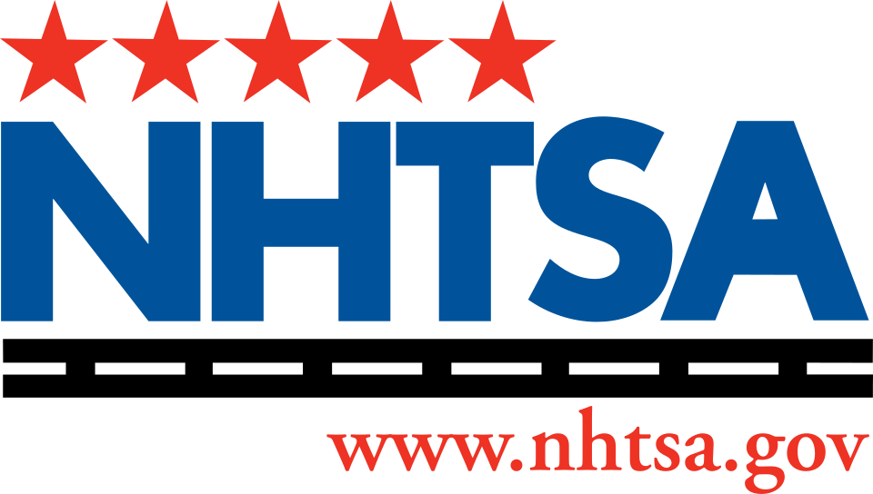

# 자율주행차의 행동 역량을 시험 문제로 규정하려는 미국 도로안전국

_Waymo의 반복된 리콜 이후, NHTSA가 자율주행차의 행동 역량을 정의하고 측정하는 시험을 준비한다_

## Executive Summary

> [!callout]
> 2026년 7월 16일, 미국 도로교통안전국(NHTSA)의 조나단 모리슨 청장이 자율주행차의 행동 역량(behavioral competencies)을 정의하고, 그것을 측정하는 성능 시험을 개발하겠다고 밝혔습니다. 제조사가 자기 차량이 요건을 충족하는지 확실히 알 수 있게 만드는 객관적 기준을 세우겠다는 것입니다. 발표만 보면 흔한 규제 예고 같지만, 그 안에는 로봇 운전자를 규제하려면 먼저 그 시험 문제부터 써야 한다는 낯선 숙제가 들어 있습니다.

> 이 논의를 앞당긴 것은 Waymo의 반복된 리콜입니다. 정차한 스쿨버스의 정지팔을 무시하고 지나간 결함으로 3,067대를 리콜하고도 오스틴에서만 20건 넘는 재위반이 확인됐고, 고속도로 공사구간을 속도도 줄이지 않고 통과하는 결함으로 약 3,900대를 다시 불러들였습니다. 누적 1억 7천만 마일을 무인 주행하며 평균적으로는 인간보다 안전하다는 회사가, 스쿨버스·공사구간·응급차량이라는 롱테일 상황에서 반복해 걸려 넘어진 것입니다.

> 그래서 규제기관이 실제로 씨름하는 대상은 법조문이 아니라 테스트 셋입니다. 어떤 엣지케이스를 시험 항목으로 큐레이션하느냐가 곧 안전 기준의 범위가 되고, 시험에 담기지 못한 상황은 규제도 하지 못합니다. 물리 AI를 규제한다는 것은, 알고 보면 데이터 품질 문제를 법의 언어로 옮겨 쓰는 일입니다. NHTSA의 이번 발표가 그 사실을 정면으로 드러냅니다.

<!-- stat-card -->
**3,067대** — 스쿨버스 리콜 — 정지팔을 무시하고 지나간 5세대 SW 결함

<!-- stat-card -->
**~3,900대** — 공사구간 리콜 — 속도를 줄이지 않고 통과한 6번째 리콜

<!-- stat-card -->
**1.7억 마일** — 누적 무인 주행 — 평균은 안전, 롱테일에서 반복 실패

<!-- stat-card -->
**15건** — 자율주행 규칙제정 항목 — 2026 NHTSA·FMCSA 규제 아젠다

## 시험 문제를 다시 쓰기로 했다

모리슨 청장이 제시한 절차는 단순하고 낯섭니다. 먼저 자율주행차가 갖춰야 할 행동 역량이 무엇인지 식별하고, 그 역량을 측정하는 시험과 성능 지표를 개발한 뒤, 마지막으로 차량이 작동해야 할 운행 매개변수를 설정한다는 순서입니다. 지금까지의 자동차 안전 규제가 브레이크 성능이나 충돌 시 탑승자 보호처럼 물리적 부품의 사양을 정하는 일이었다면, 이번에는 운전자의 판단 능력 자체를 시험 문제로 옮겨 적어야 합니다.

모리슨은 목표를 이렇게 요약했습니다. 차량을 만드는 제조사가 자기 차량이 요건을 충족하는지 아닌지를 확실하게 알 수 있어야 한다는 것입니다. 지금은 무엇을 통과해야 안전한 것인지에 대한 공통의 눈금이 없습니다. 트럼프 행정부는 이 눈금 만들기를 현 임기가 끝나는 2029년 1월 전에 마무리하겠다는 시간표를 세웠고, 하원은 NHTSA의 자율주행 차량 권한을 명문화하고 새 안전기준 개발을 지시하는 SELF DRIVE Act of 2026을 발의하며 이를 뒷받침했습니다.

*▲ 자율주행차 행동 역량 시험을 예고한 미국 도로교통안전국(NHTSA) | Source: [Wikimedia Commons](https://commons.wikimedia.org/wiki/File:US-NHTSA-Logo.svg)*

> [!callout]
> **핵심 관찰**: 개별 사고는 기존의 리콜·집행 권한으로 계속 대응합니다. 이번 시도가 다른 점은, 사후에 문제를 잡아내는 대신 무엇을 잘해야 도로에 나올 수 있는지를 사전에 시험으로 규정하려 한다는 데 있습니다. 규제의 무게 중심이 사고 대응에서 능력 검증으로 옮겨 갑니다.

## 스쿨버스를 지나친 로봇택시

이 규칙제정은 갑자기 튀어나온 것이 아닙니다. 2025년 말부터 2026년 상반기까지 쌓인 실제 사고와 리콜이 배경입니다. 가장 상징적인 사건은 스쿨버스였습니다. 2025년 11월, Waymo는 5세대 자율주행 소프트웨어의 결함으로 3,067대를 리콜했습니다. 적색 점멸등을 켜고 정지팔을 편 채 멈춰 선 스쿨버스 옆을, 차량이 태연히 지나쳐 간 사건이 여러 건 확인됐기 때문입니다.

문제는 리콜 이후에도 이어졌습니다. 오스틴에서는 소프트웨어를 고친 뒤에도 스쿨버스 정지팔을 무시한 사례가 학년도 중 20건 넘게 집계됐고, 지역 방송은 최소 24건의 위반 영상을 확인했습니다. 2026년 1월에는 학교 인근에서 Waymo 차량이 어린이를 충격하는 사고가 발생해 NTSB가 정식 조사에 들어갔습니다. 여기에 2026년 6월, 고속도로 공사구간을 속도도 줄이지 않고 통과하는 결함으로 약 3,900대를 리콜한 6번째 사례가 더해졌습니다.

*▲ 리콜의 대상이 된 Waymo의 5세대 자율주행 소프트웨어 탑재 차량(Jaguar I-Pace) | Source: [Wikimedia Commons (Dllu, CC BY 4.0)](https://commons.wikimedia.org/wiki/File:Waymo_Jaguar_I-Pace_in_San_Francisco_2023_dllu.jpg)*

응급차량도 반복해 등장하는 장면입니다. 모리슨은 응급 현장에 도착하는 사람이 차를 옮겨 줄 여분의 인력을 데려오지는 않는다며, 로봇택시가 소방차나 구급차의 진입을 막는 상황을 용납할 수 없다고 못 박았습니다. NHTSA는 이 문제를 놓고 업계와 별도 회동을 예고했습니다.

> [!callout]
> **평균은 안전한데, 왜 규제인가**: Waymo는 자사 차량이 누적 1억 7천만 마일 이상을 무인으로 달렸고 인간 운전 대비 중상 이상 사고를 크게 줄였다고 말합니다. 평균은 분명 안전합니다. 그러나 규제가 걸려 넘어지는 지점은 평균이 아니라 스쿨버스·공사구간·응급차량 같은 롱테일입니다. 평균적으로 안전한 시스템이 드문 상황에서 반복해 실패할 때, 규제기관은 그 드문 상황을 어떻게 시험할 것인가라는 질문 앞에 서게 됩니다.

## 규제와 탈규제가 함께 온다

같은 발표에서 모리슨은 반대 방향의 움직임도 함께 예고했습니다. 인간 운전자를 전제로 만들어진 낡은 규정을 걷어내겠다는 것입니다. 인간이 절대 앉지 않을 운전석을 가정한 수동 브레이크 페달 요건, 그리고 백미러가 대표적입니다. 인간이 조작하지 않을 차량에 미러가 필요한지 묻는다면 답은 아니라는 것이 상식이라고 그는 말했습니다. 7월 초에는 무인 차량의 스티어링휠과 수동 조작장치 요건을 폐지하는 방안도 검토하겠다고 했지만, 이는 아직 신호일 뿐 공식 절차가 시작된 단계는 아닙니다.

*▲ 스티어링휠 없이 설계돼 2026년 7월 유상운행 승인을 받은 Zoox 로보택시 — 인간 조작 전제 규정이 걷어지는 방향을 보여준다 | Source: [Wikimedia Commons (9yz, CC BY 4.0)](https://commons.wikimedia.org/wiki/File:Zoox_Autonomous_Robotaxi_-_San_Francisco_May_2025_(1).jpg)*

방향이 반대인 두 움직임은 사실 하나의 전략입니다. 인간이 몰 것을 가정한 규정은 걷어내고, 로봇이 실제로 무엇을 잘하고 무엇을 못하는지는 새로 시험한다는 것입니다. 부품 사양을 규정하던 자리가 비면, 그 자리를 채우는 것은 행동 능력을 검증하는 시험이 됩니다. 규제의 형식이 하드웨어 명세에서 능력 평가로 이동하는 셈입니다.

## 시험을 만드는 일이 곧 법을 쓰는 일

행동 역량을 시험으로 규정한다는 말을 뒤집어 보면, 결국 어떤 상황을 시험 항목에 넣을지 목록을 짜는 일입니다. 그리고 그 목록에 들어가지 못한 상황은 시험되지 않고, 시험되지 않은 상황은 규제되지도 않습니다. 스쿨버스 정지팔, 공사구간 감속, 응급차량 양보가 규제의 언어로 들어오는 유일한 통로는 그것들이 시험 항목이 되는 순간입니다.

사실 이 구조는 자율주행 업계에 이미 문서로 존재합니다. 국제표준 ISO 34501부터 34504까지는 시나리오의 용어 체계, 안전성 평가 프레임워크, 운행설계영역 분류, 시나리오 분류를 규정합니다. 핵심은 무엇을 시나리오 카탈로그에 넣을 것인가가 곧 안전 평가의 범위를 정한다는 발상입니다. ISO 21448, 이른바 SOTIF는 상황을 네 칸으로 나눕니다. 알려진 안전, 알려진 위험, 알려지지 않은 안전, 그리고 알려지지 않은 위험입니다. 안전공학의 목표는 이 마지막 칸을 계속 줄여 나가는 것입니다. 스쿨버스와 공사구간은 뒤늦게 알려진 위험 칸으로 옮겨 온 전형적인 롱테일 사례입니다. 이렇게 발견한 시나리오를 실제로 관리하려면 기계가 읽을 수 있는 형식이 필요한데, ASAM OpenSCENARIO 같은 실무 표준이 바로 그 카탈로그 형식을 규정합니다. 무엇을 카탈로그에 담느냐가 곧 무엇을 재현 가능한 시험으로 만들 수 있느냐를 결정합니다.

NHTSA 자신도 선행 작업을 갖고 있습니다. 2018년에 나온 자율주행 시스템 테스트 가능 사례·시나리오 프레임워크 보고서는 이미 8년 전부터 무엇을 시험할 것인가를 규정하려 했습니다. 그러니 이번 발표에서 새로운 것은 시나리오 기반 시험이라는 개념 자체가 아닙니다. 자발적 산업표준이던 시나리오 카탈로그를 연방 강제 규칙으로 끌어올리려 한다는 점이 전환입니다. 그동안 업계가 스스로 관리하던 테스트 셋의 범위가, 이제 법이 정하는 안전 기준의 범위와 겹쳐지기 시작합니다.

### 4.1. 국제 비교 — UNECE는 한발 앞서 있다

미국만 이 길을 걷는 것은 아닙니다. 2026년 6월 24일, 유엔 유럽경제위원회(UNECE)는 완전 자율주행 시스템을 위한 첫 글로벌 규제 프레임워크를 채택했습니다. 캐나다·중국·EU·일본·영국·미국 등 주요 시장이 지지했고, 자율주행 성능이 숙련된 인간 운전자 수준 이상이어야 한다는 기준과 함께, 감시된 안전관리 체계를 갖춘 시험 환경 구성 의무, 주행 데이터 기록 의무, 배포 후 지속적 성능 보고 의무를 담았습니다. UNECE가 이미 시험 환경과 지속 모니터링의 골격을 세운 반면, 미국은 이제 막 행동 역량이 무엇인지부터 공개 논의를 시작하는 단계입니다. 한발 늦었지만, 자국 산업 규모에 맞춘 별도 트랙으로 움직이는 구도입니다.

*▲ 완전 자율주행 첫 글로벌 프레임워크를 채택한 UNECE의 본거지, 제네바 팔레 데 나시옹 | Source: [Wikimedia Commons (CC BY-SA 4.0)](https://commons.wikimedia.org/wiki/File:Palais_des_Nations_Unies_Gen%C3%A8ve.jpg)*

> [!callout]
> **왜 데이터 품질이 곧 규제인가**: 물리 AI의 규제는 데이터 품질 문제를 법으로 옮겨 쓰는 일입니다. 시험 항목으로 큐레이션되지 못한 엣지케이스는 규제의 사각지대로 남고, 그 사각지대는 정확히 사고가 반복되는 자리와 겹칩니다.

## 벤치마크 설계가 컴플라이언스가 될 때

도로 이야기를 데이터의 언어로 바꾸면, 익숙한 질문이 남습니다. 우리는 AI의 능력을 평가할 때 대개 모델부터 봅니다. 더 큰 파라미터, 더 새로운 아키텍처, 더 높은 점수를 찾습니다. 그런데 NHTSA의 이번 시도가 보여 주는 것은, 안전이든 성능이든 그 판정의 기준선이 결국 시험 항목의 목록, 곧 데이터에서 정해진다는 사실입니다. 무엇을 시험할지 정하지 못하면, 아무리 뛰어난 모델도 무엇을 통과했는지 말할 수 없습니다.

이때 필요한 능력은 롱테일 엣지케이스를 촘촘히 발견하고, 그것을 재현 가능한 시험 항목으로 큐레이션하는 일입니다. 스쿨버스 정지팔 상황 하나만 해도, 첫 정지팔은 멈췄다가 두 번째 정지팔을 무시하는 변형까지 담아야 실제 위험을 시험할 수 있습니다. 이런 시나리오 라이브러리를 얼마나 대표성 있게 쌓느냐가 곧 시험의 신뢰도이고, 그 시험이 연방 규칙이 되는 순간 그것은 그대로 컴플라이언스의 근거 문서가 됩니다.

데이터·AI 실무자에게 이 사건이 주는 교훈은 분명합니다. 우리가 만드는 테스트 셋과 평가 스위트가, 더 이상 엔지니어링 내부 문서로만 머물지 않을 수 있다는 것입니다. 벤치마크를 설계하는 능력이 곧 규제에 응답하는 능력이 됩니다. 자율주행이든, 로보틱스든, 다른 물리 AI 도메인이든, 무엇을 시험 항목에 담았는가가 무엇을 보증할 수 있는가를 정한다는 원리는 똑같이 작동합니다.

> [!callout]
> **한 줄 요약**: 규제기관이 씨름하는 것은 법조문이 아니라 테스트 셋입니다. 시험에 담기지 못한 상황은 규제도 못 하고, 그래서 벤치마크를 설계하는 능력이 이제 컴플라이언스 능력이 됩니다. 모델을 고르기 전에, 무엇을 시험할지를 먼저 묻는 일이 물리 AI 시대의 출발점입니다.

## 참고문헌

### 업계·보도

- 1.Detroit News. (2026). "[New safety rules coming for self-driving cars](https://www.detroitnews.com/story/business/autos/2026/07/17/new-safety-rules-coming-for-self-driving-cars/90949621007/)." The Detroit News.
- 2.Insurance Journal. (2026). "[US Aims to Set Guardrails for Autonomous Vehicle Behavior](https://www.insurancejournal.com/news/national/2026/07/17/877969.htm)." Insurance Journal.
- 3.Bloomberg. (2026). "[US Takes Aim at Autonomous Car Mishaps in Safety Rulemaking Push](https://www.bloomberg.com/news/articles/2026-07-16/us-takes-aim-at-autonomous-car-mishaps-in-safety-rulemaking-push)." Bloomberg.
- 4.CNBC. (2026). "[Waymo recalls robotaxis that entered freeway construction zones](https://www.cnbc.com/2026/06/18/waymo-nhtsa-voluntary-recall-robotaxis-entered-freeway-construction-zones.html)." CNBC.
- 5.TechCrunch. (2026). "[Waymo recalls nearly 4,000 robotaxis over highway construction zones](https://techcrunch.com/2026/06/18/waymo-recalls-nearly-4000-robotaxis-to-stop-them-driving-into-highway-construction-zones/)." TechCrunch.

### 공식 문서·표준

- 6.UN News. (2026). "[UN adopts first global framework for fully autonomous driving systems](https://news.un.org/en/story/2026/06/1167797)." United Nations (UNECE).
- 7.Sidley Austin. (2026). "[The Department of Transportation's 2026 Regulatory Agenda: Acceleration of Autonomous Vehicle Rulemaking](https://environmentalhealthsafetybrief.sidley.com/2026/07/09/the-department-of-transportations-2026-regulatory-agenda-acceleration-of-autonomous-vehicle-rulemaking-and-future-action-on-fuel-economy/)." Sidley EHS Brief.
- 8.International Organization for Standardization. "[ISO 34502: Road vehicles — Test scenarios for automated driving systems — Scenario based safety evaluation framework](https://www.iso.org/standard/78951.html)." ISO.
- 9.ASAM e.V. "[ASAM OpenSCENARIO 2.0 Concept Paper](https://releases.asam.net/OpenSCENARIO/2.0-concepts/ASAM_OpenSCENARIO_2-0_Concept_Paper.html)." ASAM.
