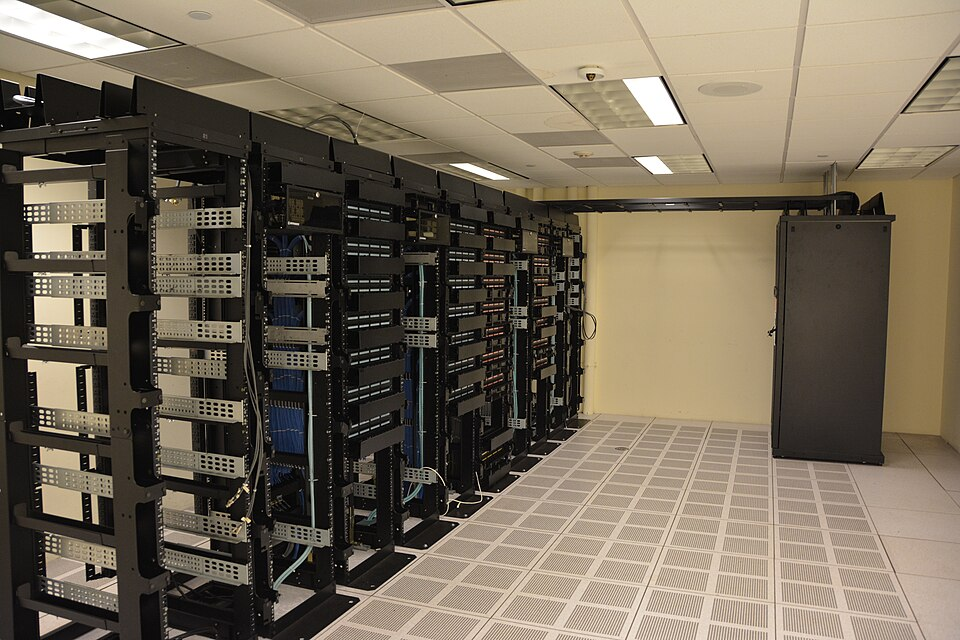

# The NSF Just Put $100 Million Behind Fixing Science Data

_NSF 26-512 arrived alongside $83 million in same-day IDSS awards._

## Executive Summary

> [!callout]
> On July 22, 2026, the U.S. National Science Foundation (NSF) released NSF 26-512, a new solicitation allocating up to $100 million to the work of turning existing scientific data into something AI can actually use. The striking part is how the money is fenced off: not a cent of it may go toward collecting new data. It funds only the work of taking datasets that already exist (scattered, stored in inconsistent formats, effectively invisible to AI) and making them accessible, interoperable, and ready for automated analysis.

> The same day, NSF announced three awards totaling $83 million that had already been made under a separate program, IDSS. Declaration and disbursement landed on a single day. Both announcements were explicitly positioned as part of the Genesis Mission unveiled at the White House that same day — a $5 billion investment in AI for science spanning 15 federal agencies.

> This article lays out that event, a government recognizing data preparation as a budget line of its own, and closes on the one question it leaves for individual labs and companies. If making data usable by AI now carries a price tag, by what do we measure and value the AI-readiness of our own data?

### Key Figures

Source: [NSF official announcement](https://www.nsf.gov/news/new-nsf-initiative-aims-unlock-dataset-value-ai-enabled) (2026-07-22)

<!-- stat-card -->
**$100M** — NSF 26-512 new budget — For AI-readiness of existing data only; $200K–$5M per award

<!-- stat-card -->
**$83M** — IDSS awards, same day — FabAID · NDP · iDLab — already disbursed, a separate program

<!-- stat-card -->
**$5B** — Genesis Mission investment — Across 15 federal agencies — NSF's two announcements sit under it

<!-- stat-card -->
**$0** — For new data collection — Budget goes to curation, integration, pipelines — collection is explicitly excluded

## A Budget for Fixing, Not Collecting

The formal title of NSF 26-512 is "Unlocking Dataset Value for AI-Enabled Scientific Discovery." The total is up to $100 million, with typical awards running $2–5 million and planning grants up to $200,000. So far this looks like any other research program. What makes the solicitation unusual is not the size of the money but a design that nails down where the money cannot go.

*▲ The U.S. National Science Foundation, which issued solicitation NSF 26-512 | Source: [Wikimedia Commons](https://commons.wikimedia.org/wiki/File:NSF_logo.png)*

The solicitation states plainly that it will not support new data collection. It applies only to datasets that already exist. In NSF's own words, "many datasets hold the potential to be used in new investigations beyond the scope of their original collection, but are inaccessible, not interoperable, or not ready for use by automated AI systems." The budget goes to closing exactly that gap: developing methods for feature extraction and metadata generation, integrating multiple datasets, and building robust data pipelines that AI tools can analyze automatically.

Ellen Zegura, who advises the NSF Director's office on science and engineering, said in the announcement that "high-quality scientific data is the foundation for advancing an AI-enabled research and innovation ecosystem." Calling data a foundation rather than an output, an infrastructure rather than a byproduct, captures the character of this announcement. The submission deadline is November 4, 2026, and the program ties into existing infrastructure such as the NSF data platform, the National AI Research Resource (NAIRR), and the Department of Energy's science and security platforms. It also leaves the door open to partnerships with private and philanthropic foundations.

> [!callout]
> Here is the core of it. A government named the bottleneck in science not as the model, nor as a shortage of new data, but as the state of the data it already holds — and created a separate budget line for fixing that state. Data preparation was promoted from a side chore of research to something a funding panel reviews.

## $83 Million Disbursed the Same Day — Not Words but Cases

A declaration is, for now, only a call for applications. That is why the second announcement of the same day carries more weight. NSF confirmed three awards totaling $83 million under the Integrated Data Systems and Services (IDSS) program, which was already underway. Unlike the new solicitation, which is still accepting proposals, this is money already paid out. It is worth stating clearly that the two announcements are separate programs whose amounts cannot be added together.

- •**FabAID** — led by the Morgridge Institute at UW–Madison, builds a national-scale data fabric connecting repositories, computing resources, and cyberinfrastructure (including NAIRR).
- •**National Data Platform (NDP)** — led by UC San Diego, builds a so-called "AI-ready ecosystem" that unifies distributed data, computing facilities, and AI resources.
- •**iDLab** — led by UCLA, builds an integrated web platform connecting researchers to NSF-supported high-performance computing and cloud resources.

All three fall under Category I, the largest award tier in the IDSS program. That tier funds major infrastructure projects at $10–30 million each, over as long as five years, with renewal possible. It means the combined $83 million comes not from many small grants but from three large projects building national-scale data foundations.

All three target the same bottleneck. Decades of accumulated scientific data sit scattered across thousands of incompatible institutional repositories, in inconsistent formats, tagged inconsistently — effectively invisible to AI models. The bottleneck comes not from a lack of data but from data that exists in an unusable state. If the new solicitation declared this problem as a budget line, the three IDSS awards are working examples of the same problem already being funded and solved.

*▲ The problem FabAID, NDP, and iDLab target — connecting scientific data scattered across thousands of institutional repositories | Source: [Wikimedia Commons](https://commons.wikimedia.org/wiki/File:Datacenter_Server_Racks_(22370909788).jpg)*

## Why Now — The Genesis Mission as Backdrop

NSF's two announcements did not happen to fall on the same day by accident. That day was the first Genesis Mission summit, hosted by the White House, where Michael Kratsios, director of the Office of Science and Technology Policy (OSTP), unveiled more than $5 billion in AI-for-science investment spanning 15 federal agencies. NSF's $100 million solicitation and its $83 million in IDSS awards are positioned as the operational tier of this national strategy.

*▲ Michael Kratsios, OSTP Director, who unveiled the $5 billion investment at the Genesis Mission summit (official portrait, taken during his earlier DoD tenure) | Source: [Wikimedia Commons](https://commons.wikimedia.org/wiki/Category:Michael_Kratsios)*

The Genesis Mission launched by executive order in November 2025. Its goals are to train AI models on scientific datasets, build AI agents that test new hypotheses, and stand up integrated platforms that automate research workflows. For that plan to hold, one premise has to be met: the scientific data the AI would learn from has to actually be in a learnable state. NSF 26-512 is the budget that fills that premise.

The same diagnosis surfaces outside of policy. KDD, the top venue in data mining, introduced an "AI for Sciences" track for the first time in 2026 — and its review criteria encourage the use of domain-specific data and require a clear description of how the data was collected, preprocessed, managed, and analyzed. Whether to release the data is optional, but the responsibility to explain how it was prepared is mandatory. In the same year, in the same season, a national budget and an academic review standard both put data preparation front and center. The same pressure that came down from policy surfaced simultaneously in academia.

## So What Is Your Data Worth?

A government's recognition translates immediately into a practical question for individual organizations. The conditions NSF attached to its budget, namely accessibility, interoperability, metadata, and pipelines fit for automated AI analysis, are not solely about supercomputers at national labs. How well the data a lab or company has been accumulating for years meets these conditions is a question you can ask regardless of scale. The problem is what to measure that readiness with.

There are already answers to that question. Pebblous's earlier piece on [the domain-specific AI readiness of scientific data](/blog/ai-readiness-scientific-domains/en/) introduces the REDI framework from the U.S. national laboratories and shows how criteria that share a single name (completeness, consistency, fitness) translate into entirely different rules across domains such as climate, genomics, and fusion. Readiness is not a yes/no dichotomy but a spectrum whose position differs by domain. The conceptual definition of "what exactly AI-Ready Data is" is covered in [a separate article](/blog/ai-ready-data-conditions/en/).

> [!callout]
> What NSF's announcement changed is the weight of this question. Data readiness used to be an internal quality metric that only the data people worried about. Now it is a line item a government reviews when it awards a budget, and a line item a conference reviews when it accepts a paper. AI-Ready Data moved from a slogan to a unit of investment. What remains is to actually hold that yardstick up against your own data.

## References

### Official Announcements

- 1.National Science Foundation. (2026). "[New NSF Initiative Aims to Unlock Dataset Value for AI-Enabled Scientific Discovery](https://www.nsf.gov/news/new-nsf-initiative-aims-unlock-dataset-value-ai-enabled)." NSF News.
- 2.National Science Foundation. (2026). "[NSF Announces $83M Investment in Integrated Data Systems](https://www.nsf.gov/news/nsf-announces-83m-investment-integrated-data-systems)." NSF News.

### Academic Sources

- 3.KDD 2026. "[AI4Sciences Track — Call for Papers](https://kdd2026.kdd.org/ai4sciences-track-call-for-papers/)."

### Industry & News Sources

- 4.HPCwire. (2026). "[NSF Invests $83M in Data Infrastructure for AI-Driven Science](https://www.hpcwire.com/off-the-wire/nsf-invests-83m-in-data-infrastructure-for-ai-driven-science/)." HPCwire.
- 5.Technology.org. (2026). "[New Initiative Aims to Unlock Dataset Value for AI-Enabled Scientific Discovery](https://www.technology.org/2026/07/30/new-initiative-aims-to-unlock-dataset-value-for-ai-enabled-scientific-discovery/)." Technology.org.
- 6.FundsforNGOs. (2026). "[RFAs: Unlocking Dataset Value for AI-Enabled Scientific Discovery (US)](https://www2.fundsforngos.org/innovation/rfas-unlocking-dataset-value-for-ai-enabled-scientific-discovery-us/amp/)." FundsforNGOs.
