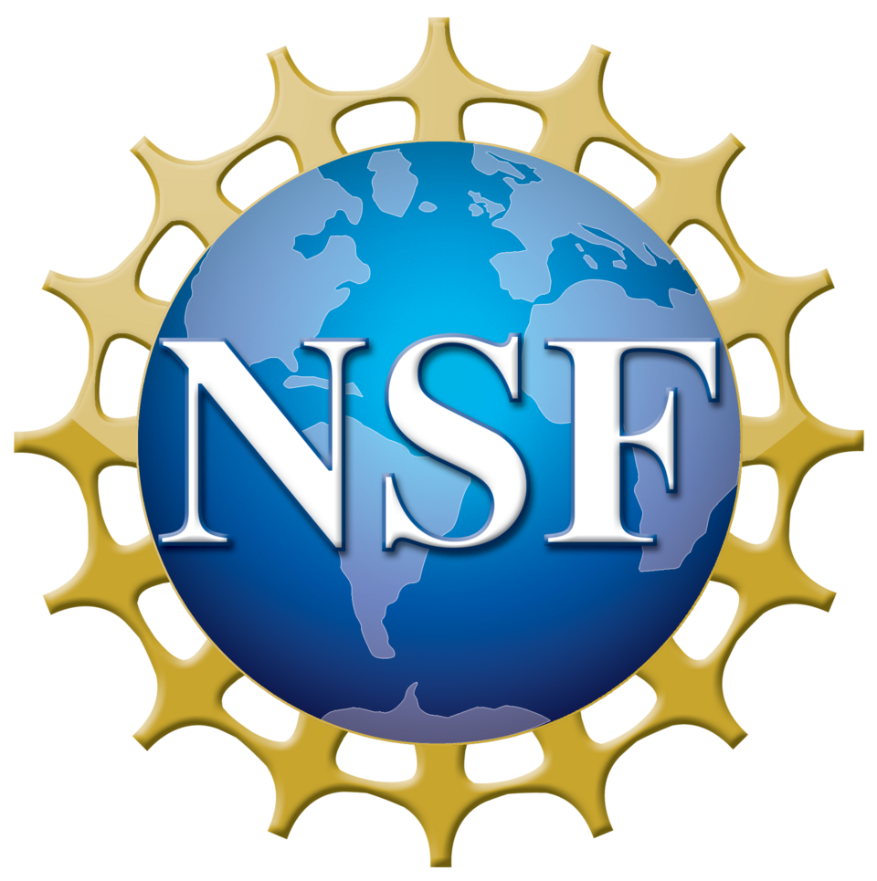

# 미국 과학재단이 과학 데이터 정비에 1억 달러를 걸었다

_NSF 26-512 솔리시테이션과 함께, 같은 날 IDSS 프로그램이 8,300만 달러를 집행했다_

## Executive Summary

> [!callout]
> 2026년 7월 22일, 미국 국립과학재단(NSF)이 기존 과학 데이터를 AI가 쓸 수 있는 상태로 바꾸는 일에 최대 1억 달러를 배정한 신규 솔리시테이션 NSF 26-512를 내놓았다. 눈여겨볼 점은 이 돈이 새 데이터를 모으는 데는 한 푼도 쓰지 못하도록 설계됐다는 것이다. 이미 쌓여 있으나 흩어지고 포맷이 제각각이라 AI에게는 사실상 보이지 않는 데이터셋을, 접근 가능하고 상호운용되며 자동 분석에 적합한 상태로 끌어올리는 데만 쓴다.

> 같은 날 NSF는 별개의 IDSS 프로그램으로 이미 집행된 8,300만 달러의 수혜 3건을 함께 발표했다. 선언과 집행이 하루에 겹친 셈이다. 두 발표 모두 그날 백악관에서 공개된 Genesis Mission, 즉 15개 연방기관에 걸친 50억 달러 규모 AI 과학 투자의 하위 집행으로 명시적으로 포지셔닝됐다.

> 이 글은 국가가 데이터 정비를 하나의 예산 항목으로 인정한 이 사건을 정리하고, 개별 연구실과 기업에게 남는 질문 하나로 맺는다. 데이터를 AI가 쓸 수 있게 만드는 일에 값이 매겨졌다면, 우리 데이터의 AI 준비도는 무엇으로 재고 무엇으로 값을 매길 것인가.

### 주요 수치

출처: [NSF 공식 발표](https://www.nsf.gov/news/new-nsf-initiative-aims-unlock-dataset-value-ai-enabled) (2026-07-22)

<!-- stat-card -->
**1억 달러** — NSF 26-512 신규 예산 — 기존 데이터의 AI 준비도에만 배정, 과제당 20만~500만 달러

<!-- stat-card -->
**8,300만 달러** — 같은 날 IDSS 집행액 — FabAID·NDP·iDLab 3건 — 이미 지급된 별개 프로그램

<!-- stat-card -->
**50억 달러** — Genesis Mission 투자 — 15개 연방기관 규모 — NSF 두 발표가 그 하위 집행

<!-- stat-card -->
**0원** — 신규 데이터 수집 지원 — 예산은 정비·통합·파이프라인에만 — 수집은 명시적 제외

## 새 데이터가 아니라 정비에 붙은 예산

NSF 26-512의 정식 이름은 "Unlocking Dataset Value for AI-Enabled Scientific Discovery"다. 총액은 최대 1억 달러, 일반 과제는 200만~500만 달러, 계획 수립 과제는 최대 20만 달러 규모다. 여기까지는 여느 연구 지원과 다르지 않아 보인다. 이 솔리시테이션을 이례적으로 만드는 대목은 돈의 크기가 아니라 돈을 쓸 수 없는 곳을 못 박은 설계에 있다.

*▲ 이번 솔리시테이션 NSF 26-512를 발표한 미국 국립과학재단(NSF) | Source: [Wikimedia Commons](https://commons.wikimedia.org/wiki/File:NSF_logo.png)*

솔리시테이션은 신규 데이터 수집을 지원하지 않는다고 명시한다. 이미 존재하는 데이터셋만을 대상으로 한다. NSF의 표현을 빌리면, "수많은 데이터셋이 애초의 수집 범위를 넘어 새로운 탐구에 쓰일 잠재력을 갖고 있지만, 접근할 수 없거나 상호운용되지 않거나 자동화된 AI 시스템이 쓸 준비가 되어 있지 않다." 예산은 바로 이 간극을 메우는 활동, 즉 피처 추출과 메타데이터 생성 방법 개발, 여러 데이터셋의 통합, AI 도구가 자동으로 분석할 수 있는 견고한 데이터 파이프라인 구축에 배정된다.

NSF 국장실 과학공학 담당 보좌관 엘런 지구라(Ellen Zegura)는 발표에서 "고품질 과학 데이터는 AI 지원 연구와 혁신 생태계를 발전시키는 기초"라고 말했다. 데이터를 결과물이 아니라 기반 시설로 부르는 이 어법이 이번 발표의 성격을 요약한다. 접수 마감은 2026년 11월 4일이며, NSF 데이터 플랫폼과 국가 AI 연구 자원(NAIRR), 에너지부의 과학·보안 플랫폼 같은 기존 인프라와 연계된다. 민간·자선재단과의 파트너십도 열어 두었다.

> [!callout]
> 핵심은 이것이다. 국가가 과학의 병목을 모델이나 새 데이터가 아니라 이미 가진 데이터의 상태로 지목했고, 그 상태를 고치는 일에 별도 예산 항목을 만들었다. 데이터 정비가 연구의 부수 작업에서 예산 심사의 대상으로 승격된 것이다.

## 같은 날 집행된 8,300만 달러 — 말이 아니라 사례

선언만으로는 아직 신청을 받는 단계일 뿐이다. 그래서 같은 날 나온 두 번째 발표가 더 무겁다. NSF는 이미 진행 중이던 통합 데이터 시스템·서비스(IDSS) 프로그램에서 8,300만 달러 규모의 수혜 3건을 확정 발표했다. 아직 접수 중인 신규 솔리시테이션과 달리, 이건 이미 지급된 돈이다. 두 발표는 액수를 합산할 수 없는 별개 프로그램이라는 점을 분명히 해 둘 필요가 있다.

- •**FabAID** — 위스콘신 매디슨의 모그리지 연구소가 주도해, 리포지토리와 컴퓨팅 자원과 사이버인프라(NAIRR 포함)를 잇는 국가급 데이터 패브릭을 구축한다.
- •**National Data Platform(NDP)** — UC 샌디에이고가 주도해, 분산된 데이터·컴퓨팅 시설·AI 자원을 통합한 이른바 "AI-ready 생태계"를 만든다.
- •**iDLab** — UCLA가 주도해, NSF 지원 고성능 컴퓨팅·클라우드 자원에 연구자를 연결하는 통합 웹 플랫폼을 구축한다.

세 건은 모두 IDSS 프로그램에서 규모가 가장 큰 Category I 과제에 해당한다. 이 등급은 과제당 1,000만~3,000만 달러, 지원 기간 최장 5년에 갱신까지 가능한 대형 인프라 사업이다. 합산 8,300만 달러라는 숫자가 소액 다건이 아니라 국가급 데이터 기반을 짓는 세 개의 대형 과제에서 나온 것이라는 뜻이다.

세 과제가 공통으로 겨냥하는 병목은 하나다. 수십 년간 쌓인 방대한 과학 데이터가 수천 개의 호환되지 않는 기관별 저장소에 흩어져 있고, 포맷이 제각각이며, 태깅이 일관되지 않아 AI 모델에게는 사실상 보이지 않는다. 데이터가 없어서가 아니라, 있는 데이터가 쓸 수 있는 상태가 아니어서 생기는 병목이다. 신규 솔리시테이션이 이 문제를 예산 항목으로 선언했다면, IDSS의 세 수혜는 같은 문제를 이미 돈을 들여 풀기 시작한 실증 사례다.

*▲ FabAID·NDP·iDLab이 겨냥하는 문제 — 수천 개 기관별 저장소에 흩어진 과학 데이터를 잇는 일 | Source: [Wikimedia Commons](https://commons.wikimedia.org/wiki/File:Datacenter_Server_Racks_(22370909788).jpg)*

## 왜 하필 지금인가 — Genesis Mission이라는 배경

NSF의 두 발표는 우연히 같은 날 나온 것이 아니다. 이날은 백악관이 주최한 첫 Genesis Mission 정상회의 당일이었고, 과학기술정책실(OSTP) 국장 마이클 크라치오스(Michael Kratsios)는 이 자리에서 15개 연방기관에 걸쳐 50억 달러 이상의 AI 과학 투자를 공개했다. NSF가 내놓은 1억 달러 솔리시테이션과 8,300만 달러 IDSS 수혜는 이 국가 전략의 하위 집행으로 위치가 잡힌다.

*▲ Genesis Mission 정상회의에서 50억 달러 투자를 공개한 OSTP 국장 마이클 크라치오스(공식 초상, 국방부 재직 당시 촬영) | Source: [Wikimedia Commons](https://commons.wikimedia.org/wiki/Category:Michael_Kratsios)*

Genesis Mission은 2025년 11월 행정명령으로 출범한 이니셔티브다. 과학 데이터셋으로 AI 모델을 학습시키고, 새 가설을 검증하는 AI 에이전트를 만들고, 연구 워크플로를 자동화하는 통합 플랫폼을 세우는 것이 목표다. 이 계획이 성립하려면 전제가 하나 필요하다. AI가 학습할 과학 데이터가 실제로 학습 가능한 상태여야 한다는 것이다. NSF 26-512는 그 전제를 채우는 예산이다.

같은 진단은 정책 바깥에서도 감지된다. 데이터마이닝 분야 최고 권위 학회인 KDD가 2026년 처음으로 "AI for Sciences" 트랙을 신설하면서, 심사 기준에 도메인 특화 데이터의 사용을 권장하고 데이터 수집·전처리·관리·분석 방식의 명확한 설명을 필수로 요구했다. 데이터를 공개할지는 선택이지만, 어떻게 준비했는지 설명할 책임은 필수라는 것이다. 국가 예산과 학계 심사 기준이 같은 해 같은 계절에 데이터 준비를 정면에 세웠다. 정책에서 학계로 내려온 같은 압력이 두 곳에서 동시에 표면화한 셈이다.

## 그렇다면 우리 데이터는 무엇으로 값을 매기나

국가가 인정했다는 사실은 개별 조직에게 곧바로 실무 질문으로 번역된다. NSF가 예산을 붙인 조건, 곧 접근성·상호운용성·메타데이터·AI 자동 분석에 적합한 파이프라인은 국립연구소의 슈퍼컴퓨터에만 해당하는 이야기가 아니다. 자기 연구실이나 회사가 몇 년째 쌓아 온 데이터가 이 조건을 얼마나 충족하는지는 규모와 무관하게 물을 수 있는 질문이다. 문제는 그 준비도를 무엇으로 재느냐다.

이 질문에는 이미 나온 답들이 있다. 페블러스가 앞서 정리한 [과학 데이터의 도메인별 AI 준비도](/blog/ai-readiness-scientific-domains/ko/) 글은 미국 국립연구소의 REDI 프레임워크를 소개하며, 완전성·일관성·적합성이라는 같은 이름의 기준이 기후·유전체·핵융합 같은 도메인마다 전혀 다른 규칙으로 번역된다는 사실을 보여 준다. 준비도는 예/아니오로 답할 이분법이 아니라 도메인마다 위치가 다른 스펙트럼이라는 것이다. "AI-Ready Data가 정확히 무엇인가"라는 개념 정의는 [별도의 글](/blog/ai-ready-data-conditions/ko/)에서 다뤘다.

> [!callout]
> NSF의 이번 발표가 바꾼 것은 이 질문의 무게다. 데이터 준비도는 그동안 데이터 담당자만 신경 쓰던 내부 품질 지표였다. 이제 그것은 국가가 예산을 심사하는 항목이 됐고, 학회가 논문을 심사하는 항목이 됐다. AI-Ready Data는 슬로건에서 투자 단위로 옮겨 갔다. 남은 일은 각자의 데이터에 그 잣대를 실제로 대 보는 것이다.

## 참고문헌

### 공식 발표

- 1.National Science Foundation. (2026). "[New NSF Initiative Aims to Unlock Dataset Value for AI-Enabled Scientific Discovery](https://www.nsf.gov/news/new-nsf-initiative-aims-unlock-dataset-value-ai-enabled)." NSF News.
- 2.National Science Foundation. (2026). "[NSF Announces $83M Investment in Integrated Data Systems](https://www.nsf.gov/news/nsf-announces-83m-investment-integrated-data-systems)." NSF News.

### 학술 소스

- 3.KDD 2026. "[AI4Sciences Track — Call for Papers](https://kdd2026.kdd.org/ai4sciences-track-call-for-papers/)."

### 업계·보도 소스

- 4.HPCwire. (2026). "[NSF Invests $83M in Data Infrastructure for AI-Driven Science](https://www.hpcwire.com/off-the-wire/nsf-invests-83m-in-data-infrastructure-for-ai-driven-science/)." HPCwire.
- 5.Technology.org. (2026). "[New Initiative Aims to Unlock Dataset Value for AI-Enabled Scientific Discovery](https://www.technology.org/2026/07/30/new-initiative-aims-to-unlock-dataset-value-for-ai-enabled-scientific-discovery/)." Technology.org.
- 6.FundsforNGOs. (2026). "[RFAs: Unlocking Dataset Value for AI-Enabled Scientific Discovery (US)](https://www2.fundsforngos.org/innovation/rfas-unlocking-dataset-value-for-ai-enabled-scientific-discovery-us/amp/)." FundsforNGOs.
