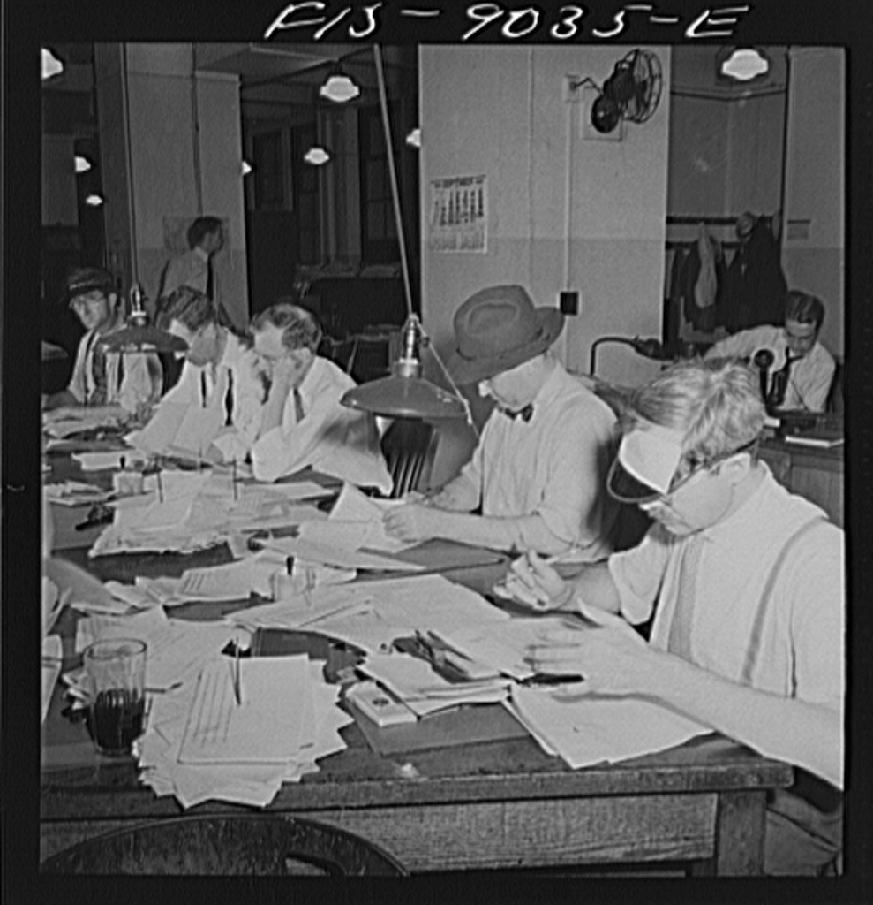

# In New York, a Human Reads the AI

_Beyond labels, all the way to human review and source protection — the data-access boundary the NY FAIR News Act draws_

## Executive Summary

> [!callout]
> New York's legislature passed the FAIR News Act through both chambers. The law does not stop at asking outlets to disclose at the top of the page that a piece was made by AI. Any AI-generated article, audio, image, or video must be reviewed by a person with editorial authority before it is published, and reporters' sources and confidential materials must be technically walled off so AI systems cannot touch them. This piece looks at what those three layered duties define, and at how they diverge from the labeling rule of the EU AI Act, whose enforcement is already close.

> The point is that the place regulation reaches has moved. Where the EU AI Act aimed at the output stage — telling consumers "this was made by AI" — New York's law steps inside the workflow that produces that output. It nails down where a human must intervene, and it designates the data zones AI must not enter. Labor provisions ride along too, barring the use of AI to replace staff or cut wages.

> Governor Kathy Hochul's signature is still pending, and the law would take effect 60 days after she signs. The New York News Publishers Association is pushing back, arguing that forcing newsrooms to carry specific disclosures violates the First Amendment's free-speech protections. In the gap between passage and effect, it is worth reading the signal: law is beginning to dictate, directly, who may lay hands on data.

<!-- stat-card -->
**60 days** — from signature to effect — Awaiting Gov. Hochul's signature

<!-- stat-card -->
**$5,000** — per repeat violation — First violation is $1,000

<!-- stat-card -->
**76%** — of Americans worried about AI stealing news — The public mood behind the bill

<!-- stat-card -->
**3,500+** — U.S. newspapers closed since 2005 — Newsroom staff down ~2/3 in a decade

*▲ The New York Times newsroom, 1942 — copy editors review wire dispatches. Eight decades later, New York State makes human review a legal requirement in the AI era. | Source: [Wikimedia Commons](https://commons.wikimedia.org/wiki/File:Newsroom_of_the_New_York_Times_newspaper._8d22685v.jpg) (Marjory Collins / U.S. Farm Security Administration, 1942 — Public Domain)*

## Three Duties That Go Past the Label

The NY FAIR News Act (formally the New York Fundamental Artificial Intelligence Requirements in News Act) was introduced by State Senator Patricia Fahy and Assembly Member Nily Rozic. Rather than papering over the problems AI brings into the newsroom with a single disclosure, it intervenes at three separate points, each in a different way. Take them one at a time.
