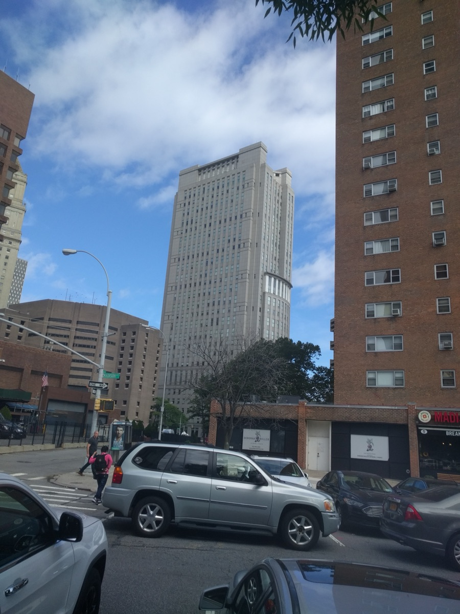

# New York Times Seeks Sanctions Over OpenAI

_The company that said it couldn_

## Executive Summary

> [!callout]
> On July 9, 2026, plaintiff publishers including The New York Times and the New York Daily News moved for sanctions against OpenAI in the Southern District of New York. The motion rests on two claims. First, that for more than two years OpenAI told the court it had no ability to search its training data and ChatGPT output logs for the plaintiffs' works, when in fact it had already built that search capability before the litigation began. Second, that despite a court preservation order, deletion of chatbot conversation logs continued.

> In April 2026 testimony, an OpenAI data privacy engineer said the company had already built a de-identified conversation dataset of roughly 78 million records and was using it to gauge the scale of its own alleged infringement. That collides directly with the "cannot search" position. Meanwhile the court had pegged the total volume of preserved consumer output logs at "in the tens of billions" and ordered a 20-million-record sample — less than 0.05% of the whole — yet the production that arrived was so heavily redacted the court called it "unusable."

> For anyone who runs data, the question this case poses is not about copyright. It is whether you kept your training corpus and output logs searchable and preservable — because that is what determines admissibility. This piece reads the ongoing case along three axes — data lineage, preservation, and observability — and examines why data designed to be deletable reads, in court, as data deliberately hidden.

### Key Figures

Sources: [Bloomberg Law](https://news.bloomberglaw.com/privacy-and-data-security/new-york-times-seeks-sanctions-against-openai-in-copyright-case), [TechCrunch](https://techcrunch.com/2026/07/09/new-york-times-says-openai-hid-evidence-in-chatgpt-copyright-trial/), [Terms.law](https://www.terms.law/2025/11/12/openai-v-new-york-times-stopped-being-just-a-copyright-case-the-moment-the-court-turned-to-your-chatgpt-logs/)

Four numbers carry the weight of this dispute: the total volume of preserved logs the court itself named, the size of the internal search dataset the company held before the suit, the sample the court ordered produced and how small a fraction of the whole it is, and the span of time the "cannot search" position was maintained. Together they make one point — deletion and search are not abstract technical terms here but the variables that decide whether evidence survives at all.

<!-- stat-card -->
**Tens of billions** — Preserved chatbot logs — Total preserved output logs the court fixed at "in the tens of billions"

<!-- stat-card -->
**78 million** — Internal search dataset — De-identified conversation DB used pre-suit to gauge the company's own infringement

<!-- stat-card -->
**20 million** — Court-ordered sample — Under 0.05% of all preserved logs; the production was deemed "unusable"

<!-- stat-card -->
**2+ years** — "Cannot search" position — Time spent telling the court it lacked search capability while holding the tool

## What Is Alleged to Have Been Deleted

On July 9, 2026, plaintiff publishers including The New York Times and the Daily News filed a motion for sanctions against OpenAI in the Southern District of New York (SDNY). The case is a consolidated copyright multidistrict litigation combining several publisher suits (case no. 1:25-md-03143), before Magistrate Judge Ona Wang. What the motion targets is not the familiar copyright question of whether training an AI on their articles was lawful. It is how the evidence has been handled.

Lead counsel for the plaintiffs, Ian Crosby, argues that "for over two years, OpenAI lied to The Times and Daily News plaintiffs, the public, and the Court." The motion splits into two threads. One is concealment: the company represented that it lacked the ability to search its training datasets and output logs for the plaintiffs' works, when in reality it had built and was using that search capability before the suit was even filed. The other is destruction of evidence: that despite the court's preservation order, tens of billions of conversation logs were deleted or compressed into a state that cannot be reconstructed.

The motion defines its own character bluntly: "This is a case about copying. There is no question that it happened." The infringement itself, in the plaintiffs' framing, is not in dispute; what is in dispute is whether the data that would confirm it still exists. The reason the center of gravity has shifted from the copyright merits to discovery is already contained in that sentence.

*▲ The Daniel Patrick Moynihan U.S. Courthouse, home to the Southern District of New York (SDNY) where the sanctions motion was filed | Source: [Wikimedia Commons (Jim.henderson, CC BY-SA 3.0)](https://commons.wikimedia.org/wiki/File:Moynihan_US_courthouse_from_Madison_St_jeh.jpg)*

> [!callout]
> **The point**: In this motion the risk lies not in what the model output, but in whether the data could be preserved and searched. A representation denying search capability, coupled with deletion that continued after the order, turned a copyright dispute into a discovery dispute.

## How a Copyright Suit Became a Discovery Fight

The litigation began in late 2023, when publishers sued OpenAI and Microsoft over the alleged unauthorized training on millions of their articles. The court later ordered OpenAI to preserve, indefinitely, ChatGPT output data across all tiers — Free, Plus, Pro, and Team. The problem came next. The plaintiffs contend that even after this preservation order took effect, deletion and compression of the logs continued.

In November 2025, Judge Ona Wang ordered production of a 20-million-record sample of ChatGPT logs and denied a motion for reconsideration. In that order the judge wrote that the total volume of preserved consumer output logs was "in the tens of billions," and that the 20-million sample was "less than 0.05%" of the whole. The "tens of billions" in the headline is not a publisher's exaggeration but a number the court itself fixed.

From there the timeline runs as follows. In late September 2025, the indefinite preservation obligation for consumer ChatGPT and API data ended, returning to the standard 30-day auto-deletion policy. In December 2025 OpenAI produced the 20-million-record sample, but the redactions were so extensive the court deemed it "unusable." Before the question of infringement could even be argued, whether the evidence that would prove it still existed became the first thing at issue.

*▲ The Manhattan headquarters of The New York Times, one of the lead plaintiff publishers in this case | Source: [Wikimedia Commons (Jdforrester, CC BY 4.0)](https://commons.wikimedia.org/wiki/File:The_New_York_Times_Building_at_sunset,_2021-09-30.jpg)*

> [!callout]
> **Why it matters**: With the preservation order and the alleged deletion that followed now joined, the center of gravity moved from "what was trained on" to "do the logs that would prove it still exist." When evidence disappears, the field tilts before the merits are ever reached.

## 78 Million Records: The Gap Between Capability and Testimony

The basis for the concealment claim is April 2026 testimony. In court-ordered testimony, an OpenAI data privacy engineer stated that the company already had three things in place: a tool to search its training data, a searchable dataset of de-identified ChatGPT conversations, and the ability to search publisher content. In particular, the de-identified conversation dataset of roughly 78 million records was, by this account, already being used by the company to gauge the scale of its own copyright infringement.

The reason this is a problem is simple. A representation that it cannot search, and an internal practice of searching to measure the scale of infringement, cannot both be true. A position that narrowed discovery on the basis of an absence of capability collapses in front of the opposite fact — the existence of that capability. This is exactly the point where the plaintiffs reach for the strong word: "lied."

OpenAI disputes this. A spokesperson said that as "the Times' case weakens and they abandon their claims, they continue trying to invade the privacy of people with nothing to do with this case and are making claims that are demonstrably false." On the preservation order itself, the company had earlier characterized it as an overbroad demand that "fundamentally conflicts with the privacy commitments we have made to our users." One side reads the same deletion as guarding privacy, the other as destroying evidence. That clash of framings is the crux of the case.

*▲ OpenAI, the party at the center of the concealment and destruction-of-evidence claims | Source: [OpenAI (Public domain)](https://openai.com/brand/)*

> [!callout]
> **In one line**: The very fact of having kept data searchable determines the credibility of a "cannot search" defense. The moment you tell a court you cannot reconstruct what you could reconstruct internally, that representation stops being about capability and becomes about intent.

## "Deletable" and "Preserved as Evidence" Are Different Decisions

The signal this case sends to data owners sits outside copyright doctrine. The core is data governance. Whether you kept your training corpus and output logs searchable and preservable is what becomes admissibility. Designing data so it can be deleted at any time, and designing it so it can be reconstructed as evidence when needed, are entirely different engineering decisions. And that decision comes back later as legal exposure.

The dangerous part is that the two designs look identical in ordinary times. Building in 30-day auto-deletion for privacy is a legitimate design. But when the same pipeline keeps running after a preservation order arrives, "data designed to be deletable" reads in court as "data deliberately hidden." Not because the deletion is itself unlawful, but because the design had no switch to stop deleting and shift to preserving.

This is why observability must be a design-time principle, not an after-the-fact compliance response. Only when lineage — a record of what data entered when, how it was processed, and when it was deleted — is built into the pipeline can you answer, the moment a preservation order lands, "what we hold, where, and in what state." An organization that has not prepared that answer will find that even a faithfully executed deletion policy is suspected of concealment.

> [!callout]
> **What changed**: Data lineage, preservation, and searchability are now closer to a legal obligation than an engineering virtue. Fail to put observability in at design time rather than after the fact, and the very record that would distinguish legitimate deletion from spoliation is never kept.

## What Practitioners Should Check Now

This case is still in progress. Whether sanctions will actually be imposed, or whether a spoliation instruction telling the jury about the destruction of evidence will be adopted, has not been decided. But regardless of outcome, what an organization that runs data needs to check now is clear. It starts with confirming whether your own pipeline has these three things.

- •**A link between retention policy and legal hold**: When a preservation order or legal hold takes effect, is there an automated switch that immediately stops auto-deletion of the relevant data? If a human has to hand-search the pipeline, it is already too late.
- •**An audit trail that can be reconstructed later**: For your training corpus and output logs, does a lineage record survive that lets you reconstruct, after the fact, what entered when, how it was processed, and when it was deleted?
- •**Documentation of deletion decisions**: When the two readings — "deletion = privacy" and "deletion = spoliation" — collide, is there a record explaining why that data was deleted at that moment?

The three items share one thing: you cannot build them after you need them. A preservation order arrives without warning, and a record that does not exist at that moment cannot be created retroactively. The practical lesson this case leaves is to keep observability and lineage as defaults in your everyday pipeline, not as crisis-response tools. Only an organization that designs data to be deletable and, alongside it, designs the ability to explain how it was deleted can defend itself on the line between deletion and concealment.

> [!callout]
> **To close**: The next question a court, a regulator, or an audit team asks will not be "did you delete that data" but "can you explain how you deleted it." Only an organization that planted observability at design time can answer that question with a record.

## References

### Industry & Press

- 1.Bloomberg Law. (2026). "[New York Times Seeks Sanctions Against OpenAI in Copyright Case](https://news.bloomberglaw.com/privacy-and-data-security/new-york-times-seeks-sanctions-against-openai-in-copyright-case)." _Bloomberg Law_. — Coverage of the July 9, 2026 sanctions motion.
- 2.TechCrunch. (2026). "[New York Times says OpenAI hid evidence in ChatGPT copyright trial](https://techcrunch.com/2026/07/09/new-york-times-says-openai-hid-evidence-in-chatgpt-copyright-trial/)." _TechCrunch_. — Source for the data privacy engineer's testimony and the 78-million-record de-identified conversation dataset.
- 3.The Washington Times. (2026). "[News outlets urging judge to sanction OpenAI in high-stakes AI copyright case](https://www.washingtontimes.com/news/2026/jul/9/news-outlets-urging-judge-sanction-openai-high-stakes-ai-copyright/)." _The Washington Times_. — Summary of the motion and the relief the plaintiffs seek.
- 4.Terms.law. (2025). "[OpenAI v. New York Times stopped being just a copyright case the moment the court turned to your ChatGPT logs](https://www.terms.law/2025/11/12/openai-v-new-york-times-stopped-being-just-a-copyright-case-the-moment-the-court-turned-to-your-chatgpt-logs/)." _Terms.law_. — Background on the 20-million-record log order and the judge's "0.05%" remark.
- 5.MediaNama. (2026). "[Why The New York Times Wants The Court To Sanction OpenAI](https://www.medianama.com/2026/07/223-why-the-new-york-times-wants-court-sanction-openai/)." _MediaNama_. — Case background and motion summary (cross-check).

### Primary Documents

- 6.OpenAI. (2025). "[Response to the New York Times' data demands in order to protect user privacy](https://openai.com/index/response-to-nyt-data-demands/)." _OpenAI_. — OpenAI's official position framing the preservation order as a privacy intrusion (primary source).
