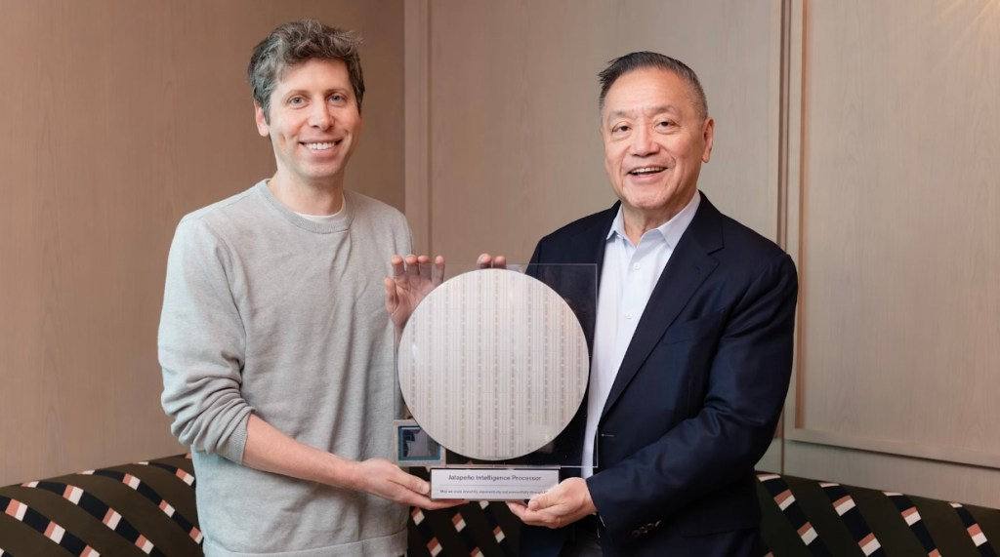

# OpenAI Shipped Its First Custom Inference Chip in Nine Months

_Jalapeño, built with Broadcom — the model helps design the chip, and the chip runs the next model cheaper_

## Executive Summary

> [!callout]
> OpenAI has unveiled Jalapeño, its first custom inference chip, built together with Broadcom. It's a signal that the company that builds models has started laying the very floor those models run on. The more telling part isn't the chip's specs, but the structure underneath: OpenAI designing its own infrastructure with its own model.

> The number that stands out is nine months. A large ASIC normally takes a year and a half to two years to go from a blank sheet to tape-out, and OpenAI says it compressed that to nine months by putting its own language model to work on design optimization. The model shapes part of the chip it will run on, and once that chip is finished it runs the next model more cheaply. That said, the roughly 50% reduction in inference cost is still OpenAI's own claim based on pre-production samples, and full deployment isn't scheduled until the first half of 2028.

> Behind the efficiency story comes the cost of closure. When chip design, model training, and serving all converge inside a single company, who audits the data, the evaluations, and the verifications that circulate within it? Vertical integration grows that efficiency fast, and this question grows at the same pace.

### Key Numbers

Sources: [TechCrunch](https://techcrunch.com/2026/06/24/openai-unveils-its-first-custom-chip-built-by-broadcom/), [OpenAI](https://openai.com/index/openai-broadcom-jalapeno-inference-chip/)

Four numbers form the spine of this announcement. Cost ($8.4B) says why the chip was built; size (~840mm²) says what was built; the development window (nine months) says how fast; and the savings target (~50%) says what it's aiming for. The subject of this piece isn't the spec sheet of a single chip but the way these four interlock.

<!-- stat-card -->
**9 months** — Design → tape-out — A large ASIC that normally takes 1.5–2 years, done in one pass

<!-- stat-card -->
**$8.4B** — 2025 infrastructure cost — Projected to climb to $14B in 2026

<!-- stat-card -->
**~840mm²** — Die size — A reticle-sized chip near the EUV limit

<!-- stat-card -->
**~50%** — Inference cost reduction target — OpenAI's own claim, based on pre-production samples

*▲ OpenAI CEO Sam Altman (left) and Broadcom CEO Hock Tan with the Jalapeño Inference Processor wafer | Source: [TechCrunch](https://techcrunch.com/2026/06/24/openai-unveils-its-first-custom-chip-built-by-broadcom/)*

## An $8.4 Billion Bill

To understand why OpenAI decided to build a chip of its own, start with the bill. Its 2025 server operating costs ran to roughly $8.4 billion, and in 2026 that figure is expected to swell to as much as $14 billion. Every question that 900 million weekly active users throw at it each day is an inference computation, and most of those computations run on Nvidia GPUs.

The problem is the margin on those GPUs. Nvidia's high-end accelerators are reported to carry profit margins of around 75%. In other words, a large share of what OpenAI spends on inference leaks out as the margin it pays to buy chips. The more users it gains, the heavier this structure becomes. However smart a model gets, if every turn of that intelligence has to prop up someone else's margin, the economics struggle to hold.

Other companies have walked this path first. Google designs its own TPUs, and Amazon its own Trainium and Inferentia, running their workloads on their own silicon. Owning the chip lets a company control its cost per inference and stay free of an outside supplier's schedule and pricing. OpenAI's Jalapeño is its first step into that current.

*▲ Google's TPU v4 board — the custom AI accelerator precedent that big tech walked first. OpenAI's Jalapeño is its first step into that current | Source: [Wikimedia Commons](https://commons.wikimedia.org/wiki/File:TPU_v4.png) (CC BY 4.0)*

## A First Chip in Nine Months

Jalapeño is a large ASIC designed purely for inference. Broadcom handled the design, and production runs on TSMC's 3nm process. The die measures about 840mm², pressed right up against the reticle limit (about 858mm²) of what an EUV scanner can print in a single shot. It pairs a systolic-array structure similar to Google's TPU with six to eight HBM3 or HBM4 memory modules — a chip tailored wholesale to inference workloads. Training still belongs to Nvidia GPUs; Jalapeño concentrates on running finished models fast and cheap.

The most unusual part is the speed of development. From a blank design to tape-out, a large ASIC usually takes a year and a half to two years. OpenAI says it finished the process in nine months and described it as the shortest development cycle in the history of high-performance semiconductors. The secret behind that speed leads straight into the heart of this piece.

*▲ Google TPU 3.0 board — a systolic-array inference accelerator with liquid cooling. Jalapeño adopts a similar architecture paired with HBM3/4 memory modules | Source: [Wikimedia Commons](https://commons.wikimedia.org/wiki/File:Tensor_Processing_Unit_3.0.jpg)*

The person who led the design is Richard Ho, OpenAI's head of hardware. He was a key contributor to Google's early TPU work, and that experience of quickly building inference accelerators carried over directly. The deployment timeline runs to a small-scale prototype in late 2026, mass production in 2027, and full operation in the first half of 2028 — and Microsoft is reported to have agreed to buy 40% of the initial production.

> [!callout]
> **The core**: Jalapeño is a chip built to control the cost of inference. It is optimized for serving rather than training, and the nine-month development speed itself hints at what OpenAI built the chip with.

## The Model Shapes the Chip, the Chip Runs the Model

When asked what made nine months possible, OpenAI pointed directly to its own language model. Chip design is the work of optimizing tens of millions of circuit placements and timings, and OpenAI says it automated much of that optimization with its own model. In effect, the model shaped part of the chip it would run on. The model-as-design-tool makes the hardware, and once that hardware is finished it runs the next generation of models more cheaply.

The meaning becomes clear once you imagine the loop completing a full turn. Cheaper inference enables more experiments and more training cycles, and a model improved that way designs the next chip better. Software makes hardware, and hardware in turn grows software — a feedback loop. That's why this circular structure, more than the spec sheet of a single chip, is the story likely to outlast the news.
