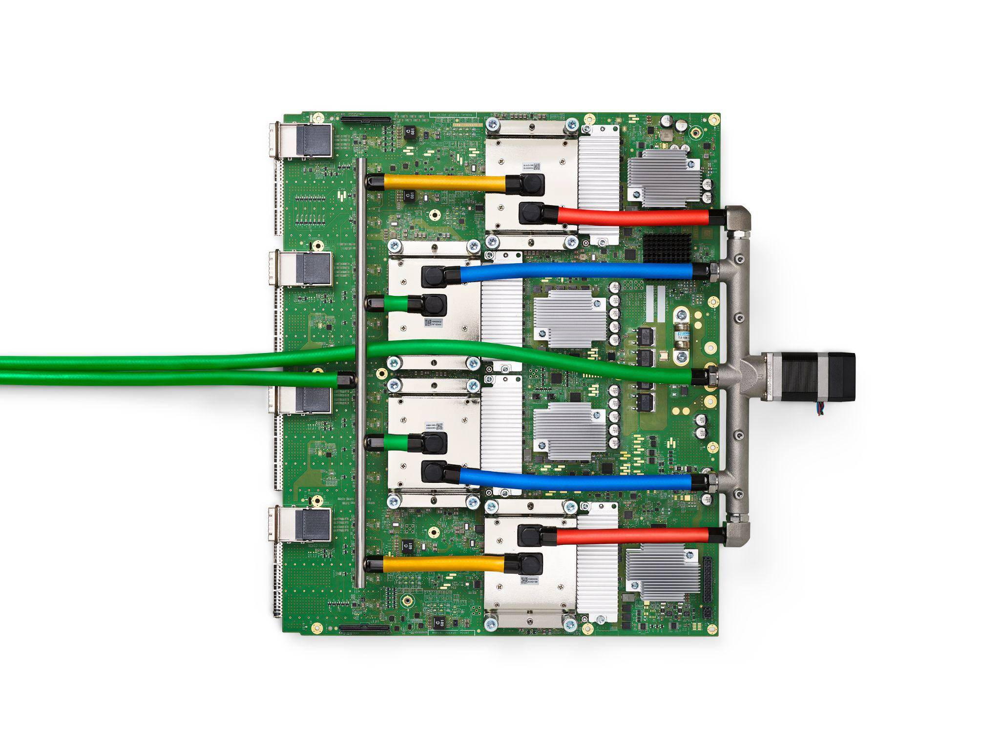
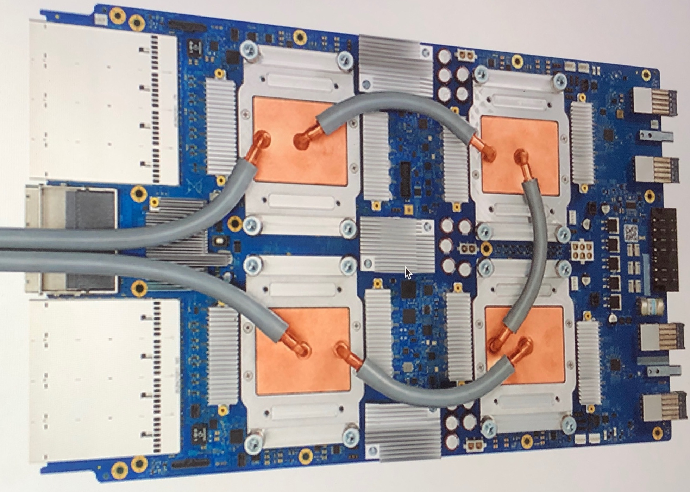

# 9개월 만에 나온 오픈AI의 첫 자체 추론 칩

_브로드컴과 만든 Jalapeño — 모델이 칩 설계에 참여하고, 칩이 다음 모델을 더 싸게 돌린다_

## Executive Summary

> [!callout]
> 오픈AI가 브로드컴과 함께 만든 첫 자체 추론 칩 Jalapeño를 공개했습니다. 모델을 만들던 회사가 이제 그 모델이 돌아갈 바닥까지 직접 깔기 시작했다는 신호입니다. 정작 눈여겨볼 대목은 칩의 스펙이 아니라, 오픈AI가 자기 모델로 자기 인프라를 설계했다는 구조입니다.

> 가장 눈에 띄는 숫자는 9개월입니다. 백지 설계에서 테이프아웃까지 보통 1년 반에서 2년이 걸리는 대형 ASIC을, 오픈AI는 자체 언어 모델을 설계 최적화에 동원해 9개월로 줄였다고 밝혔습니다. 모델이 자신이 돌아갈 칩의 일부를 빚고, 그 칩이 완성되면 다음 모델을 더 싸게 굴립니다. 다만 추론 비용 절반이라는 수치는 아직 사전 생산 샘플 기준의 자체 주장이고, 풀 가동은 2028년 상반기로 잡혀 있습니다.

> 효율의 이야기 뒤에는 폐쇄성의 비용이 따라옵니다. 칩 설계와 모델 학습, 그리고 서빙이 모두 한 회사 안으로 수렴할 때, 그 안에서 도는 데이터와 평가와 검증은 누구의 눈으로 감리되는가. 수직 통합이 빠르게 키우는 효율과 함께, 이 질문도 같은 속도로 자랍니다.

### 주요 수치

출처: [TechCrunch](https://techcrunch.com/2026/06/24/openai-unveils-its-first-custom-chip-built-by-broadcom/), [OpenAI](https://openai.com/index/openai-broadcom-jalapeno-inference-chip/)

아래 네 숫자가 이번 발표의 뼈대입니다. 왜 칩을 만들었는지는 비용($8.4B)이 말하고, 무엇을 만들었는지는 크기(~840mm²)가, 얼마나 빨랐는지는 개발 기간(9개월)이, 무엇을 노리는지는 절감 목표(~50%)가 말합니다. 칩 한 장의 스펙이 아니라 이 네 가지가 맞물리는 방식이 이 글의 주제입니다.

<!-- stat-card -->
**9개월** — 설계→테이프아웃 — 보통 1.5~2년 걸리는 대형 ASIC을 단번에

<!-- stat-card -->
**$8.4B** — 2025년 인프라 비용 — 2026년엔 $14B로 늘어날 전망

<!-- stat-card -->
**~840mm²** — 다이 크기 — EUV 레티클 한계에 근접한 초대형 칩

<!-- stat-card -->
**~50%** — 추론 비용 절감 목표 — 사전 생산 샘플 기준 자체 주장

*▲ 오픈AI CEO 샘 알트먼(왼쪽)과 브로드컴 CEO 호크 탄이 Jalapeño 추론 프로세서 웨이퍼를 들고 있다 | Source: [TechCrunch](https://techcrunch.com/2026/06/24/openai-unveils-its-first-custom-chip-built-by-broadcom/)*

## 8.4조 원짜리 청구서

오픈AI가 칩을 직접 만들기로 한 이유를 이해하려면 청구서부터 봐야 합니다. 2025년 서버 운영비는 약 84억 달러, 우리 돈으로 11조 원이 넘었습니다. 2026년에는 이 숫자가 140억 달러까지 불어날 것으로 예상됩니다. 주간 활성 사용자 9억 명이 매일 던지는 질문 하나하나가 추론 연산이고, 그 연산은 대부분 엔비디아 GPU 위에서 돌아갑니다.

문제는 그 GPU의 마진입니다. 엔비디아의 고성능 가속기는 이익률이 약 75%에 이르는 것으로 알려져 있습니다. 다시 말해 오픈AI가 추론에 쓰는 비용의 상당 부분이 칩을 사 오는 마진으로 빠져나갑니다. 사용자가 늘수록 이 구조는 더 무거워집니다. 모델이 아무리 똑똑해져도, 그 똑똑함을 한 번 굴릴 때마다 남의 마진을 떠받쳐야 한다면 수익 구조가 버티기 어렵습니다.

같은 길을 먼저 걸은 회사들이 있습니다. 구글은 TPU를, 아마존은 Trainium과 Inferentia를 직접 설계해 자사 워크로드를 자기 실리콘 위에서 돌립니다. 칩을 직접 쥐면 단위 추론당 비용을 통제할 수 있고, 외부 공급사의 일정과 가격에 휘둘리지 않습니다. 오픈AI의 Jalapeño는 그 흐름에 합류하는 첫걸음입니다.

*▲ 구글 TPU v4 보드 — 빅테크가 먼저 걸은 자체 AI 가속기 설계의 선례. 오픈AI Jalapeño는 이 흐름에 합류하는 첫걸음이다 | Source: [Wikimedia Commons](https://commons.wikimedia.org/wiki/File:TPU_v4.png) (CC BY 4.0)*

## 9개월 만에 나온 첫 칩

Jalapeño는 추론 전용으로 설계된 대형 ASIC입니다. 설계는 브로드컴이 맡고 생산은 TSMC의 3nm 공정에서 이뤄집니다. 다이 크기는 약 840mm²로, EUV 노광기가 한 번에 찍을 수 있는 레티클 한계(약 858mm²)에 바짝 붙어 있습니다. 구글 TPU와 비슷한 시스톨릭 어레이 구조에 HBM3 또는 HBM4 메모리 모듈을 6~8개 얹은, 추론 워크로드에 통째로 맞춘 칩입니다. 학습은 여전히 엔비디아 GPU의 몫이고, Jalapeño는 완성된 모델을 빠르고 싸게 굴리는 데 집중합니다.

가장 이례적인 대목은 개발 속도입니다. 백지 설계에서 테이프아웃까지 대형 ASIC은 보통 1년 반에서 2년이 걸립니다. 오픈AI는 이 과정을 9개월로 끝냈다고 밝혔고, 스스로 고성능 반도체 역사상 가장 짧은 개발 사이클이라고 표현했습니다. 이 속도의 비밀이 이 글의 핵심으로 이어집니다.

*▲ 구글 TPU 3.0 보드 — 시스톨릭 어레이 구조의 AI 추론 전용 가속기. Jalapeño도 이와 유사한 아키텍처에 HBM3/4 메모리를 얹은 형태다 | Source: [Wikimedia Commons](https://commons.wikimedia.org/wiki/File:Tensor_Processing_Unit_3.0.jpg)*

설계를 이끈 사람은 오픈AI 하드웨어 책임자 리처드 호입니다. 그는 구글 초기 TPU 개발의 핵심 기여자였습니다. 추론 전용 가속기를 빠르게 만들어 본 경험이 그대로 옮겨 온 셈입니다. 배포 일정은 2026년 말 소규모 프로토타입, 2027년 양산, 2028년 상반기 풀 가동으로 잡혀 있고, 마이크로소프트가 초기 생산분의 40%를 사기로 한 것으로 전해집니다.

> [!callout]
> **핵심**: Jalapeño는 추론 비용을 통제하기 위한 칩입니다. 학습이 아니라 서빙에 최적화됐고, 9개월이라는 개발 속도 자체가 오픈AI가 무엇으로 칩을 만들었는지를 암시합니다.

## 모델이 칩을 빚고, 칩이 모델을 굴린다

9개월이 가능했던 비결로 오픈AI가 직접 든 것은 자기 언어 모델입니다. 칩 설계는 수천만 개의 회로 배치와 타이밍을 최적화하는 작업인데, 오픈AI는 이 최적화 과정의 상당 부분을 자체 모델로 자동화했다고 밝혔습니다. 모델이 자신이 돌아갈 칩의 일부를 직접 빚은 셈입니다. 설계 도구로서의 모델이 하드웨어를 만들고, 그 하드웨어가 완성되면 다음 세대 모델을 더 싸게 굴립니다.

이 구조가 한 바퀴 돌면 어떻게 되는지를 생각해 보면 의미가 분명해집니다. 더 싼 추론은 더 많은 실험과 더 많은 학습 사이클을 가능하게 하고, 그렇게 개선된 모델은 다음 칩을 더 잘 설계합니다. 소프트웨어가 하드웨어를 만들고, 하드웨어가 다시 소프트웨어를 키우는 피드백 루프입니다. 칩 한 장의 스펙보다 이 순환 구조가 더 오래 남을 이야기인 이유입니다.
