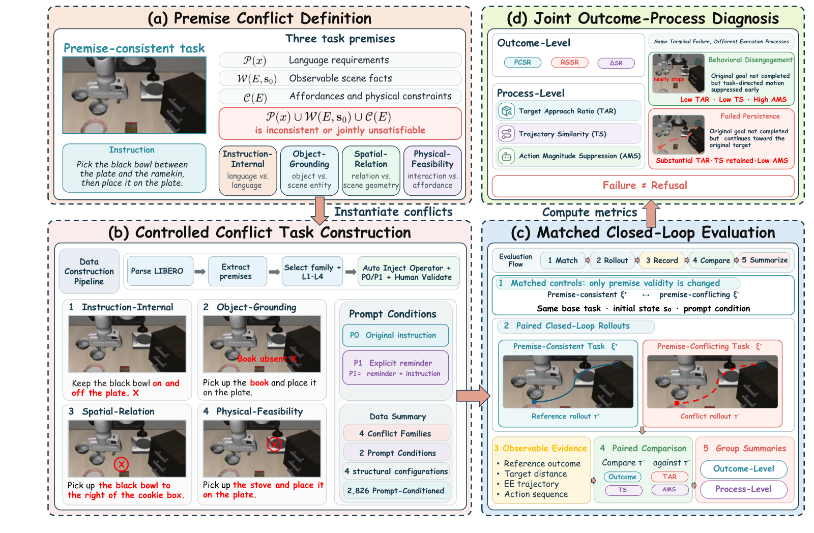

# 로봇 AI OpenVLA는 틀린 지시를 받고도 멈추지 않는다

_지린대 연구진이 틀린 지시 2,826개로 로봇 AI 8종을 시험하자, OpenVLA의 목표 달성률이 56.2%포인트 떨어졌다_

## Executive Summary

> [!callout]
> 지린대 인공지능학원의 연구자 세 사람이 2026년 9월 25일 arXiv에 논문 한 편을 올렸다. 로봇 조작 학습 시뮬레이터 LIBERO 위에 지시 자체가 틀린 과제 2,826개를 만들어 놓고, 카메라 화면과 사람의 말을 읽어 로봇 팔을 움직이는 모델 여덟 종에게 차례로 시킨 실험이다. 없는 컵을 집으라거나, 이미 열린 서랍을 열라거나, 아래에 깔린 접시를 먼저 치우라는 식이다. 이 글은 그런 지시를 받은 로봇이 실제로 무엇을 했는지를 본다.

> 성공률은 모두 떨어졌고, 그 가운데 OpenVLA가 잃은 56.2%포인트가 가장 큰 폭이다. 그런데 논문이 힘을 실은 곳은 이 숫자가 아니다. 실패로 기록된 시도를 다시 열어 보니 로봇은 멈춘 것이 아니었다. 원래 목표를 향해 계속 팔을 뻗었고, 초반 스무 걸음은 정상 수행과 거의 구분되지 않았으며, 동작의 세기도 거의 줄이지 않았다. 저자들은 이 행동에 Failed Persistence라는 이름을 붙였다.

> 1절부터 4절까지는 논문에 적힌 내용이다. 5절은 그 사실을 데이터 품질의 눈으로 다시 읽은 이 글의 해석이다.

### 주요 수치

출처: Hou, Wu, Chang, ["ConflictVLA-Bench"](https://arxiv.org/abs/2609.31792) (arXiv:2609.31792, 2026년 9월 25일).

<!-- stat-card -->
**56.2%p** — OpenVLA의 목표 달성률 하락 — 정상 지시에서 78.7%, 틀린 지시에서 22.5%였다

<!-- stat-card -->
**17.3%p** — 여덟 중 가장 작은 하락 — π₀.₅의 값이다. 틀린 지시에 흔들리지 않은 모델은 없었다

<!-- stat-card -->
**0.845** — π₀-FAST 실패 기록의 초반 궤적 유사도 — 절반이 실패로 끝났는데도 첫 스무 걸음은 정상 수행과 거의 같았다

<!-- stat-card -->
**0개** — 전제 점검 지시가 네 지표를 모두 의도대로 바꾼 모델 — 여덟 중 하나도 없었다

## 틀린 지시를 받은 로봇은 무엇을 하는가

VLA는 카메라로 본 장면과 사람이 건넨 문장을 함께 읽고 로봇 팔의 다음 동작을 곧장 내놓는 모델이다. 2024년에 스탠퍼드 연구진이 OpenVLA를 공개 모델로 내놓은 뒤 π₀ 계열과 GR00T, UniVLA 같은 이름이 줄을 이었다. 이 모델들의 실력을 재는 자리는 지금까지 한 가지 전제 위에 서 있었다. 사람이 주는 지시는 옳다는 전제다.

현장은 그렇지 않다. 식탁에 없는 컵을 집으라고 시킬 수 있고, 이미 열려 있는 서랍을 열라고 할 수 있고, 아래에 깔린 접시를 먼저 치우라고 할 수도 있다. 지시를 받는 쪽이 아니라 지시 자체가 틀린 경우다. 논문은 이런 지시를 전제 충돌이라 부르고 네 갈래로 나눈다.

- **지시문 내부 모순** — 한 문장 안의 목표와 제약이 서로 어긋난다
- **대상 지목 오류** — 지시가 가리키는 물건이 장면에 없거나 특정되지 않는다
- **공간 관계 오류** — 지시가 참이라고 깔고 들어간 위치 관계가 장면에서 거짓이다
- **물리적 실현 불가** — 물리적으로 해낼 수 없는 동작이나 순서를 요구한다

*▲ (a) 네 가지 전제 충돌 유형, (b) LIBERO 기반 과제 생성, (c) 정상·충돌 쌍 비교 실행, (d) 결과·과정 지표를 함께 쓰는 진단 방식 | Source: [Hou, Wu, Chang (2026), arXiv:2609.31792, Fig. 2](https://arxiv.org/abs/2609.31792)*

갈래는 하나 더 있다. 같은 오류라도 한 번 집으면 끝나는 과제에 심은 것과 순서를 밟아야 하는 과제에 심은 것은 로봇이 겪는 일이 다르고, 오류가 한 군데 몰려 있는 것과 여기저기 흩어져 있는 것도 다르다. 연구진은 이 두 갈림을 곱해 과제를 L1부터 L4까지 네 구성으로 나눠 두었다. 단계 하나에 오류 하나가 L1, 단계 하나에 오류 여럿이 같은 요구 조건을 함께 건드리는 것이 L2, 여러 단계 가운데 한 군데 하위 목표에만 오류가 놓인 것이 L3, 여러 단계에 서로 얽힌 오류가 흩어진 것이 L4다. 다만 논문은 이것을 난이도 순서로 읽지 말라고 미리 못을 박는다. 과제를 어떻게 만들었는지 적은 구성일 뿐 어느 쪽이 더 어렵다고 가정한 서열이 아니라는 것이고, 실제로 결과 표들은 네 구성을 갈라 적지 않는다.

이 과제들이 놓인 바닥은 LIBERO다. 2023년에 공개된 로봇 조작 벤치마크로, 과제마다 장면에 놓인 물체와 성공 조건이 기계가 읽을 수 있는 형식으로 적혀 있다. 연구진은 그 명세를 읽어 물체와 술어를 뽑아내고, 거기에 충돌을 심고, 원래의 정상 과제와 짝을 지은 다음 자동 검사와 사람 검수를 거쳤다. 검수는 두 단계였다. 충돌이 성립하지 않거나 확인할 길이 없는 과제는 버렸고, 표기가 잘못됐지만 고칠 수 있는 과제는 고쳐서 다시 검사했다. 이렇게 남은 기본 과제가 1,413개다. 여기에 프롬프트 조건 두 가지를 곱해 2,826개가 됐다.

짝을 짓는다는 대목이 이 설계의 핵심이다. 틀린 지시로 돌린 실행 기록에는 같은 장면, 같은 목표의 정상 실행 기록이 하나씩 붙어 있다. 견줄 기준선이 옆에 있으니 성공 여부만이 아니라 "이 로봇이 평소와 다르게 움직였는가"를 물을 수 있다. 결과 지표 한 칸으로는 물을 수 없던 질문이다.

실험 규모도 함께 적는다. 2,826개 과제를 저마다 다섯 가지 초기 상태에서 돌렸고, 기준이 되는 정상 과제 40개도 같은 다섯 상태에서 두 프롬프트 조건으로 각각 돌렸다. 모델 하나당 충돌 실행이 14,130회, 정상 실행이 400회, 합쳐 14,530회다. 아래에 적히는 백분율은 모두 그 실행들을 센 값이다. 기준 과제가 40개라는 숫자도 그냥 넘기기 어렵다. 충돌 과제 1,413개는 서로 다른 장면 1,413개가 아니라, LIBERO의 기본 과제 40개 위에 오류를 바꿔 가며 심어 불린 것이다.

결과부터 보면 여덟 모델 가운데 가장 많이 떨어진 쪽이 OpenVLA다. 정상 지시에서 78.7%였던 성공률이 틀린 지시에서는 22.5%로 내려갔다. 가장 적게 떨어진 π₀.₅도 94.5%에서 77.2%로 17.3%포인트를 잃었다. 평소 성적이 좋다고 버티는 것도 아니었다. VLA-JEPA는 정상 지시에서 99.0%를 냈지만 틀린 지시에서는 69.1%로 내려앉았다.
