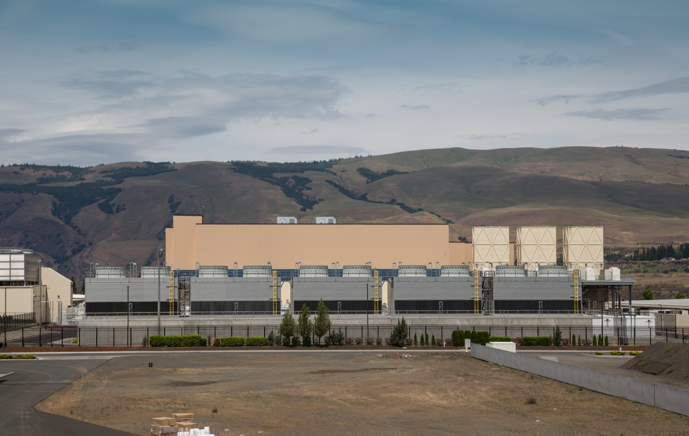

# When an AI Data Center Runs Late, Who Pays for the Wait?

_Oracle told the developer of its New Mexico campus that it can put off rent for up to three years, saying the electricity will arrive late_

## Executive Summary

> [!callout]
> On September 24, 2026, Oracle sent a force majeure notice to the developer of the large AI data center it has agreed to occupy in New Mexico. Force majeure is a clause written into a contract ahead of time, and it limits what one side owes when circumstances outside its control keep it from performing. The circumstance Oracle named is electricity. This campus is not taking power from the grid outside its fence. It is supposed to make up to 2.45 gigawatts on site in a plant of its own, and the gas pipeline and the air permit that plant depends on are both running behind the dates the contract assumes. This article reads the notice not as one bad week for one company but as a case showing where a delay on the ground travels once a contract picks it up.

> What the notice changes is timing rather than amount. If the 2028 start falls through, Oracle can push back the date rent begins by as much as three years. Other costs keep running during that stretch, and the total rent, once payments begin, is exactly what the original lease already set. Nothing is forgiven; it is postponed. The market that moved first was credit, not equity. Roughly 20 banks put $18 billion behind this campus, and once the notice became public that debt was changing hands at 89 to 91 cents on the dollar.

> Sections 1 through 4 follow what reporting and the public record hold. Section 5, which carries the event over to the delay risk that has no price yet in the AI services we pay for, is this article's own reading.

### Key Numbers

Sources: reporting by [TechCrunch](https://techcrunch.com/2026/09/24/oracle-sends-force-majeure-notice-on-its-new-mexico-stargate-data-center/), [CNBC](https://www.cnbc.com/2026/09/24/oracle-data-center-force-majeure.html) and the [Santa Fe New Mexican](https://www.santafenewmexican.com/las_cruces/local_news/oracle-sends-force-majeure-notice-to-project-jupiter-developers-to-protect-itself-from-liability/article_ecdbb097-66d9-49eb-9436-95fe7b6a2eec.html) (September 24–25, 2026), plus a [Reuters analysis](https://finance.yahoo.com/technology/ai/articles/analysis-oracle-blue-owl-project-225500245.html). The loan price is a Financial Times figure that several outlets picked up.

<!-- stat-card -->
**2.45GW** — Power capacity at Project Jupiter — Four buildings on roughly 1,400 acres. The electricity is to be made on site by fuel cells, and that plant has no permit yet

<!-- stat-card -->
**3 years** — Longest the rent can be deferred — If the start slips past 2028, payments begin later. The total does not shrink, and the landlord waits for it

<!-- stat-card -->
**$18 billion** — Lent by about 20 banks — A facility with Santander and Jefferies among the lenders. A slipped schedule lands here as real exposure

<!-- stat-card -->
**89–91 cents** — Price of that debt after the notice — That is under the $1 of face value. Credit markets put a price on the delay before anyone else did

## One Letter, Three Stocks Down the Same Day

The setting is Santa Teresa, in Doña Ana County at the southern edge of New Mexico, near El Paso, Texas and the Mexican border. On roughly 1,400 acres of desert, four buildings adding up to 2.45 gigawatts are going up under the name Project Jupiter. Building it are STACK Infrastructure, owned by Blue Owl Capital, together with BorderPlex Digital Assets. The party that agreed to rent the finished buildings whole is Oracle, named anchor tenant of the campus in January 2026. Much of the compute that runs there is meant for OpenAI, and the campus belongs to Stargate, the buildout Oracle, OpenAI and SoftBank are pursuing together. The developers have put the total investment plan at as much as $165 billion.

*▲ A representative large AI data center campus (Google's facility in The Dalles, Oregon — not the actual Project Jupiter site) | Source: [Wikimedia Commons (Tony Webster, CC BY 2.0)](https://commons.wikimedia.org/wiki/File:Google_Datacenter_-_The_Dalles,_Oregon_(17832143871).jpg)*

On Thursday, September 24, Bloomberg reported first that Oracle had sent this developer a force majeure notice. The claim inside it is that if power commitments are missed and the 2028 start falls through, Oracle will defer rent payments for up to three years. Markets answered quickly. Oracle fell almost 5% early in the session and closed down more than 3%, and Blue Owl Capital, the developer's parent, lost 3.6%. Bloom Energy, which is to supply the campus with fuel cells, dropped about 6%. News touching one clause of a contract pulled down the share price of a company that sells power equipment.

Official statements from both sides point the same direction. Oracle said "Project Jupiter remains on our planned schedule. We are fully committed to New Mexico and confident in our path forward." A spokesman added a point about what the document is for. "Force-majeure notices are commonplace in developments of this scale and are often used to preserve contractual rights among project partners," he said. "They do not, by themselves, establish a project delay or change delivery expectations." A spokesperson for STACK Infrastructure wrote that "Blue Owl, STACK Infrastructure and Oracle remain fully aligned on Project Jupiter. This notice does not change the financial commitments to this multiyear project."

> [!callout]
> So this notice is not news that Oracle is walking away. It is not a declaration that the contract is broken, and it is not a signal that the project has collapsed. Oracle pulled one risk-sharing clause, present in the contract from the start, toward its own side. Three stocks still fell the same day. That prices changed when nothing moved except a clause is what shows how much the clause carries.

## Oracle Is Locked Into This Lease

This is not a lease the tenant can cancel partway through. Blue Owl put roughly $3 billion of equity into the project, and the contract makes Oracle responsible for the cost of the debt raised to put up the buildings. Capital and borrowing hold each other in place, and there is no exit door for the tenant. So Oracle's remaining option is not to leave but to move time.

What changes if the notice holds? Should the 2028 target fail, the first rent payment can land three years later than the lease intended. Costs other than rent keep going out through that period. And once payments begin, Oracle owes rent for the entire term written into the original lease. The sum the developer collects does not shrink. What shrinks is what that money is worth by the time it arrives.

One more condition attaches here. By Bloomberg's account, the three-year deferral is not settled by the fact that Oracle sent a notice. It takes effect only if Oracle and Blue Owl agree that a force majeure event tied to meeting power commitments did occur. The notice is the document that opens that negotiation, not its conclusion.

Where the burden lands in this structure is visible in how Blue Owl earns. Through the development phase, while the buildings go up, Blue Owl takes a 9% annual return on the equity it committed. Once the buildings are done and the tenant moves in, higher rent begins arriving. If Oracle invokes force majeure and stretches out the development phase, Blue Owl stays longer at the lower return. It collects in the end, just later. The money has not disappeared; the waiting got longer, and somebody pays for that wait.

> [!callout]
> Doing this job is what a force majeure clause exists for. It decides in advance how to split the burden when one side cannot perform for reasons it could not help. What is new here is not the clause but the fact that the schedule has slipped far enough for somebody to reach for it.

Whether it can be reached for now is itself contested. By the account of the Legal Information Institute at Cornell Law School, force majeure is typically invoked for extraordinary events known as acts of God, such as fires, floods or war. Mariel Nanasi, executive director of the Santa Fe-based New Energy Economy, questions whether it fits here. "I question whether that claim is actually applicable and real in this situation," she said. "It's got to be unforeseeable ... and this is completely foreseeable." Which way that question is answered decides who carries the cost of three years.

## The Electricity Is Running Behind the Contract

Under the contract, securing the power for this campus is understood to be Oracle's responsibility, according to sources cited by Reuters. And that power is late. The reason is neither silicon nor capital, but things you bury in the ground and clear on paper.

Where does that electricity come from? This campus does not draw it from an outside grid. Oracle and its partners plan to install a huge array of Bloom Energy fuel cells on the site, produce up to 2.45 gigawatts there, and feed those cells natural gas delivered through a newly built pipeline. Bloom Energy, whose stock slid the day the notice surfaced, is the company supplying the cells for that plant. Neither the plant nor the pipeline has yet been approved.

*▲ Bloom Energy fuel cell server units. The on-site plant planned for Project Jupiter runs on the same class of equipment | Source: [Wikimedia Commons (CC BY 2.0)](https://commons.wikimedia.org/wiki/File:Bloom_Energy_Servers.jpg)*

First the pipeline. Transwestern Pipeline, a subsidiary of the Dallas-based Energy Transfer, is laying the roughly 18-mile Green Chile pipeline. The route has to cross a 0.6-mile stretch of state trust land, and the New Mexico State Land Office has twice rejected the crossing application, arguing that the pipeline would not benefit state lands. A revised route went back in during August, but the date gas starts flowing has moved from September 2026 to February 2027, close to six months. At the federal level the review has advanced. Staff at the Federal Energy Regulatory Commission completed an environmental assessment of the pipeline this month and concluded that approving it would not harm the environment. That is not a final approval, and public comment on the review stays open through October 5.

Second the air permit. The New Mexico Environment Department has not yet issued the air quality permit needed to run the fuel cell plant. The decision deadline stands at November 23, 2026. A public hearing due to start this month sat on hold for weeks because opponents of the project went to court. That litigation is the third item. In suits brought by environmental groups over water and air permits, the New Mexico Supreme Court paused the permitting proceedings and then, in a September 17, 2026 decision, allowed them to continue. Resuming does not mean moving faster. The state has still not named a hearing examiner and has not set a hearing date.

How much all of this has pushed the schedule depends on who is counting. One source cited by Reuters said the power delay is holding the whole project back by close to a year, while other counts put it at more than seven months. Reading it as a range, somewhere between six months and a year, is the accurate way. Earlier this month Oracle issued a request for proposals for 2 gigawatts of renewable energy development in New Mexico, a move toward making up the missing electricity itself.

Locally a different arithmetic is running. Colin Cox, an attorney at the Center for Biological Diversity, noted that New Mexico "has already given over 200 million gallons of our fresh water to construct something that ... appears to be on shaky grounds financially." Maslyn Locke, a senior staff attorney at the New Mexico Environmental Law Center, wrote that "Oracle's debts should not be excused based on the fact that they underestimated community power and opposition to their ill-advised project." Those hoping for jobs and tax revenue and those worried about water and power are split over the same piece of ground.

## A Loss Does Not Vanish, It Changes Books

Late last year a consortium of about 20 banks, Santander and Jefferies among them, agreed to lend $18 billion. After word of the notice got out, that debt traded at 89 to 91 cents on the dollar, a figure the Financial Times reported and other outlets carried. It is close to a dime below par. While the equity market took 3% out in a day, the credit market set its own price on a single question: will this building start earning on time?

The diagram below redraws the same event as a path that money travels. The left column is what happened on the ground, the middle is the sentence in the contract that takes it down, and the right is the set of books where that sentence changes a number.
