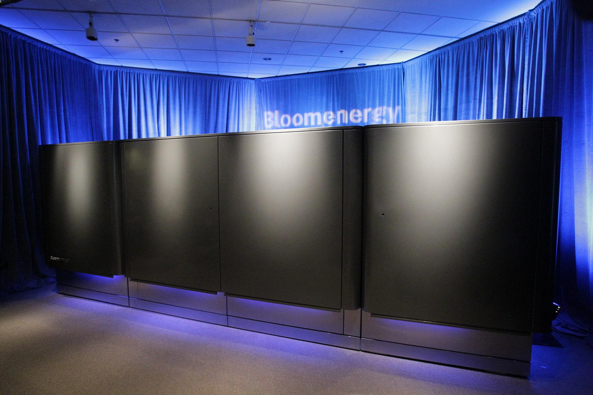

# AI 데이터센터가 늦어지면, 그 비용은 누가 낼까?

_전기가 제때 들어오지 않는다며 오라클이 뉴멕시코 데이터센터 임대료를 최대 3년 미루겠다고 개발사에 통지했다_

## Executive Summary

> [!callout]
> 2026년 9월 24일, 오라클이 뉴멕시코에 짓고 있는 대형 AI 데이터센터의 개발사에 불가항력 통지를 보냈다. 불가항력은 계약서에 미리 적어 두는 조항으로, 내 잘못이 아닌 사정 때문에 약속을 못 지키게 됐을 때 책임을 덜어 주는 장치다. 오라클이 든 사정은 전기다. 이 캠퍼스는 전력을 바깥 계통에서 받아 쓰지 않고 부지 안에 발전소를 지어 2.45기가와트를 직접 만들기로 했는데, 그 발전소에 쓸 가스관 공사와 대기질 허가가 계약이 잡아 둔 일정보다 늦다. 이 글은 이 통지를 오라클 한 회사의 악재가 아니라, 땅 위에서 생긴 지연이 계약서를 타고 누구의 장부로 옮겨 가는지 보여 주는 사례로 읽는다.

> 통지가 실제로 바꾸는 것은 액수가 아니라 시점이다. 2028년 가동이 무산되면 오라클은 첫 임대료를 최대 3년 뒤에 내기 시작할 수 있다. 미루는 동안에도 다른 비용은 나가고, 지급이 시작된 뒤 내는 임대료 총액은 처음 계약 그대로다. 깎아 주는 것이 아니라 늦춰 주는 것이다. 정작 먼저 움직인 것은 주식이 아니라 대출이었다. 이 캠퍼스에는 은행 20여 곳이 모아 준 180억 달러가 물려 있고, 통지가 알려진 뒤 그 대출채권은 액면을 밑도는 1달러당 89~91센트에 오갔다.

> 1절부터 4절까지는 보도와 공개 기록에 남은 것을 따라간다. 이 사건을 우리가 쓰는 AI 서비스의 원가에 아직 값이 매겨지지 않은 지연 위험의 문제로 옮겨 읽는 5절은 이 글의 해석이다.

### 주요 수치

출처: [TechCrunch](https://techcrunch.com/2026/09/24/oracle-sends-force-majeure-notice-on-its-new-mexico-stargate-data-center/)·[CNBC](https://www.cnbc.com/2026/09/24/oracle-data-center-force-majeure.html)·[Santa Fe New Mexican](https://www.santafenewmexican.com/las_cruces/local_news/oracle-sends-force-majeure-notice-to-project-jupiter-developers-to-protect-itself-from-liability/article_ecdbb097-66d9-49eb-9436-95fe7b6a2eec.html) 보도(2026-09-24~25), [로이터 분석](https://finance.yahoo.com/technology/ai/articles/analysis-oracle-blue-owl-project-225500245.html). 대출채권 거래가는 파이낸셜타임스 보도를 여러 매체가 재인용한 수치다.

<!-- stat-card -->
**2.45GW** — 프로젝트 주피터 전력 용량 — 약 1,400에이커 부지에 건물 4동. 이 전기를 부지 안 연료전지 발전소로 직접 만드는데, 그 발전소 허가가 아직 없다

<!-- stat-card -->
**3년** — 임대료를 미룰 수 있는 최대 기간 — 가동이 2028년을 넘기면 지급 개시를 늦춘다. 총액은 줄지 않고, 개발사가 늦게 받는다

<!-- stat-card -->
**180억 달러** — 은행 20여 곳이 댄 대출 — 산탄데르·제프리스 등이 참여한 신용공여. 일정이 밀리면 위험이 실제로 얹히는 자리다

<!-- stat-card -->
**89~91센트** — 통지 뒤 대출채권 1달러당 값 — 액면가 1달러를 밑돈 값이다. 신용시장이 지연 위험에 먼저 값을 붙였다

## 통지 한 장에 세 회사 주가가 내렸다

무대는 미국 뉴멕시코주 남쪽 끝 도냐아나 카운티의 산타테레사다. 텍사스 엘패소와 멕시코 국경이 가까운 이 사막 지대의 약 1,400에이커 부지에 건물 네 동, 합쳐서 2.45기가와트짜리 데이터센터 캠퍼스가 올라가고 있다. 이름은 프로젝트 주피터다. 짓는 쪽은 블루아울 캐피털이 소유한 스택 인프라스트럭처와 보더플렉스 디지털 애셋이고, 다 지은 건물을 통째로 빌려 쓰기로 한 쪽이 오라클이다. 오라클은 2026년 1월 이 캠퍼스의 주 임차인으로 이름을 올렸다. 여기서 돌릴 연산은 상당 부분 오픈AI의 몫이고, 이 캠퍼스는 오라클·오픈AI·소프트뱅크가 함께 벌이는 스타게이트 구상의 일부다. 개발사 측이 밝힌 총투자 계획은 최대 1,650억 달러에 이른다.

*▲ 대규모 AI 데이터센터 캠퍼스의 예시 이미지(구글 오리건주 더댈러스 시설, 프로젝트 주피터 실제 부지 사진은 아니다) | Source: [Wikimedia Commons (Tony Webster, CC BY 2.0)](https://commons.wikimedia.org/wiki/File:Google_Datacenter_-_The_Dalles,_Oregon_(17832143871).jpg)*

9월 24일 목요일, 블룸버그가 오라클이 이 개발사에 불가항력 통지를 보냈다고 먼저 전했다. 통지에 담긴 주장은 전력 공급 약속이 어긋나 2028년 가동이 무산될 경우 임대료 납부를 최대 3년 미루겠다는 것이다. 시장 반응은 빨랐다. 오라클 주가는 장중 한때 5% 가까이 빠졌다가 3% 넘게 내린 채 마감했고, 개발사의 모회사인 블루아울 캐피털은 3.6% 내렸다. 캠퍼스에 연료전지를 대기로 한 블룸에너지도 6%가량 빠졌다. 계약서 한 조항을 건드린 소식이 발전 설비를 파는 회사의 주가까지 끌어내렸다.

양쪽 회사가 내놓은 공식 입장은 같은 방향이다. 오라클은 "Project Jupiter remains on our planned schedule"이라며 프로젝트가 계획한 일정대로 가고 있고 뉴멕시코에 대한 약속도 그대로라고 밝혔다. 대변인은 설명을 덧붙였다. 이 정도 규모의 개발에서 불가항력 통지는 흔한 일이고 계약상 권리를 지켜 두려고 쓰는 경우가 많으며, 통지 자체가 프로젝트 지연을 확정하거나 인도 시점을 바꾸는 것은 아니라는 설명이다. 블루아울과 스택 인프라스트럭처도 세 회사가 프로젝트 주피터에 대해 완전히 뜻을 같이하고 있으며 이 통지가 여러 해에 걸친 이 사업의 재무적 약속을 바꾸지는 않는다고 했다.

> [!callout]
> 그래서 이 통지는 "오라클이 손을 뗀다"는 소식이 아니다. 계약을 깨겠다는 선언도, 프로젝트가 무너졌다는 신호도 아니다. 계약서에 처음부터 적혀 있던 위험 분담 조항 하나를 오라클이 자기 쪽으로 당겨 쓴 것이다. 그런데도 주가 세 개가 같은 날 내렸다. 조항 하나가 움직였을 뿐인데 값이 달라졌다는 사실이, 이 조항이 무엇을 옮기는지 보여 준다.

## 오라클은 이 계약에서 나갈 수 없다

이 임대차는 오라클이 중도에 해지할 수 있는 구조가 아니다. 블루아울이 이 프로젝트에 약 30억 달러를 지분으로 넣었고, 건물을 짓느라 빌린 돈의 이자를 오라클이 책임지는 형태로 계약이 짜였다. 들어간 자본과 부채가 서로를 붙들고 있어서 임차인이 빠져나갈 문이 없다. 그러니 오라클이 쓸 수 있는 수단은 나가는 것이 아니라 시간을 옮기는 것뿐이다.

불가항력 통지가 성립하면 무엇이 달라지는가. 2028년 가동 목표가 무산될 경우 오라클은 임대료를 내기 시작하는 시점을 최대 3년 뒤로 미룰 수 있다. 그 기간에도 임대료 말고 다른 비용은 계속 나간다. 그리고 지급이 시작되면 원래 계약에 적힌 전체 기간만큼의 임대료를 그대로 낸다. 개발사가 받을 돈의 총액은 줄지 않는다. 줄어드는 것은 그 돈이 들어오는 시점의 가치다.

여기에는 조건이 하나 더 붙는다. 블룸버그 보도에 따르면 3년 이연은 오라클이 통지를 보냈다는 사실만으로 확정되지 않는다. 전력 공급 약속과 결부된 불가항력 사유가 실제로 있었다는 데 오라클과 블루아울이 합의해야 효력이 생긴다. 통지는 그 협상을 여는 문서이지 결론이 아니다.

이 구조에서 부담이 어디로 가는지는 블루아울의 수익 구조를 보면 알 수 있다. 건물을 짓는 개발 단계 동안 블루아울은 투입한 지분에 대해 연 9% 수익을 받는다. 건물이 완성되고 임차인이 들어오면 그때부터 더 높은 임대료가 들어오기 시작한다. 오라클이 불가항력을 걸어 개발 단계를 늘리면, 블루아울은 낮은 쪽 수익률에 더 오래 머문다. 결국 다 받기는 하되, 더 늦게 받는다. 돈이 사라지지는 않았다. 기다리는 시간이 길어졌을 뿐이고, 그 기다림의 값은 누군가 치른다.

> [!callout]
> 계약서에서 불가항력 조항은 원래 이런 일을 하라고 있는 문장이다. 한쪽이 어쩔 수 없는 사정으로 약속을 못 지킬 때 그 부담을 어떻게 나눌지 미리 정해 둔다. 이번에 새로 생긴 것은 조항이 아니라, 그 조항을 실제로 당길 만큼 일정이 밀렸다는 사실이다.

그 조항을 지금 당길 수 있느냐는 그 자체로 다툼거리다. 코넬 로스쿨 법률정보연구소의 설명에 따르면 불가항력은 화재나 홍수, 전쟁처럼 당사자가 어찌할 수 없는 사건에 쓰라고 만든 장치다. 산타페에 있는 뉴에너지이코노미를 이끄는 마리엘 나나시는 그 주장이 이 상황에 정말 적용되는지 의문이라고 말했다. 예견할 수 없는 일이어야 하는데 이 일은 완전히 예견 가능했다는 것이다. 이 물음에 어느 쪽으로 답이 나느냐에 따라 3년이라는 시간의 값을 누가 지는지가 갈린다.

## 전기가 계약보다 늦게 온다

계약상 이 캠퍼스에 쓸 전기를 확보하는 책임은 오라클에 있다고 알려져 있다. 로이터가 소식통을 인용해 전한 내용이다. 그리고 그 전기가 늦다. 늦는 이유는 반도체도 자본도 아니고, 땅에 묻고 서류로 허가받아야 하는 것들이다.

그 전기는 어디서 오는가. 이 캠퍼스는 바깥 전력망에서 전기를 끌어다 쓰지 않는다. 오라클과 파트너들은 부지 안에 블룸에너지의 연료전지를 대규모로 깔아 최대 2.45기가와트를 현장에서 만들고, 그 연료전지에 넣을 천연가스를 새로 놓는 관으로 끌어오기로 했다. 통지 당일 함께 주가가 빠진 블룸에너지가 바로 이 발전소에 연료전지를 대는 회사다. 그런데 이 발전소도 이 가스관도 아직 허가를 받지 못했다.

*▲ 블룸에너지의 연료전지 서버 유닛. 프로젝트 주피터의 부지 안 발전소도 같은 계열의 설비로 전기를 만든다 | Source: [Wikimedia Commons (CC BY 2.0)](https://commons.wikimedia.org/wiki/File:Bloom_Energy_Servers.jpg)*

첫째는 가스관이다. 댈러스에 본사를 둔 에너지트랜스퍼의 자회사 트랜스웨스턴 파이프라인이 약 18마일짜리 그린칠리 가스관을 놓고 있다. 이 노선은 주 신탁지 0.6마일 구간을 지나야 하는데, 뉴멕시코주 토지관리청은 이 가스관이 주 신탁지에 도움이 되지 않는다며 통과 신청을 두 차례 거부했다. 8월에 노선을 한 번 고쳐 다시 밀고 있지만, 가스가 들어오는 시점은 애초 2026년 9월에서 2027년 2월로 약 6개월 밀렸다. 연방 쪽 심사는 진도가 나갔다. 연방에너지규제위원회 실무진은 이달 이 가스관의 환경영향평가를 마치고 승인해도 환경에 나쁜 영향을 주지 않는다고 결론지었다. 다만 이것은 최종 승인이 아니며 평가 결과에 대한 의견 접수가 10월 5일까지 열려 있다.

둘째는 대기질 허가다. 뉴멕시코주 환경부는 연료전지 발전소를 돌리는 데 필요한 대기질 허가를 아직 내주지 않았다. 결정 시한은 2026년 11월 23일로 잡혀 있다. 이달 시작될 예정이던 공개 심리는 반대 측이 낸 소송 때문에 몇 주째 멈춰 있었다. 셋째가 그 소송이다. 환경단체가 용수와 대기 허가를 걸어 제기한 소송에서 뉴멕시코주 대법원은 허가 절차를 한 차례 세워 두었다가 2026년 9월 17일 결정으로 다시 진행해도 된다고 판단했다. 그렇다고 절차가 곧장 빨라지는 것도 아니다. 주 정부는 심리를 맡을 심리관을 아직 지명하지 않았고 기일도 잡지 않았다.

이것들이 합쳐져 일정이 얼마나 밀렸는지는 집계에 따라 다르다. 로이터가 인용한 한 소식통은 전력 지연으로 프로젝트 전체가 1년 가까이 밀리고 있다고 했고, 다른 집계는 7개월 이상으로 본다. 6개월에서 1년 사이라는 폭으로 읽는 편이 정확하다. 오라클은 이달 초 뉴멕시코에서 2기가와트 규모의 신재생에너지 개발 제안요청서를 냈다. 모자란 전기를 스스로 만들어 채우겠다는 움직임이다.

지역에서는 다른 셈법이 돈다. 생물다양성센터의 콜린 콕스는 주 정부가 이미 2억 갤런이 넘는 지역의 담수를 이 프로젝트에 배정해 놓고서 정작 그 프로젝트는 재정적으로 불안한 기반 위에 서 있는 것처럼 보인다고 지적했다. 뉴멕시코 환경법률센터의 매슬린 로크는 지역사회의 힘과 반대를 과소평가한 회사에 채무를 면제해 주어서는 안 된다고 말했다. 일자리와 세수를 기대하는 쪽과 물과 전기를 걱정하는 쪽이 같은 부지를 놓고 갈린다.

## 손실은 사라지지 않고 장부를 옮겨 다닌다

지난해 말 산탄데르와 제프리스를 비롯한 20여 개 은행이 모여 180억 달러를 빌려주기로 했다. 통지 소식이 전해진 뒤 그 대출채권은 1달러당 89~91센트에 거래됐다. 파이낸셜타임스가 전한 수치를 여러 매체가 받아 쓴 것이다. 액면에서 10센트 가까이 깎인 값이다. 주식시장이 하루 3%를 반영하는 동안 신용시장은 이 건물이 제때 돈을 벌기 시작할 것인가라는 질문에 자기 값을 새로 매겼다.

아래 도식은 같은 사건을 돈의 이동 경로로 다시 그린 것이다. 왼쪽 칸은 땅 위에서 벌어진 일이고, 가운데 칸은 그것을 받아 적는 계약서의 문장이며, 오른쪽 칸은 그 문장이 값을 바꿔 놓는 장부들이다.
