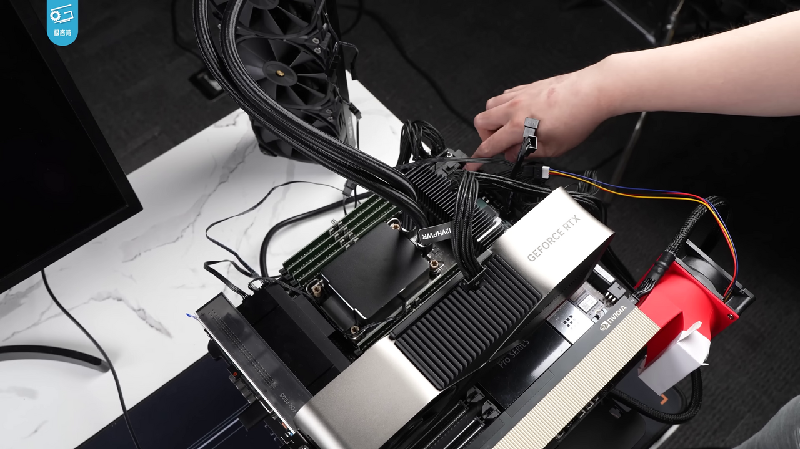

# A Content Ledger That Prices Every Source Behind an AI Answer

_Next Net, Sundial, and NVIDIA say SAIL adds a per-query settlement layer that plugs into CoMP and RSL_

## Executive Summary

> [!callout]
> Every time an AI draws on publisher content to build an answer, the usage is written to a ledger, and that ledger becomes the basis for payment. That is the picture SAIL (Standardized Agentic Intelligence Ledger) sets out. Next Net and Sundial Media & Technology Group announced it on July 14, 2026. NVIDIA supplies the compute; four media brands (Essence, Refinery29, Afropunk, and Beautycon) supplied the actual content. This piece reads that moment, when the unit of copyright settlement drops from the contract down to the query, from a data point of view.

> What SAIL targets is the gap left by two existing paths. Per-deal license negotiation gives newer and smaller publishers no leverage, and lawsuits, even when won, leave the "who gets paid how much" problem exactly where it was. Yet SAIL, too, is only a half-solved answer. It designed the "source file" that proves usage, but the price, the revenue-split formula, and any real transaction remain undisclosed.

> So we neither overrate SAIL nor dismiss it. Set among the several "per-query settlement" attempts arriving in the market at once, it makes one thing clearer: they all converge on a single question — how much did each source contribute to this answer?

### Key Figures

Source: [GlobeNewswire](https://www.globenewswire.com/news-release/2026/07/14/3326956/0/en/Next-Net-and-Sundial-Media-Technology-Group-Launch-SAIL-a-New-Rights-Managed-Content-Standard-for-AI.html), [AdExchanger](https://www.adexchanger.com/publishers/this-new-training-framework-gives-publishers-a-say-in-how-ai-uses-their-work/)

Four numbers compress where SAIL stands today. Real media brands and infrastructure are attached, but the price and live transactions that would complete settlement are still empty. That gap lands exactly where an earlier Pebblous report called the problem "still unsolved."

<!-- stat-card -->
**4** — participating media brands — Essence, Refinery29, Afropunk, and Beautycon supplied actual content

<!-- stat-card -->
**0** — disclosed live transactions — a pre-launch framework as of announcement — further technical evaluation ongoing

<!-- stat-card -->
**undisclosed** — price and revenue-split formula — usage "proof" is designed, but the settlement "formula" is not yet in place

<!-- stat-card -->
**91** — disclosed AI licensing deals — the cumulative tally of the contract-unit era — now the unit drops to the query

## What License and Lawsuit Both Left Unsolved

Until now, a publisher had roughly two ways to hand content to AI and get paid. One is per-deal license negotiation. News Corp's contract with OpenAI, worth more than $250 million over five years, and the separate deals struck by the AP, Axel Springer, and the FT all belong here. The problem is that this path is open only to a powerful few. A newer or smaller publisher without the scale to sit at the table has no seat to begin with, and every renewal means negotiating all over again.

The other way is litigation. The NYT sued OpenAI, CNN sued Perplexity, and in the training-data suits Anthropic offered a settlement of roughly $1.5 billion. That settlement was then rejected in 2026 by Judge Martinez-Olguin, on the grounds that "the basis for calculating payments is insufficient." Winning a suit, or even reaching a settlement, did nothing to answer who gets paid how much, and on what basis. The court effectively confirmed that the unit-of-settlement problem is still unsolved.

*▲ The NYT sued OpenAI over copyright, but winning a lawsuit still leaves no formula for who gets paid how much | Source: [Wikimedia Commons (CC BY 4.0, Jdforrester)](https://commons.wikimedia.org/wiki/File:The_New_York_Times_Building_at_sunset,_2021-09-30.jpg)*

The third path SAIL proposes is to drop that unit of settlement from the contract down to the query. Sundial CEO Kirk McDonald describes the framework as an alternative to "one-off license negotiation" and to "litigation," emphasizing a collaborative approach over a "David-and-Goliath" dynamic. The idea is that instead of a single contract, the ledger records which sources each AI answer drew on and how much, and that ledger becomes the basis for payment.

> [!callout]
> **The point**: licenses exclude publishers with no leverage, and even a won lawsuit leaves no settlement formula behind. SAIL tries to fill that gap with a "per-query ledger."

## What SAIL Actually Does

SAIL is the combination of three axes. The AI licensing platform Next Net (CEO Franklin Rios) runs the content-intelligence pipeline, the media publisher Sundial supplies the actual content, and NVIDIA provides the compute. NVIDIA's role is infrastructure, not an equity stake. The explanation is that Next Net's pipeline runs semantic scoring, vector search, and GPU-accelerated inference on top of NeMo, RAPIDS, and NIM microservices to enable "rights-managed retrieval at scale."

*▲ NVIDIA backs SAIL's semantic scoring and vector search with GPU compute, not an equity stake | Source: [Wikimedia Commons (CC BY 3.0, 极客湾Geekerwan)](https://commons.wikimedia.org/wiki/File:NVIDIA_H100_(%E6%9E%81%E5%AE%A2%E6%B9%BEGeekerwan)_021.png)*

The heart of how it works is "tracking per query." Each time an AI system references publisher content while composing an answer, that usage is recorded, and the SAIL ledger accumulates this history by appending to it. What the publisher receives is a **source file**. It is a document of record showing which pieces of content a given AI response was built from. It is the material that proves the premise of settlement: what was used, and how much.

There is one more technically interesting element here: authority weighting. SAIL doesn't stop at tallying usage; it reportedly includes a function that configures an AI system to treat a particular publisher as a "more trusted source." Essence, for example, could be set to be cited in answers as the most authoritative source on topics related to Black women. In other words, settlement is also a negotiation over citation priority.

There is one more thing SAIL aims at beyond settlement. Sundial has already trained its own cultural standards into internal AI tools (marketing automation, a content-production platform, chatbots), and it wants to carry those same standards over when it connects to external AI systems. The design, then, doesn't stop at pricing copyright; it tries to write into the ledger the very way content is cited and the editorial direction it carries.

What really deserves attention is the part still left undisclosed. Price and the revenue-split percentages, for a start, are not public. Nor are the specifics of the settlement mechanism: whether billing is per token or per response, or how it combines with payment protocols. There is no real transaction yet, and no official launch date. As of the announcement, this is a framework disclosure with "further technical evaluation ongoing," and nothing more. SAIL also declines from the start to call itself a standalone standard. It positions itself as a transaction, receipt, and market-intelligence layer laid on top of the IAB Tech Lab's CoMP and RSL.

> [!callout]
> **Disclosed vs. undisclosed**: the participating brands, the NVIDIA infrastructure, the source-file proof, and the authority weighting are disclosed. The price, revenue split, settlement mechanism, live transactions, and launch date are not. The "proof" of settlement is designed; the "formula" is still empty.

## A Crowded Field — SAIL Isn't Alone

SAIL is not the only attempt at "per-query settlement." At least half a dozen adjacent and competing systems are arriving in the market at once; they profess compatibility with one another, but real interoperability is unverified. The table below maps that field. SAIL's news value lies not in being "first," but in being the first commercial combination to put four real media brands and NVIDIA infrastructure together on top of two existing standards.

| System | Nature | Key differentiator |
| --- | --- | --- |
| IAB CoMP | industry-standard consortium | the higher-level standard for per-query settlement — the target SAIL professes to be compatible with |
| RSL | robots.txt extension license signal | per-crawl billing works; settlement at inference time is still unsolved |
| Aegon | academic proposal (arXiv 2026) | signed JWT licenses + append ledger + Merkle tree — a cryptographically more concrete blueprint |
| Cashmere | commercial platform ($5M seed) | in production with Wiley and Harvard Business Publishing — a live case ahead of SAIL |
| TollBit | commercial bot paywall | $30.9M raised, covering 500+ sites — but no public spec or auditable ledger |
| Cloudflare 402 | infrastructure-level payment | switched to blocking crawlers by default in July 2025 — the very trigger for settlement-infrastructure demand |
| Perplexity | its own revenue-share program | shares revenue with publishers on citation — already experimenting with a citation-priority idea akin to SAIL's authority weighting |

> [!callout]
> **Why it matters**: the news is the fact itself that several standards are racing toward "per-query settlement" at the same time. That competition is not yet settled, and SAIL is one of the commercial attempts among them that has actually attached real brands and infrastructure.

## Why Now

A few pressures converged to concentrate demand for settlement infrastructure in the summer of 2026. On the regulatory side, the EU AI Act adds weight. Article 10, which imposes a duty to document data provenance for high-risk systems, is due to take effect in August 2026, and general-purpose AI model providers must disclose a summary of training data using the European Commission's standard template. In the U.S., too, the Copyright Office's Part 3 report, issued in May 2025, took a skeptical view of a sweeping fair-use defense and signaled the need for a compulsory-licensing framework.

*▲ EU AI Act Article 10 imposes a data-provenance documentation duty on high-risk systems, effective August 2026 | Source: [Wikimedia Commons (CC BY-SA 3.0, Diliff)](https://commons.wikimedia.org/wiki/File:European_Parliament_Strasbourg_Hemicycle_-_Diliff.jpg)*

The technical and market pressure is more direct. When Cloudflare switched to blocking crawlers by default in July 2025, the "free lane for scraping" narrowed. Around that shift, licensing deals jumped from 10 to 22. As the free-grab route closed, demand for paid-usage infrastructure grew immediately.

The larger trend is what Pebblous laid out in an earlier report. Disclosed AI licensing deals rose from 2 in 2023 to 11 in 2024 and 18 in 2025, with 34 expected in 2026. Among these deals, news and journalism lead with 48, far ahead of music and audio (16) or images and video (12). That is why the party that put real content on SAIL is a media publisher. And the character of it all is shifting from "selling for training" to "renting in real time." As AI moves away from buying data once and toward borrowing it per query, the unit of settlement has no choice but to follow, down from the contract to the query. SAIL stands at the end of this trend.

## A Half-Solved Answer — It Comes Down to Data Provenance

What SAIL built is the proof of settlement. It stood up a ledger that records, in a source file, which content a given answer drew on. But the formula of settlement is still empty, because how much to charge, what a single reference is worth, remains undisclosed. The diagnosis Pebblous made earlier in its [RSL report](/report/rsl-content-licensing/en/), that "per-crawl billing works but settlement at inference time is unsolved," still holds even now that SAIL has arrived. The ledger exists, but what number to write in it hasn't been decided.

This gap meets exactly the problem Pebblous has been working on. For per-query settlement to work, you have to be able to measure "which sources contributed to this answer, and how much." And that measurement is anything but self-evident. If the [copyright liability of grounding data](/blog/grounding-data-copyright-liability/en/) we covered days ago raised the problem that "a new liability arises with every query," then SAIL is the infrastructure-level answer that tries to put a price on that liability. But for the answer to be complete, whatever measures the size of the liability has to stand up first.

The problem of measuring contribution already forms its own technical lineage. Influence functions, which estimate how much a piece of training data affected a particular output, and methods like the Shapley value, which convert the marginal contribution of a data fragment into a number, belong to it. Per-query settlement grows accurate only on top of this contribution measurement and this tracking of data provenance. Without a reliable way to record and prove which sources were used and how much, the ledger stays a book of accounts with no numbers in it.

> [!callout]
> **The open question**: SAIL dropped copyright settlement from the contract to the query, but it left the problem of setting the value of a single query exactly where it was. Setting that value is the work of measuring data provenance and contribution — and that is the real task the per-query settlement era has to solve next.

## References

- 1.Next Net & Sundial Media & Technology Group. (2026-07-14). "Next Net and Sundial Media Technology Group Launch SAIL, a New Rights-Managed Content Standard for AI." [GlobeNewswire](https://www.globenewswire.com/news-release/2026/07/14/3326956/0/en/Next-Net-and-Sundial-Media-Technology-Group-Launch-SAIL-a-New-Rights-Managed-Content-Standard-for-AI.html).
- 2.AdExchanger. (2026-07). "This New Training Framework Gives Publishers A Say In How AI Uses Their Work." [adexchanger.com](https://www.adexchanger.com/publishers/this-new-training-framework-gives-publishers-a-say-in-how-ai-uses-their-work/).
- 3.PPC Land. (2026-07). "Next Net and Sundial pair four media brands with NVIDIA for AI content pay." [ppc.land](https://ppc.land/next-net-and-sundial-pair-four-media-brands-with-nvidia-for-ai-content-pay/).
