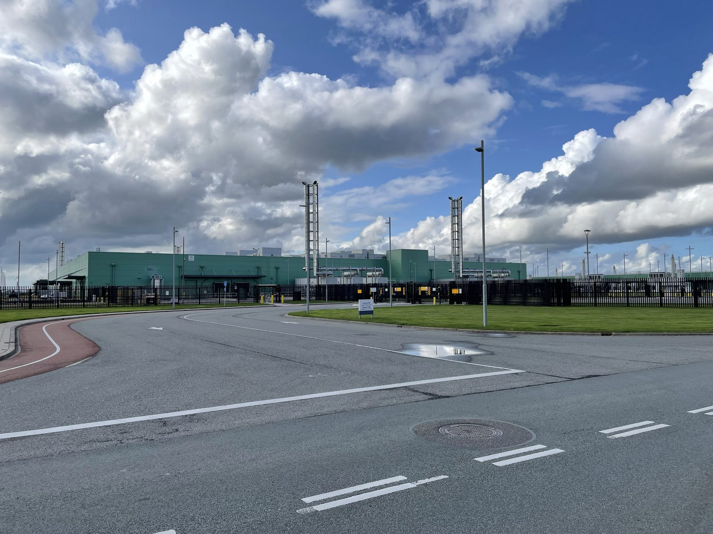
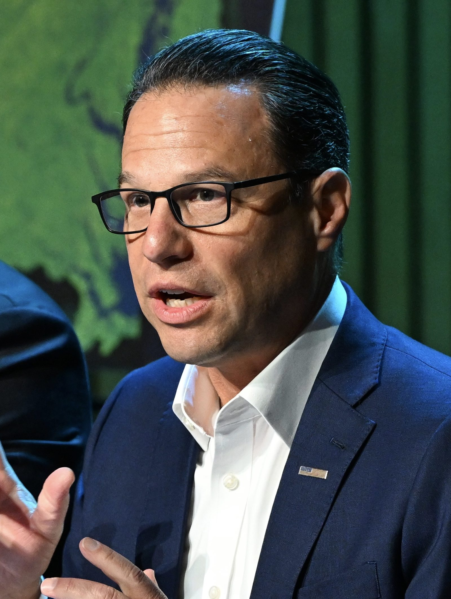

# 펜실베이니아, 데이터센터 비밀유지계약 전면 금지

_정보공개청구로 드러난 NDA 여덟 건이 계기가 됐고, 전력과 용수 사용량은 해마다 신고 대상이 된다_

## Executive Summary

> [!callout]
> 8월 18일 조시 셰이피로 펜실베이니아 주지사가 행정명령 2026-05에 서명했습니다. 데이터센터 사업에 비밀유지계약을 쓰는 것은 허용되지 않는다는 조항이 들어갔습니다. 데이터센터는 주의 신속허가 프로그램에서 전면 제외됐고, 지역 승인을 먼저 받지 못하면 환경보호국이 허가를 내주지 않습니다.

> 금지 조항이 나온 배경에는 하루 뒤 공개된 탐사보도가 있습니다. 스포트라이트 PA가 정보공개청구로 확인한 서명된 비밀유지계약은 최소 여덟 건이었고, 서명자 명단에는 읍 감독관과 카운티 위원장뿐 아니라 주 정부 장관도 있었습니다. 그중 한 건에서 실제로 비밀로 지켜진 정보는 최종 이용자가 아마존이라는 사실 하나였습니다.

> 더 오래 남을 조항은 금지 조항 옆에 붙어 있습니다. 같은 행정명령이 운영사에 전년도 총 에너지와 용수 소비량, 피크 시간대 사용량, 최대 일수요를 해마다 제출하도록 했고, 제안 단계 프로젝트를 주 정부 공개 지도에 올렸습니다. 8.4기가와트 1단계와 550조원을 앞에 두고 시행령을 쓰고 있는 한국에도 그대로 되물을 수 있는 대목입니다.

### 주요 수치

비밀유지계약은 펜실베이니아의 여덟 건에서 그치지 않았고, 그 관행을 되돌리려는 법안은 상원에서 멈춰 있습니다. 정작 허가를 다 받은 프로젝트는 아직 다섯 곳뿐입니다.

출처: [펜실베이니아 주지사실](https://www.pa.gov/governor/newsroom/2026-press-releases/governor-shapiro-signs-executive-order-on-data-center-developmen) (2026-08-18) · [Spotlight PA](https://www.spotlightpa.org/news/2026/08/pennsylvania-data-center-nda-public-record-capitol/) (2026-08-19) · [Virginia Mercury](https://virginiamercury.com/2025/04/30/data-centers-non-disclosure-agreements-and-democracy/)

<!-- stat-card -->
**최소 8건** — 펜실베이니아 공직자가 서명한 비밀유지계약 — 읍 감독관, 카운티 위원, 주 내각 장관이 아마존웹서비스·밴티지·QTS와 맺었습니다

<!-- stat-card -->
**31곳 중 25곳** — 비밀유지계약을 맺은 버지니아 지자체 — 데이터센터가 있거나 승인·제안된 곳을 전수 청구한 결과이며, 연구진은 과소집계일 수 있다고 밝혔습니다

<!-- stat-card -->
**171 대 31** — 비밀유지계약 억제 법안의 하원 통과 표차 — 세제 감면을 계약 미사용 서약에 연동하는 안으로, 상원 재무위원회에 계류 중입니다

<!-- stat-card -->
**5곳** — 1단계 허가를 모두 받은 프로젝트 — 지난 1년간 100건 넘게 제안됐고 58곳이 환경보호국과 접촉했으나 여기까지 온 곳은 다섯입니다

## 행정명령이 실제로 바꾼 것

8월 18일 해리스버그에서 서명된 행정명령 2026-05의 제목은 데이터센터의 영향으로부터 펜실베이니아 소비자를 보호한다는 것입니다. 핵심은 주 환경보호국의 허가 심사 절차를 바꾼 데 있습니다. 개발사가 주지사실이 정한 책임인프라개발 요건, 줄여서 GRID 요건을 지키겠다고 법적 구속력 있게 약속하고 지역의 승인을 받아야만 심사가 진행됩니다.

*▲ 행정명령 2026-05가 서명된 해리스버그 펜실베이니아 주 의사당 | Source: [Wikimedia Commons (Kumar Appaiah, CC BY-SA 2.0)](https://commons.wikimedia.org/wiki/File:Pennsylvania_State_Capitol_East_Side.jpg)*

GRID 요건은 네 가지를 요구합니다. 프로젝트에 필요한 발전과 송배전 등 신규 인프라 비용을 개발사가 전액 부담하고 가정과 사업체로 넘기지 않을 것, 주요 설계 결정에 주민 의견이 실제로 반영될 만큼 이른 시점부터 공개 회의와 통지를 포함한 소통 계획을 실행할 것, 지역 인력을 고용하고 학교와 인프라에 투자하는 지역사회 혜택협약을 맺을 것, 엄격한 물 절약 기준을 포함해 최고 수준의 환경 기준을 충족할 것입니다.

약속의 형식도 정해졌습니다. 개발사는 환경보호국과 사전 협의를 거친 뒤 동의명령합의서를 체결해야 하고, 이 문서에는 이행 실패에 대한 벌칙이 들어갑니다. GRID 요건에 동의하지 않는 개발사는 필요한 지역 승인을 모두 확보하고 건설에 필요한 모든 허가 신청이 법령에 부합한다고 확인된 뒤에야 심사가 시작됩니다. 세제 쪽도 함께 조였습니다. 국세청은 전산 데이터센터 장비 면세 프로그램 지침을 고쳐 GRID 요건을 못 지키는 신청자에게는 기존 면세를 주지 않기로 했습니다.

비밀유지계약 조항은 이 목록 안에 한 줄로 들어 있습니다. 데이터센터 사업에 비밀유지계약을 사용하는 것은 허용되지 않는다는 문장입니다. 같은 날 데이터센터는 주 신속허가 프로그램에서 전부 빠졌고, 앞으로도 대상으로 검토하지 않기로 했습니다.

> [!callout]
> 셰이피로 주지사가 개발사에 보낸 메시지는 간결합니다. 우리의 엄격한 요건에 동의할 수 없고 짓고 싶은 지역에서 좋다는 답을 받아 내지 못한다면 주 정부의 지원도 받지 못할 것이라는 문장입니다. 그는 이 조치를 전국에서 가장 엄격한 가드레일이라고 표현했습니다.

규모를 보면 왜 지금인지가 보입니다. 지난 1년 사이 공개 데이터베이스에 잡힌 펜실베이니아 데이터센터 제안은 100건이 넘고, 그중 58곳이 어떤 형태로든 환경보호국과 인허가를 논의했습니다. 실제로 허가를 한 건이라도 신청한 곳은 15곳, 1단계 개발에 필요한 허가를 모두 받은 곳은 다섯 곳뿐입니다. 대부분이 아직 서류 단계에 머물러 있는데도 주민 반발은 이미 임계점에 닿았습니다. 퀴니피액 조사에서 펜실베이니아 주민 네 명 중 세 명 가까이가 자기 지역에 데이터센터가 들어서는 데 반대한다고 답했습니다.

## 규제보다 정보공개청구가 먼저 있었다

행정명령 다음 날인 8월 19일, 비영리 탐사보도 매체 스포트라이트 PA가 케이트 황푸 기자의 기사를 냈습니다. 정보공개청구로 모은 문서를 근거로, 펜실베이니아 공직자들이 데이터센터 개발사와 맺은 비밀유지계약이 최소 여덟 건 확인됐다는 내용이었습니다. 서명한 사람은 읍 감독관과 카운티 위원, 그리고 주 정부 내각 장관이었고, 상대는 아마존웹서비스와 밴티지 데이터센터스, 퀄리티 테크놀로지 서비시스였습니다.

### 2.1. 서명하지 않은 사람과 서명한 사람

탤런 에너지가 몬투어 카운티 앤서니 읍의 감독관 크레이그 하이에게 연락해 용도지역 변경 이야기를 꺼냈을 때, 하이는 우선 의아했습니다. 큰 용도지역 결정 권한은 읍이 아니라 카운티에 있기 때문입니다. 그래도 감독관들은 만나 보기로 했는데, 날짜를 잡고 나자 회사가 조건 하나를 붙였습니다. 회의를 하려면 비밀유지계약에 서명해야 한다는 것이었습니다.

하이는 서명을 거부했고 회의도 하지 않았습니다. 그가 스포트라이트 PA에 한 말은 이렇습니다. 겉으로는 다 합당해 보였지만 우리는 선출된 공직자이고, 앞으로 할 일을 유권자에게 말하지 말라는 전제가 몹시 언짢았다는 것입니다. 그 회사가 무엇을 지으려 했는지는 몇 달이 지나서야 알게 됐습니다. 데이터센터였습니다.

서명한 쪽의 사정도 기록에 남았습니다. 스카일킬 카운티 위원장 래리 파도라 역시 회의 전에 서명을 요구받았습니다. 그는 카운티 법무관이 이 계약은 어차피 주의 정보공개법 대상이라 공개될 것이고 그러니 서명을 시키는 것 자체가 무의미하다고 상대 회사에 알렸다고 말했습니다. 그렇게 참석한 자리는 클라인 읍에 들어설 사업에 대한 기본 설명이었고, 거기서 그가 기밀로 알게 된 유일한 정보는 최종 이용자가 아마존이라는 사실이었습니다. 부지 매입과 등기가 끝난 뒤에는 모두가 알게 됐지만, 발표 전까지 그는 아마존의 이름을 밝히지 않았습니다.

### 2.2. 무엇이 기밀인지 적혀 있지 않은 기밀 조항

확인된 문서 대부분은 독점 정보와 기밀 정보의 공개를 금지하면서 그 범위를 특정하지 않았습니다. 주 지역사회경제개발부 장관 릭 사이거가 아마존과 맺은 계약에서 기밀 정보는 표면에 기밀이라고 명확히 표시된 것, 또는 합리적으로 기밀로 여겨져야 하는 것을 뜻했습니다. 펜실베이니아뉴스미디어협회 변호사 멜리사 멜레브스키는 이런 모호한 문구가 준수 자체를 어렵게 만든다고 지적했습니다. 공직자가 자신이 무엇을 감추기로 약속했는지 모르게 되기 때문입니다.

소비자단체 퍼블릭시티즌의 디애나 노엘은 관계의 방향을 문제 삼았습니다. 자기 지역에 무엇이 제안되는지 듣기 위한 조건으로 기업이 선출직에게 서명을 요구하는 순간, 그 공직자는 유권자가 아니라 기업에 책임을 지는 위치로 옮겨 간다는 것입니다. 브레크너 정보자유 프로젝트의 데이브 퀼리어는 그다음에 오는 결과를 짚었습니다. 공공을 대신해 중요한 결정을 내리는 지방정부와 주정부가 공공을 빼놓고 결정하게 되는 상태입니다.

업계 쪽 설명도 기사에 함께 실렸습니다. 데이터센터연합 주정책 담당 부사장 댄 디오리오는 규제의 필요성을 이해한다면서도, 식당부터 대형 소매점까지 많은 대형 개발이 경쟁상 이익을 지키려 비밀유지계약을 쓴다고 말했습니다. 경쟁사가 어느 부지를 보고 있는지 알려지면 땅값과 개발 절차가 달라진다는 논리입니다. 다만 마이크로소프트는 지자체와 비밀유지계약을 쓰지 않겠다고 이미 선언했습니다.

### 2.3. 행정명령보다 먼저 움직인 의회

주의회에는 이미 두 갈래 법안이 올라가 있었습니다. 공화당 소속 트레이시 페니쿠익 상원의원은 공공기관이 데이터센터 개발사와 비밀유지계약을 맺는 것 자체를 금지하는 안을 냈습니다. 그가 대표하는 리머릭 읍에서는 약 140만 제곱피트 규모 데이터센터가 용도지역 변경 절차를 밟고 있는데, 사업을 대리하는 변호사가 읍 감독관들에게 최종 이용자를 밝힐 처지가 아니라고 말한 상태입니다.

민주당 소속 조 시레시 하원의원은 다른 지렛대를 골랐습니다. 세제 감면을 비밀유지계약을 쓰지 않겠다고 서약한 데이터센터에만 적용하도록 고치는 안입니다. 이 법안은 하원에서 171 대 31로 통과했습니다. 초당적 표차였지만 상원 재무위원회에서 멈춰 있습니다. 시레시가 스포트라이트 PA에 한 말은 짓지 말라는 것이 아니라 지을지 말지를 지역사회가 정하고 그러려면 지역사회가 가질 수 있는 정보를 다 가져야 한다는 것이었습니다.

### 2.4. 펜실베이니아만의 일이 아니었다

버지니아에서는 이 관행의 규모가 먼저 세어졌습니다. 메리워싱턴대 사회학 교수 에릭 본즈와 학생 빅터 뉴비는 데이터센터가 이미 있거나 승인됐거나 제안된 버지니아 지자체를 찾을 수 있는 대로 다 찾아 정보공개청구를 넣었고, 31곳 가운데 25곳에서 비밀유지계약을 확인했습니다. 두 사람은 이 숫자가 실제보다 적을 수 있다고 단서를 달았습니다. 한 카운티는 공직자가 대형 기술기업과 비밀유지계약에 서명했지만 공개 기록용 사본을 보관하지 않았다고 답해 왔기 때문입니다. 청구할 문서가 남아 있지 않으면 정보공개청구도 거기서 멈춥니다.

*▲ 31곳 중 25곳에서 비밀유지계약이 확인된 버지니아 러던 카운티 애시번의 데이터센터 밀집 지역 | Source: [Wikimedia Commons (Theodore Christopher, CC0)](https://commons.wikimedia.org/wiki/File:Data_centers_in_Ashburn.jpg)*

루이지애나에서는 주지사 본인이 서명자였습니다. 걸프스테이츠뉴스룸이 정보공개청구로 받아 낸 문서를 보면, 제프 랜드리 주지사는 2024년 4월 23일 주지사실 명의로 상호 비밀유지계약에 직접 서명했습니다. 상대는 메타 플랫폼스의 데이터센터 자회사 레이들리 LLC였습니다. 이 계약이 기밀로 정의한 항목에는 제안 조건과 가격, 재무 정보뿐 아니라 이 합의서가 존재한다는 사실과 양측이 논의 중이라는 사실 자체가 들어 있었습니다. 법이 요구하는 공개는 허용하되, 받는 쪽이 공개 범위를 줄이려 상업적으로 합리적인 노력을 하고 공개를 막는 보호명령까지 신청해야 한다는 조건이 붙었습니다. 주지사실과 비밀유지계약을 맺은 주 공무원은 100명이 넘습니다. 앞서 인용한 퀼리어는 이 문서를 검토하고 정보공개법을 거꾸로 뒤집는 조항이라고 평했습니다. 합의서의 존재 자체를 감추는 대목에 대해서는 정보를 감추고 있다는 사실을 감추려는 것이라고 했습니다.

> [!callout]
> 규제가 관행을 찾아낸 것이 아니라, 정보공개청구 몇 건이 관행을 문서로 드러낸 뒤에 규제가 따라왔습니다. 파도라의 법무관이 옳았다는 점도 같은 이야기입니다. 그 비밀유지계약은 정보공개법 앞에서 이미 무력했고, 다만 아무도 청구하지 않는 동안만 유효했습니다.

## 금지 조항보다 오래 남을 조항

전력과 물을 누가 얼마나 쓰고 그 비용을 누가 내느냐는 이미 익숙한 논점입니다. 행정명령 2026-05에서 덜 읽힌 부분은 그 부담을 어떻게 나눌지가 아니라, 그 부담을 앞으로 어떤 형식으로 적어 두게 할지를 정한 대목입니다.

운영사는 환경보호국에 에너지와 용수 사용 정보를 제출해야 합니다. 항목이 구체적으로 적혀 있습니다. 전년도 총 에너지 소비량, 전년도 총 천연가스 소비량, 피크 시간대의 시간당 평균 에너지 사용 추정치, 전년도 총 용수 소비량과 최대 일수요, 그리고 오염된 물이나 공기로부터 환경과 공중을 보호하기 위해 취한 조치입니다.

*▲ 행정명령이 정한 신고 항목의 대상이 되는 데이터센터 시설 (네덜란드 미덴미어) | Source: [Wikimedia Commons (Hay Kranen, CC BY 4.0)](https://commons.wikimedia.org/wiki/File:Microsoft_Data_Center_Middenmeer,_the_Netherlands_-_1.jpg)*

여기에 별도 조치 하나가 붙었습니다. 셰이피로 행정부는 환경보호국과 접촉한 제안 프로젝트를 전부 담은 공개 지도를 만들었습니다. 주민은 각 허가가 어느 단계에 있는지 지도에서 확인할 수 있고, 새 제안이 파악되면 지도가 갱신됩니다. 지역사회경제개발부는 지자체용 조닝 기준과 지역사회 혜택협약 모범사례를 배포하기로 했습니다. 협상 조건이 지자체마다 제각각이던 자리에 공통 서식이 들어가는 셈입니다.

서식을 먼저 만든 지자체도 있습니다. 애리조나 피마 카운티는 회사 이름과 물·전력 수요를 감춘 채 진행되던 데이터센터 사업으로 한 차례 홍역을 치른 뒤, 2025년 9월 2일 감독위원회에서 4 대 1로 새 비밀유지계약 정책을 통과시켰습니다. 카운티 기구의 승인이나 표결보다 최소 90일 앞서 사업 내용을 공개해야 하고, 계약 기간은 기본 180일로 두되 연장은 별도로 판단하며, 어떤 비밀유지계약이 살아 있는지 분기마다 감독위원들에게 목록으로 보고해야 합니다. 계약서 자체의 표준 양식도 만들었습니다. 무엇을 감출 수 있는지는 건드리지 않고, 언제까지 감출 수 있는지와 그 사실을 누가 알고 있어야 하는지를 정한 규칙입니다.

전력 쪽에도 같은 성격의 조항이 있습니다. 주지사실의 에너지 적정요금 특별고문 마크 시비스트가 주 공공유틸리티위원회와 함께 세 가지를 추진합니다. 전력망이 압박을 받을 때 다른 고객보다 데이터센터가 먼저 전기 공급을 잃도록 하는 프로토콜, 데이터센터 수요를 맞추려 PJM이 여는 신뢰도 보완 경매의 비용을 다른 고객이 아닌 데이터센터에 청구하는 절차, 그리고 데이터센터 전력 수요가 정확히 예측되고 투명하게 공개되도록 하는 규약입니다.

- •**금지는 한 번의 사건입니다**. 계약서에 서명하지 않게 되는 것으로 끝납니다.
- •**신고는 해마다 반복되는 절차입니다**. 같은 항목을 같은 서식으로 여러 해, 여러 사업장이 제출하면 그것은 문서가 아니라 시계열이 됩니다.
- •**비교가 가능해집니다**. 지역별 전력 사용량과 용수 최대 일수요, 고용 약속, 세제 감면을 한 표에 놓고 볼 수 있게 됩니다. 지금까지는 그 자리에 서로 다른 문법으로 쓰인 개별 협약이 있었습니다.

다만 여기서 한 걸음을 앞질러 가지 않는 편이 정확합니다. 행정명령이 정한 것은 환경보호국에 제출할 의무이지, 제출된 자료를 어떤 형식과 주기로 공개할지가 아닙니다. 공개 지도는 제안 프로젝트와 허가 진행 상황을 보여 주는 별개 조치이고, 사용량 신고 자료가 같은 방식으로 공개되리라는 조항은 본문에 없습니다. 기록으로 남게 하는 것과 그 기록을 누구나 열어 볼 수 있게 하는 것은 다른 단계이며, 지금 확정된 것은 앞쪽까지입니다.

> [!callout]
> 그럼에도 전환의 방향은 분명합니다. 규제가 무엇을 하지 말라고 말하는 데서 무엇을 매년 적어 내라고 말하는 쪽으로 옮겨 갔습니다. 앞의 규제는 위반을 적발해야 작동하고, 뒤의 규제는 제출된 숫자가 서로 어긋나기만 해도 작동합니다.

## 부족하다는 쪽과 과하다는 쪽

이 행정명령은 양쪽에서 동시에 비판받았습니다. 한쪽은 모라토리엄이 아니라서 모자란다고 하고, 다른 쪽은 전면 금지가 과하다고 합니다.

모자란다는 쪽의 핵심 근거는 이것이 모라토리엄이 아니라는 점입니다. 푸드앤드워터워치 주 디렉터 메건 맥도너는 유일한 해법이 모든 신규 데이터센터 개발에 대한 의무 모라토리엄이라고 말했습니다. 뉴욕 캐시 호컬 주지사는 전국 첫 주 단위 모라토리엄에 서명했고, 텍사스 그레그 애벗 주지사는 주 전력망에 직접 연결하는 신규 데이터센터를 일시 중단시켰습니다. 다만 호컬이 서명한 것도 법률이 아니라 행정명령 62호였습니다. 50메가와트 이상 시설의 허가 심사를 최대 1년 보류하는 내용이고, 의회가 20메가와트 기준으로 더 넓게 통과시킨 법안은 아직 서명되지 않은 채 남아 있습니다. 펜실베이니아에서는 여야가 몇 달째 3년 모라토리엄을 요구해 왔지만 행정명령은 그 요구에 답하지 않았고, 기존 세제 인센티브도 되돌리지 않았습니다.

재선 상대인 공화당 소속 주 재무관 스테이시 개리티 캠프는 더 날을 세웠습니다. 셰이피로가 전국에서 가장 열심인 데이터센터 응원단장이었다며 이번 조치를 가스라이팅이라고 불렀습니다. 다만 개리티의 입장도 이동했습니다. 2025년 6월 발표 때는 환영했다가 지금은 모든 데이터센터 개발의 중단을 요구하고 있습니다.

*▲ 모자란다는 쪽과 과하다는 쪽 양쪽에서 비판받은 조시 셰이피로 펜실베이니아 주지사 | Source: [Wikimedia Commons (Maryland GovPics, CC BY 4.0)](https://commons.wikimedia.org/wiki/File:Josh_Shapiro_December_2025.jpg)*

과하다는 쪽은 업계입니다. 데이터센터연합의 디오리오는 전면 금지를 미끄러운 비탈이라고 부르며, 계약 기간을 제한하거나 대상 주제를 좁히는 식의 조정을 제안했습니다. 진짜 기밀은 보호하되 절차를 진행하기로 했다는 사실 정도는 더 일찍 알리는 구조를 만들자는 것입니다.

이 조치에는 구조적 한계도 있습니다. GRID 기준은 원래 세제 혜택과 신속허가에 연동된 자발적 기준으로 제안됐고 하원은 초당적으로 이를 통과시켰지만, 공화당이 주도하는 상원이 움직이지 않았습니다. 행정명령은 그 막힌 길의 우회로입니다. 셰이피로는 이번 GRID 요건이 자발적인 것이 아니라 법적 구속력을 갖는다고 강조했지만, 행정명령은 법률이 아니어서 다음 행정부가 되돌릴 수 있습니다. 반대로 시레시 법안처럼 세법 조항에 새겨진 요건은 되돌리려면 다시 입법을 거쳐야 합니다. 상원 원내대표 조 피트먼은 지역 단위에서 모라토리엄을 결정할 수 있게 하는 방안을 포함해 추가 논의에 열려 있다고 밝혔습니다.

## 550조원 계획은 무엇을 기록으로 남기나

한국은 지금 정확히 반대편 국면에 있습니다. 2026년 6월 29일 배경훈 부총리 겸 과학기술정보통신부 장관은 2029년까지 8.4기가와트 규모 AI 데이터센터에 550조원을 투자한다는 계획을 발표했습니다. SK가 5기가와트, GS가 2.4기가와트, 네이버가 1기가와트를 맡고, 2035년까지 18.4기가와트와 1000조원으로 넓히는 구상입니다. 입지는 수도권 집중을 피해 울산과 동해, 세종 등 비수도권으로 분산됩니다.

*▲ 8.4기가와트·550조원 규모 AI 데이터센터 투자 계획을 발표한 배경훈 부총리 겸 과학기술정보통신부 장관 | Source: [Wikimedia Commons (CHOSUN IMAGE VISION, CC BY 3.0)](https://commons.wikimedia.org/wiki/File:Bae_Kyung-hoon%27s_Portrait_(2025.7).png)*

제도 쪽 일정도 이미 정해져 있습니다. 인공지능 데이터센터 산업 진흥에 관한 특별법은 2026년 5월 7일 국회를 통과해 6월 9일 공포됐고, 2027년 3월 10일 시행됩니다. 과기정통부는 6월 18일 하위법령 연구반을 꾸려 킥오프 회의를 열었습니다. 지금 시행령을 쓰고 있는 중이라는 뜻입니다.

논의되는 특례의 방향은 펜실베이니아와 대칭을 이룹니다. 일정 요건을 충족한 사업자는 과기정통부를 단일 창구로 여러 인허가를 한 번에 진행할 수 있고, 정해진 기간 안에 관계 기관이 거부 의견을 내지 않으면 허가된 것으로 보는 타임아웃제가 도입됩니다. 비수도권에서 일정 규모 이하로 짓거나 증설하는 경우, 기존 데이터센터를 AI용으로 전환하는 경우에는 전력계통영향평가가 면제됩니다.

발표에서 빠진 숫자도 있습니다. 투자액과 용량과 입지는 반복해 제시됐지만 상시 고용 규모는 어느 보도자료에도 나오지 않았습니다. 노동문제연구소 해방의 오민규 연구실장이 [프레시안 인사이드경제](https://www.pressian.com/pages/articles/2026081808463568743)에서 메타의 공개 자료로 역산을 해 봤습니다. 5기가와트 규모 리치랜드패리시 데이터센터는 투자액 500억 달러에 건설 피크 인력 7500명, 완공 후 상시 운영 인력 1000명입니다. 1기가와트당 200명꼴이고, 최근 착공한 1기가와트 이상 메타 데이터센터를 모아 보면 200명에서 300명 사이였습니다. 같은 비율을 8.4기가와트에 대면 상시 고용은 1700명 안팎이 됩니다.

이 숫자를 어떤 서식으로 적어 두느냐가 그다음 문제입니다. 메타는 2024년 12월 리치랜드패리시 계획을 처음 알릴 때 직접 일자리 500개와 간접 일자리 1000개를 나눠 적어 합계 1500개라고 했습니다. 2026년에 다시 내놓은 문장은 운영이 시작되면 이 데이터센터가 1000개의 일자리를 지원하게 된다는 것이었습니다. 그사이 투자 규모는 100억 달러에서 500억 달러로 다섯 배가 됐는데 고용 숫자는 오히려 줄었고, 직접과 간접을 나누던 구분은 문장에서 사라졌습니다. 같은 사업의 같은 약속을 두 해에 걸쳐 적었는데 두 문장을 나란히 놓고 비교할 방법이 없습니다. 서식이 없으면 숫자는 남아도 비교는 남지 않습니다.

방향이 반대라는 사실만으로 어느 쪽이 옳다고 말할 수는 없습니다. 두 곳의 출발점이 다릅니다. 펜실베이니아는 100건이 넘는 제안이 몰려든 뒤에 속도를 늦추는 중이고, 한국은 아직 대부분이 착공 전인 단계에서 속도를 붙이는 중입니다. 다만 시행령을 쓰는 시점이 겹친다는 점은 짚을 만합니다.

### 5.1. 아무도 묻지 않았을 뿐일 수 있다

한국 지자체와 개발사 사이에 비밀유지계약이 쓰이고 있는지를 확인한 국내 보도는 아직 없습니다. 그러니 쓰이고 있다고 단정할 근거도 없습니다. 그런데 펜실베이니아에서도 여덟 건의 존재를 드러낸 것은 규제가 아니라 정보공개청구 몇 건이었습니다. 아직 아무도 청구하지 않았다는 사실과 아무 일도 없다는 사실은 같지 않습니다.

더 실질적인 질문은 지금 쓰이는 시행령 쪽에 있습니다. 지금까지 공개된 논의는 인허가 일괄처리와 타임아웃제, 비수도권 특구와 전력 특례에 모여 있고, 사업자가 전력과 용수 사용량, 상시 고용 실적을 정기적으로 신고하고 그 결과가 어떤 형식으로 남는지에 관한 내용은 확인되지 않습니다. 기록을 남기게 하는 조항은 인허가 특례와 달리 나중에 붙이기가 어렵습니다. 첫해 데이터가 없으면 비교할 기준선 자체가 생기지 않기 때문입니다.

정부에 낯선 수단도 아닙니다. 과기정통부는 이미 345킬로볼트 계통에 여유가 있는 변전소 정보를 공개해 입지 분산을 유도하겠다고 밝혔습니다. 어떤 정보를 공개하면 시장이 어떻게 움직이는지를 이미 정책 수단으로 쓰고 있다는 뜻입니다. 그 수단을 전력과 용수 사용 실적 쪽으로 한 칸 옮기는 것이 이번 펜실베이니아 조치의 요지입니다.

> [!callout]
> **Editor's Note**: 페블러스가 데이터 품질 진단에서 반복해 보는 장면과 닮았습니다. 값 자체가 틀린 경우보다, 같은 항목을 부서마다 다른 서식으로 적어 둔 탓에 비교가 안 되는 경우가 훨씬 흔합니다. 나중에 표준을 씌우는 비용은 처음부터 서식을 맞추는 비용보다 늘 비쌌습니다. 데이터센터 유치 조건도 지금은 서식을 정할 수 있는 시점에 있습니다.

행정명령 원문과 GRID 요건은 [펜실베이니아 주지사실 발표](https://www.pa.gov/governor/newsroom/2026-press-releases/governor-shapiro-signs-executive-order-on-data-center-developmen)에서, 비밀유지계약 여덟 건의 내용은 [스포트라이트 PA 기사](https://www.spotlightpa.org/news/2026/08/pennsylvania-data-center-nda-public-record-capitol/)에서 확인할 수 있습니다.

**(주)페블러스 데이터 커뮤니케이션팀**  
2026년 8월 21일

## 참고문헌

### 정부 발표

- 1.Office of Governor Josh Shapiro. (2026). "[Governor Shapiro Signs Executive Order on Data Center Development in PA](https://www.pa.gov/governor/newsroom/2026-press-releases/governor-shapiro-signs-executive-order-on-data-center-developmen)." Commonwealth of Pennsylvania, Governor's Newsroom, 2026-08-18.

### 탐사보도·언론

- 2.The Philadelphia Inquirer. (2026). "[Gov. Josh Shapiro signs executive order restricting data center development in Pennsylvania](https://www.inquirer.com/politics/pennsylvania/josh-shapiro-data-center-order-20260818.html)." 2026-08-18.
- 3.Downard, W. (2026). "[Pennsylvania governor signs data center executive order. Critics say it falls short.](https://www.route-fifty.com/artificial-intelligence/2026/08/pennsylvania-governor-signs-data-center-executive-order-critics-say-it-falls-short/415508/)" Route Fifty (Pennsylvania Capital-Star 신디케이션), 2026-08-19.
- 4.Huangpu, K. (2026). "[Why PA data centers want public officials to sign NDAs](https://www.spotlightpa.org/news/2026/08/pennsylvania-data-center-nda-public-record-capitol/)." Spotlight PA, 2026-08-19.
- 5.Bonds, E. & Newby, V. (2025). "[Data centers, non-disclosure agreements and democracy](https://virginiamercury.com/2025/04/30/data-centers-non-disclosure-agreements-and-democracy/)." Virginia Mercury, 2025-04-30.
- 6.Gulf States Newsroom. (2026). "[Gov. Jeff Landry personally signed an NDA with Meta. Here's what it says.](https://www.wwno.org/politics/2026-07-24/gov-jeff-landry-personally-signed-an-nda-with-meta-heres-what-it-says)" WWNO, 2026-07-24.

### 국내 소스

- 7.오민규. (2026). "[550조 들여 1700명 고용 창출? 메가 프로젝트인가 메가 블랙홀인가](https://www.pressian.com/pages/articles/2026081808463568743)." 프레시안 인사이드경제, 2026-08-18.
