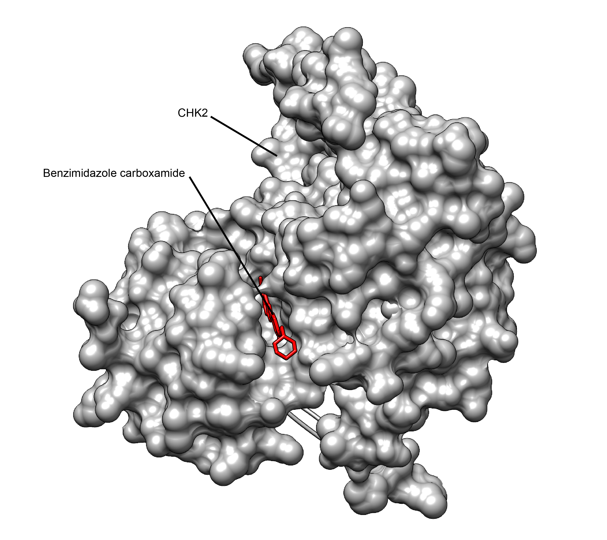

# 약 만드는 회사들, 데이터는 안 내주고 AI만 같이 가르친다

_제약사 다섯 곳이 공개한 적 없는 단백질 구조 2만여 건으로 가르친 AI가, 공개 데이터로만 배운 AI보다 훨씬 정확하다_

## Executive Summary

> [!callout]
> 제약회사가 가장 늦게까지 내놓지 않는 자산 가운데 하나가 단백질과 후보 약물이 어떻게 맞물려 있는지를 찍어 둔 구조 데이터다. 어떤 분자를 어느 자리에 붙여 봤는지가 그대로 드러나기 때문이다. 그 데이터를 다섯 회사가 같은 모델 하나를 가르치는 데 썼다는 소식을 네이처가 9월에 전했다. 이 글은 회사들이 무엇을 내놓고 무엇을 끝까지 쥐고 있었는지, 그리고 합치기 전에 먼저 맞춰야 했던 것이 무엇인지를 본다.

> 다섯 회사가 밖에 내놓은 적 없는 구조 20,167건으로 학습을 마친 모델은 시험용 구조에서 단백질과 약물이 맞닿는 자리를 높은 품질로 맞힌 비율이 52.1%였다. 공개 데이터베이스만으로 배운 같은 계열 모델은 35.6%에 그쳤다. 더 눈에 띄는 결과는 그다음이다. 다섯 회사 가운데 어느 한 곳의 데이터만으로 따로 학습시킨 모델도 이 합친 모델을 넘지 못했다. 다만 이 수치는 아직 동료심사를 거치지 않았다. 연합학습을 주관한 회사가 자사 블로그에 올린 기술 리포트가 유일한 출처다.

> 4절까지는 공개된 자료를 따라간다. 무슨 일이 있었는지, 원본을 내보내지 않고 어떻게 합쳤는지, 수치가 어디까지 말해 주는지, 그리고 아직 열려 있지 않은 것이 무엇인지가 거기 있다. 5절은 그 과정을 데이터가 합쳐질 수 있는 형태였는지의 관점에서 읽는 이 글의 해석이다.

### 주요 수치

출처: [아페리스 기술 리포트](https://www.apheris.com/resources/federated-training-dramatically-improves-the-accuracy-of-protein-ligand-co-folding-on-private-pharma-structures). 첫 카드의 맥락 설명만 [네이처 기사](https://www.nature.com/articles/d41586-026-02882-x)에서 가져왔다.

<!-- stat-card -->
**20,167건** — 학습에 들어간 비공개 구조 — 공개 데이터베이스에 있는 약물 비슷한 분자와의 결합 구조는 1만 건 안팎이라는 것이 참여사 임원의 추정이다

<!-- stat-card -->
**35.6% → 52.1%** — 맞닿는 자리를 높은 품질로 맞힌 구조의 비율 — 공개 데이터로만 학습한 같은 계열 모델과 합친 모델을 같은 시험 집합에서 견준 값이다

<!-- stat-card -->
**1,056건** — 성능을 잰 시험용 구조 — 각 회사가 자기 구조의 5%를 떼어 남겼고, 같은 연구 과제에서 나온 구조는 통째로 한쪽에만 넣었다

<!-- stat-card -->
**0건** — 회사 밖으로 나간 원본 구조 — 중앙으로 모인 것은 학습을 마친 모델 파라미터이고, 구조 파일 자체는 각사 환경에 남았다

## 경쟁 회사 다섯 곳이 같은 AI를 가르쳤다

네이처가 9월에 전한 소식의 주인공은 AI 구조생물학 네트워크, 줄여서 AISB라 부르는 제약업계 모임이다. 네이처는 이 네트워크 참여사로 애브비와 아스텍스를 비롯한 여러 제약사를 꼽았고, 이번 학습에 실제로 구조 데이터를 낸 곳은 다섯 곳이다. 연합학습 인프라를 만드는 독일 회사 아페리스가 공개한 명단을 따르면 애브비, 존슨앤드존슨, 아스텍스, 브리스톨 마이어스 스퀴브, 다케다다. 앞의 두 곳이 2025년 3월에 먼저 시작했고 나머지 세 곳이 같은 해 10월에 합류했다.

가르친 대상은 오픈폴드3다. 컬럼비아대 모하메드 알쿠라이시 교수 연구실이 구글 딥마인드의 알파폴드3를 오픈소스로 다시 구현한 모델이고, 단백질과 약물 후보 분자가 함께 있을 때 서로 어떤 모양으로 맞물리는지를 예측한다. 이 계열 모델은 지금까지 공개 단백질 구조 데이터베이스인 PDB로 배웠다. PDB에는 실험으로 밝혀낸 구조가 20만 건 넘게 쌓여 있다.

*▲ 단백질(회색 표면)과 저해제 분자(빨간색)가 결합 주머니에서 맞물린 구조 — 오픈폴드3 계열 모델이 예측하는 대상이 바로 이 맞물림이다 | Source: [Wikimedia Commons (CC BY-SA 4.0)](https://commons.wikimedia.org/wiki/File:Human_CHK2_in_complex_with_benzimidazole_carboxamide_inhibitor.png)*

문제는 그 20만 건의 구성이다. 아스텍스에서 계산화학과 정보를 맡고 있는 폴 모텐슨은 네이처에 PDB 안에서 약물 비슷한 분자와 결합한 상태로 찍힌 구조는 1만 건 정도일 것이라고 말했다. 신약 연구가 실제로 궁금해하는 상황은 바로 그 1만 건 쪽인데, 모델이 배운 재료의 대부분은 다른 종류의 구조다. 학습에 쓰인 분자와 많이 다른 분자를 만나면 이 계열 모델의 정확도가 급격히 떨어진다는 사실은 올해 5월 학술지 Nature Structural & Molecular Biology에 실린 스위스 바젤대 연구진의 평가에서 확인됐고, 네이처는 데이터가 모자란다는 대목의 근거로 그 논문을 각주에 달았다.

아페리스 리포트에는 그 부족의 크기가 더 구체적으로 적혀 있다. 알파폴드3가 학습을 끊은 시점 이후 PDB에는 구조가 7만 건 가까이 더 쌓였지만 대부분은 보조인자, 대사물질, 이온, 결정화에 쓰는 첨가물이다. 승인 약물이나 임상 단계 약물이 들어 있는 공개 구조는 1만 600건 남짓이고, 그중 그 시점 이후에 들어온 것은 3,000건 정도다. 이번에 다섯 회사가 내놓은 2만여 건은 전부 진행 중인 신약 개발 과제에서 나온 화합물이어서, 학습에 쓸 수 있는 약물 관련 구조를 대략 세 배로 늘렸다.

그리고 그 모자란 부분이 어디에 있는지는 업계가 오래전부터 알고 있었다. 애브비에서 계산 신약개발을 이끄는 존 카라니콜라스가 네이처에 한 말이 그대로 그 사정이다. "PDB에 없는 데이터가 정확히 우리 사내 데이터에 있는 데이터다." 제약사는 후보 물질 하나를 붙잡고 수백 번씩 구조를 찍는다. 잘 붙은 것도 있고 엉뚱하게 붙은 것도 있는데, 그 기록은 논문으로 나가지 않고 회사 안에 남는다. 어느 단백질의 어느 자리를 누가 노리고 있는지가 드러나는 자료라 밖으로 내보낼 이유가 없었다. 그렇게 쌓인 금고 전체가 얼마나 큰지는 아무도 모른다. 다 합치면 PDB보다 많을 것이라는 추정도 있다고 네이처는 전했다.

이번에 달라진 것은 그 자료를 내보내지 않은 채로 학습에만 쓰는 방식을 다섯 회사가 함께 돌려 봤다는 점이다. 연합학습으로 제약사 데이터를 묶어 보려는 시도 자체가 처음은 아니다. 앞선 대규모 시도들도 회사를 가로지르는 학습이 된다는 것까지는 보였지만 성능 개선은 크지 않았다고 아페리스는 썼다. 다섯 회사가 오픈폴드3 프리뷰2를 함께 손보는 데는 열 주가 채 걸리지 않았고, 그사이 구조 파일이 회사 밖으로 나간 적은 없다. 결과로 나온 모델에는 AISB-1-Fed라는 이름이 붙었다.

## 데이터를 내보내지 않고 합치는 법

쓰인 방법은 연합학습이다. 데이터를 한곳에 모아 놓고 모델을 돌리는 대신, 모델을 데이터가 있는 곳으로 보낸다. 다섯 회사는 각자 자기 서버 안에서 오픈폴드3를 몇 걸음씩 학습시키고, 그렇게 바뀐 모델 파라미터만 아페리스가 운영하는 수집 지점으로 올린다. 수집 지점은 다섯 벌의 파라미터를 평균 내 하나의 모델로 만들고, 그 모델을 다시 다섯 회사에 내려보낸다. 이 왕복을 여러 번 반복한다.

이 구조에서 중앙은 숫자 덩어리만 손에 쥔다. 아페리스는 수집 지점이 받은 것은 구조가 아니라 파라미터였다고 리포트에 적었다. 원본 구조 파일은 학습 내내 각 회사 환경 안에 있었고, 파라미터를 거꾸로 풀어 구조를 되살릴 수 없도록 설계했다고 덧붙였다. 사내 데이터를 내놓는 일과 사내 데이터로 무언가를 가르치는 일을 갈라 놓은 셈이다.
