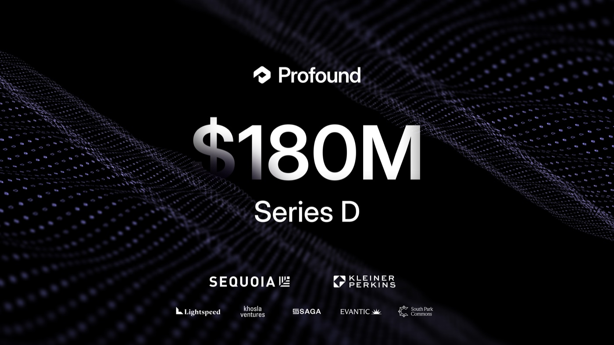
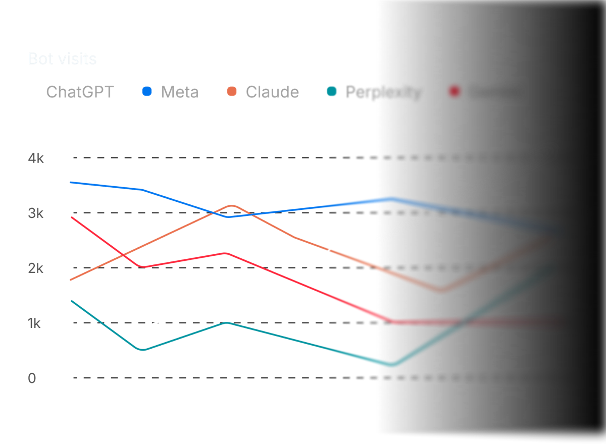

# Rewording the Question Changes Which Brands AI Recommends

_Profound raises a $180M Series D at a $1.8B valuation — an audit finds two paraphrases of one intent overlap at 0.288_

## Executive Summary

> [!callout]
> A company that measures which brands an AI names when it composes an answer, and sells that measurement, announced a Series D on September 15. The company is Profound, based in New York, and the round is $180M at a $1.8B valuation, co-led by Sequoia Capital and Kleiner Perkins. This article looks at what that price was put on, and at the state of the ruler used to measure it.

> Set beside the previous round, the speed shows. At the Series C on February 24 the company was worth $1B. In under seven months the figure is 1.8 times that, and over the same stretch enterprise customers went from more than 700 to more than 1,000. And yet an audit published in May reports that the metric this industry sells reproduces worse than the same sentence run twice does. Most of the recommended list turns over when the same request is put in slightly different words.

> The response from the company named in that paper is the part worth pausing on. Weeks later, Profound's own research blog carried a piece explaining how it designs its measurements. The piece lists phrasing sensitivity as one of three forces that move the numbers, and states that phrasing drives what the model retrieves. The audit points at the same chain. Sections 1 through 4 follow what the company put in its round announcements and that research post, and what the audit paper records. Section 5 carries the question over to data practice, and that reading is this article's own, not something in those documents.

### Key Figures

Sources: [Profound announcement (2026-09-15)](https://www.globenewswire.com/news-release/2026/09/15/3362180/0/en/profound-raises-180m-series-d-at-1-8b-valuation-to-build-the-ai-platform-for-marketing-teams.html) · [Unusual audit paper (arXiv, 2026-05-22)](https://arxiv.org/abs/2605.27440)

<!-- stat-card -->
**$1.8B** — Series D valuation — On $180M raised. February's Series C put the figure at $1B, so under seven months brought a 1.8-fold rise

<!-- stat-card -->
**0.288** — Overlap between cosmetic rewordings — Roughly 55% of the recommended list turns over. A rerun of the untouched sentence turns over 33 to 38%

<!-- stat-card -->
**0.135** — Overlap once a constraint is added — Narrowing "CRM" to "CRM for a SaaS startup" is about enough to swap the list outright

<!-- stat-card -->
**1,000+** — Enterprise customers — More than a third of the Fortune 100. In February the count was over 700. The CEO's letter a day later says 2,500+ brands, counting on a wider basis

## What Happened?

At the front of this round are Sequoia Capital and Kleiner Perkins. Lightspeed Venture Partners, Khosla Ventures, Saga Ventures, Evantic, and South Park Commons came in alongside them. No new name joined. Across the five announcements the company has published, the head of the table has gone around once and come back. Kleiner Perkins led the Series A in June 2025, and Sequoia led the Series B two months later. At February's Series C the two ceded the lead to Lightspeed, and this time they returned together.

The speed of the repricing is the heart of this announcement. The five rounds the company has announced itself, in order:

| Date | Round | Led by | Valuation |
| --- | --- | --- | --- |
| August 2024 | Seed · $3.5M | Khosla · Saga · South Park Commons | Undisclosed |
| June 2025 | Series A · $20M | Kleiner Perkins | Undisclosed |
| August 2025 | Series B · $35M | Sequoia Capital | Undisclosed |
| February 24, 2026 | Series C · $96M | Lightspeed | $1B |
| September 15, 2026 | Series D · $180M | Sequoia · Kleiner Perkins | $1.8B |

Each row comes from the announcement the company published on its own blog for that round. Valuations have been disclosed from the Series C onward. February's Series C press release put total funding at more than $155 million, which puts the tally past $335 million once this round is added. The company was founded in New York in 2024.

*▲ Profound's own Series D announcement graphic | Source: [Profound (tryprofound.com)](https://www.tryprofound.com/blog/series-d)*

Growth figures came out alongside the round. Revenue has tripled over the past six months by the company's own account, and enterprise customers passed 1,000, covering more than a third of the Fortune 100. The company describes itself as a platform used by 16% of the Fortune 500. Seven months ago, in the same spot in the Series C release, those numbers read more than 700 enterprises and more than 10% of the Fortune 500. The customer list names Comcast, The Estée Lauder Companies, Walmart, Campari Group, Royal Bank of Canada, Zoom, ServiceNow, Ramp, Cursor, MongoDB, and Figma. The money goes to expanding an applied AI lab in New York City and San Francisco. That team will study how frontier models perform on marketing work, evaluate their capabilities, and post-train models specifically for marketing.

What the investors bet on comes through in a line from Ilya Fushman, a partner at Kleiner Perkins. Fushman is not a new arrival, having joined the board at the Series A that Kleiner Perkins led. The sentence below restates a position held for fifteen months rather than a fresh verdict.

“As AI becomes a primary interface for search and discovery, marketing is being rebuilt around a new set of workflows.”

The premise is that AI answers are taking over the spot search held as a brand's front door. If the premise holds, how often and in what way a brand's name comes up inside those answers becomes a number worth measuring. This round is the price attached to the job of measuring it.

## What Does This Company Sell?

The category goes by answer engine optimization (AEO) or generative engine optimization (GEO). In place of fighting over which line of the search results a page lands on, the work is fighting to get a brand and its documents cited when an AI composes an answer. The headline number these tools sell usually comes down to one thing. Fire a fixed set of questions at several AI systems on a schedule, count how often the brand's name appears in the answers, and report the result as a ratio against competitors. The industry calls that AI share of voice.

*▲ A bot-visit tracking screen Profound displays on its own homepage | Source: [tryprofound.com](https://www.tryprofound.com)*

Several companies sell some version of this. Otterly, LLM Pulse, HubSpot's AEO Grader, Authoritas, and Semrush all sit in the same space. Profound is the one that has pushed furthest into the enterprise. What the company put at the front of this announcement was not a leaderboard either, but software that does the work. An agent called AI Marketer reads brand data, analyzes AI answers, works out what needs doing, and hands execution to sub-agents. Context Manager holds the brand context those agents work from, and Ads Studio handles ad buying.

The press release names data as the company's own asset: the platform is built on more than two billion real user prompts and still growing. It watches both what people ask AI and what the models say back. James Cadwallader, the co-founder and chief executive, summed up where the company stands.

“Our customers have shown us how much more marketing teams can take on when they have purpose built AI to help them do the work.”

That is the seller's account. The question the buyer wants answered is much simpler. Is our brand showing up more inside AI, or less? A single arrow on a weekly report stands in for the answer. What is that arrow made of?

## How Much Does That Ruler Move?

For the approach to hold, one quiet assumption has to be true. The sentence picked for tracking has to stand in for the buying intent behind it, so that a single line, "best CRM," represents everyone looking into CRMs. Only under that assumption can the difference between this week and last week be read as the model shifting or as run-to-run noise.

An audit posted to arXiv on May 22 tested that assumption directly. The authors took about twenty base questions from commercial contexts and reworded each along five axes: swapping in near-synonyms, changing the grammatical form of the question, adding and removing modifiers, changing region and language, and sliding the scope from broad to narrow. Each variant went to combinations of OpenAI and Anthropic models twenty times over, for roughly 6,000 runs. As a comparison floor they built a separate 6,000 runs in which the sentence was left alone and the same question was reissued thirty times. To settle which brands an answer had recommended, they put the judgment to two different models and counted only what both called a recommendation.

Once they measured how much the recommended lists overlap under each condition, the order turned upside down.
