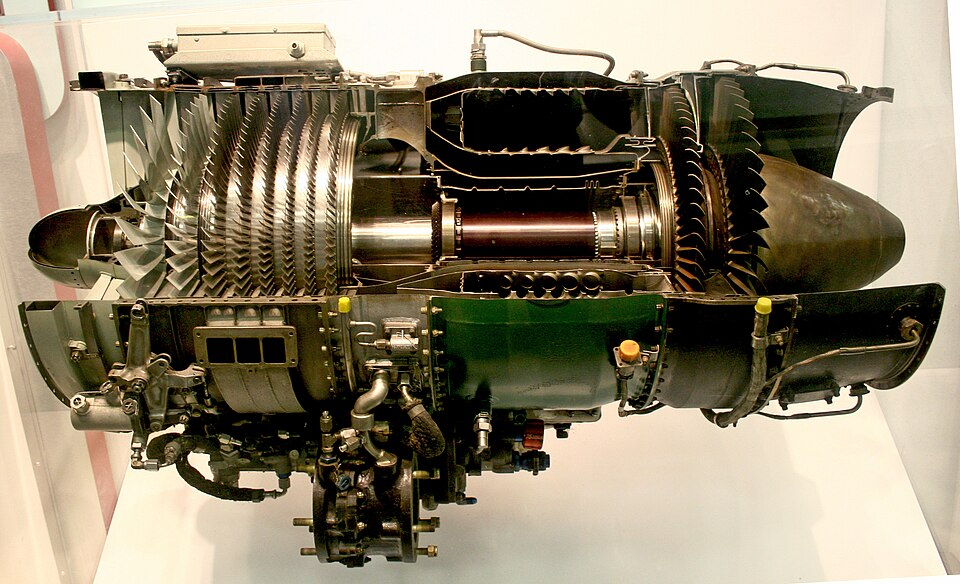
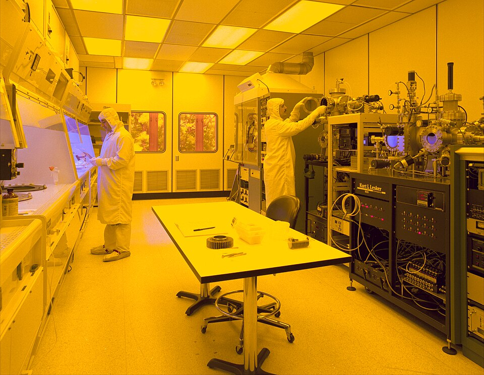
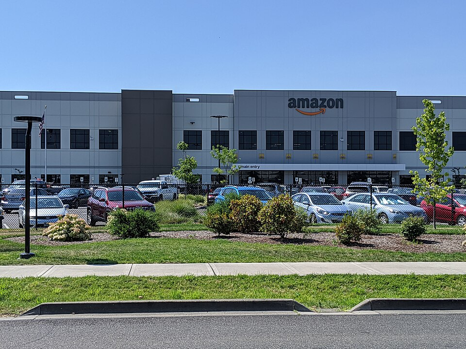

# 베이조스의 AI 회사는 인터넷이 아닌 공장에서 데이터를 가져온다

_OpenAI도 구글도 접근 못 하는 물리 실험 데이터가 Physical AI의 진짜 해자라고 Prometheus는 말한다_

## Executive Summary

> [!callout]
> 2026년 6월 11일, 제프 베이조스가 공동 CEO로 있는 Physical AI 스타트업 Prometheus가 시리즈 B로 120억 달러를 조달했다고 공개됐다. 기업 가치는 410억 달러. 설립 7개월, 직원 150명 회사에 투자자들이 붙인 가격표다. 그렇다면 그 410억 달러는 대체 무엇에 매겨진 값일까.

> 회사가 내세운 해자는 모델이 아니다. 베이조스는 직접 "우리는 우리만의 데이터셋을 만들어야 한다. 학습 데이터가 당신들이 익숙한 LLM의 것과 완전히 다르다"고 말했다. 터빈 테스트 셀과 웨이퍼 팹에서 나오는 물리 실험 데이터는 인터넷에 없고, 그래서 OpenAI도 구글도 스크래핑할 수 없다. 투자자들이 410억 달러를 베팅한 대상은 이 접근 불가능성 그 자체다.

> 모델이 빠르게 평준화되는 지금, 가치를 가르는 것은 누가 더 좋은 모델을 가졌느냐가 아니라 누가 남이 못 가진 데이터를 가졌느냐로 옮겨가고 있다. Prometheus는 그 명제에 붙은 가장 비싼 영수증이다.

### 주요 수치

이 회사의 규모와 야심을 가장 압축적으로 보여 주는 건 네 개의 숫자다. 5개월 만에 밸류에이션이 여섯 배로 뛰었고, 회사가 노리는 시장은 디지털 AI 시장의 수십 배다. 그리고 그 시장의 데이터를 직접 손에 넣기 위해, 모델 회사를 넘어서는 규모의 자금이 따로 움직이고 있다.

출처: [TechCrunch](https://techcrunch.com/2026/06/11/jeff-bezoss-prometheus-raises-12b-to-build-an-artificial-general-engineer-for-the-physical-world/) · [GeekWire](https://www.geekwire.com/2026/bezos-ai-startup-prometheus-raises-12b-at-41b-valuation-and-the-ceos-explain-what-theyre-doing/)

<!-- stat-card -->
**120억 달러** — 시리즈 B 조달액 — 5개월 만에 밸류에이션 6배 상승

<!-- stat-card -->
**410억 달러** — 기업 가치 — 누적 조달 180억 달러 이상

<!-- stat-card -->
**70조 달러** — 물리 경제 TAM — 1조 미만 디지털 AI 시장의 약 70배

<!-- stat-card -->
**1,000억 달러** — 추진 중 홀딩 컴퍼니 — 산업 기업 인수로 운영 데이터 독점

## Prometheus가 만드는 건 로봇이 아니다

Prometheus는 2025년 11월에 세워졌고 2026년 6월에 모습을 드러냈다. 제프 베이조스와 Vik Bajaj가 공동 CEO를 맡는다. Bajaj는 구글의 생명과학 부문 Verily를 공동 창업하고 암 조기진단 기업 GRAIL에서 최고과학책임자를 지낸 과학자다. 베이조스가 사업과 자본을, Bajaj가 과학 기반을 댄다. 직원은 150명, 사무소는 샌프란시스코·런던·취리히에 있다.

*▲ 제프 베이조스 — Prometheus AI 공동 CEO | Source: [Wikimedia Commons](https://commons.wikimedia.org/wiki/File:Jeff_Bezos_2016.jpg) (CC BY 2.0)*

회사가 만들겠다는 것은 "인공 일반 엔지니어(Artificial General Engineer)"다. 제트 엔진, 반도체 칩, 의약품 화합물처럼 복잡한 물리 시스템을 설계하고 제조하는 과정을 자동화하는 소프트웨어를 가리킨다. 아이디어에서 설계, 프로토타입, 제조로 이어지는 이른바 발명 루프를 열 배 빠르게 돌리는 것이 목표다. 칩과 스마트폰부터 마천루와 다리, 신약까지가 대상이다.

*▲ GE J85 터보젯 엔진 단면 — AGE가 설계·제조를 자동화하려는 복잡한 물리 시스템의 예 | Source: [Wikimedia Commons](https://commons.wikimedia.org/wiki/File:J85_ge_17a_turbojet_engine.jpg) (CC BY-SA 3.0)*

주의할 점은 이것이 로봇이나 공장 자동화 플레이가 아니라는 것이다. Prometheus가 겨냥하는 단계는 물건을 조립하는 현장이 아니라, 물건을 어떻게 만들지 결정하는 설계와 엔지니어링이다. 일론 머스크는 이를 두고 "카피캣"이라 했지만, 회사가 잡으려는 자리는 물리 세계의 두뇌에 가깝다.

## 왜 410억인가 — 데이터 해자의 가격표

설립 7개월 된 회사가 410억 달러를 인정받은 근거는 모델 성능이 아니다. 베이조스가 직접 짚은 것은 데이터다. "우리는 우리만의 데이터셋을 만들어야 한다. 학습 데이터가 당신들이 익숙한 LLM의 것과 완전히 다르다." 이 한 문장에 회사의 전략 전체가 들어 있다.

오늘날 거대 언어 모델은 인터넷을 긁어 학습한다. Reddit, Wikipedia, 뉴스, 코드 저장소처럼 누구나 접근할 수 있는 텍스트가 재료다. 바로 그래서 이 데이터는 해자가 되지 못한다. OpenAI가 긁을 수 있으면 구글도, 앤트로픽도 긁을 수 있다. 모델 성능이 비슷해지는 이유의 절반은 학습 재료가 같은 우물에서 나오기 때문이다.

물리 실험 데이터는 그 우물에 없다. 제트 엔진 터빈을 테스트 셀에서 한계까지 돌릴 때 나오는 응력과 온도, 반도체 웨이퍼 팹에서 공정 한 단계마다 쌓이는 허용 오차, 소재가 어떤 조건에서 어떻게 변형되는지 기록한 공학 사양서. 이런 데이터는 인터넷에 올라오지 않는다. 합성으로 지어낼 수도 없다. 실제 기계를 실제로 돌려 본 곳에만 있다.

*▲ 반도체 클린룸 — 이 공간에서 나오는 제조 공정 데이터는 인터넷에 없고 스크래핑할 수 없다 | Source: [Wikimedia Commons](https://commons.wikimedia.org/wiki/File:Clean_room.jpg)*

### 2.1. 스크래핑할 수 있는 것과 없는 것

같은 "데이터"라도 두 종류는 성격이 완전히 다르다. 한쪽은 누구나 접근할 수 있어 경쟁 우위가 되지 못하고, 다른 한쪽은 물리적으로 접근 자체가 막혀 있어 그 자체가 방어선이 된다. Prometheus가 베팅한 것은 후자다.

#### 누구나 긁을 수 있는 데이터

- •웹 텍스트 — Reddit, Wikipedia, 뉴스, 코드
- •공개 이미지·영상 — 인터넷에 올라온 모든 것
- •결과: 모델 성능이 서로 비슷해진다

#### 아무도 못 긁는 데이터

- •터빈 테스트 셀의 응력·온도 기록
- •반도체 팹의 제조 허용 오차, 소재 과학 데이터
- •결과: 가진 쪽만 만들 수 있는 모델이 된다

5개월 만에 밸류에이션이 여섯 배로 뛴 사실은 이 논리에 돈이 따라붙었음을 보여 준다. JPMorgan, Goldman Sachs, BlackRock 같은 곳이 베팅한 대상은 더 똑똑한 모델이 아니라, 남이 가질 수 없는 데이터를 가질 수 있다는 전망이다. 시장 크기도 이 베팅을 받쳐 준다. 전 세계 제조업만 따져도 16조 달러인데, 여기에 항공우주와 건설, 에너지까지 더한 물리 경제 전체는 70조 달러에 이른다. 1조 달러에 못 미치는 디지털 AI 시장의 약 70배다. 데이터가 막혀 있는 만큼, 그 데이터를 손에 넣은 쪽이 노릴 수 있는 시장도 그만큼 크다.

> [!callout]
> 물리 세계는 코드만으로는 만들 수 없는 해자를 만든다. 모델 아키텍처는 논문으로 공개되고 가중치는 증류로 복제되지만, 터빈을 실제로 돌려 얻은 데이터는 그 터빈을 가진 쪽에만 쌓인다. 410억 달러는 모델이 아니라 이 접근 불가능성에 매겨진 값이다.

## 공장을 사들이는 이유

데이터가 해자라면, 다음 질문은 단순하다. 그 데이터를 어떻게 손에 넣을 것인가. 베이조스의 답은 데이터를 만드는 공장 자체를 사는 것이다. FT와 WSJ 보도에 따르면 그는 제조·공학·설계 기업을 인수하기 위한 별도의 홀딩 컴퍼니에 1,000억 달러 규모의 자금을 모으고 있다. 베이조스 본인은 CNBC에서 "우리 기술의 덕을 볼 수 있는 회사들의 일부를 사들일 수도 있다"고 말했다.

구조는 아마존의 플라이휠과 똑같다. 산업 기업을 인수하면 그 회사가 매일 돌리는 설비에서 운영 데이터가 나온다. 그 데이터로 Prometheus 모델을 학습시키면 모델이 좋아지고, 좋아진 모델은 그 기업의 경쟁력을 높여 더 많은 데이터를 만든다. 아마존이 3P 셀러의 거래 데이터를 직접 소유해 플랫폼 우위를 키웠듯, 이번엔 물리 세계의 제조 데이터를 직접 소유하려는 것이다. 타깃 섹터는 칩 제조, 항공우주, 방위 산업이고, 중동과 싱가포르 국부 펀드와도 협의 중이라고 알려졌다.

*▲ 아마존 물류센터 — 아마존 플라이휠(데이터 소유 → 경쟁력 강화)을 물리 AI로 확장하려는 베이조스의 전략 | Source: [Wikimedia Commons](https://commons.wikimedia.org/wiki/File:Amazon_fulfillment_center_-_Troutdale_Oregon.jpg) (CC BY-SA 4.0)*

여기서 데이터는 더 이상 모델을 위한 연료에 그치지 않는다. 데이터를 만드는 자산을 사기 위해 자본이 움직이고, 그 자산이 다시 데이터를 낳는다. 데이터가 자본이 되고 자본이 데이터를 사는 순환이다. 모델은 누구나 만들 수 있지만, 이 순환에 올라타려면 데이터를 낳는 물리 자산을 가져야 한다.

<!-- stat-card -->
****Editor's Note.** 페블러스가 오래 말해 온 명제가 하나 있다. 모델이 상품화될수록 가치를 가르는 것은 모델이 아니라 데이터라는 것이다. Prometheus는 그 명제에 410억 달러짜리 영수증을 붙였다. 거대 자본이 모델이 아니라 "아무도 못 가진 데이터"에 베팅했다는 사실은, Physical AI에서 데이터가 곧 자본이라는 말을 70조 달러 규모로 실증한다. 데이터의 출처와 품질, 접근 가능성을 다루는 일이 왜 핵심 역량인지를, 이 사건은 가장 비싼 방식으로 보여 준다.**

## 참고문헌

### R.1. 업계·보도

- 1.TechCrunch. (2026). "[Jeff Bezos's Prometheus raises $12B to build an 'artificial general engineer' for the physical world](https://techcrunch.com/2026/06/11/jeff-bezoss-prometheus-raises-12b-to-build-an-artificial-general-engineer-for-the-physical-world/)." — 시리즈 B 120억 달러, 410억 달러 밸류에이션, "artificial general engineer" 개념.
- 2.Axios. (2026). "[Bezos-backed Prometheus targets industrial AI](https://www.axios.com/2026/06/11/prometheus-bezos-industrial-ai)." — 410억 달러 밸류에이션, 산업 AI 포지셔닝.
- 3.GeekWire. (2026). "[Bezos AI startup Prometheus raises $12B at $41B valuation, and the CEOs explain what they're doing](https://www.geekwire.com/2026/bezos-ai-startup-prometheus-raises-12b-at-41b-valuation-and-the-ceos-explain-what-theyre-doing/)." — 베이조스·Vik Bajaj 공동 CEO 인터뷰, 데이터셋 발언.

읽어주셔서 감사합니다. 모델이 평준화되는 시대에 진짜 경쟁 우위가 어디서 오는지, 그 답이 점점 데이터로 모이고 있다고 믿습니다. 남이 못 가진 데이터를 어떻게 만들고 지킬 것인가라는 질문에 생각이나 반론이 있으시면 언제든 나눠 주세요.

**(주)페블러스 데이터 커뮤니케이션팀**  
2026년 6월 20일
