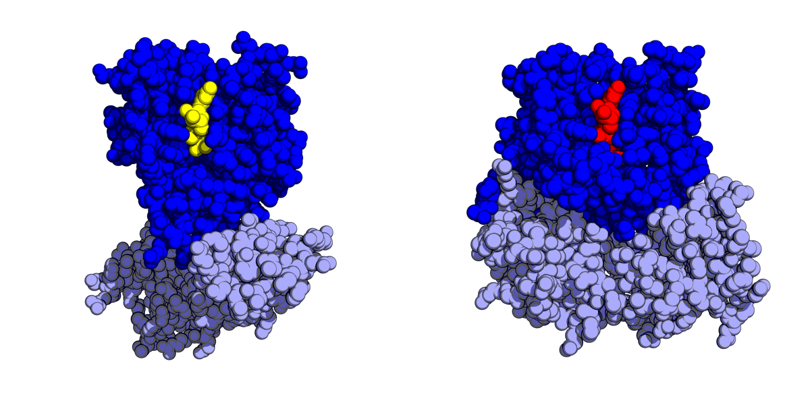
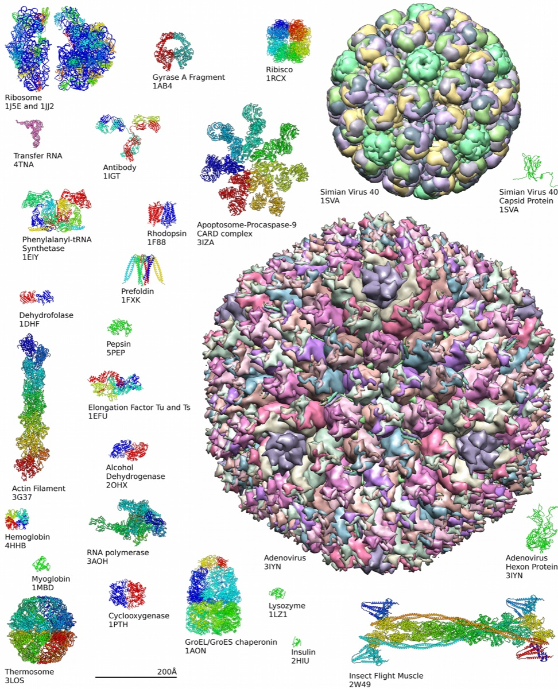

# 존재하지 않는 데이터로 단백질의 움직임을 배우는 확산모델

_정본 궤적 데이터가 없는 단백질 동역학 연구, BioEmu와 AlphaFlow는 없는 데이터를 만들어 학습한다_

## Executive Summary

> [!callout]
> 알파폴드는 단백질이 어떤 3차원 모양으로 접히는지를 놀라운 정확도로 풀었습니다. 그런데 단백질의 기능은 그 정지된 한 장의 형태가 아니라, 형태가 시시각각 흔들리고 바뀌는 방식에서 나옵니다. 2026년 로드맵 논문의 표현을 빌리면, 서열에서 동적 구조 변화가 어떻게 일어나는지에 대한 정량적 이해는 아직 해결되지 않았습니다. 이 글은 그 미해결의 이유가 모델이 아니라 데이터에 있다는 점을 봅니다.

> 알파폴드가 성공한 진짜 배경은 PDB라는 희귀하게 깨끗한 데이터셋이었습니다. 실험으로 검증된 22만 개가 넘는 구조가 정답으로 쌓여 있었고, 지금도 새 구조가 꾸준히 공급됩니다. 반면 단백질의 움직임에는 그런 정본 궤적 데이터셋이 없습니다. 공개된 동역학 데이터는 ATLAS 1,390개, GPCRmd 705개 수준으로, 정적 구조 데이터보다 서너 자릿수 작습니다.

> 그래서 연구팀들은 시뮬레이션과 생성모델로 아직 존재하지 않는 데이터를 직접 만들어 그 공백을 메우고 있습니다. BioEmu는 자체 생산한 방대한 분자 동역학 데이터로 학습했고, DiffEnsemble은 정적 구조에 숨어 있는 동역학의 흔적을 추출해 확산모델의 학습 근거로 삼았습니다. 정답이 없는 곳에서 무엇을 학습의 근거로 세울 것인가 — AI-Ready Data의 다음 국경이 여기서 열립니다.

### 주요 수치

정적 구조와 동역학 사이의 데이터 격차를 네 숫자로 압축하면 다음과 같습니다. 알파폴드가 학습한 실험 구조의 규모, 그와 대비되는 동역학 데이터셋의 규모, 데이터가 없어 직접 만들어 낸 시뮬레이션의 분량, 그리고 정적 데이터에서 동역학을 끌어낸 최신 모델의 개선 폭입니다.

출처: [Cui et al., Briefings in Bioinformatics (2025)](https://academic.oup.com/bib/article/26/4/bbaf340/8202937) · BioEmu (Nature Methods, 2025) · DiffEnsemble (bioRxiv, 2026)

<!-- stat-card -->
**22만+** — PDB 실험 구조 — 알파폴드가 학습한 정답 데이터

<!-- stat-card -->
**1,390개** — ATLAS 동역학 단백질 — 정적 구조 대비 100배 이상 작은 규모

<!-- stat-card -->
**200ms** — BioEmu 자체 생산 MD — 없어서 직접 만든 학습 데이터

<!-- stat-card -->
**+28.9%** — DiffEnsemble RMSD 개선 — 정적 구조에서 동역학을 추출

## 기능은 정지 사진에 담기지 않는다

알파폴드가 푼 문제는 명확합니다. 아미노산 서열을 넣으면 그 단백질이 어떤 3차원 모양으로 접히는지를, 실험에 맞먹는 정확도로 예측합니다. 수십 년 동안 실험실이 몇 달씩 매달려야 하나를 얻던 구조를, 이제는 몇 분 만에 화면에 띄웁니다. 생명과학의 오랜 병목 하나가 이렇게 풀렸습니다.

그런데 그 예측은 한 장의 정지 사진에 가깝습니다. 단백질은 세포 안에서 가만히 있지 않습니다. 끊임없이 접혔다 펴지고, 도메인이 열리고 닫히며, 다른 분자와 만나 잠깐 새로운 모양을 만듭니다. 효소가 반응을 촉진하고, 수용체가 신호를 전달하고, 약물이 결합 포켓에 들어앉는 일 대부분이 이 움직임 위에서 벌어집니다. 기능은 형태 그 자체보다, 형태가 흔들리는 방식에 담겨 있습니다.

구조생물학은 이 둘을 다른 이름으로 부릅니다. 하나는 정적 구조, 즉 특정 조건에서 관측된 단일 형태입니다. 다른 하나는 동역학, 즉 단백질이 오갈 수 있는 여러 형태의 집합인 구조체 앙상블과 그 사이를 잇는 경로입니다. 알파폴드류의 성과는 앞쪽에 집중돼 있습니다. 2026년에 43명의 연구자가 함께 낸 로드맵 논문은 이 대비를 정면으로 짚으며, 서열에서 동적 구조 변화와 고차 조립이 어떻게 일어나는지에 대한 정량적 이해가 아직 해결되지 않았다고 적었습니다.

*▲ 같은 단백질(EF-Tu)도 결합한 리간드에 따라 형태가 달라진다 — 왼쪽은 GDP(노랑), 오른쪽은 GDP 유사체 GDPNP(빨강) 결합 상태 | Source: [Wikimedia Commons](https://commons.wikimedia.org/wiki/File:EF-Tu_conformations.png)*

> [!callout]
> 정지 사진이 무의미하다는 뜻은 아닙니다. 오히려 그 사진이 있었기에 다음 질문을 던질 수 있게 됐습니다. 이제 남은 문제는 사진 여러 장을, 그것도 사진과 사진 사이의 연결까지 예측하는 일입니다. 그리고 바로 이 지점에서 문제의 성격이 모델에서 데이터로 옮겨 갑니다.

## 알파폴드가 성공한 진짜 이유

알파폴드의 성공은 흔히 모델 설계의 승리로 이야기됩니다. 물론 그 아키텍처는 뛰어났습니다. 그러나 그 앞에는 조용히 자리를 지킨 조건이 하나 있었습니다. PDB, 즉 단백질 데이터 뱅크라는 데이터셋입니다. X선 결정학, NMR, 극저온 전자현미경으로 원자 수준까지 검증된 실험 구조가 22만 건 넘게 축적된 공개 저장소입니다.

이 데이터가 왜 특별한지는 세 가지로 나뉩니다. 첫째, 정답이 실험으로 검증돼 있습니다. 모델이 흉내 낼 대상이 추정이 아니라 실측입니다. 둘째, 규모가 큽니다. 수십만 개의 서로 다른 단백질이 어떻게 접히는지를 보여 주는 사례가 쌓여 있습니다. 셋째, 정답이 지금도 신선하게 공급됩니다. 알파폴드는 학습 시점 이후에 새로 제출된 구조로도 검증받았고, 큐레이션된 벤치마크뿐 아니라 처음 보는 신규 구조에도 일반화됐습니다.

*▲ PDB·EMDB에 쌓인 22만+ 구조의 일부 — 리보솜부터 인슐린까지, 알파폴드가 학습한 정답 데이터의 다양성 | Source: [Wikimedia Commons](https://commons.wikimedia.org/wiki/File:Protein_structure_examples.png)*

이 조건들을 한 문장으로 묶으면, 정답이 있고 그 정답이 꾸준히 공급된다는 것입니다. 지도학습에서 이보다 좋은 출발점은 드뭅니다. 알파폴드가 특별했던 만큼, 알파폴드가 딛고 선 데이터도 특별했습니다. 그래서 다음 질문이 자연스럽게 따라옵니다. 동역학에도 이런 데이터셋이 있을까요.

## 동역학엔 정본 데이터가 없다

결론부터 말하면 없습니다. 그리고 이 부재가 동역학이 아직 안 풀린 근본 이유입니다. 후속 알파폴드가 나오지 않아서가 아니라, 후속 알파폴드가 학습할 정답이 없어서입니다.

공개된 동역학 데이터셋의 규모를 정적 구조와 나란히 두면 격차가 분명해집니다. 분자 동역학 시뮬레이션을 통일된 프로토콜로 모은 ATLAS가 1,390개 단백질, 도메인 단위로 넓힌 mdCATH가 5,398개, 특정 수용체 계열로 좁힌 GPCRmd가 705개입니다. 반면 PDB는 실험 구조 22만 건, 알파폴드 데이터베이스는 예측 구조 1억 건이 넘습니다. 동역학 데이터는 세 자릿수에서 네 자릿수만큼 작습니다.

규모만 문제가 아닙니다. 2025년 Briefings in Bioinformatics에 실린 리뷰는 기존 정적 데이터베이스가 제한된 동적 정보만 담고 있다고 명시합니다. 정적 데이터베이스는 특정 조건에서의 단일 안정 구조만 기록하고, 그것을 보완할 분자 동역학 데이터는 밀리초 규모로 제한되며 계산 비용이 큽니다. 시간에 따라 변하는 구조를 직접 측정하는 실험 자체가 극히 어렵고 느립니다. 정지 사진은 쉽게 찍히지만, 움직임을 담은 영상은 좀처럼 얻어지지 않습니다.

> [!callout]
> 알파폴드에게는 PDB라는 정본이 있었고, 동역학에는 그에 대응하는 정본 궤적 데이터셋이 없습니다. 문제를 다시 정의하면 이렇게 됩니다. 모델을 어떻게 더 키울 것인가가 아니라, 학습시킬 정답을 어디서 구할 것인가. 정답이 세상에 아직 충분히 존재하지 않을 때, 연구팀은 무엇을 할 수 있을까요.

## 없는 데이터를 만드는 팀들

답은 의외로 단순합니다. 없으면 만듭니다. 지금 이 분야의 여러 팀이 서로 다른 방식으로 아직 존재하지 않는 데이터를 생산해 학습의 공백을 메우고 있습니다. 세 가지 접근이 대표적입니다.

### 4.1. 직접 시뮬레이션해서 만든다 — BioEmu

마이크로소프트 리서치의 BioEmu는 조건부 확산모델로 단백질의 구조체 앙상블을 샘플링합니다. 학습에는 알파폴드 데이터베이스의 예측 구조에 더해, 팀이 자체적으로 돌린 200밀리초 분량의 분자 동역학 시뮬레이션 데이터를 썼습니다. 정본 궤적 데이터셋이 없으니, 슈퍼컴퓨터로 초대규모 시뮬레이션을 직접 생산해 학습 재료로 삼은 것입니다. 그 결과 기존 시뮬레이션보다 최대 10만 배 빠르게 통계적으로 독립적인 구조 샘플을 얻고, 도메인의 개폐 운동이나 평소 닫혀 있는 숨은 결합 포켓 같은 신약 개발에 직결되는 움직임을 포착합니다.

### 4.2. 정적 데이터를 흐름으로 바꾼다 — AlphaFlow

AlphaFlow는 알파폴드와 ESMFold를 흐름매칭 기법으로 미세조정해, 단일 구조 예측기를 여러 형태를 뽑아내는 생성기로 바꿨습니다. 여기서도 동역학의 정답 데이터는 귀했습니다. 분자 동역학으로 미세조정한 버전은 겨우 82개 단백질로 학습했습니다. 정적이고 풍부한 데이터로 먼저 몸을 만든 뒤, 동적이고 희귀한 데이터로 마지막을 다듬는 구조입니다. 이 선 풍부 후 희귀의 패턴은 이 분야 거의 모든 모델이 공유합니다.

### 4.3. 정지 사진 안의 움직임을 캐낸다 — DiffEnsemble

가장 흥미로운 발상은 DiffEnsemble입니다. 새 데이터를 만드는 대신, 이미 있는 정적 구조 데이터 안에 동역학의 흔적이 잠재해 있다고 봤습니다. PDB의 정적 구조에서 잠재적 동역학 표현을 학습하고, 알파폴드 데이터베이스의 구조 프로필을 조건부 가이드로 결합해 확산 과정을 이끕니다. ATLAS의 72개 타깃 벤치마크에서, 앙상블의 형태 다양성을 재는 pairwise RMSD 상관계수는 AlphaFlow 대비 28.9% 높았고 유연성 지표인 RMSF 상관계수는 11.3% 높았습니다. 타깃의 42%에서 단백질의 주된 운동을 정확히 짚었습니다.

*▲ 페블러스 원본 도식 — BioEmu·AlphaFlow·DiffEnsemble이 없는 동역학 데이터를 만드는 세 가지 방식*

세 접근 모두 인상적이지만, 공통의 그림자가 있습니다. 정답이 없으니 검증도 어렵다는 점입니다. 생성모델은 구조적으로는 그럴듯한데 실제로는 기능하지 않는 가짜 단백질을 만들어 낼 수 있고, 그것이 진짜인지 판별할 실측 기준이 마땅치 않습니다. 게다가 흔히 쓰는 RMSD나 TM-score는 정적인 형태의 유사성만 잽니다. 움직임을 평가하려면 RMSF나 RMWD 같은 새 지표가 필요한데, 아직 표준으로 자리 잡지 못했습니다. 무엇을 만들지뿐 아니라, 만든 것을 무엇으로 채점할지도 함께 열려 있는 문제입니다.

이 그림자를 그냥 두는 것은 아닙니다. 최근 연구들은 생성모델이 빠르게 뽑아낸 구조를 다시 분자 동역학이나 마르코프 상태모델에 통과시켜, 각 형태가 실제로 얼마나 자주 나타나고 에너지 지형의 어디에 놓이는지를 물리 법칙으로 되짚습니다. 생성모델이 후보를 던지면 물리 시뮬레이션이 그중 무엇이 진짜인지 걸러 내는 분업인 셈입니다. 만든 데이터를 만든 자리에서 다시 검증하는 이 방식은, 생성모델 하나만으로는 물리량이 부정확하다는 한계를 인정하면서, 정답이 아직 없는 문제에서 신뢰를 세우는 현재의 현실적 해법으로 자리 잡고 있습니다.

## 정제할 데이터가 아니라 없는 데이터

지금까지 AI-Ready Data 논의는 대체로 이미 있는 데이터를 어떻게 다루느냐에 머물렀습니다. 흩어진 데이터를 모으고, 지저분한 데이터를 닦고, 라벨을 붙이고, 정본으로 정리하는 일입니다. 데이터가 어딘가에 존재한다는 전제 위에서 품질을 끌어올리는 작업이었습니다.

단백질 동역학은 그 전제 자체가 흔들리는 자리를 보여 줍니다. 여기서는 정제할 데이터가 지저분한 것이 아니라, 학습에 쓸 정답이 아예 충분히 존재하지 않습니다. 다음 국경은 정제가 어려운 데이터가 아니라, 없는 데이터입니다. 그리고 이 국경에서는 질문이 달라집니다. 어떻게 닦을 것인가가 아니라, 정답이 없는 곳에서 무엇을 학습의 근거로 삼을 것인가.

시뮬레이션과 생성모델로 만들어 낸 데이터는 그 답의 한 형태입니다. 다만 만든 데이터에는 새로운 책임이 따라붙습니다. 이 데이터가 현실을 얼마나 반영하는지, 어디까지 믿어도 되는지, 무엇으로 검증할지를 함께 설계하지 않으면, 그럴듯하지만 틀린 데이터가 학습을 오염시킵니다. 데이터를 만드는 능력과 만든 데이터를 신뢰할 수 있게 만드는 능력은 다른 문제입니다.

> [!callout]
> **Editor's Note.** 페블러스가 데이터 품질을 이야기하는 이유가 이 지점에 닿아 있습니다. 데이터를 닦는 일에서 시작했지만, 앞으로 더 중요해질 물음은 데이터가 없을 때 무엇을 근거로 세울 것인가입니다. 만든 데이터의 신뢰를 어떻게 검증할지, 정답이 없는 문제를 무엇으로 채점할지 — 단백질의 움직임을 배우려는 이 시도가, 데이터가 앞서 다녀야 할 다음 길을 미리 보여 줍니다.

알파폴드는 한 장의 구조를 풀었고, 그 뒤에는 PDB라는 흔치 않게 깨끗한 데이터가 있었습니다. 움직임을 풀려는 다음 도전은 모델이 아니라 데이터에서 막혀 있고, 그래서 팀들은 없는 데이터를 스스로 만들어 앞으로 나아가는 중입니다. 정답이 아직 세상에 없을 때 무엇을 근거로 배울 것인가 — 이 질문을 함께 들여다봐 주셔서 고맙습니다.

**(주)페블러스 데이터 커뮤니케이션팀**  
2026년 7월 24일

## 참고문헌

### 핵심 논문

- 1.Griffié, J. et al. (2026). "[Protein Dynamics Beyond Structure Prediction](https://arxiv.org/abs/2606.08647)." arXiv preprint.
- 2."[Exploring protein conformational ensembles using evolutionary conditional diffusion](https://www.biorxiv.org/content/10.64898/2026.01.30.702768v1.full)" (DiffEnsemble). bioRxiv (2026).
- 3.Cui, X. et al. (2025). "[Beyond static structures: protein dynamic conformations modeling in the post-AlphaFold era](https://academic.oup.com/bib/article/26/4/bbaf340/8202937)." Briefings in Bioinformatics, 26(4), bbaf340.
- 4.Lewis, S. et al. (2025). "[Scalable emulation of protein equilibrium ensembles with generative deep learning](https://www.science.org/doi/10.1126/science.adv9817)." Science.
- 5.Jing, B., Berger, B., Jaakkola, T. (2024). "[AlphaFold Meets Flow Matching for Generating Protein Ensembles](https://arxiv.org/abs/2402.04845)." ICML 2024.
- 6.Jumper, J. et al. (2021). "[Highly accurate protein structure prediction with AlphaFold](https://www.nature.com/articles/s41586-021-03819-2)." Nature, 596, 583-589.

### 데이터셋

- 7.Vander Meersche, Y. et al. (2024). "[ATLAS: protein flexibility description from atomistic molecular dynamics simulations](https://academic.oup.com/nar/article/52/D1/D384/7438909)." Nucleic Acids Research, 52(D1), D384-D392.
- 8.Mirarchi, A., Giorgino, T., De Fabritiis, G. (2024). "[mdCATH: A Large-Scale MD Dataset for Data-Driven Computational Biophysics](https://www.nature.com/articles/s41597-024-04140-z)." Scientific Data.

### 도구·저장소

- 9.Microsoft Research. "[bioemu: Inference code for scalable emulation of protein equilibrium ensembles with generative deep learning](https://github.com/microsoft/bioemu)." GitHub.
