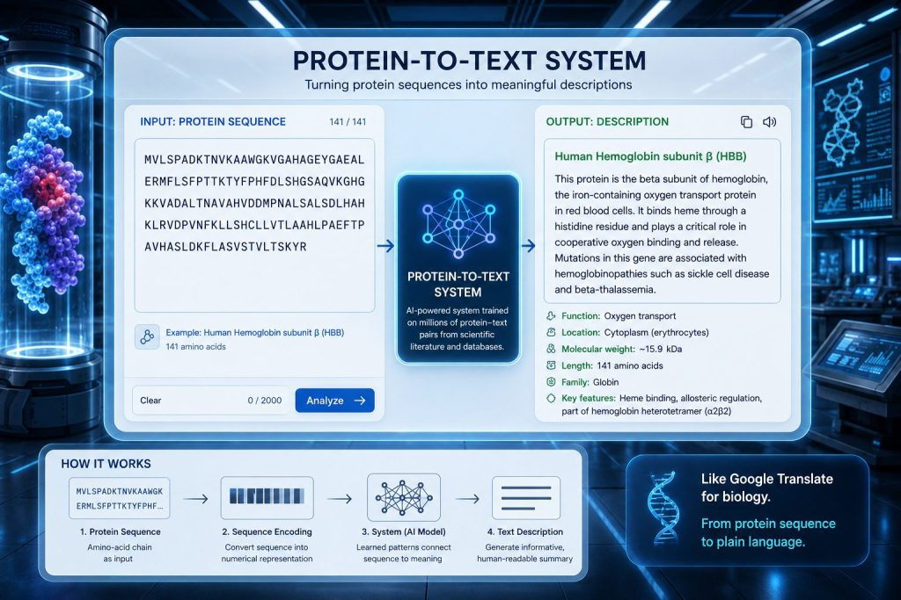

# The AI Language Model That Describes Proteins Nobody Has Characterized

_Technion and Tel Aviv_

## Executive Summary

> [!callout]
> A joint team from the Technion and Tel Aviv University has released an AI called **BetaDescribe** (PNAS, July 2026). Feed it a protein sequence and it returns plain-language sentences describing what the protein does. The point is that it can attach a description even to proteins that older methods could not touch because no similar sequence exists. This article looks at what makes those descriptions trustworthy, through the lens of data quality.

> The team split the work into a generator, validators, and a judge, building a structure that scores itself, and reported success in describing six proteins whose properties were previously unknown. But the judge and the validators are not experimentally confirmed ground truth; they are yet another learned model that predicts properties from sequence. Because the side that produces the answer and the side that grades it belong to the same family, the question stands: when AI labels data that has no ground truth, who grades the label?

> This is a problem we already lived through in text and code, now arriving in biological data. The difference is that with text a human can later read it and catch the error, whereas for a protein that has never been assayed, that after-the-fact check does not exist at all.

### Key Figures

The four numbers below compress the backdrop of this article. Sequences have piled up past 200 million, yet only a tiny share have human-verified function, and generative annotation that turns sequences into sentences has already shipped into databases at the scale of tens of millions. By contrast, the sample where BetaDescribe reported success is six. The gap is large, generation is already at scale, and verification is still small.

Source: UniProt statistics and [phys.org (2026)](https://phys.org/news/2026-07-ai-protein-sequences-text-reveal.html)

<!-- stat-card -->
**200M+** — Sequences in UniProt — Only a tiny share are experimentally verified

<!-- stat-card -->
**570K vs 250M** — Swiss-Prot vs TrEMBL — Human curation vs automatic annotation

<!-- stat-card -->
**49M** — Sequences annotated by ProtNLM — Generative annotation has already shipped

<!-- stat-card -->
**6** — Proteins BetaDescribe validated — Promising, but the sample is small

## Sequences Overflow, Function Stays Blank

The protein database UniProt holds more than 200 million amino-acid sequences. As sequencing costs keep falling, new sequences keep arriving fast. The problem is that only a tiny fraction of them have a known function, that is, a description of what the sequence actually does. The letters of the sequence overflow, but their meaning is mostly left blank.

*▲ An illustration representing a protein of unknown function (generated with ChatGPT) | Source: [Technion](https://www.technion.ac.il/en/blog/article/the-language-of-proteins/)*

This gap is sharply visible inside UniProt itself. **Swiss-Prot**, where humans read the literature and curate annotations by hand, holds only about 570,000 entries. **TrEMBL**, where a computer fills in annotations automatically, exceeds 250 million. The difference in scale between hand-polished high-quality annotation and machine-applied bulk annotation is the fundamental structure of this field.

The traditional way to figure out function was to find a similar protein. If a sequence resembles one whose function is already known, that description is copied over. Similarity searches like BLAST are the classic example. But when no similar protein exists, this approach cannot produce an answer. The more novel and unfamiliar a protein is, the more likely it is to be left blank.

## What BetaDescribe Does

BetaDescribe aims at this blank. Input a protein sequence and it lays out properties in plain-language sentences: the protein's function, its catalytic activity, the metabolic pathways it takes part in, where it settles inside the cell. It is close to a translator that renders the letter string of a sequence into a description a person can read. The underlying language model is a LLAMA2-family model pretrained on large-scale text.

*▲ Concept diagram of a protein-to-text system: sequence in, sentence out (example image generated with ChatGPT) | Source: [Technion](https://www.technion.ac.il/en/blog/article/the-language-of-proteins/)*

Its biggest distinction is that it is designed to work even when no similar sequence exists. It can attempt a description for the unknown proteins that homology-based methods cannot touch, so it is introduced as a complement to existing automatic annotation. The team also suggests it can be used for in-silico mutation experiments that probe, from sequence alone, which residues or regions matter to function.

The team reported success in generating descriptions for six proteins whose properties were previously unknown. It is a case that shows promise, but six is still a small sample for talking about large-scale deployment. A question naturally follows here. For a description attached to a protein with no known answer, how do we confirm that it is correct?

## Generate, Validate, Judge. But the Judge Is a Model Too

BetaDescribe's answer is to divide the roles. Three components take on different jobs.

- The **Generator** takes a sequence and produces several candidate sentences describing the function.
- The **Validators**, independently of the generator, predict relatively simple properties such as subcellular location directly from the sequence.
- The **Judge** compares the generator's candidates against the validators' predictions to decide whether to accept or reject them, keeping up to three descriptions per protein as final candidates.

Since there is no guarantee that what is generated is correct, a separate scoring layer was placed on top. Separating the side that produces from the side that grades is reasonable in itself. If you let the generator grade itself, it tends to be generous toward the answers it wrote.
