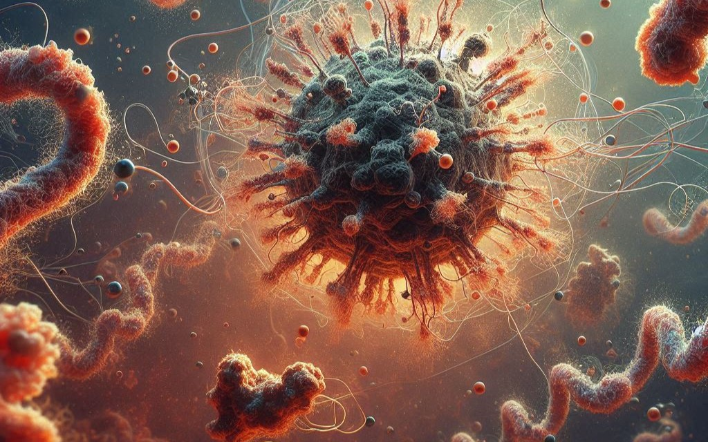

# 미지의 단백질에 기능 설명을 써 넣는 AI 언어 모델

_테크니온·텔아비브의 BetaDescribe, 서열을 문장으로 바꾸고 그 문장을 다시 모델이 채점한다_

## Executive Summary

> [!callout]
> 테크니온과 텔아비브대 공동 연구팀이 **BetaDescribe**라는 AI를 공개했다(PNAS, 2026년 7월). 단백질 서열을 넣으면 그 단백질이 무슨 일을 하는지 자연어 문장으로 설명해 주는 언어 모델이다. 닮은 서열이 없어 기존 방법으로는 손을 못 대던 단백질에도 설명을 붙일 수 있다는 것이 핵심이다. 이 글은 그 설명을 무엇으로 믿을 수 있는지를 데이터 품질의 눈으로 본다.

> 연구팀은 생성기와 검증기, 판정기를 나눠 스스로 채점하는 구조를 만들었고, 그때까지 특성이 알려지지 않았던 단백질 6개를 설명하는 데 성공했다고 보고했다. 다만 판정기도 검증기도 실험으로 확인된 정답이 아니라 서열에서 속성을 예측하는 또 다른 학습 모델이다. 만든 쪽과 채점하는 쪽이 같은 계열이라는 점에서, 정답이 없는 데이터에 AI가 라벨을 달 때 그 라벨을 누가 채점하느냐는 질문이 그대로 남는다.

> 텍스트와 코드에서 이미 겪은 문제가 생물학 데이터로 넘어온 장면이다. 다른 점은, 텍스트는 나중에 사람이 읽고 틀렸다고 알아챌 여지라도 있지만 한 번도 실험된 적 없는 단백질에는 그 사후 확인 자체가 없다.

### 주요 수치

아래 네 숫자가 이 글의 배경을 압축한다. 서열은 2억 건 넘게 쌓였지만 사람이 검증한 기능은 극소수이고, 서열을 문장으로 바꾸는 생성형 주석은 이미 수천만 건 규모로 데이터베이스에 배포됐다. 반면 BetaDescribe가 성공을 보였다고 보고한 표본은 6개다. 격차는 크고, 생성은 이미 대규모이며, 검증은 아직 작다.

출처: UniProt 통계 및 [phys.org (2026)](https://phys.org/news/2026-07-ai-protein-sequences-text-reveal.html)

<!-- stat-card -->
**2억+** — UniProt 등록 서열 — 실험으로 검증된 기능은 극소수

<!-- stat-card -->
**57만 vs 2.5억** — Swiss-Prot vs TrEMBL — 사람 큐레이션 vs 자동 주석

<!-- stat-card -->
**4,900만** — ProtNLM 자동 주석 서열 — 생성형 주석은 이미 배포됐다

<!-- stat-card -->
**6개** — BetaDescribe 검증 단백질 — 가능성은 보였지만 표본은 작다

## 서열은 넘치는데 기능은 빈칸

단백질 데이터베이스 UniProt에는 2억 건이 넘는 아미노산 서열이 쌓여 있다. 시퀀싱 비용이 계속 떨어지면서 새 서열은 지금도 빠르게 늘어난다. 문제는 그 서열이 실제로 무슨 일을 하는지, 즉 기능이 밝혀진 경우가 전체에서 극히 일부라는 데 있다. 서열이라는 글자는 넘쳐나는데 그 뜻풀이는 대부분 빈칸으로 남아 있다.

*▲ 기능이 알려지지 않은 단백질을 형상화한 이미지(ChatGPT 생성) | Source: [Technion](https://www.technion.ac.il/en/blog/article/the-language-of-proteins/)*

이 격차는 UniProt 안에서도 선명하게 갈린다. 사람이 직접 문헌을 읽고 검토해 주석을 단 **Swiss-Prot**은 약 57만 건에 그친다. 반면 컴퓨터가 자동으로 주석을 채워 넣은 **TrEMBL**은 2억 5천만 건을 넘어선다. 손으로 다듬은 고품질 주석과 기계가 대량으로 붙인 주석 사이의 스케일 차이가 이 분야의 근본 구조다.

기능을 알아내는 전통적인 방법은 닮은 단백질을 찾는 것이었다. 이미 기능이 밝혀진 단백질과 서열이 비슷하면 그 설명을 옮겨 붙인다. BLAST 같은 유사도 검색이 대표적이다. 그러나 닮은 단백질이 없으면 이 방식은 답을 내지 못한다. 정말로 새롭고 낯선 단백질일수록 빈칸으로 남을 확률이 높은 셈이다.

## BetaDescribe가 하는 일

BetaDescribe는 이 빈칸을 겨냥한다. 단백질 서열을 입력하면 그 단백질의 기능, 촉매 활성, 참여하는 대사 경로, 세포 안에서 자리 잡는 위치 같은 속성을 자연어 문장으로 풀어 낸다. 서열이라는 글자 배열을 사람이 읽을 수 있는 설명으로 옮기는, 일종의 번역기에 가깝다. 바탕이 되는 언어 모델은 대규모 텍스트로 사전학습된 LLAMA2 계열이다.

*▲ 서열을 입력하면 문장을 출력하는 protein-to-text 개념도(ChatGPT 생성 예시 이미지) | Source: [Technion](https://www.technion.ac.il/en/blog/article/the-language-of-proteins/)*

가장 큰 차별점은 닮은 서열이 없어도 작동하도록 설계됐다는 점이다. 상동성 기반 방법이 손을 못 대는 미지의 단백질에도 설명을 시도할 수 있어, 기존 자동 주석의 보완재로 소개된다. 연구팀은 서열만으로 어떤 잔기나 영역이 기능에 중요한지 탐색하는 in-silico 돌연변이 실험에도 쓸 수 있다고 제시했다.

연구팀은 그때까지 특성이 알려지지 않았던 단백질 6개에 대해 설명을 생성하는 데 성공했다고 보고했다. 가능성을 보여 주는 사례이지만, 대규모 배포를 이야기하기에 6개라는 표본은 아직 작다. 여기서 자연스럽게 질문이 생긴다. 정답이 알려지지 않은 단백질에 붙인 설명이 맞는지, 무엇으로 확인할 것인가.

## 생성-검증-판정, 그런데 판정도 모델이다

BetaDescribe의 답은 역할을 나누는 것이다. 세 개의 구성 요소가 서로 다른 일을 맡는다.

- **생성기(Generator)**는 서열을 받아 기능을 설명하는 후보 문장을 여러 개 만든다.
- **검증기(Validators)**는 생성기와 독립적으로, 세포 내 위치 같은 비교적 단순한 속성을 서열에서 직접 예측한다.
- **판정기(Judge)**는 생성기가 낸 후보들을 검증기의 예측과 대조해 받아들일지 버릴지 정하고, 단백질 하나당 최대 세 개의 설명을 최종 후보로 남긴다.

생성한 것이 곧 맞다는 보장은 없으니 따로 채점하는 층을 둔 셈이다. 만든 쪽과 채점하는 쪽을 분리한 설계는 그 자체로 합리적이다. 생성기가 스스로를 채점하게 두면 자기가 쓴 답에 후한 점수를 주기 쉽기 때문이다.
