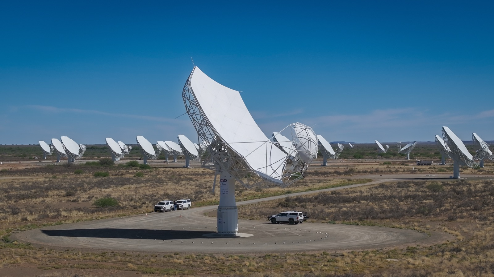
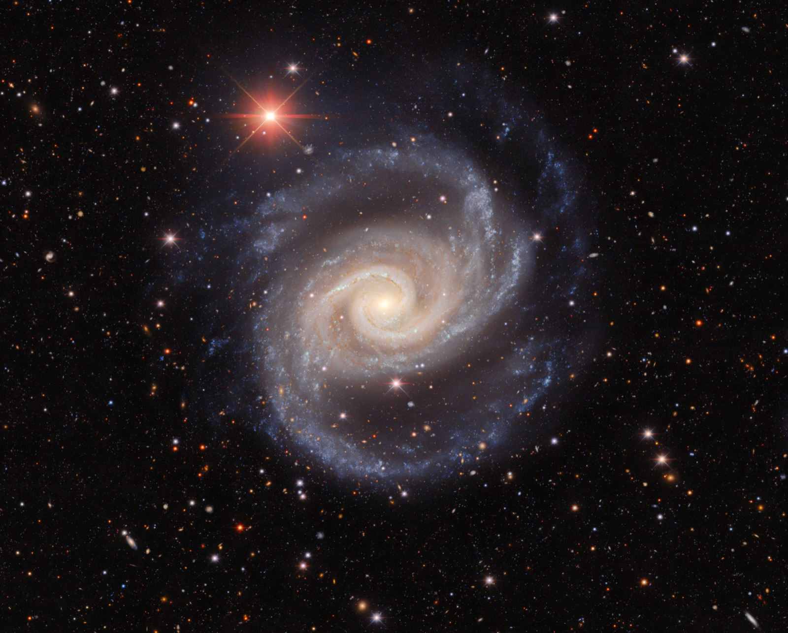

# Can a Telescope

_An international radio astronomy team compressed MeerKAT observation data to near a tenth, and every value measured from the galaxy came back inside the errors_

## Executive Summary

> [!callout]
> Nine radio astronomers pulled a single galaxy out of four years of MeerKAT survey observations, put it through two different kinds of compression, and set the results beside a run with no compression at all. Even where the files shrank to roughly a tenth of the original, every physical quantity drawn from that galaxy landed inside the errors. This article follows that result, and the cautions printed right beside it.

> The headline number is a spectrum difference below 0.01%. That held with the lossy compressors squeezing the data down to 12–14% of the original. The authors add that the setting goes past what they themselves normally recommend, and that they picked it on purpose so any impact would show.

> Sections 1 through 3 follow the paper's own reporting. The questions in sections 4 and 5 belong to this article. If anyone is going to say that data may be cut, someone has to settle first what has to stay the same for the answer to count as unchanged.

### Key Figures

Source: Dodson and eight co-authors, [Options for Compression of radio interferometry data](https://arxiv.org/abs/2609.25988), arXiv:2609.25988 (posted 22 September 2026).

<!-- stat-card -->
**Below 0.01%** — Spectrum difference after compression — That was with the files cut to 12–14% of the original. It held in every case tested

<!-- stat-card -->
**0.7%** — Flux gap left by grid-stacking — Nothing is thrown away here, and the gap is still this wide. Image-stacking came to 2.7% in the same comparison

<!-- stat-card -->
**About 10%** — The noise floor that rose alongside it — Worst case at tenfold compression. Ease the compression to fourfold and it drops to around 1%

<!-- stat-card -->
**One galaxy** — The sample this conclusion rests on — One bright spiral and one weak source. Wider testing is needed, by the paper's own conclusion

## The Telescopes Arriving Soon Cannot Keep What They Observe

Three large facilities are arriving in radio astronomy over the next few years: the Square Kilometre Array (SKA), the next-generation Very Large Array (ngVLA), and the Deep Synoptic Array (DSA). The paper puts their gain at roughly an order of magnitude in instantaneous bandwidth, and several orders of magnitude in effective collecting area and therefore in sensitivity. Catching the signal from the era when the first stars lit up, and measuring spectral lines precisely across millions of galaxies, both ride on that gain.

Directly behind the promise comes the constraint. Using that performance means handling volumes of data radio astronomy has never dealt with. For the SKA, the data rate coming out of the correlators is expected to be on the order of one terabyte per second. Long-term storage capacity is limited, so that data has to be buffered on site and processed close to real time.

The constraint bites hardest on observations that stare deep at the same patch of sky across many nights. Traditional imaging sweeps the whole of the original visibility data again on every turn of the deconvolution loop. By the end it is not days' worth but hundreds of days' worth that has to be held all at once. Neither ASKAP nor the SKA, the authors state flatly, can finish a deep neutral hydrogen survey the traditional way within their cost constraints.

So why is there room to compress at all? Interferometric data has a structural quirk. A large share of the measured visibilities is dominated by noise, because the signal from any one bright, localised patch of sky is spread thinly across every baseline, frequency and time sample. On top of that the radio sky is intrinsically sparse, and the brightness temperature of astronomical sources usually runs far below the receiver noise temperature. Volume and information content do not track each other, and that mismatch is the opening.

*▲ The SKA-Mid dish (front) and the MeerKAT array (back) in the Karoo, South Africa. The MHONGOOSE survey used in this study was observed with MeerKAT | Source: [SKAO, Wikimedia Commons (CC BY 3.0)](https://commons.wikimedia.org/wiki/File:SKA-Mid_dish_with_MeerKAT_telescope_dishes_in_background.jpg)*

## One Dataset, Two Ways of Cutting It Down

The data on the test bench comes from the MHONGOOSE survey. It is a deep neutral hydrogen survey carried out with South Africa's MeerKAT telescope, covering 30 galaxies within 23 megaparsecs (about 75 million light-years) at 55 hours per galaxy, observed from October 2020 to December 2024. Those 55 hours were not taken in one sitting but split into ten sessions of 5.5 hours. That structure lets a single day be compared against the full stack, which makes it a good set for holding processing methods up against one another.

Out of it this work picked NGC 1566, one radio-bright spiral galaxy. It also watched J0422–5455, a much weaker source that happens to fall inside the same frequency coverage. The baseline is the result of traditional processing with no compression, and the question for every other method is how closely it reproduces that baseline.

*▲ The spiral galaxy NGC 1566 (the Spanish Dancer), the brighter of the two targets used in this compression comparison | Source: [DECam/CTIO/NOIRLab/NSF/AURA, Wikimedia Commons (CC BY 4.0)](https://commons.wikimedia.org/wiki/File:NGC1566_-_Noirlab2208a.jpg)*

Establishing the baseline was not simple either. The researchers first ran the same data through the imaging software the MHONGOOSE team had used and through the software they intended to use, and lined the two up. The two tools define Stokes I differently, which left a factor of two between the values, and even after correcting for that a 1% gap in noise and a 10% gap in pixel flux remained. What was left is put down to the different imaging modes, and turning on matching settings reduced the gap without removing it. Measuring a 0.7% difference between methods means keeping a 10% difference between tools out of the comparison. So rather than comparing against the already published images, they took a fresh traditional run made with the same tool as their baseline.
