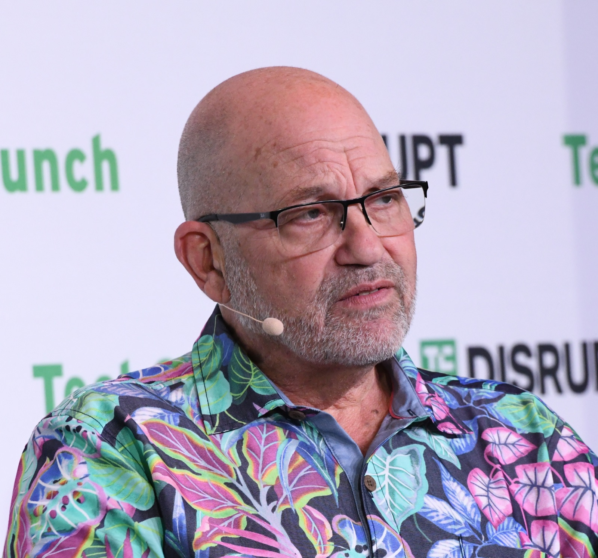

# 로봇 연구소가 외국에 팔리면, 로봇이 배운 기록도 넘어갈까?

_현대차그룹이 미국에 세운 로봇·AI 연구소 RAI가 소프트뱅크로 넘어가고, 미국 정부가 안보 심사에 들어갔다_

## Executive Summary

> [!callout]
> 현대차그룹이 미국 매사추세츠주 케임브리지에 세운 로봇·AI 연구기관 RAI 인스티튜트의 지분을 소프트뱅크그룹에 넘기기로 합의했다. 미국 로봇 전문지 더로봇리포트가 9월 18일 복수의 소식통을 인용해 처음 전했고, 두 회사 모두 금액을 확인하지 않았다. 거래는 지금 미국 외국인투자심의위원회의 심사를 받고 있다. 공장에 들어갈 로봇 한 대를 사고파는 일이 아니라 그 로봇을 가르친 조직을 통째로 사고파는 일이라, 심사의 눈이 하드웨어가 아닌 다른 곳을 향한다. 이 글은 이 거래에서 실제로 국경을 넘는 것이 무엇인지를 따라간다.

> 설립 초기에 들어간 돈은 4억 달러가 넘는데 이미 다 쓰였다. 그러니 소프트뱅크가 받는 것은 남은 현금이 아니라 그 돈으로 4년 동안 쌓은 것, 곧 연구진과 코드와 학습 기록이다. RAI는 보스턴 다이내믹스의 신형 아틀라스가 보여 준 곡예 동작의 바탕이 된 전신 제어 학습 틀을 만든 곳이다. 다만 어떤 데이터가 어떤 조건으로 함께 이동하는지는 공개되지 않았고, 심사가 어느 단계에 있는지도 비공개다.

> 1절부터 3절까지는 보도와 공개 자료로 확인된 내용이다. 4절의 유럽 데이터법 조항과 업계 관행도 공개된 사실이지만, 그것을 이번 거래와 나란히 놓고 읽는 대목과 5절은 이 글의 해석이다.

### 주요 수치

출처: [더로봇리포트](https://www.therobotreport.com/softbank-agrees-to-acquire-robotics-and-ai-institute/)(2026-09-18), [딜룸](https://dealroom.co/news/154603-softbank-to-acquire-robotics-and-ai-institute-deal-under-us-review/), [소프트뱅크그룹 보도자료](https://group.softbank/en/news/press/20251008)(2025-10-08).

<!-- stat-card -->
**47.5%** — 소프트뱅크로 넘어가는 RAI 지분 — 현대차그룹이 2026년 상반기 재무보고에서 '매각 예정 자산'으로 분류해 둔 몫이다

<!-- stat-card -->
**4억 달러 이상** — 설립 초기에 투입된 자금 — 이미 다 쓰였다. 남은 자산은 연구진과 학습 기록이다

<!-- stat-card -->
**9.65%** — 반대 방향으로 움직인 지분 — 소프트뱅크가 들고 있던 보스턴 다이내믹스 몫을 현대차그룹이 풋옵션을 행사해 사들이고 있다

<!-- stat-card -->
**53.8억 달러** — 소프트뱅크의 ABB 로보틱스 인수 — 기업가치 기준으로 2025년 10월 합의했다. 산업용 로봇 하드웨어를 같은 묶음에 붙이는 거래다

## 연구소 한 곳이 주인을 바꾼다

RAI 인스티튜트는 현대차그룹이 보스턴 다이내믹스를 품는 과정에서 2022년에 따로 떼어 세운 연구기관이다. 마크 레이버트가 만들었다. 1992년에 보스턴 다이내믹스를 창업했고 2020년 1월에 그 회사 CEO에서 물러난 뒤, 제품을 만드는 일에서 떨어져 나와 연구만 하는 조직을 새로 차렸다. 현대차그룹은 설립 초기 투자로 4억 달러가 넘는 돈을 넣었다. 그 돈은 이미 다 쓰인 상태라고 더로봇리포트가 전했다.

*▲ RAI 인스티튜트를 세운 마크 레이버트. 1992년 보스턴 다이내믹스를 창업했고 2020년 CEO에서 물러난 뒤 2022년 RAI를 따로 세웠다(2023년 테크크런치 디스럽트). | Source: [Wikimedia Commons](https://commons.wikimedia.org/wiki/File:Marc_Raibert_-_Empowering_the_Future_(cropped).jpg)*

아직 공식 발표는 없다. RAI는 지금 공유할 내용이 없다고 답했고 소프트뱅크는 답하지 않았다. 회계 장부에는 흔적이 남았다. 현대차그룹은 2026년 상반기 재무보고에서 RAI 지분 47.5%를 매각 예정 자산으로 분류했다. 파는 쪽이 장부에서 이미 그렇게 갈라 둔 것이다. 거래 금액은 양쪽 모두 밝히지 않았고, 국내 일부 채널에서 도는 추정치는 1차 출처가 없다.

눈여겨볼 대목은 같은 시기에 지분 두 개가 서로 반대로 움직인다는 점이다. 소프트뱅크는 2017년부터 2021년까지 보스턴 다이내믹스를 소유했고 그 뒤로도 9.65%를 들고 있었다. 2026년 7월 현대차그룹이 이 잔여 지분에 걸린 풋옵션을 행사해 전량 인수 절차에 들어갔다. 로봇을 만드는 회사는 현대차그룹으로 모이고, 로봇을 가르치던 연구소는 소프트뱅크로 간다.
