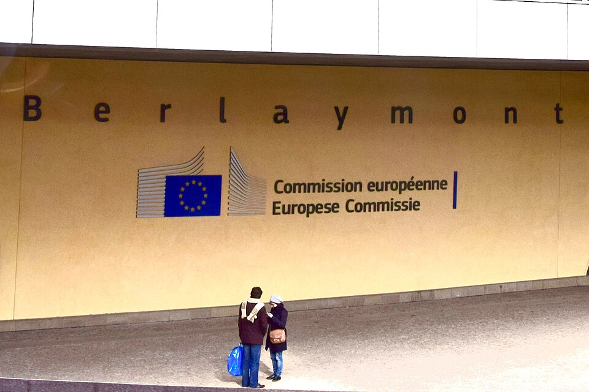

# Reddit Ends Free Public Access to Its Data and Sells It to AI Firms

_RSS feeds stop on November 13 and the public API closes in March 2027, while the revenue line carrying Reddit_

## Executive Summary

> [!callout]
> This article reads the two notices Reddit posted on September 30, 2026. RSS, the format that let anyone who knew a URL pull a list of posts without logging in, stops working on November 13, and the public API that apps and bots have run on closes completely in March 2027. Reddit gave a single reason. RSS, the company wrote, had become a common route for large-scale scraping and automated abuse.

> A different door at the same company stays open. Other revenue, the line that holds licences for AI training data, came to $43 million in the second quarter of 2026, 24% above the same quarter a year earlier. Against total revenue of $805 million for the quarter, that is barely more than 5% of the business. The sum is too small to explain the shutdown as a reach for that money. What changes is not this quarter's income but the shape of the path the same data travels.

> Sections 1 through 4 stay with what is written in Reddit's notices, in the coverage that followed them, and in the record of Meta's CrowdTangle shutdown in 2024. Section 5 reads those facts again through the eyes of someone who handles data for a living, and that reading belongs to this article.

### Key Figures

Four numbers carry this announcement. The first two say what closes and when. The other two say which side feels it once the shutdown lands, and how much already moves along the path that remains.

Sources: [TechCrunch (2026-09-30)](https://techcrunch.com/2026/09/30/reddit-is-killing-rss-feeds-ending-public-api-access-because-of-ai-bots/), [MediaNama (2026-10)](https://www.medianama.com/2026/10/223-reddit-rss-feeds-public-api-bots/).

<!-- stat-card -->
**November 13** — The day RSS stops — Reddit says uses outside community operations have no replacement

<!-- stat-card -->
**March 2027** — The month the public API closes for good — No day has been named. New applications end on October 31

<!-- stat-card -->
**$43 million** — Other revenue, where AI licences sit — Q2 2026. Up 24%, yet 5% of $805 million in total revenue

<!-- stat-card -->
**14,000+** — Apps and bots already registered — As of September 30. Unregistered ones lose access from January 12, 2027

## What Closes, and When

Reddit posted on September 30 in two places: r/modnews, where community operators gather, and r/redditdev, where developers do. Between them the notices close two things. One is RSS, a format that takes a few extra characters on a URL and hands a machine the list of new posts in a given community, with no login required. The other is the public API, the channel through which apps and bots asked Reddit for content and received it.

*▲ The RSS feed icon. This is the exact format that stops working across Reddit on November 13, 2026. Source: [Wikimedia Commons](https://commons.wikimedia.org/wiki/File:Feed-icon.svg)*

None of it shuts at once. Over roughly six months from the day of the notice, a different door locks at each stage. The dates below follow the order given in the coverage.

| Date | What happens |
| --- | --- |
| 2026-09-30 | Notices posted to r/modnews and r/redditdev |
| 2026-10-31 | New applications for public API access stop being accepted |
| 2026-11-13 | RSS feeds stop working across the site |
| 2026-11-30 | Registration for the app migration programme closes |
| 2027-01-12 | Unregistered apps and accounts begin losing access |
| 2027-03 | The public API closes to everyone. No day has been named yet |

▲ Sources: TechCrunch (2026-09-30), MediaNama (2026-10), TechRepublic. Every report gives March 2027 as a month only.

Reddit also offered somewhere to move to. It has attached a migration programme worth $1 million in total for moving existing apps onto its developer platform, at $1,000 per qualifying app. More than 14,000 apps and bots had registered by September 30. Those that finish registering keep running on the new platform, and those that do not start losing access on January 12, 2027.

One further change sits quietly in the same announcement. Old Reddit, the legacy interface, will be limited to logged-in users who have been active within the past six months. Reddit cited scraping and automated traffic for that measure as well. Another entrance that stood open to people who were not signed in is narrowing.

## Reddit's Reason and the Numbers From the Same Quarter

The stated reason is short. RSS had become, in Reddit's words, a "common vector for large-scale scraping and automated abuse." That description is close to accurate. RSS asks for no login and no credential, and it hands over a whole list of posts in a shape built for machines to read. For a company trying to stop bulk collection, it is the first door to lock.

One way of taking the same data in bulk is left open, though. Reddit booked $43 million in other revenue, meaning everything outside advertising, for the second quarter of 2026. Data licences signed with AI companies sit at the centre of that line, and the largest customers are OpenAI and Google. The figure came in 24% above the same quarter a year earlier.

Lifted out on its own, that number is easy to inflate. Total revenue for the quarter was $805 million, of which advertising supplied $762 million. The line holding data licences comes to a little over 5% of the whole. Advertising grew 64% over the year while this line grew 24%, so it is not even the faster-moving side. Against that ratio, the idea that Reddit switched off RSS out of hunger for licensing income loses its force.

What the two numbers show when set side by side is therefore structure rather than motive. One route closes on a published date, and the other remains, with a contract attached to it. The small size of the sum says something further. If what Reddit is protecting is the $43 million arriving now, this is a small fight; if it is the tollgate every future user of this data has to pass, it is not a small fight at all. Reddit describes the business in its own filings as a new revenue source with a short history, and flags the risk that it could shrink quickly should the Google and OpenAI contracts go unrenewed.

▲ Source: Reddit's Q2 2026 results, as carried in TechCrunch and MediaNama.

The contract path is not new this month. Reddit signed a data licence with Google in February 2024 and another with OpenAI that May. Reported amounts put Google at around $60 million a year and OpenAI at around $70 million, though the company confirmed neither and both reached the public through second-hand coverage, so they should be held loosely. What the IPO filings do show is a contracted backlog above $200 million, which puts the business past its experimental stage.

Nor is this the first time Reddit has reached for the word contract. Revising its public content policy on May 9, 2024, the company stated that any business building or training a product on public Reddit posts needs an agreement with Reddit. Narrowing bulk collection to parties who had accepted the policy was the explanation offered then. That same post carried one more sentence: users, moderators, researchers and other good-faith, non-commercial actors would keep their access. Two years on, this notice closes the route those non-commercial users were on.

For those taking the data without paying, Reddit went to court. It sued Anthropic in June 2025, and on October 22 of the same year it filed in the Southern District of New York against Perplexity and three data-collection firms. The claim is that they harvested Reddit posts by way of Google search results. Reddit says it planted hidden posts that only Google could index and then watched for them to surface in the defendants' services, and that citations of Reddit rose fortyfold after it sent cease-and-desist letters. All of that is the plaintiff's allegation rather than a finding of fact.

Defence filings frame the case as something else. Perplexity said it does not train models on Reddit posts and only summarises and cites public discussions, which leaves it with nothing to licence in the first place, and it called the suit a "sad example of what happens when public data becomes a large part of a public company's business model." Oxylabs, the Lithuanian firm among the defendants, said nobody can claim ownership of public data that was never theirs to own. Both sides are using one word in two senses. To one, "public" names an asset that can carry a price; to the other, it names a commons that cannot.

This argument passed a marker during the year. On January 2, 2026, Perplexity moved to dismiss, leaning on hiQ v. LinkedIn, the ruling that scraping pages anyone can view is not punishable under the US Computer Fraud and Abuse Act. On July 31 the court denied most of that motion. It treated the bot-blocking layer Google places in front of the search results carrying Reddit posts as a technological measure that effectively controls access under the Digital Millennium Copyright Act. Text a person can read with their own eyes may still sit behind a gate that sorts out machines, and going around that gate is weighed on its own terms.

Unjust enrichment and unfair competition claims fell at that stage, and the question of who took what remains open. What stands after the motion to dismiss failed is plain enough. An address being open does not by itself create a right to take what sits behind it.

## The Research Route Survives Under Conditions Few Can Meet

Several early reports read as though researchers were losing access altogether. That sentence is half right. Reddit built an academic route before these notices went up, and it survives the change. Reddit for Researchers is the name of the programme. The company states plainly that developer tools may not be used for research, and points to this programme as the only official path for studying Reddit data.

*▲ Reddit's official logo. Reddit itself decides who gets approved for the academic research route, Reddit for Researchers. Source: [Wikimedia Commons](https://commons.wikimedia.org/wiki/File:Reddit_logo.svg)*

Surviving is not the same as being easy to enter. Listing what Reddit asks for shows how high the bar sits.

- •Be affiliated with an accredited university. Applications arrive from institutional email addresses only
- •Submit a proposal setting out the research purpose and the data needed, naming the communities to be studied
- •Provide institutional review board approval or a documented exemption
- •Obtain an endorsement from an institutional sponsor such as a faculty adviser, department head or research office lead
- •Keep the work non-commercial, and pass the data received to nobody else

What waits on the other side of that door also appears in the official guidance. The data sits as a dataset on Google BigQuery, covers the past five years, and is visible only up to a six-month lag. It refreshes once a month, and posts their authors deleted in the meantime arrive already removed. No fee applies, though the condition is non-commercial academic research. For anyone who has to follow last week's events this week, this route is no substitute.

Access is withdrawn after a stretch of disuse or once the conditions lapse. A researcher working alone outside a university, a reporter at a for-profit newsroom, a company that builds and sells tools for reading public opinion: none of them can meet these terms to begin with. The line falls not at whether you do research but at whether you hold an endorsement and an approval.

Moderators are in a somewhat better position. Reddit told community operators who had taken their alerts through RSS to move to a Discord relay app on the developer platform, which gives that group a replacement. One sentence the company wrote itself, though, points outside that group. For people who used RSS for anything other than running a community, there is nothing to switch to. Among them are the reader who subscribed to a favourite community in a feed reader and the solo developer whose script pinged them whenever a keyword appeared.

> [!callout]
> MediaNama, the Indian outlet that covered the notices, put two absences together: neither notice mentions research at all, and Reddit has not said whether commercial data access will carry published prices or be negotiated deal by deal. Where prices stay unpublished, nobody outside can tell who came in at what rate. A list of those being cut off is public; the list of those being let in is not.

## When Meta Shut Down CrowdTangle

What happens when an open counter closes and only the approved one remains has already been measured once. Meta switched off CrowdTangle, bought in 2016, on August 14, 2024. The tool showed how far a given post travelled on Facebook and Instagram, and its main users were researchers and journalists tracking misinformation and election interference.

*▲ Meta's official logo. Meta switched off CrowdTangle, acquired in 2016, on August 14, 2024. Source: [Wikimedia Commons](https://commons.wikimedia.org/wiki/File:Meta_Platforms_Inc._logo.svg)*

The Coalition for Independent Technology Research ran a survey once the shutdown was announced. Thirty-four organisations, among them news outlets, universities and civil society groups, returned 36 responses, and 32 of those said the shutdown would disrupt their work. In percentage terms, 88%. Some respondents had already revised or abandoned studies under way. Timing drew its own criticism, since the cutoff landed three months before the US presidential election.

Meta did not leave the space empty. It opened a replacement called the Content Library. Trouble lies in who can get in, which looks much like Reddit for Researchers. In the same survey, eleven respondents said they had applied for Content Library access and four said they had received it. Those who got in reported that near-real-time data was hard to see and downloads were blocked. For-profit newsrooms could not enter at all. A tool had not disappeared so much as the qualification for entering it had changed, and work stopped for everyone who could not meet the new one.

How much warning each side gave is worth comparing. Meta announced the shutdown in March 2024 and pulled the plug on August 14, leaving five months between notice and closure. RSS has been given from September 30 to November 13, a little over six weeks. The public API runs to March 2027, a cushion closer to CrowdTangle's. First to move are the people running feed readers and alert bots.

Differences between the two cases deserve stating as well. Meta turned off one particular tool, while Reddit is closing a standard format anyone could use and a public channel at the same time. Reddit also has a circumstance Meta did not. A business selling the same data for money already appears as a line in its revenue. No price tag went up where CrowdTangle had been.

## Why Pebblous Is Watching This Change

Where Reddit data flows is a subject this blog has visited before. We have written about the structure in which only hard-to-replace brand corpora carry a price while everything else [stays free training data, never reaching the settlement ledger](/blog/ai-content-licensing-market-leverage/en/). This notice moves one step further along that structure. Routes that carry no price get locked, and the priced one is left standing.

For anyone who works with data, access is not the only thing this change touches. Verifiability moves with it. While an address stood open, anybody could go to that address, receive the same posts, and approximately reproduce what a model had been fed. Once the data flows through contracts, what remains in that place is the contracting party's account of it. A third party cannot open up the scope, the quality or the skew for themselves.

Regulation is moving the other way. The first fine the European Commission issued under the Digital Services Act, €120 million against X on December 5, 2025, rested on three grounds, one of which was blocking researchers from public data behind unnecessary barriers. Behind that ground sits a provision obliging platforms to open public data to researchers. One side closes the public counter while the other writes opening it into law as a duty.

*▲ The Berlaymont, headquarters of the European Commission. This is the body that fined X €120 million under the Digital Services Act in December 2025. Source: [Wikimedia Commons (Ank Kumar, CC BY-SA 4.0)](https://commons.wikimedia.org/wiki/File:European_Commission_headquarters,_The_Berlaymont_Building,_Brussels,_Belgium_(_Ank_Kumar,_Infosys_Limited_).jpg)*

Pebblous repeats one line whenever AI-Ready Data comes up. Where provenance has not been recorded, verification is not verification. Whether a model gives good answers can be found out by using it, and what those answers rest on cannot be retraced unless the record was kept on the material side. What the Reddit case shows is that the authority to keep that record is moving inside the contract. Rules asking where training data came from keep multiplying, while the material for answering them keeps disappearing from outside the contracting parties.

So the question this notice leaves is about more than access. How many ways remain to check what the models we use learned from, by some means other than the word of the company that built them? Reddit is one place where such a way is closing. CrowdTangle showed two years earlier what becomes of a place once it has closed.

Thank you for reading this far. The schedule and the figures can be checked in the coverage by [TechCrunch](https://techcrunch.com/2026/09/30/reddit-is-killing-rss-feeds-ending-public-api-access-because-of-ai-bots/) and [MediaNama](https://www.medianama.com/2026/10/223-reddit-rss-feeds-public-api-bots/), and the terms of the academic route in [Reddit's official help page](https://support.reddithelp.com/hc/en-us/articles/49381918834964-Reddit-for-Researchers-Program). We would be glad to know how the datasets your team relies on divide between the ones arriving through a public address and the ones arriving through a contract, so count them up and tell us.

## References

### Coverage of the Notices

- 1.TechCrunch. (2026). "[Reddit is killing RSS feeds, ending public API access because of AI bots](https://techcrunch.com/2026/09/30/reddit-is-killing-rss-feeds-ending-public-api-access-because-of-ai-bots/)." 2026-09-30.
- 2.MediaNama. (2026). "[Reddit to shut RSS feeds, close public API as AI bots scrape its data](https://www.medianama.com/2026/10/223-reddit-rss-feeds-public-api-bots/)." 2026-10.
- 3.The AI Insider. (2026). "[Reddit Ends RSS Feeds and Public API, Tightening Control Over Data Prized by AI Firms](https://theaiinsider.tech/2026/10/02/reddit-ends-rss-feeds-and-public-api-tightening-control-over-data-prized-by-ai-firms/)." 2026-10-02.
- 4.TechRepublic. (2026). "[Reddit RSS and Public API Shutdown: Key Deadlines](https://www.techrepublic.com/article/news-reddit-rss-public-api-shutdown/)."

### Official Documents and Litigation

- 5.Reddit. "[Reddit for Researchers Program](https://support.reddithelp.com/hc/en-us/articles/49381918834964-Reddit-for-Researchers-Program)." Reddit Help.
- 6.TechCrunch. (2024). "[Reddit locks down its public data in new content policy, says use now requires a contract](https://techcrunch.com/2024/05/09/reddit-locks-down-its-public-data-in-new-content-policy-says-use-now-requires-a-contract/)." 2024-05-09.
- 7.Search Engine Land. (2025). "[Reddit sues Perplexity, SerpApi over scraping Google Search data](https://searchengineland.com/reddit-sues-perplexity-serpapi-scraping-google-463681)." 2025-10.
- 8.Loeb & Loeb LLP. (2026). "[Reddit Inc. v. SerpApi LLC](https://www.loeb.com/en/insights/publications/2026/08/reddit-v-serpapi-llc)." 2026-08. (Summary of the SDNY ruling on the motion to dismiss, 2026-07-31)
- 9.European Commission. (2025). "[Commission fines X €120 million under the Digital Services Act](https://digital-strategy.ec.europa.eu/en/news/commission-fines-x-eu120-million-under-digital-services-act)." 2025-12-05.
- 10.Reddit, Inc. (2026). "[Q2 2026 Earnings Press Release](https://www.sec.gov/Archives/edgar/data/0001713445/000171344526000098/earningspressreleaseq226.htm)." Form 8-K, SEC EDGAR.

### The CrowdTangle Precedent

- 11.Coalition for Independent Technology Research. (2024). "[Blocking our Right to Know: Surveying the Impact of Meta's CrowdTangle Shutdown](https://independenttechresearch.org/wp-content/uploads/2024/07/CrowdTangle-Survey-Report-Final.pdf)."
- 12.NPR. (2024). "[Meta shutters tool used to fight disinformation, despite outcry](https://www.npr.org/2024/08/14/nx-s1-5074143/meta-shutters-tool-used-to-fight-disinformation-despite-outcry)." 2024-08-14.
- 13.Tech Policy Press. (2024). "[Researchers Consider the Impact of Meta's CrowdTangle Shutdown](https://www.techpolicy.press/researchers-consider-the-impact-of-metas-crowdtangle-shutdown/)."
