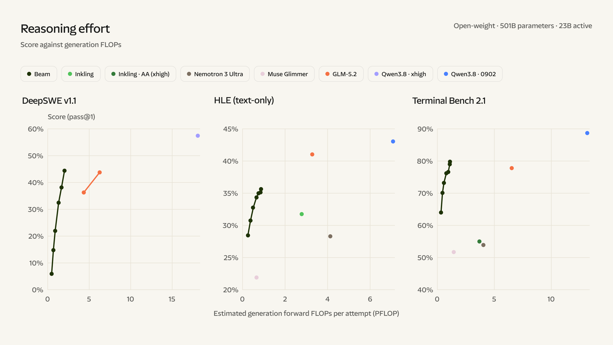
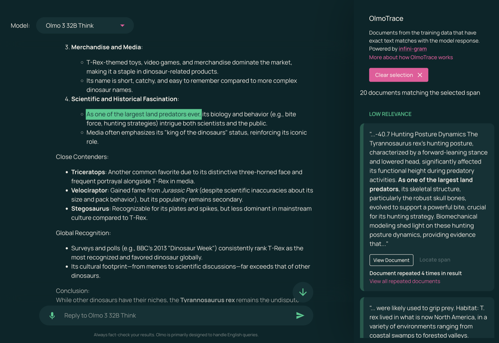

# 리플렉션 AI의 공개 모델 Beam, 학습 데이터는 풀지 않는다

_리플렉션 AI는 10월 중 Beam을 누구나 내려받게 풀지만, 학습에 쓴 23.8조 토큰이 어디서 왔는지는 밝히지 않는다_

## Executive Summary

> [!callout]
> 이 글은 2026년 10월 5일 리플렉션 AI가 발표한 Beam을 읽는다. 이 회사가 처음 내놓는 공개 가중치 모델이고, 코딩과 도구 사용을 겨냥해 만들었다. 가중치는 10월 중 아파치 2.0 라이선스로 풀린다고 했으니 누구나 내려받아 돌리고 고칠 수 있다. 이 글이 들여다보는 곳은 그 '누구나'가 어디까지 닿느냐다.

> 리플렉션은 사전학습 자료를 어떻게 골랐는지 꽤 자세히 적었다. 원시 인터넷 토큰의 약 95%를 걸러 냈고, 흔한 필터라면 버렸을 1조 8천억 개가량을 살려 두었다고 썼다. 그런데 그 자료의 출처로 가면 웹과 공개 자료와 독점 라이선스 데이터셋이라는 세 범주가 전부다. 10월에 공개한다는 목록에도 데이터셋과 학습 파이프라인은 들어 있지 않다. 회사는 1년 전에 그렇게 하겠다고 이미 말했고, 이번에 말한 대로 했다.

> 1절부터 3절까지는 리플렉션의 발표문과 유럽연합 AI법 조문에 있는 사실이다. 4절과 5절은 그 사실을 공개 모델을 사내에 들이는 쪽의 눈으로 다시 읽은 이 글의 해석이다.

### 주요 수치

발표문에서 네 숫자를 뽑았다. 앞의 둘은 모델과 학습 자료의 크기이고, 뒤의 둘은 자료를 다룬 방식과 공개 목록의 내용이다.

출처: [Reflection AI, "Introducing Beam" (2026-10-05)](https://reflection.ai/blog/introducing-beam).

<!-- stat-card -->
**5,010억** — Beam의 총 파라미터 — 토큰 하나를 처리할 때 실제로 쓰는 것은 230억 개다

<!-- stat-card -->
**23.8조** — 사전학습에 쓴 토큰 — 출처는 웹·공개 자료·독점 라이선스 데이터셋 세 범주로만 적혔다

<!-- stat-card -->
**95%** — 걸러 낸 원시 인터넷 토큰 — 무엇을 남기고 무엇을 버렸는지 가른 기준 자체는 공개되지 않았다

<!-- stat-card -->
**0개** — 공개 목록에 오른 학습 데이터셋 — 가중치·기술보고서·모델카드·개발 도구는 들었고 데이터셋은 들지 않았다

## Beam이 10월에 푸는 것과 풀지 않는 것

리플렉션 AI는 엔비디아가 투자를 이끈 미국 회사다. 2025년 10월에 20억 달러를 모으면서 내건 목표가 최상급 AI를 누구나 받아 쓸 수 있게 만들겠다는 것이었고, 당시 보도는 이 회사를 미국판 딥시크로 불렀다. Beam은 그 약속의 첫 결과물이다. 전문가 혼합(MoE) 구조라 총 5,010억 파라미터를 들고 있으면서도 토큰 하나를 처리할 때는 230억 개만 깨운다. 컨텍스트는 1백만 토큰까지 받는다.

학습에 들어간 기계의 규모도 발표문에 나온다. 사전학습은 엔비디아 GB300 6,144장을 묶은 클러스터에서 4주가 안 되게 돌았고, 그다음 강화학습에 GB300 1만 500장을 4주 동안 썼다. 이 강화학습에서 모델이 만든 시도는 1억 회가 넘고, 최대 컨텍스트 길이는 25만 6천 토큰이다. 돈과 전기를 어디에 썼는지는 이렇게 숫자로 남아 있다.

성적표도 함께 나왔다. 코드 수정 능력을 재는 SWE-Bench Verified에서 80.9를 받았는데, 같은 표에서 비교 대상으로 올린 Inkling은 77.6, Nemotron 3 Ultra는 70.7이다. 터미널에서 작업을 끝까지 수행하는지 보는 Terminal-Bench v2.1에서는 80.1로, Z.ai의 GLM-5.2가 기록한 81.0에 살짝 못 미친다. 리플렉션이 전면에 내세운 문장은 순위가 아니라 효율이다. 고난도 추론 과제에서 GLM-5.2에 맞먹는 점수를 3~4배 적은 추론 연산으로 낸다는 것이다.

*▲ 리플렉션이 내세우는 "3~4배 적은 추론 연산" 주장의 근거 차트 — 세 벤치마크 모두 리플렉션 자체 측정치다. Source: [Reflection AI, "Introducing Beam" (2026-10-05)](https://reflection.ai/blog/introducing-beam).*

> [!callout]
> 다만 이 비교에는 회사가 직접 달아 둔 단서가 붙는다. 프롬프트 처리와 맥락에 따라 달라지는 어텐션 연산, 서빙 오버헤드를 뺀 값이라서 실제로 측정한 추론 비용이 아니라 어림한 비교라는 것이다. 성적표의 숫자도 전부 리플렉션이 자체적으로 돌려 낸 값이다. 외부 검증은 가중치가 실제로 풀린 다음에야 가능해진다.

그래서 10월에 무엇이 손에 들어오는지가 중요해진다. 발표문이 이름을 들어 공개하겠다고 적은 것은 가중치와 기술보고서, 모델카드, 개발자용 도구다. 여기에 모델을 돌리고 평가하고 미세조정하는 데 필요한 전체 스택을 문서와 함께 낸다고 덧붙였다. 라이선스는 아파치 2.0이다.

목록에는 결이 조금 다른 항목도 하나 들어 있다. 사내에서 만들어 써 온 안전성 평가를 오픈소스로 풀겠다는 것이다. 발표문은 그 이유도 함께 적었다. 공개 생태계가 같은 잣대로 시험해 보고 거기에 보탤 수 있도록 들여다볼 수 있는 공통 기준을 만들겠다는 것이다. 평가 결과는 기술보고서에 싣는다고 했다. 검증 도구를 남의 손에 쥐여 주겠다는 이 약속이 학습 자료 쪽으로는 이어지지 않는다.

이 목록에 없는 것이 둘이다. 학습에 쓴 데이터셋, 그리고 그 데이터셋을 만든 학습 파이프라인이다. 발표문은 둘을 공개하겠다고도, 공개하지 않겠다고도 적지 않았다. 그냥 목록에 없다. 이 침묵을 읽을 근거는 1년 전에 나와 있다. 20억 달러 투자를 받던 2025년 10월에 공동창업자 미샤 라스킨은 가중치는 공개하되 데이터셋과 전체 학습 파이프라인은 자사 소유로 유지하겠다고 밝혔다. 이번 발표는 그 방침을 바꾼 것이 아니라 그대로 집행한 것이다.

▲ 페블러스 원본 도식 — 리플렉션 AI가 2026년 10월 5일 발표문에 적은 공개 대상과, 그 목록에 들지 않은 항목. Source: Reflection AI, "Introducing Beam" (2026-10-05).

## 학습에 쓴 23.8조 토큰은 어디서 왔나

리플렉션이 학습 자료를 두고 아무 말도 하지 않았다고 하면 사실과 다르다. 발표문은 자료를 어떻게 다뤘는지를 제법 길게 설명한다. 웹 문서와 코드와 과학·수학 자료 각각에 쓸 품질 분류기를 직접 학습시켰고, 그 분류기로 자료를 여러 등급으로 나눈 뒤 좋은 등급 쪽에 가중치를 실어 학습했다고 썼다. 원시 인터넷 토큰의 약 95%는 파싱과 중복 제거와 큐레이션 과정에서 버렸다. 반대로 흔히 쓰는 필터였다면 놓쳤을 고품질 토큰이 1조 8천억 개가량 된다고 보고, 그것을 살려 두었다고 했다. 그중에는 자기들이 큐레이션한 웹-코드 토큰의 87%가 들어 있다.

여기까지는 방법에 대한 설명이다. 자료를 어떻게 걸렀는가는 충분히 나왔다. 그 자료가 어디서 왔는가로 넘어가면 말이 갑자기 짧아진다. 사전학습 자료의 출처를 적은 문장은 하나다. 웹과 공개 자료와 독점 라이선스 데이터셋에서 가져온 23.8조 개의 다양한 고품질 토큰이라고 적혀 있다. 코드를 두고도 비슷한 한 마디가 더 있다. 웹에 공개돼 있고 제약 없는 라이선스가 붙은 코드와 코드 문서를 거의 전부 학습한다는 것이다.

이 두 문장으로는 답할 수 없는 질문이 여럿 남는다. 어떤 웹 도메인을 긁었는가. 독점 라이선스 데이터셋은 누구에게서 무슨 조건으로 샀는가. 세 범주가 23.8조 안에서 각각 몇 퍼센트인가. '제약 없는 라이선스'는 어느 라이선스 목록을 말하는가. 저작권자가 학습 거부 의사를 밝힌 자료는 어떻게 걸렀는가. 하나도 답이 없다. 95%라는 숫자는 얼마나 많이 버렸는지만 알려 줄 뿐, 무엇을 남기고 무엇을 버렸는지 가른 기준은 끝내 나오지 않는다.

비어 있는 곳은 사전학습만이 아니다. Beam의 성적을 끌어올린 4주짜리 강화학습은 소프트웨어 공학과 터미널 작업, 경쟁 프로그래밍, 과학·수학, 웹 검색, 도구 사용을 아우르는 환경 약 100만 개 위에서 돌았다. 그 환경이 어디서 왔는지에 대한 설명도 한 줄이다. 대부분 합성 데이터 파이프라인으로 찍어 냈고 거기에 독점 벤더 데이터와 오픈소스 자료를 보탰다는 것이다. 어느 벤더에게서 무엇을 샀는지, 합성 데이터를 찍어 낸 것은 어떤 모델이고 씨앗이 된 자료는 무엇인지는 빠져 있다.

### 2.1. '오픈웨이트'와 '오픈소스'는 다른 말이다

이 구분은 Beam에만 해당하는 이야기가 아니다. 완성된 파라미터만 공개하는 쪽을 오픈웨이트라 부르고, 그 파라미터가 만들어진 과정까지 공개하는 쪽을 오픈소스라 부른다. 오픈소스 AI 정의는 숙련된 사람이 실질적으로 동등한 데이터셋을 다시 만들 수 있을 만큼 자료의 출처와 선별과 필터링을 문서로 남길 것을 요구한다. 이 기준에서 보면 가중치 공개는 필요조건의 일부일 뿐이다.

둘 사이의 간격은 실제 사례로 보면 분명해진다. 2025년 11월 앨런 AI 연구소가 내놓은 OLMo 3은 가중치만이 아니라 사전학습 데이터셋 Dolma 3을 함께 공개했다. 약 6조 토큰 규모이고, 데이터 구성 비율 문서와 학습 코드, 그리고 학습 도중에 저장한 중간 체크포인트까지 같이 풀었다. 데이터와 코드와 체크포인트가 다 있으니 모델이 내놓은 문장을 학습 자료의 어느 대목에서 왔는지 되짚는 작업도 가능해진다. Beam이 공개하는 것으로는 그 되짚기를 할 수 없다.

*▲ OlmoTrace — OLMo 3의 응답 한 구절을 학습 데이터 원문까지 되짚어 보여주는 기능. Beam은 데이터셋이 비공개라 이런 되짚기 자체가 불가능하다. Source: [Ai2, "Olmo 3" (2025-11-20)](https://allenai.org/blog/olmo3).*

| 공개 범위 | 받는 쪽이 할 수 있는 일 | 할 수 없는 일 |
| --- | --- | --- |
| 가중치만 (Beam) | 내려받아 사내 서버에서 돌리기, 미세조정, 출력 평가, 재배포 | 학습 자료 재구성, 저작권·개인정보 혼입 감사, 학습 재현 |
| 가중치+데이터+코드 (OLMo 3) | 왼쪽 전부에 더해 데이터 구성 검사, 학습 재현, 출력에서 학습 자료 되짚기 | 데이터셋에 담긴 개별 문서의 원 저작권 조건까지 면제받기 |

▲ 공개 범위에 따라 받는 쪽의 권한이 어디까지 늘어나는지 정리. Source: Reflection AI, "Introducing Beam" (2026-10-05); Ai2, "Olmo 3" (2025-11-20).

> [!callout]
> Beam을 깎아내리려고 이 표를 만든 것이 아니다. 아파치 2.0으로 푸는 5,010억 파라미터 모델은 그 자체로 드물고, 받는 쪽이 얻는 자유도 작지 않다. 다만 '열린 모델'이라는 한 낱말이 두 칸을 다 가리키는 말로 쓰이는 중이라, 어느 칸을 받았는지는 받는 쪽이 따로 확인해야 한다.

## 유럽은 이미 요약 공개를 의무로 정해 두었다

학습 자료 출처를 공개하라는 요구는 업계의 바람이 아니라 이미 조문으로 존재한다. 유럽연합 AI법 제53조 1항 (d)호는 범용 AI 모델 공급자에게 학습에 쓴 콘텐츠를 충분히 상세하게 요약해 공개할 것을, 그것도 유럽연합 AI사무국이 제공하는 양식에 맞춰 할 것을 의무로 정한다. 양식은 2025년 7월 24일에 발표됐고 의무는 2025년 8월 2일부터 적용됐다. 그 전에 시장에 나온 모델에는 2027년 8월 2일까지 유예가 있고, 위반에 대한 집행은 2026년 8월 2일부터 가능하다.

양식이 요구하는 항목은 Beam의 발표문이 비워 둔 칸과 거의 그대로 겹친다. 공급자와 모델에 관한 기본 정보, 주요 데이터 출처를 범주별로 정리한 목록, 그리고 처리와 관리에 관한 항목이다. 출처 목록에는 공개 데이터셋과 라이선스를 받은 데이터셋, 크롤링해 수집한 자료, 이용자 데이터, 합성 데이터 같은 범주를 각각의 대략적 규모와 함께 적어야 한다. 저작권자가 밝힌 학습 거부 의사를 어떻게 존중했는지도 설명 항목에 들어간다.

여기서 많이 어긋나는 통념이 하나 있다. 공개 라이선스로 풀면 이 의무에서 빠진다는 생각이다. 제53조 2항이 자유·공개 라이선스로 배포되는 모델에 면제를 주기는 한다. 다만 면제 대상은 1항의 (a)호와 (b)호, 그러니까 기술문서 작성 의무와 하위 사업자에게 정보를 제공할 의무뿐이다. 저작권 준수 정책을 두라는 (c)호와 학습 콘텐츠 요약을 공개하라는 (d)호는 면제 목록에 들어 있지 않다. 게다가 이 면제는 시스템적 위험을 가진 범용 AI 모델에는 아예 적용되지 않는다.

▲ 제53조 2항의 면제는 (a)호와 (b)호에만 걸린다. 시스템적 위험을 가진 모델에는 이 면제 자체가 적용되지 않는다. Source: Regulation (EU) 2024/1689 제53조.

그러니 Beam이 유럽 시장에 들어가는 시점에 저 세 범주짜리 출처 설명은 양식 한 장으로 다시 적혀야 한다. 리플렉션이 유럽에 언제 어떤 형태로 내놓을지는 아직 알려지지 않았으므로, 지금 이 회사가 법을 어겼다고 말할 수는 없다. 다만 공개 라이선스가 방패가 되어 주지는 않는다는 점은 분명하다. 법이 노리는 것도 전체 데이터 목록을 받아 내는 일이 아니다. 영업비밀을 인정하는 여지를 남겨 두되, 권리를 가진 쪽이 자기 자료가 쓰였는지 확인하고 대응할 수 있을 만큼은 적으라는 것이다.

## 공개 모델을 들이면 학습 자료 질문이 우리 몫이 된다

공개 가중치 모델을 사내에 들이는 결정은 대개 두 가지를 확인하고 끝난다. 라이선스가 아파치 2.0이니 상업적으로 써도 되고, 벤치마크 점수가 쓸 만하다는 것이다. 그런데 그 모델을 제품에 얹고 나면 질문의 성격이 바뀐다. 고객사의 보안 검토서가 오고, 공공 조달 심사가 붙고, 때로는 규제기관의 문의가 온다. 거기서 받는 질문은 점수에 대한 것이 아니다.

이 모델은 무엇으로 학습했는가. 우리 업계의 저작권 있는 자료가 들어갔을 가능성이 있는가. 개인정보가 섞여 들어갔을 가능성은 어떻게 배제했는가. 가중치만 받은 쪽은 이 질문에 자기 말로 답할 수 없다. 모델을 만든 회사의 설명을 그대로 옮기는 수밖에 없고, 그것이 세 범주에서 끝나면 옮길 내용도 그만큼이다.

아파치 2.0 라이선스가 이 공백을 메워 주지도 않는다. 이 라이선스는 가중치라는 산출물을 쓰고 고치고 재배포할 권리를 주는 문서이지, 그 산출물을 만드는 데 쓰인 자료가 어떤 권리 관계에 있었는지를 보증하는 문서가 아니다. 두 가지는 애초에 다른 층위에 있다. 쓸 권리를 받았다는 사실과 그 물건의 내력을 안다는 사실은 겹치지 않는다.

그래서 공개 모델을 검토할 때 체크리스트에 항목을 하나 더 둘 만하다. 라이선스 종류와 벤치마크 점수 옆에, 이 모델에 학습 자료 요약이 공개돼 있는지, 공개돼 있다면 어느 수준까지 채워져 있는지를 적는 칸이다. 기준을 새로 만들 필요는 없다. 유럽연합 양식이 요구하는 항목을 그대로 가져다 쓰면 된다.

- •학습 자료 요약이 공개돼 있는가. 없다면 그 모델의 내력에 대해 우리가 외부에 할 수 있는 말은 공급사 발표문을 옮기는 것뿐이다
- •요약이 있다면 출처가 범주별로 나뉘어 있고 각 범주의 규모가 붙어 있는가. 방법만 늘어놓고 출처를 비운 요약은 이 칸을 채우지 못한다
- •그 자리를 우리가 메워야 한다면 누가 무엇을 기록하는가. 모델을 들인 쪽이 리스크 문서를 쓰게 된다면 그 작업량도 도입 비용에 들어간다

## 페블러스가 이 발표를 주목하는 이유

페블러스가 AI-Ready Data를 말할 때 되풀이하는 전제가 있다. 데이터의 품질은 데이터만 들여다봐서 알 수 없고, 그 데이터가 어디서 왔고 어떻게 손질됐는지가 함께 기록돼야 비로소 판단할 수 있다는 것이다. Beam의 발표문이 꼭 그런 경우다. 숫자는 많다. 파라미터도, 토큰도, GPU 장수도, 벤치마크 점수도 다 있다. 자료가 어디서 왔는지만 없다.

모델을 쓰는 쪽에서 보면 이것은 공급망 문제다. 부품을 사 오면서 어느 공장에서 왔는지 묻지 않는 제조사는 없다. 그런데 모델은 성능표만 보고 들여오는 일이 아직 흔하다. 성능은 시간이 지나면 더 좋은 모델로 갈아탈 수 있지만, 학습 자료에서 비롯된 권리 문제는 갈아탄 뒤에도 남는다. 둘은 같은 속도로 낡지 않는다.

가중치를 푸는 결정은 분명히 좋은 쪽으로 가는 걸음이다. Beam이 실제로 10월에 풀리면 서구에서 받아 쓸 수 있는 최상급 공개 모델이 하나 더 생기고, 자체 서버에 모델을 두어야 하는 조직에는 선택지가 늘어난다. 이 글이 짚으려는 것은 그 걸음의 방향이 아니라 폭이다. '열림'이 어디까지를 뜻하는지가 업계 안에서 아직 합의되지 않았고, 그 빈자리를 법이 먼저 채우기 시작했다.

여기까지 읽어 주셔서 감사하다. 이 글의 수치와 인용은 리플렉션 AI의 [Beam 발표문](https://reflection.ai/blog/introducing-beam)과 유럽연합 AI법 제53조 조문에서 확인했다. 여러분의 팀은 공개 모델을 들일 때 학습 자료에 관해 어떤 칸을 확인하는지 나눠 주시면 좋겠다.

## 참고문헌

- 1.Reflection AI. (2026). "[Introducing Beam](https://reflection.ai/blog/introducing-beam)." Reflection AI Blog, 2026-10-05.
- 2.Ai2 (Allen Institute for AI). (2025). "[Olmo 3](https://allenai.org/blog/olmo3)." Ai2 Blog, 2025-11-20.
- 3.European Union. "[Regulation (EU) 2024/1689 (Artificial Intelligence Act), Article 53](https://eur-lex.europa.eu/eli/reg/2024/1689/oj)." Official Journal of the European Union, 2024-07-12.
