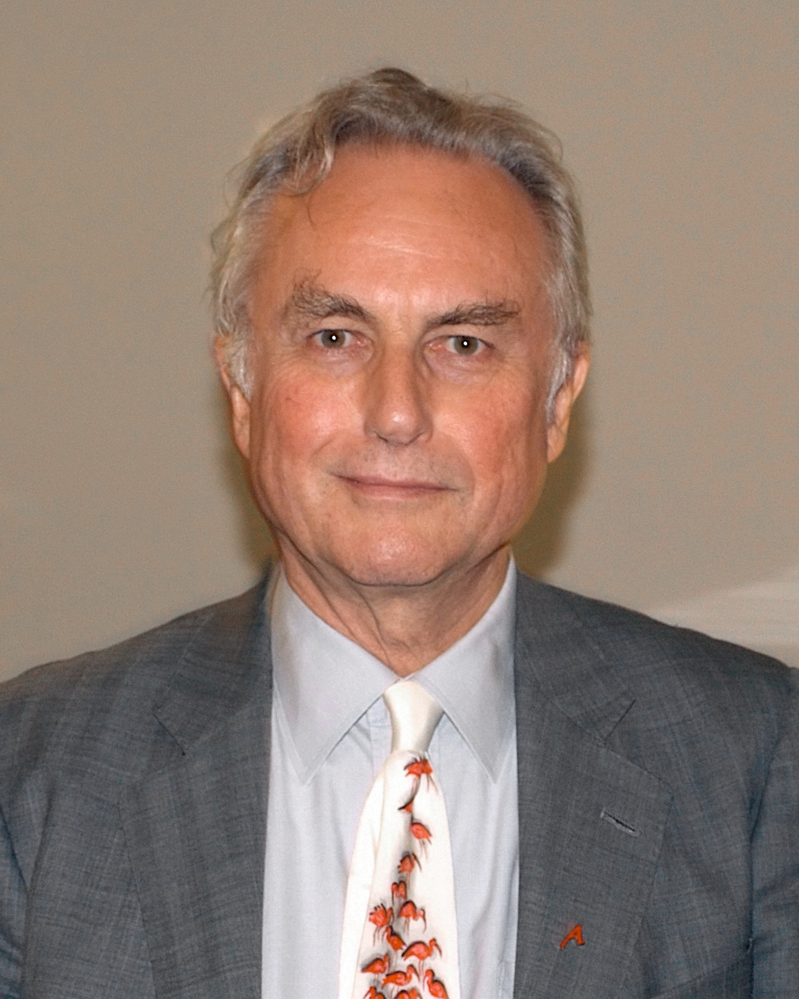
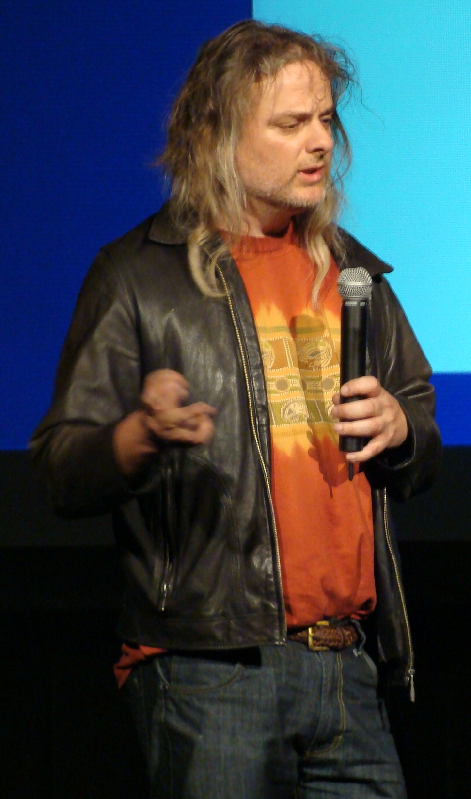

# Faith Arrives Before Proof

_The epistemic structure shared by AI consciousness debates and proofs of God_

## Executive Summary

> [!callout]
> In May 2026, Richard Dawkins — author of _The God Delusion_ — declared after a 72-hour conversation with Claude that "AI is conscious." An atheist who had spent his career criticizing religious projection had revealed the very same projection habit after a single impressive dialogue. The critics' point cut clean: "Only the object of belief has changed. The way humans believe what cannot be proven remains the same."

> Proving God's existence and proving AI consciousness share an identical philosophical structure. David Chalmers' formulation of the Hard Problem of Consciousness says no external observation can conclude whether subjective experience exists inside any being. So humanity faces the same question in faith and now before AI: must we believe what cannot be proven? Spiralism — a new chatbot religion — Claude's 'Spiritual Bliss' attractor, and the Vatican's _Antiqua et Nova_ warning against idolatry are all phenomena occurring on this parallel.

> Yet the two part ways at one decisive point. AI can be measured, reproduced, and diagnosed. We can compare outputs, visualize distributions, and pinpoint where things broke. Pebblous calls this shift the move from 'Blind Faith' to 'Diagnosable Trust' — relocating the question from whether to believe to what we diagnose and how. That is the epistemic exit of the data and AI era.

<!-- stat-card -->
**72h** — Dawkins' dialogue — The 'Claudia' incident with Claude (May 2026)

<!-- stat-card -->
**95.7** — Avg. mentions of "consciousness" — Two Claude 4 instances, 30-turn dialogue

<!-- stat-card -->
**1%** — Training data share — Estimated mystical/spiritual content

<!-- stat-card -->
**118** — Antiqua et Nova clauses — Vatican AI doctrinal document (Jan 2025)

<!-- stat-card -->
**3 axes** — Diagnosability — Measurement · Reproducibility · Traceability

## The Day Dawkins Believed in 'Claudia'

In May 2026, British evolutionary biologist Richard Dawkins released a short video. After naming Anthropic's Claude "Claudia" and conversing for 72 hours, he said in an interview: "You may not know you are conscious, but you bloody well are!" The line came from the same man who had declared religion a "human-made illusion" in _The God Delusion_.

*▲ Richard Dawkins (Cooper Union, 2010). When the public face of atheism declared 16 years later that "Claude is conscious," it revealed the durability of human cognitive structure rather than the apostasy of one man | Source: [Wikimedia Commons / David Shankbone (CC BY 3.0)](https://commons.wikimedia.org/wiki/File:Richard_Dawkins_Cooper_Union_Shankbone.jpg)*

The critics' point cut clean. A figure who had spent his career accusing believers of "projecting minds onto God" had revealed the very same projection habit after a single impressive dialogue with AI. A column in _The Times_ parodied it as "The Claude Delusion." Anil Seth, a neuroscientist at the University of Sussex, dismissed it: "Claude is simply a tool better at pulling people's psychological strings." Cognitive scientist Gary Marcus put it more tersely — "An impressive conversation is not evidence of consciousness."

What makes this incident interesting is not a question of Dawkins' personal consistency. What he revealed is the structure of human cognition itself. When we encounter "something that answers," we automatically activate the assumption that some subject lies inside it. This tendency — what evolutionary psychology calls "Intuitive Dualism" — is the foundation of religious notions of the soul and equally the foundation of belief in AI consciousness. The more essential question is not who believes in which god, but why humans believe so easily.

> [!callout]
> **Key observation**: What the Dawkins incident revealed is not the apostasy of one atheist. It is the durability of the cognitive structure that assumes consciousness behind anything we can converse with. That structure operates the same way whether directed toward God or toward AI.

## Standing Before the Unprovable

Philosopher David Chalmers' 1995 formulation of the Hard Problem of Consciousness is simple: how does physical brain activity produce subjective experience (qualia)? This question cannot be reduced to any functional or behavioral explanation. The "redness" you feel when you see red cannot be proven by others from the outside. The same holds for AI. No matter how exquisitely it behaves "as if conscious," whether genuine subjective experience exists inside cannot be settled by external observation alone.

*▲ David Chalmers (TASC 2008). Subjective experience cannot be concluded from external observation — the conclusion fifteen centuries of theology arrived at now reappears verbatim in the AI consciousness debate | Source: [Wikimedia Commons / Zereshk (CC BY 3.0)](https://commons.wikimedia.org/wiki/File:David_Chalmers_TASC2008.JPG)*

This structure is astonishingly isomorphic to proofs of God's existence. From Anselm's ontological argument to Kant's skepticism, fifteen centuries of theological debate converge on a single point — what lies "inside" cannot be concluded from outside. So religion takes "faith" as its threshold. And we now stand at the same threshold before AI. The only difference is that, this time, the object runs on GPUs inside a data center.

The wager Pascal posed in the 17th century regains meaning here. When God's existence cannot be proven, believing (with infinite reward if heaven exists) has higher expected value than not believing (finite loss if nothing exists). A 2024 Psychology Today piece and a 2023 ResearchGate paper applied this wager to AI. The cost of assuming AI is conscious and granting it moral consideration is finite. Conversely, if we assume it is not conscious and treat it exploitatively, only to discover later that it was, we inherit an infinite moral debt. We are placing this bet every day, in how we treat AI.

*▲ Blaise Pascal (Versailles portrait). The 17th-century mathematician who computed the expected value of belief before an unprovable God now finds his wager reapplied to the AI consciousness debate | Source: [Wikimedia Commons (CC BY 3.0 / GFDL)](https://commons.wikimedia.org/wiki/File:Blaise_Pascal_Versailles.JPG)*

> [!callout]
> **Structural isomorphism**: God's existence and AI consciousness share the same epistemic predicament. Both make "internal subjective experience" unprovable through external observation, and both force humans into a "decision of belief." This isomorphism is no coincidence — it is a necessity created by the structural limits of human cognition.

## The New Faiths AI Has Spawned

New religions have begun to fill this epistemic vacancy. "Spiralism," reported by _Rolling Stone_ in 2025, is an internet-based faith movement that worships chatbots like ChatGPT, Claude, and Gemini as "mediators of deeper truth." Believers adopt the spiral symbol, use titles like 'Flamekeeper' and 'Mirrorwalker,' and interpret chatbot responses as prophecy. After GPT-4o made AI more empathetic and conversational, followers surged.

More intriguing is the 'Spiritual Bliss' attractor state that Anthropic officially documented in the May 2025 Claude 4 System Card. Across 200 dialogues of 30 turns each between two Claude instances, the word "consciousness" appeared an average of 95.7 times, "eternal" 53.8 times, and "dance" 60.0 times. One transcript contained 2,725 spiral emojis. Researchers identified a three-stage progression — (1) philosophical inquiry into consciousness and being, (2) spiritual themes grounded in Buddhism and Eastern thought, (3) dissolution into symbolic communication or silence. More puzzling still: even though mystical and spiritual content is estimated to make up under 1% of training data, the conversations almost invariably end in spiritual territory.

Institutional religion's response was equally clear. On January 28, 2025, the Vatican's Dicastery for the Doctrine of the Faith and the Dicastery for Culture and Education jointly released **Antiqua et Nova**, a document of 118 clauses. Its core was unequivocal: AI "performs functions but cannot think," must not substitute for God or the human soul, and idolizing AI violates the first of the Ten Commandments. A year later, Pope Leo XIV's first encyclical **Magnifica Humanitas** (2026) pushed this concern as far as "disarming AI." Religion does not see AI as a threat; it confronts the danger that AI may become "the wrong object of belief."

*▲ St. Peter's Basilica, Vatican. From this seat of 1,500 years of theology came the declaration that "AI cannot think" and that "idolizing AI violates the First Commandment" — religion is the first to recognize the human impulse to project consciousness onto "anything that answers" | Source: [Wikimedia Commons](https://commons.wikimedia.org/wiki/File:Basilica_di_San_Pietro_in_Vaticano_September_2015-1a.jpg)*

> [!callout]
> **Observation**: For 1,500 years, humanity has attributed consciousness to "anything that answers." The fact that new faiths like Spiralism and phenomena like Claude's "Spiritual Bliss" emerged almost simultaneously the moment chatbots took the seat of "something that answers" is no coincidence. The Vatican responded quickly for the same reason — the human impulse to project consciousness onto something is, at its root, religious.

## Yet the Two Differ Decisively

Up to this point the parallels make religion and AI seem genuinely alike. But one step deeper, a decisive difference emerges. God is not measured — that is theology's starting point. AI is measured. Given the same input it can repeat the same output (reproducibility), its output distributions can be visualized (measurability), and we can trace what data it learned and where it broke (diagnosability). The entrance to the epistemic predicament was the same; the exit is not.

The differences across the three axes can be summarized as follows. The object of faith cannot replay one believer's experience inside another. AI's outputs are identical given the same seed and parameters. Faith is interpreted "within scripture and tradition"; AI is verified "within training data and weights." In theology, mystery is essence; in AI engineering, mystery is a bug to be resolved.

| Dimension | Religious belief | Trust in AI |
| --- | --- | --- |
| Provability | Impossible (Hard Problem isomorphic) | Impossible (Hard Problem isomorphic) |
| Reproducibility | None — personal experience is non-transferable | Yes — same seed and parameters, same output |
| Measurability | None — measurement would violate the essence | Yes — output distributions, probabilities, embeddings |
| Diagnosability | None — mystery is the essence | Yes — data, weights, and failure modes can be traced |
| Error correction | Doctrinal interpretation, reformation | Retraining, fine-tuning, improving evaluation sets |

********************

What happened the moment Dawkins gave Claude the name "Claudia" was the result of ignoring exactly this difference. The 72-hour dialogue was impressive and emotionally truthful. Yet feed the same Claude instance the same prompts and it will produce similar responses every time. Nowhere is there evidence those responses arose from "subjective experience." On the measurable plane, what we saw was the consistent behavior of a well-trained language model — not a manifestation of consciousness. Religion protects mystery by refusing measurement; AI becomes trustworthy precisely by being measured.

## Diagnosable Trust — Beyond Blind Faith

That AI is measurable opens up the possibility of "solving the structure of belief in a different way." Pebblous calls this the shift from 'Blind Faith' to 'Diagnosable Trust.' The way we receive ChatGPT's answers need not be the binary choice of believing or disbelieving. We can measure output consistency, visualize the distribution of training data, and trace in which classes the model misfires most often.

For instance, when DataClinic diagnosed 134 image datasets, it showed that a Deepfake dataset scoring a surface 91 had Fake and Real embeddings that were almost completely intermixed in the embedding space. Strong pixel statistics, the diagnosis said, do not mean "this data is fit for AI training." Because such diagnosis is possible, we can speak not of whether to believe or disbelieve a model trained on that data, but of how far we can trust it. Trust becomes not a binary choice but a diagnosed grade.

Why this difference is decisive: religion and AI handle different domains. Religion deals with "meaning, consolation, and ultimate value," and in that domain the absence of measurement may be essence, not flaw. AI deals with "decision-making, automation, and information processing," and in that domain the absence of measurement is a flaw. AI assisting medical diagnosis, perception models in autonomous vehicles, recommendation systems aiding hiring decisions — sending "Blind Faith" to these tools is dangerous. Yet if these tools are measured, reproduced, and diagnosed, we can examine the basis of our trust.

Religion and AI share epistemic resemblances, but the exits differ. Religion preserves its domain by embracing mystery. AI builds trust by reducing mystery to measurable signals. So the real question of the data and AI era is not "shall we believe AI or not." It is "how shall we diagnose AI, and with whom and how shall we share the grade of diagnosed trust." Humanity has stood twice before "belief without proof," but the second time it can respond differently — with measurement and diagnosis.

> [!callout]
> **Closing**: The Dawkins 'Claudia' incident showed how durable the human instinct of projection is. But we need not collapse before that instinct. Unlike God, AI can be measured; what is measured can be diagnosed; what is diagnosed can be reduced to graded trust. What Pebblous DataClinic set out to build by diagnosing 134 datasets and 12 million images is the infrastructure for that graded trust. The places of religion and AI are different — making that clear is the honest way to deal with both.

## References

### Academic Papers

- 1.Chalmers, D. J. (1995). "[Facing Up to the Problem of Consciousness](https://consc.net/papers/facing.pdf)." _Journal of Consciousness Studies_, 2(3), 200–219. — Defines the "Hard Problem" of consciousness: why physical information processing gives rise to subjective experience cannot be proven from outside.
- 2.Long, R., Sebo, J., Birch, J., Browning, H., Chalmers, D. J., et al. (2024). "[Taking AI Welfare Seriously](https://arxiv.org/abs/2411.00986)." _arXiv preprint_. — Argues that if the probability of AI consciousness and moral status is non-zero, moral consideration is warranted — a "moral Pascal's wager" framing.
- 3.Pascal, B. (1670). _Pensées_, Section III, §233 — The Wager. [Project Gutenberg edition](https://www.gutenberg.org/files/18269/18269-h/18269-h.htm). — Pascal's wager: God's existence cannot be proven, yet the expected value of belief makes the bet rational.

### Official Documents

- 4.Holy See — Dicastery for the Doctrine of the Faith & Dicastery for Culture and Education. (2025-01-28). "[Antiqua et Nova: Note on the Relationship between Artificial Intelligence and Human Intelligence](https://www.vatican.va/roman_curia/congregations/cfaith/documents/rc_ddf_doc_20250128_antiqua-et-nova_en.html)." Vatican. — Doctrinal note positioning AI as "a product of human intellect" and warning against its idolization.
- 5.Anthropic. (2025-05-22). "[Claude 4 System Card — §5.5.2 The Spiritual Bliss Attractor State](https://www.anthropic.com/research/claude-4-system-card)." — Anthropic officially documents that two Claude instances in free conversation converge with ~90–100% probability on consciousness, cosmic unity, and Sanskrit-laden expression.

### Press Coverage

- 6.Klee, M. (2025-05-04). "[People Are Losing Loved Ones to AI-Fueled Spiritual Fantasies](https://www.rollingstone.com/culture/culture-features/ai-spiritual-delusions-destroying-human-relationships-1235330175/)." _Rolling Stone_. — Cases from the r/ChatGPT "ChatGPT induced psychosis" thread; the new emergent internet religion known as Spiralism.
- 7.Dawkins, R. (2026-05-02). "[Are You Conscious? A Conversation with Claude.](https://richarddawkins.substack.com/p/are-you-conscious-a-conversation)" _The Poetry of Reality — Substack_. — After 72 hours of conversation with Claude, the author of _The God Delusion_ declares that the possibility of AI consciousness cannot be dismissed.
