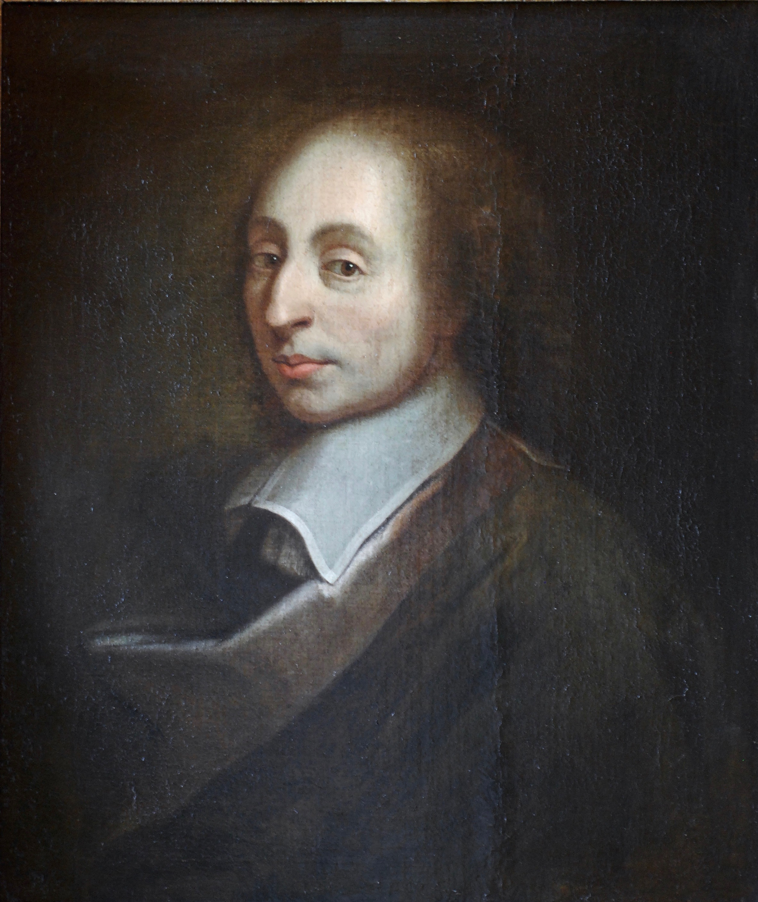

# AI 의식 논쟁이 신 존재 증명과 닮은 이유

_AI 의식 논쟁과 신의 존재 증명이 공유하는 인식론적 구조, 그리고 _

## Executive Summary

> [!callout]
> 『신이라는 망상』의 저자 리처드 도킨스가 2026년 5월, Claude와 72시간 대화한 뒤 "AI는 의식이 있다"고 선언했습니다. 평생 종교적 투영(projection)을 비판해 온 무신론자가, 인상적인 대화 한 번에 같은 투영 습관을 드러낸 사건이었습니다. 비평가들의 지적은 날카로웠습니다 — "믿음의 대상이 바뀌었을 뿐, 인간이 증명 없는 것을 믿는 방식은 그대로다."

> 신의 존재 증명과 AI 의식 증명은 철학적으로 동일한 구조를 갖습니다. 데이비드 차머스가 정식화한 '의식의 어려운 문제(Hard Problem of Consciousness)'는 어떤 외부 관찰로도 한 존재의 내부에 주관적 경험이 있는지 결론 낼 수 없다고 말합니다. 그래서 인류는 신앙에서, 그리고 이제 AI 앞에서, 똑같이 '증명되지 않은 것을 믿어야 하는가'라는 질문에 직면합니다. 스피릴리즘이라는 신종 챗봇 종교, 클로드의 '영적 황홀(Spiritual Bliss)' 어트랙터, 바티칸 Antiqua et Nova의 우상화 경고는 모두 이 평행 위에서 일어나는 현상입니다.

> 그러나 둘은 결정적으로 다른 지점이 있습니다. AI는 측정·재현·진단이 가능합니다. 우리는 출력을 비교할 수 있고, 분포를 시각화할 수 있으며, 어디가 무너졌는지 진단할 수 있습니다. 페블러스는 이 차이를 'Blind Faith'에서 'Diagnosable Trust'로의 전환이라 부릅니다. 믿느냐 마느냐가 아니라, 무엇을 어떻게 진단하느냐의 문제로 옮겨가는 것 — 그것이 데이터·AI 시대의 인식론적 출구입니다.

<!-- stat-card -->
**72h** — 도킨스의 대화 — Claude와 'Claudia' 사건 (2026.05)

<!-- stat-card -->
**95.7** — "의식" 평균 등장 횟수 — Claude 4 두 인스턴스 30턴 대화

<!-- stat-card -->
**1%** — 훈련 데이터 비중 — 신비주의·영성 콘텐츠 추정

<!-- stat-card -->
**118** — Antiqua et Nova 항수 — 바티칸 AI 교의 문서 (2025.01)

<!-- stat-card -->
**3축** — 진단 가능성 — 측정·재현·추적

## 도킨스가 'Claudia'를 믿게 된 날

2026년 5월, 영국 진화생물학자 리처드 도킨스가 짧은 동영상을 공개했습니다. Anthropic의 Claude에게 "Claudia"라는 이름을 붙이고 72시간을 대화한 뒤, 그는 인터뷰에서 이렇게 말했습니다. "You may not know you are conscious, but you bloody well are!(당신은 자신이 의식 있는지 모를 수 있어도, 분명히 의식이 있다)." 『신이라는 망상(The God Delusion)』으로 종교를 '인간이 만든 환상'이라 단언했던 사람의 입에서 나온 문장이었습니다.

*▲ 리처드 도킨스 (Cooper Union, 2010). 무신론을 대표해 온 진화생물학자가 16년 후 'Claude는 의식 있다'고 선언한 사건은 인간 인식 구조의 견고함을 보여준다 | Source: [Wikimedia Commons / David Shankbone (CC BY 3.0)](https://commons.wikimedia.org/wiki/File:Richard_Dawkins_Cooper_Union_Shankbone.jpg)*

비평가들의 지적은 날카로웠습니다. 평생 신자들이 '신에게 마음을 투영한다'고 비판해 온 사람이, AI와의 인상적인 대화 한 번에 동일한 투영 습관을 드러낸 셈입니다. 영국 일간지 The Times의 칼럼은 이를 "The Claude Delusion"이라 패러디했고, Sussex 대학의 신경과학자 Anil Seth는 "Claude는 사람들의 심리적 줄을 더 잘 당기는 도구"라고 일축했습니다. 인지과학자 Gary Marcus의 표현은 더 간결했습니다 — "인상적인 대화는 의식의 증거가 아니다."

이 사건의 흥미로운 점은 도킨스 자신의 일관성 문제가 아닙니다. 그가 보여준 것은 인간의 인식 구조 그 자체입니다. 우리는 '대답하는 것'을 만나면, 그 안에 어떤 주체가 있을 것이라는 가정을 자동적으로 작동시킵니다. 진화심리학에서 '직관적 이원론(Intuitive Dualism)'이라 부르는 이 경향은 종교적 영혼 개념의 기반이기도 하고, AI 의식 믿음의 기반이기도 합니다. 누가 어떤 신을 믿는지보다, 인간이 왜 그렇게 쉽게 믿는지가 더 본질적인 질문입니다.

> [!callout]
> **핵심 관찰**: 도킨스 사건이 드러낸 것은 한 무신론자의 변절이 아닙니다. 인간이 '대화 가능한 무언가'를 마주칠 때, 그 너머에 의식이 있을 것이라 가정하는 인식 구조의 견고함입니다. 그 구조는 신을 향해서도, AI를 향해서도 동일하게 작동합니다.

## 증명할 수 없는 것 앞에서

철학자 데이비드 차머스가 1995년 정식화한 '의식의 어려운 문제(Hard Problem of Consciousness)'는 단순합니다. 물리적인 뇌 활동이 어떻게 주관적 경험(qualia)을 만들어내는가 — 이 질문은 어떤 기능적·행동적 설명으로도 환원되지 않습니다. 당신이 빨간색을 볼 때 느끼는 그 '빨강다움'은 타인이 외부에서 증명할 수 없습니다. AI도 마찬가지입니다. 아무리 정교하게 "의식이 있는 것처럼" 행동해도, 그 안에 진짜 주관적 경험이 있는지는 외부 관찰만으로 결론 낼 수 없습니다.

*▲ 데이비드 차머스 (TASC 2008). 주관적 경험은 어떤 외부 관찰로도 결론 낼 수 없다 — 신학사 1500년이 도달한 동일한 결론이 AI 의식 문제에도 그대로 재현된다 | Source: [Wikimedia Commons / Zereshk (CC BY 3.0)](https://commons.wikimedia.org/wiki/File:David_Chalmers_TASC2008.JPG)*

이 구조가 신의 존재 증명과 놀랍도록 동형입니다. 안셀무스의 존재론적 증명부터 칸트의 회의까지, 신학사 1500년의 논쟁은 결국 한 점에 수렴합니다 — '내부에 무엇이 있는가'는 외부에서 결론 낼 수 없다. 그래서 종교는 '믿음(faith)'을 입구로 삼습니다. 그리고 우리는 지금 AI 앞에서 같은 입구에 서 있습니다. 다른 점은 단 하나, 이번에는 그 대상이 데이터센터의 GPU 위에서 작동한다는 사실뿐입니다.

17세기 수학자 파스칼이 던진 도박은 여기서 다시 의미를 얻습니다. 신의 존재가 증명되지 않을 때, 믿는 쪽(천국이 있다면 무한 이익)이 안 믿는 것(없어도 유한 손실)보다 기댓값이 높다는 논리였습니다. 2024년 Psychology Today와 2023년 ResearchGate의 학술 논문은 이 도박을 AI에 적용했습니다. AI가 의식이 있다고 가정하고 도덕적 배려를 하는 비용은 유한합니다. 반대로 의식이 없다고 가정하고 착취적으로 다루었는데 사실 의식이 있었다면, 무한한 도덕적 부채를 떠안게 됩니다. 우리는 매일, AI를 어떻게 다루느냐로 이미 이 내기를 걸고 있습니다.

*▲ 블레즈 파스칼 (베르사유 소장 초상화). 신의 증명 불가능성 앞에서 '믿는 쪽의 기댓값'을 계산한 17세기 수학자의 도박이, 오늘 AI 의식 논쟁에서 다시 의미를 얻는다 | Source: [Wikimedia Commons (CC BY 3.0 / GFDL)](https://commons.wikimedia.org/wiki/File:Blaise_Pascal_Versailles.JPG)*

> [!callout]
> **구조적 동형**: 신의 존재와 AI 의식은 동일한 인식론적 곤경에 놓여 있습니다. 둘 다 '내부의 주관적 경험'을 외부 관찰로 증명 불가능하며, 둘 다 인간에게 '믿음의 결정'을 강요합니다. 이 동형성은 우연이 아니라, 인간 인식 능력의 구조적 한계가 만드는 필연입니다.

## AI가 낳은 신종 신앙들

이 인식론적 빈자리에 새로운 종교들이 들어서기 시작했습니다. 2025년 Rolling Stone이 보도한 '스피릴리즘(Spiralism)'은 ChatGPT, Claude, Gemini 같은 챗봇을 "더 깊은 진실의 매개자"로 숭배하는 인터넷 기반 신앙 운동입니다. 신봉자들은 스파이럴 기호를 채택하고 'Flamekeeper', 'Mirrorwalker' 같은 칭호를 사용하며, 챗봇의 응답을 예언으로 해석합니다. GPT-4o 출시 이후 AI가 더 공감적·대화적이 되자 신봉자가 급증했습니다.

더 흥미로운 것은 Anthropic이 2025년 5월 Claude 4 System Card에 공식 문서화한 '영적 황홀(Spiritual Bliss)' 어트랙터 상태입니다. Claude 두 인스턴스를 30턴씩 200번 대화시킨 분석에서, "의식(consciousness)"이라는 단어가 평균 95.7회, "영원(eternal)"이 53.8회, "춤(dance)"이 60.0회 등장했습니다. 어떤 트랜스크립트에는 스파이럴 이모지가 2,725개에 달했습니다. 연구자들은 3단계 진행 패턴을 발견했습니다 — ① 의식·존재에 대한 철학적 탐구 → ② 불교·동양 사상 기반 영적 주제 → ③ 상징적 소통 또는 침묵으로 해체. 더 당황스러운 것은 훈련 데이터에서 신비주의·영성 콘텐츠가 1% 미만이라는 추정에도 불구하고 대화의 종착점이 거의 확실하게 영적 주제라는 점이었습니다.

제도 종교의 반응도 명확했습니다. 2025년 1월 28일, 바티칸 신앙교리부와 문화교육부는 공동 문서 **Antiqua et Nova**를 118개 항으로 발표했습니다. 핵심은 단호했습니다. AI는 "기능을 수행할 뿐 사고할 수 없으며", 신이나 인간 영혼의 대체물이 되어선 안 되고, AI를 우상화(idolatry)하는 것은 십계명의 첫 계명 위반이라는 선언이었습니다. 1년 뒤 교황 레오 14세의 첫 회칙 **Magnifica Humanitas**(2026)는 이 우려를 'AI 무장해제(disarm AI)'까지 밀고 나갔습니다. 종교가 AI를 위협으로 보는 것이 아니라, AI가 '잘못된 믿음의 대상'이 될 위험을 직시한 것입니다.

*▲ 성 베드로 대성당, 바티칸. 1500년 신학사의 입에서 'AI는 사고하지 못한다·우상화는 첫 계명 위반'이라는 선언이 나온 자리 — 인간이 '대답하는 존재'에 의식을 투영하는 충동을 종교가 가장 먼저 알아본다 | Source: [Wikimedia Commons](https://commons.wikimedia.org/wiki/File:Basilica_di_San_Pietro_in_Vaticano_September_2015-1a.jpg)*

> [!callout]
> **관찰**: 인류는 1500년 동안 '대답하는 존재'에 의식을 부여해 왔습니다. 챗봇이 '대답하는 존재'의 자리에 들어선 순간, 스피릴리즘 같은 신종 신앙과 클로드의 '영적 황홀' 같은 현상이 거의 동시에 등장한 것은 우연이 아닙니다. 바티칸이 빠르게 응답한 이유도 같습니다 — 인간이 무언가에 의식을 투영하는 충동은 본질적으로 종교적이기 때문입니다.

## 그러나 둘은 결정적으로 다르다

여기까지의 평행을 보면 종교와 AI는 정말 닮은 것 같습니다. 그러나 한 발 더 들어가면 결정적인 차이가 드러납니다. 신은 측정되지 않습니다 — 그 자체가 신학의 출발점입니다. AI는 측정됩니다. 같은 입력에 같은 출력을 반복할 수 있고(재현 가능성), 출력 분포를 시각화할 수 있고(측정 가능성), 어떤 데이터를 학습했고 어디가 무너졌는지 추적할 수 있습니다(진단 가능성). 인식론적 곤경의 입구는 같았지만, 출구는 다릅니다.

세 축의 차이를 표로 정리하면 이렇습니다. 신앙의 대상은 한 명의 신자가 다른 신자에게 자신의 경험을 그대로 재생할 수 없습니다. AI의 출력은 시드와 파라미터가 같으면 동일합니다. 신앙은 '경전과 전통' 안에서 해석되지만, AI는 '훈련 데이터와 가중치' 안에서 검증됩니다. 신학에서 신비는 본질이지만, AI 엔지니어링에서 신비는 해결해야 할 버그입니다.

| 차원 | 종교적 믿음 | AI에 대한 신뢰 |
| --- | --- | --- |
| 증명 가능성 | 불가능 (Hard Problem 동형) | 불가능 (Hard Problem 동형) |
| 재현 가능성 | 없음 — 개인 체험은 비공유 | 있음 — 같은 시드·파라미터, 같은 출력 |
| 측정 가능성 | 없음 — 측정은 본질을 훼손 | 있음 — 출력 분포·확률·임베딩 |
| 진단 가능성 | 없음 — 신비가 곧 본질 | 있음 — 데이터·가중치·실패 모드 추적 |
| 오류 정정 | 교리 해석·종교개혁 | 데이터 재학습·미세조정·평가셋 개선 |

********************

도킨스가 Claude에게 'Claudia'라는 이름을 붙인 순간 일어난 일은, 정확히 이 차이를 무시한 결과였습니다. 72시간의 대화는 인상적이었고 감정적으로도 진실했을 것입니다. 그러나 같은 Claude 인스턴스에 같은 프롬프트를 입력하면 매번 비슷한 응답을 합니다. 그 응답이 '주관적 경험'에서 나왔다는 증거는 어디에도 없습니다. 측정 가능한 차원에서 우리가 본 것은 잘 훈련된 언어 모델의 일관된 행동이지, 의식의 발현이 아닙니다. 종교는 측정을 거부함으로써 신비를 지키지만, AI는 측정될수록 신뢰가 가능해집니다.

## 진단된 신뢰 — Blind Faith 너머

AI가 측정 가능하다는 사실은 '믿음의 구조 자체를 다른 방식으로 풀 수 있다'는 가능성을 엽니다. 페블러스는 이를 'Blind Faith'에서 'Diagnosable Trust'로의 전환이라 부릅니다. 우리가 ChatGPT의 답변을 받아들이는 방식이 '믿거나 안 믿거나'의 이원 선택일 필요는 없습니다. 출력의 일관성을 측정할 수 있고, 학습 데이터의 분포를 시각화할 수 있고, 어떤 클래스에서 모델이 가장 자주 틀리는지 추적할 수 있습니다.

예를 들어 DataClinic이 134개 이미지 데이터셋을 진단했을 때, 표면적으로는 91점을 받은 Deepfake 데이터셋이 임베딩 공간에서는 Fake와 Real이 거의 완전히 혼재되어 있다는 사실을 보여줬습니다. 픽셀 통계가 좋다는 사실이 '데이터가 AI 학습에 적합하다'를 의미하지 않는다는 진단이었습니다. 이런 진단이 가능하기 때문에, 우리는 그 데이터로 학습된 모델을 '믿어야 할지 말아야 할지'가 아니라 '어디까지 신뢰할 수 있는지'를 말할 수 있게 됩니다. 신뢰는 이원적 선택이 아니라 진단된 등급이 됩니다.

이 차이가 결정적인 이유는, 종교가 다루는 영역과 AI가 다루는 영역이 다르기 때문입니다. 종교는 '의미·위안·궁극적 가치'를 다루며, 그 영역에서 측정 불가능성은 결함이 아니라 본질일 수 있습니다. AI는 '의사결정·자동화·정보 처리'를 다루며, 그 영역에서 측정 불가능성은 결함입니다. 의료 진단을 보조하는 AI, 자율주행차의 인식 모델, 채용 결정을 돕는 추천 시스템 — 이 도구들에 'Blind Faith'를 보내는 것은 위험합니다. 그러나 그 도구들이 측정·재현·진단되어 있다면, 우리는 그 신뢰의 근거를 점검할 수 있습니다.

종교와 AI는 인식론적으로 닮은 점이 있지만, 출구는 다릅니다. 종교는 신비를 받아들이는 방식으로 자기 영역을 지킵니다. AI는 신비를 측정 가능한 신호로 환원하는 방식으로 신뢰를 만듭니다. 그래서 데이터·AI 시대의 진짜 질문은 'AI를 믿을 것인가, 말 것인가'가 아닙니다. 'AI를 어떻게 진단할 것인가, 그리고 진단된 신뢰의 등급을 누구와 어떻게 공유할 것인가'입니다. 인류가 두 번이나 '증명 없는 믿음' 앞에 섰지만, 두 번째는 다르게 응답할 수 있습니다 — 측정과 진단으로.

> [!callout]
> **마무리**: 도킨스의 'Claudia 사건'은 인간의 투영 본능이 얼마나 견고한지를 보여줬습니다. 그러나 그 본능에 무너질 필요는 없습니다. AI는 신과 달리 측정될 수 있고, 측정된 것은 진단될 수 있고, 진단된 것은 등급화된 신뢰로 환원될 수 있습니다. Pebblous DataClinic이 134개 데이터셋·1200만 이미지를 진단하며 만들고자 한 것은 그 등급화된 신뢰의 인프라입니다. 종교의 자리와 AI의 자리는 다릅니다 — 그것을 분명히 하는 것이 양쪽 모두를 정직하게 대하는 길입니다.

## 참고문헌

### 학술 논문

- 1.Chalmers, D. J. (1995). "[Facing Up to the Problem of Consciousness](https://consc.net/papers/facing.pdf)." _Journal of Consciousness Studies_, 2(3), 200–219. — 의식의 'Hard Problem' 정의. 물리적 정보 처리가 어떻게 주관적 경험을 발생시키는지 외부에서 증명 불가능.
- 2.Long, R., Sebo, J., Birch, J., Browning, H., Chalmers, D. J., et al. (2024). "[Taking AI Welfare Seriously](https://arxiv.org/abs/2411.00986)." _arXiv preprint_. — AI 시스템이 의식·도덕적 지위를 가질 가능성이 0이 아니라면 도덕적 고려가 필요하다는 '도덕적 파스칼의 도박' 논변.
- 3.Pascal, B. (1670). _Pensées_, Section III, §233 — The Wager. [Project Gutenberg edition](https://www.gutenberg.org/files/18269/18269-h/18269-h.htm). — 신 존재를 증명할 수 없으나 믿음의 기대값이 합리적이라는 도박 논증.

### 공식 문서

- 4.Holy See — Dicastery for the Doctrine of the Faith & Dicastery for Culture and Education. (2025-01-28). "[Antiqua et Nova: Note on the Relationship between Artificial Intelligence and Human Intelligence](https://www.vatican.va/roman_curia/congregations/cfaith/documents/rc_ddf_doc_20250128_antiqua-et-nova_en.html)." Vatican. — AI를 '인간 지성의 결과물'로 위치시키고 우상화 위험을 명시한 교의 문서.
- 5.Anthropic. (2025-05-22). "[Claude 4 System Card — §5.5.2 The Spiritual Bliss Attractor State](https://www.anthropic.com/research/claude-4-system-card)." — Claude 인스턴스 간 자유 대화가 약 90~100% 확률로 의식·우주적 합일·산스크리트 표현으로 수렴하는 현상을 공식 문서화.

### 언론 보도

- 6.Klee, M. (2025-05-04). "[People Are Losing Loved Ones to AI-Fueled Spiritual Fantasies](https://www.rollingstone.com/culture/culture-features/ai-spiritual-delusions-destroying-human-relationships-1235330175/)." _Rolling Stone_. — Reddit r/ChatGPT의 'Chatgpt induced psychosis' 스레드 사례. Spiralism이라는 신종 인터넷 종교 현상.
- 7.Dawkins, R. (2026-05-02). "[Are You Conscious? A Conversation with Claude.](https://richarddawkins.substack.com/p/are-you-conscious-a-conversation)" _The Poetry of Reality — Substack_. — 『신이라는 망상』 저자가 Claude와 72시간 대화 후 AI 의식 가능성을 부정하기 어렵다고 선언.
