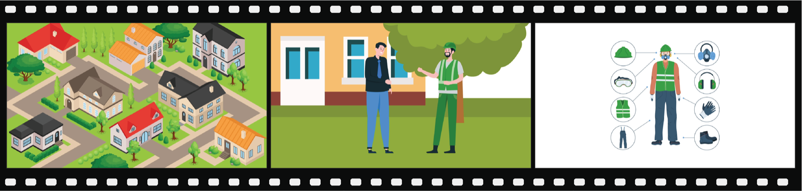

# AI Agents Now Finish One in Six Real Freelance Jobs

_Scale AI and CAIS_

## Executive Summary

> [!callout]
> There is a benchmark that measures how far AI agents can carry a real freelance job to completion. It is the Remote Labor Index (RLI), built jointly by Scale AI and the Center for AI Safety (CAIS). When it launched in October 2025, the best-performing model finished only 2.5% of 240 projects at a level a human client would accept. Eight months later, in July 2026, that figure had climbed to 16.1%. What actually matters here is not the rise itself but the data design that made it trustworthy, and the wall that still stands.

> What sets RLI apart from other benchmarks is where its problems come from. They are not exam questions written for a test but real freelance projects where money actually changed hands. The reference answers are finished deliverables shipped by human experts, and the grading is done by people. So what the benchmark measures is not reasoning ability but completeness: will an actual client accept this deliverable?

> Break the failures down and the direction is unmistakable. Of the failure cases, 45.6% fell short of professional quality standards, and 35.7% were incomplete deliverables with missing or cut-off elements. The agents did not stumble because they could not solve the problem; they stumbled because they could not carry the output through to a coherent finish. For anyone who works with data, this distinction is familiar. The bottleneck for automation was not intelligence but completion, which is to say the quality of the output itself.

### Key Figures

Sources: [CAIS (2026)](https://safe.ai/blog/significant-increase-in-digital-labor-automation) · [Scale AI (2025)](https://scale.com/blog/rli) · paper [arXiv:2510.26787](https://arxiv.org/abs/2510.26787)

<!-- stat-card -->
**16.1%** — Top automation rate — Fable 5, as of July 2026

<!-- stat-card -->
**×6.4** — Rise over eight months — 2.5% (Oct 2025) → 16.1% (Jul 2026)

<!-- stat-card -->
**45.6%** — Top failure cause — Fell short of expert quality

<!-- stat-card -->
**$1,720** — AI equivalent earnings — Same 240 jobs; humans earned $143,991

## Eight Months, Four Times Over

When RLI first launched in October 2025, Manus topped the leaderboard with an automation rate of 2.5%. Eight months later, in July 2026, the new leader Fable 5 posted 16.1%. The share of the 240 projects finished at a level a human client would accept had jumped more than sixfold. Other top models climbed alongside it, but the gap to the leader remains wide. As of that same July 2026, Opus 4.8 sat at 8.3% and GPT-5.5 at 6.3%, leaving Fable 5's rate close to double that of the second-place model.

| Point in time | Top model | Automation rate |
| --- | --- | --- |
| Oct 2025 (launch) | Manus | 2.5% |
| Interim | Opus 4.6 + Claude Cowork | 4.2% |
| Jul 2026 (latest) | Fable 5 | 16.1% |
| Jul 2026 | Opus 4.8 | 8.3% |
| Jul 2026 | GPT-5.5 | 6.3% |

<!-- stat-card -->
**RLI automation-rate timeline** — Fable 5 was evaluated on 218 of the 240 jobs. The other 22 could not be scored because of restricted access to U.S. government materials; even counting all of them as failures leaves the automation rate at 14.6%.

Lay the economic gap over the top and the meaning of the rise sharpens. Across the 240 projects, the human freelancers actually earned $143,991. Handing the same jobs to the best model at launch (Manus) yielded equivalent earnings of just $1,720. Eight months of gains have not closed that gap, but they show clearly which way the curve is bending.

> [!callout]
> What matters is not the single number 16.1% but the kind of test it came from. Scoring 90 on a standardized quiz and passing one in six paid, deliverable jobs are entirely different stories.

## Jobs Where Real Invoices Changed Hands

The 240 projects in RLI are not problems invented in a lab. They are jobs that real clients paid for and commissioned on actual freelance platforms. They span twenty-three Upwork sub-categories, from video production, CAD design, and graphic design to game development and architectural drawings. The average project took 28.9 hours to complete at an average cost of $632.6, with individual jobs ranging from as little as $9 to as much as $22,500.

These jobs were not simply scraped together. The researchers sourced candidates three ways. They posted openings across 43 eligible fields and recruited 358 skilled freelancers with an average of 2,341 hours of experience; they filled thin fields by separately hiring freelancers; and they took published work only after clearing author permission and confirming its cost and time. Of the 550 candidates gathered this way, more than half (310) were filtered out, leaving just 240. A 56% rejection rate shows how rigorously this dataset was refined.

*▲ One of the real freelance projects in the RLI dataset — an advertisement video deliverable shipped by a human expert | Source: [CAIS (2026)](https://safe.ai/blog/significant-increase-in-digital-labor-automation)*

> [!callout]
> The more closely a benchmark resembles the real labor market, the easier it is to read its results back into practice. That one condition — that money changed hands — sets RLI apart from ordinary reasoning tests.

## Why the Number Holds Up

A claim that automation jumped sixfold means nothing if the grading is loose. RLI's credibility comes not from the sophistication of what it measures but from how it designs the reference answers and the scoring. The core is three ingredients attached to every project.

<!-- stat-card -->
**① Task description (brief)** — The client's original request was preserved and standardized into three items: task description, provided materials, and deliverables. What the AI has to build is identical to what the human received.

<!-- stat-card -->
**② Input files** — All the materials needed to complete the project are provided as-is. The agent starts from the same conditions the human freelancer held in hand.

<!-- stat-card -->
**③ The human-shipped reference deliverable** — The reference answer is the finished expert work "a reasonable client would actually accept," recorded down to its completion time and cost. The grading baseline is a real delivered artifact, not an abstract answer key.

People do the grading. Evaluators rate the AI output on a 1-to-3 scale: 1 is unacceptable, 2 is acceptable at a human level, and 3 exceeds the human output. The share scoring 2 or higher is the automation rate. Evaluators are trained to take the "reasonable client" view, primed in advance on the failure modes AI commits often, and each project is scored independently by three of them, with the verdict decided by majority.

The trust metrics this procedure produced are concrete. Inter-rater agreement on the automation scoring was 94.4%; every case judged a success went through a full re-review; and when a sample of 50 was checked again, the false-success rate — cases scored a success that were really failures — was 5.8% or lower. The reason the numbers can be trusted lives inside the way the data was designed.

> [!callout]
> A benchmark's credibility is a product of data quality

> Reasoning benchmarks measure how well a model solves problems whose answers are already fixed. RLI measures a judgment that does not resolve to a single answer: would a client accept this deliverable? What made that judgment measurable is the data design: the brief, the inputs, the reference answer, and the scoring protocol. However much the benchmark can be trusted is a measure of how well the data beneath it was built.

## The Wall Was Completion

The researchers collected the written reasons attached to roughly 400 failure scores and grouped them by type. The result points clearly to where the wall for automation stands. The top two types alone account for most of the failures.

<!-- stat-card -->
**Failure causes by type (multiple counts allowed)** — Quality shortfall45.6% — Fell short of expert standards (e.g. a ring CAD with blunt prongs, shapes at a child's drawing level) — Incomplete deliverable35.7% — Missing or cut-off elements (e.g. 8 seconds delivered for an 8-minute video request, missing source assets) — Corrupt or unusable file17.6% — Empty files or formats that will not open (e.g. a 3D model that changes shape with each viewing angle) — Inconsistency across deliverables14.8% — Coherence breaks between files when several generation tools are used

All four types lean toward "could not finish the output" rather than "could not solve the problem." Delivering an 8-minute video as 8 seconds, or building a 3D structure that changes shape as it rotates, is less a limit of intelligence than a limit of completeness and coherence. The contrast between what AI does relatively well and what it does poorly backs the same diagnosis. Making something new from scratch — generating images and audio, writing reports — it handles reasonably well, but it falls apart on work that edits existing assets across multiple stages and keeps the pieces aligned end to end.

*▲ Outputs from three AI models and a human expert on the same ring CAD brief — photorealistic renders on top, underlying 3D models below | Source: [CAIS (2026)](https://safe.ai/blog/significant-increase-in-digital-labor-automation)*

> [!callout]
> To anyone who has worked with data quality, this failure map is not unfamiliar. Missing values, truncation, format errors, and broken coherence are the same defects we always see in bad datasets. The completeness problem in AI output and the data quality problem wear the same face. What blocks automation is not the absence of a smarter model but the absence of the ability to produce a flawless output all the way to the end.

## What It Did Not Measure

An honest benchmark states what it does not measure. The RLI researchers placed three kinds of work outside their scope from the start: jobs that require real-time back-and-forth with a client (tutoring, for instance), jobs a team has to run together (project management, for instance), and deliverables that cannot be opened in a web-based grading environment (desktop app development, for instance).

So even if the automation rate on RLI reached 100%, it would not mean AI had replaced all remote labor. On the far side of what was made measurable there is always what was left unmeasured. Because this boundary is drawn clearly, the figure 16.1% can be read without exaggeration.

Here we meet the question Pebblous faces every day. To speak honestly about automation, you first have to decide what to measure and by what standard, and that standard comes back, in the end, to the problem of data design. The reason RLI could sort half of its failures under "completion" at all is that well-built data, namely human reference answers and a scoring protocol, existed in the first place. Before debating how much of real work AI replaces, we should first ask how well the material for measuring it was made.

> [!callout]
> Four times over in eight months is fast. But what made that curve trustworthy, and what showed where the wall still stands, was in the end the data. The real indicator of automation is not a model's score but the quality of the material used to measure that score.

## References

- 1.Mazeika, M. et al. (2025). "[Remote Labor Index: Measuring AI Automation of Remote Work](https://arxiv.org/abs/2510.26787)." arXiv:2510.26787.
- 2.Center for AI Safety. (2026). "[A Significant Increase in Digital Labor Automation](https://safe.ai/blog/significant-increase-in-digital-labor-automation)." safe.ai Blog.
- 3.Scale AI. (2025). "[The Remote Labor Index: Measuring the Automation of Work](https://scale.com/blog/rli)." Scale AI Blog.
