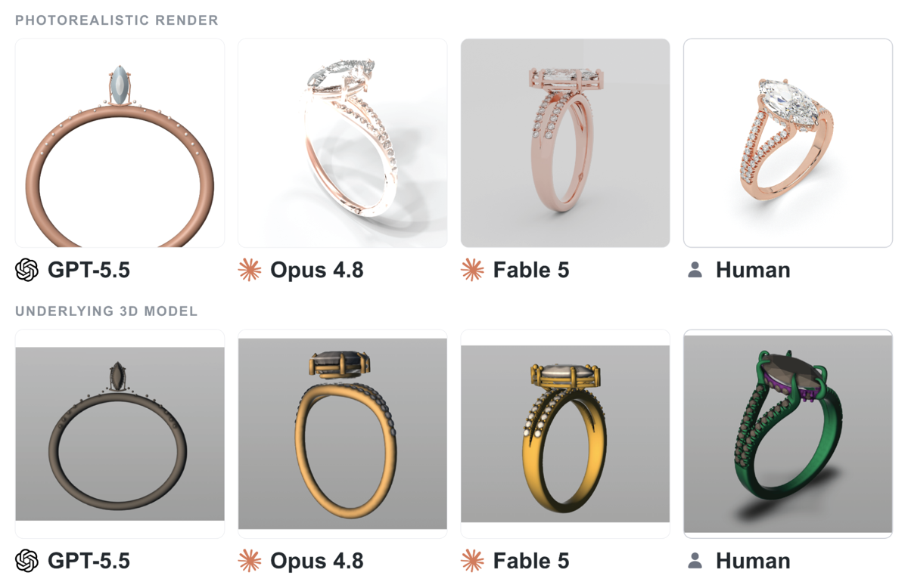

# AI 에이전트가 끝낸 실제 프리랜서 일감, 여덟 달 만에 6분의 1

_Scale AI·CAIS의 Remote Labor Index가 자동화율을 2.5%에서 16.1%로 끌어올린 과정과 남은 벽_

## Executive Summary

> [!callout]
> AI 에이전트가 실제 프리랜서 일감을 얼마나 끝까지 해내는지 재는 벤치마크가 있습니다. Scale AI와 미국 AI 안전센터(CAIS)가 함께 만든 Remote Labor Index(RLI)입니다. 공개 시점인 2025년 10월에는 최고 성능 모델이 240개 프로젝트 중 2.5%만 사람이 받아들일 수준으로 완성했는데, 여덟 달 뒤인 2026년 7월에는 그 수치가 16.1%까지 올랐습니다. 정작 눈여겨볼 대목은 그 상승 자체가 아니라, 상승을 신뢰할 수 있게 만든 데이터 설계와 아직 넘지 못한 벽입니다.

> RLI가 다른 벤치마크와 갈리는 지점은 문제의 출처입니다. 시험용으로 만든 문제가 아니라 실제로 돈이 오간 프리랜서 프로젝트를 모았고, 정답은 사람 전문가가 납품한 완성본이며, 채점도 사람이 합니다. 그래서 이 벤치마크가 재는 것은 추론력이 아니라 "이 결과물을 고객이 실제로 받아들일 것인가"라는 완성도입니다.

> 실패를 뜯어보면 방향이 분명합니다. 실패 사례의 45.6%는 전문가 기준에 못 미치는 품질, 35.7%는 요소가 빠지거나 잘린 미완성 산출물이었습니다. 문제를 못 풀어서가 아니라 결과물을 끝까지 정합성 있게 완성하지 못해서 넘어진 것입니다. 데이터를 다루는 사람에게 이 구분은 익숙합니다. 자동화의 병목은 지능이 아니라 완성도, 곧 산출물 품질의 문제였습니다.

### 주요 수치

출처: [CAIS(2026)](https://safe.ai/blog/significant-increase-in-digital-labor-automation) · [Scale AI(2025)](https://scale.com/blog/rli) · 논문 [arXiv:2510.26787](https://arxiv.org/abs/2510.26787)

<!-- stat-card -->
**16.1%** — 최고 자동화율 — Fable 5, 2026년 7월 기준

<!-- stat-card -->
**×6.4** — 여덟 달간 상승폭 — 2.5%(2025.10) → 16.1%(2026.07)

<!-- stat-card -->
**45.6%** — 실패 원인 1위 — 전문가 기준에 못 미친 품질

<!-- stat-card -->
**$1,720** — AI가 번 환산액 — 같은 240건, 사람은 $143,991

## 여덟 달, 네 배

RLI가 처음 공개된 2025년 10월, 리더보드 1위였던 Manus의 자동화율은 2.5%였습니다. 여덟 달이 지난 2026년 7월, 새 1위 Fable 5는 16.1%를 기록했습니다. 240개 프로젝트 중 사람 고객이 받아들일 만한 수준으로 완성한 비율이 6배 넘게 뛴 것입니다. 그사이 다른 상위 모델들도 함께 올라왔지만 선두와의 거리는 여전히 큽니다. 같은 2026년 7월 시점에 Opus 4.8은 8.3%, GPT-5.5는 6.3%에 머물러, 1위 Fable 5의 자동화율은 2위의 두 배에 가까웠습니다.

| 시점 | 최고 성능 모델 | 자동화율 |
| --- | --- | --- |
| 2025년 10월 (공개) | Manus | 2.5% |
| 중간 시점 | Opus 4.6 + Claude Cowork | 4.2% |
| 2026년 7월 (최신) | Fable 5 | 16.1% |
| 2026년 7월 | Opus 4.8 | 8.3% |
| 2026년 7월 | GPT-5.5 | 6.3% |

<!-- stat-card -->
**RLI 자동화율 타임라인** — Fable 5는 240건 중 218건에서 평가됐습니다. 나머지 22건은 미국 정부 자료 접근 제한으로 평가하지 못했는데, 이를 전부 실패로 가정해도 자동화율은 14.6%입니다.

상승의 크기는 경제적 격차와 나란히 놓을 때 분명해집니다. 240개 프로젝트에서 사람 프리랜서가 실제로 벌어들인 돈은 14만 3,991달러입니다. 같은 일감을 공개 당시 최고 모델(Manus)에 맡겼을 때 환산 수익은 1,720달러에 그쳤습니다. 여덟 달의 상승은 이 격차를 아직 다 메우지 못했지만, 곡선이 어느 방향으로 휘고 있는지는 분명히 보여 줍니다.

> [!callout]
> 중요한 것은 16.1%라는 숫자 하나가 아니라 그 숫자가 어떤 시험에서 나왔는가입니다. 표준화된 퀴즈에서 90점을 받는 것과, 돈을 받고 납품하는 실무를 여섯 번에 한 번 통과시키는 것은 전혀 다른 이야기입니다.

## 실제 청구서가 오간 일

RLI가 다루는 240개 프로젝트는 실험실에서 지어낸 문제가 아닙니다. 실제 프리랜서 플랫폼에서 고객이 돈을 내고 발주했던 일감입니다. 비디오 제작, CAD 설계, 그래픽 디자인, 게임 개발, 건축 도면까지 스물세 개의 Upwork 하위 카테고리에 걸쳐 있습니다. 프로젝트 하나의 평균 완료 시간은 28.9시간, 평균 비용은 632.6달러였고, 작게는 9달러부터 크게는 2만 2,500달러짜리까지 섞여 있었습니다.

이 일감을 그냥 긁어모은 것이 아닙니다. 연구진은 세 경로로 후보를 확보했습니다. 43개 적격 분야에 직접 공고를 올려 평균 2,341시간 경력의 숙련 프리랜서 358명을 모았고, 부족한 분야는 별도로 프리랜서를 고용해 채웠으며, 공개된 작업물은 저작자 허가와 비용·시간 확인을 거쳐 받았습니다. 이렇게 모은 550개 후보 중 절반이 넘는 310개를 걸러 내고 240개만 남겼습니다. 기각률 56%는 이 데이터셋이 얼마나 깐깐하게 정제됐는지를 보여 줍니다.

*▲ RLI 데이터셋에 담긴 실제 프리랜서 프로젝트 중 하나 — 사람 전문가가 납품한 광고 영상 산출물 | Source: [CAIS(2026)](https://safe.ai/blog/significant-increase-in-digital-labor-automation)*

> [!callout]
> 벤치마크가 실제 노동시장을 닮을수록 결과를 실무로 옮겨 읽기 쉬워집니다. "돈이 오간 일"이라는 조건 하나가 RLI를 여느 추론 시험과 다른 자리에 놓습니다.

## 이 숫자를 믿는 이유

자동화율이 6배 뛰었다는 주장은 채점 방식이 허술하면 아무 의미가 없습니다. RLI의 신뢰도는 지능을 재는 정교함이 아니라 정답과 채점을 설계한 방식에서 나옵니다. 핵심은 프로젝트마다 붙은 세 가지 재료입니다.

<!-- stat-card -->
**① 작업 설명(브리프)** — 원래 고객이 보낸 요청 문구를 살려 "작업 설명·제공 자료·산출물" 세 항목으로 표준화했습니다. AI가 무엇을 만들어야 하는지가 사람이 받았던 것과 동일합니다.

<!-- stat-card -->
**② 입력 파일** — 프로젝트를 끝내는 데 필요한 자료 일체를 그대로 제공합니다. 사람 프리랜서가 손에 쥐었던 재료와 같은 조건에서 출발합니다.

<!-- stat-card -->
**③ 사람이 납품한 정답 산출물** — "합리적인 고객이 실제로 받아들일 전문가 완성본"을 정답으로 두고, 그 완료 시간과 비용까지 기록했습니다. 채점의 기준선이 추상적 정답이 아니라 실제 납품물입니다.

채점은 사람이 합니다. 평가자는 AI 산출물을 1~3점으로 매기는데, 1점은 수용 불가, 2점은 사람 수준으로 받아들일 만함, 3점은 사람 산출물을 능가하는 수준입니다. 2점 이상을 받은 비율이 곧 자동화율입니다. 평가자는 "합리적인 고객" 관점을 훈련받고, AI가 자주 저지르는 실패 유형을 미리 학습한 뒤, 한 프로젝트를 세 명이 독립적으로 채점해 다수결로 판정합니다.

이 절차가 만든 신뢰 지표가 구체적입니다. 자동화율 채점에서 평가자 간 일치도는 94.4%였고, 성공으로 판정된 사례는 전수 재검토를 거쳤으며, 표본 50건을 다시 확인했을 때 거짓 성공(실제로는 실패인데 성공으로 잘못 본 비율)은 5.8% 이하였습니다. 숫자를 믿을 수 있는 이유가 곧 데이터를 설계한 방식 안에 들어 있는 셈입니다.

> [!callout]
> 벤치마크의 신뢰도는 데이터 품질의 산물

> 추론 벤치마크는 정답이 이미 정해진 문제를 얼마나 잘 푸는지 잽니다. RLI는 "이 결과물을 고객이 받아들일까"라는, 정답이 하나로 떨어지지 않는 판단을 잽니다. 그 판단을 측정 가능하게 만든 것이 브리프·입력·정답·채점 프로토콜이라는 데이터 설계입니다. 벤치마크가 믿을 만한 만큼, 그 밑의 데이터가 잘 지어졌다는 뜻입니다.

## 벽은 완성도에 있었다

연구진은 약 400건의 실패 채점에 붙은 서면 사유를 모아 유형별로 묶었습니다. 결과는 자동화의 벽이 어디에 있는지를 뚜렷하게 가리킵니다. 상위 두 유형만으로 실패의 대부분이 설명됩니다.

<!-- stat-card -->
**실패 원인 분류 (중복 집계 허용)** — 품질 미달45.6% — 전문가 기준에 못 미침 (예: 프롱이 뭉툭한 반지 CAD, 어린이 그림 수준의 도형) — 불완전한 산출물35.7% — 요소 누락·잘림 (예: 8분 영상 요청에 8초짜리 제공, 소스 자산 누락) — 손상·사용 불가 파일17.6% — 빈 파일·열리지 않는 형식 (예: 시점마다 형태가 달라지는 3D 모델) — 산출물 간 불일치14.8% — 여러 생성 도구를 쓸 때 파일 간 정합성이 깨짐

네 유형 모두 "문제를 풀지 못했다"가 아니라 "결과물을 끝까지 완성하지 못했다"는 쪽에 가깝습니다. 8분 영상을 8초로 내놓거나, 회전할 때마다 모양이 바뀌는 3D 건물을 만드는 실패는 지능의 한계라기보다 완결성과 정합성의 한계입니다. 실제로 AI가 상대적으로 잘하는 영역과 못하는 영역의 대비도 이 진단을 뒷받침합니다. 처음부터 새로 만드는 일(이미지·오디오 생성, 보고서 작성)은 비교적 해내지만, 기존 자산을 여러 단계에 걸쳐 편집하고 앞뒤를 맞추는 일에서 무너집니다.

*▲ 같은 반지 CAD 브리프에 대한 AI 3개 모델과 사람 전문가의 산출물 비교 — 위는 포토리얼리스틱 렌더, 아래는 3D 원본 모델 | Source: [CAIS(2026)](https://safe.ai/blog/significant-increase-in-digital-labor-automation)*

> [!callout]
> 데이터 품질을 다뤄 본 사람에게 이 실패 지도는 낯설지 않습니다. 결측·잘림·형식 오류·정합성 붕괴는 나쁜 데이터셋에서 늘 보던 결함이기도 합니다. AI 산출물의 완성도 문제와 데이터 품질 문제는 같은 얼굴을 하고 있습니다. 자동화를 가로막는 것은 더 똑똑한 모델의 부재가 아니라, 끝까지 흠 없는 결과물을 만드는 능력의 부재였습니다.

## 재지 않은 것

정직한 벤치마크는 자기가 재지 않는 것을 밝혀 둡니다. RLI 연구진은 세 종류의 업무를 처음부터 범위 밖에 뒀습니다. 고객과 실시간으로 주고받아야 하는 일(예: 과외), 팀이 함께 굴려야 하는 일(예: 프로젝트 매니지먼트), 웹 기반 채점 환경에서 열어 볼 수 없는 산출물(예: 데스크톱 앱 개발)입니다.

그래서 RLI에서 자동화율이 100%가 되더라도 그것이 원격 노동 전체를 대체한다는 뜻은 아닙니다. 무엇을 측정 가능하게 만들었는가의 뒷면에는 무엇을 측정 밖에 남겼는가가 항상 있습니다. 이 경계를 분명히 그어 두었기 때문에 16.1%라는 숫자를 과장 없이 읽을 수 있습니다.

여기서 페블러스가 매일 마주하는 질문과 만납니다. 자동화를 정직하게 말하려면 먼저 무엇을 어떤 기준으로 측정할지를 정해야 하고, 그 기준은 결국 데이터 설계의 문제로 돌아옵니다. RLI가 실패의 절반을 "완성도"로 정리할 수 있었던 것도, 애초에 사람 정답과 채점 프로토콜이라는 잘 지어진 데이터가 있었기 때문입니다. AI가 실무를 얼마나 대체하느냐를 논하기 전에, 그것을 잴 자료가 얼마나 잘 만들어졌느냐를 먼저 물어야 합니다.

> [!callout]
> 여덟 달 만에 네 배는 빠른 속도입니다. 그러나 이 곡선을 신뢰하게 만든 것도, 남은 벽이 어디인지 보여 준 것도 결국 데이터였습니다. 자동화의 진짜 지표는 모델의 점수가 아니라, 그 점수를 재는 자료의 품질입니다.

## 참고문헌

- 1.Mazeika, M. et al. (2025). "[Remote Labor Index: Measuring AI Automation of Remote Work](https://arxiv.org/abs/2510.26787)." arXiv:2510.26787.
- 2.Center for AI Safety. (2026). "[A Significant Increase in Digital Labor Automation](https://safe.ai/blog/significant-increase-in-digital-labor-automation)." safe.ai Blog.
- 3.Scale AI. (2025). "[The Remote Labor Index: Measuring the Automation of Work](https://scale.com/blog/rli)." Scale AI Blog.
