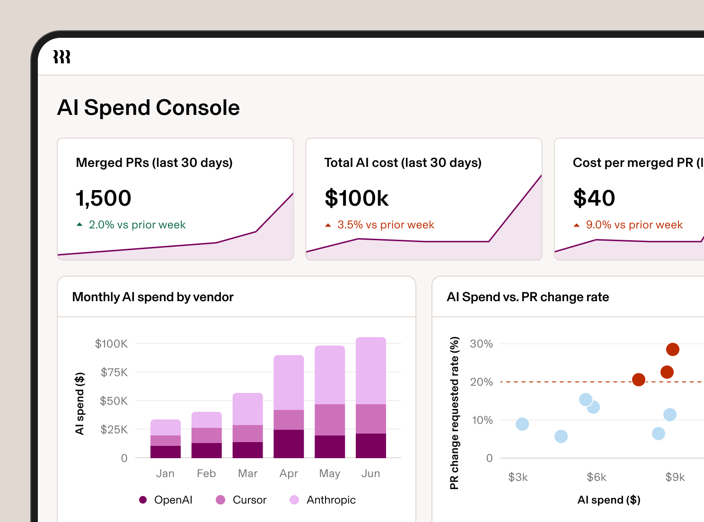
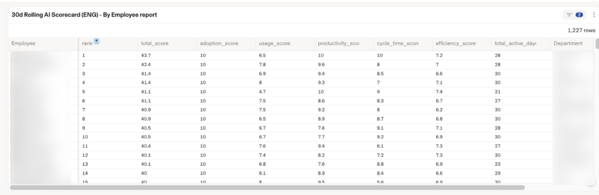

# AI 지출 옆에 재작업률을 놓은 리플링의 직원 점수표

_월 5만 달러를 쓴 엔지니어가 나온 뒤 프롬프트와 PR과 리뷰 재작업을 엮어 만든 AI Spend Console_

## Executive Summary

> [!callout]
> 2026년 3월 리플링(Rippling)의 경영 회의에 올라온 보고는 이랬다. AI 토큰에 쓰는 돈이 R&D 인력 예산의 40%에 이르렀다. 인사·급여 소프트웨어를 파는 이 회사는 그때부터 AI 지출을 팀이 아니라 사람 단위로 재기 시작했고, 그 과정에서 만든 도구를 최근 외부 제품으로 내놓았다. 정작 중요한 건 절감액이 아니라 그 도구가 무엇을 지표로 삼았는가다.

> 명세서를 사람 단위로 쪼개자 직원의 10~15%가 전체 AI 지출의 약 60%를 쓰고 있었고, 그 안에 한 달에 5만 달러를 태운 엔지니어가 있었다. 눈여겨볼 대목은 그다음이다. 리플링의 점수표는 프롬프트 수와 PR 산출물 옆에 동료가 코드 리뷰에서 다시 하라고 요구한 빈도를 나란히 놓는다. 지출만 재면 많이 쓴 사람이 곧 열심히 일한 사람으로 읽히기 때문이다.

> 이 계산이 성립하려면 프롬프트 로그와 깃허브 PR, 리뷰 코멘트가 모두 같은 사람에게 연결돼 있어야 한다. 대부분의 조직은 그 연결 없이 AI 예산부터 늘렸다. 그래서 남는 질문이 둘이다. 우리는 AI의 효과를 잴 데이터를 애초에 남기고 있는가, 그리고 그 데이터를 개인 평가에 쓰기 시작하면 무엇을 미리 합의해야 하는가.

### 주요 수치

출처: [TechCrunch](https://techcrunch.com/2026/08/07/after-rippling-blew-millions-on-ai-in-months-it-built-an-employee-roi-tool/) · [Rippling](https://www.rippling.com/blog/introducing-ai-spend-console)

지출은 소수의 인원에게 몰려 있었고, 대응이 끝난 뒤에도 쓴 양 자체는 줄지 않았다.

<!-- stat-card -->
**$50,000** — 한 엔지니어의 월 AI 지출 — 사람 단위로 쪼개 보고 나서야 드러난 최고치

<!-- stat-card -->
**40% → 10~15%** — R&D 인건비 대비 토큰 지출 — 한도 협상과 모델 라우팅 이후 전망치

<!-- stat-card -->
**10~15% / 60%** — 인원 비중과 지출 비중 — 소수 인원이 전체 AI 지출의 절반 이상을 사용

<!-- stat-card -->
**6,000억** — 7월 사용 토큰 — 3월 피크와 비슷한 양, 비용은 4월 지출의 37%

## 한 엔지니어가 한 달에 5만 달러를 썼다

2026년 3월 리플링의 경영 회의에서 CFO 아담 스위에츠키(Adam Swiecicki)가 숫자 하나를 꺼냈다. 회사가 AI 토큰에 쓰는 돈이 R&D 헤드카운트 예산의 40%에 이르렀다는 것이었다. 월 증가율은 80%였다. 그 속도가 유지되면 이듬해에는 토큰 값이 R&D 인력 인건비의 90%에 육박할 참이었다. CPO 매트 맥이니스(Matt MacInnis)는 그때 반응을 "We were incredulous"라고 회고했다. 아무도 그 숫자를 믿지 못했다는 뜻이다.

경고가 나온 그달 리플링이 태운 토큰은 6,050억 개였다. 회사 전체 명세서로 보면 그냥 큰 숫자 하나다. 그래서 리플링은 그 명세서를 사람 단위로 쪼갰다. 그러자 분포가 드러났다. 직원의 10~15%가 전체 AI 지출의 약 60%를 쓰고 있었고, 그 안에 한 달에 5만 달러를 쓴 엔지니어가 있었다.

이런 쏠림이 리플링만의 사정은 아니다. AI 지출 벤치마크를 모아 온 Rize의 2026년 집계에서 기업의 1인당 연간 AI 지출은 평균 2,068달러였는데, 상위 10%는 2,800달러를 넘었고 중위값은 200달러에 못 미쳤다. 열네 배 차이다. 회사 평균만 보면 이 격차는 드러나지 않는다. 총액을 인원수로 나눈 평균을 실제로 쓴 사람은 아무도 없다.

이 지점이 이번 사건의 첫 번째 교훈이다. 총액만 보던 회사는 지출이 왜 늘었는지 설명할 수 없다. 같은 데이터를 사람 단위로 다시 세는 순간에야 문제가 어디에 있는지가 보인다. 그리고 그렇게 쪼개 놓고 나면, 곧바로 다음 질문이 따라온다. 이 사람들은 그 돈으로 무엇을 만들었나.

## 낭비한 건 사람이 아니라 기본값이었다

이런 숫자를 보면 자연스럽게 누가 흥청망청 썼는지를 찾게 된다. 리플링의 진단은 달랐다. 값비싼 기본값이 그냥 표준이었다는 것이다. 회사 설명은 이렇다. 가장 새로 나온 모델이 fast mode로 맞춰져 있었고, 그건 회사가 그렇게 결정해서가 아니라 아무도 그 설정을 들여다보고 기준을 세운 적이 없기 때문이었다. 문법을 다듬는 일에도 프론티어 모델이 붙어 있었다.

대응은 두 갈래로 갔다. 하나는 협상이다. 커서, 오픈AI, 앤트로픽처럼 쓰는 도구마다 지출 한도를 걸었다. 다른 하나는 배관이다. 작업의 성격에 따라 더 싼 모델로 요청을 보내는 AI 게이트웨이를 세웠다. 프론티어 모델보다 85%가량 저렴하면서 결과는 비슷한 GLM 5.2 같은 선택지가 그 라우팅의 목적지가 됐다.

*▲ AI Spend Console 대시보드. 벤더별(OpenAI·Cursor·Anthropic) 월간 지출과 함께 AI 지출 대비 PR 재작업 요청률 산점도를 보여준다. | Source: [Rippling](https://www.rippling.com/blog/introducing-ai-spend-console)*

효과는 사용량이 아니라 단가에서 났다. 7월 내부 사용량은 다시 6,000억 토큰으로 경고가 나온 3월의 피크와 비슷했는데, 비용은 4월 토큰 지출의 37% 수준이었다. R&D 인건비 대비 토큰 지출 전망도 40%에서 10~15%로 내려왔다. 맥이니스의 설명은 짧다. 이제는 더 효율적인 모델로 라우팅하기 때문이라는 것이다. 직원들에게 AI를 덜 쓰라고 말한 결과가 아니다.

여기까지는 비용 이야기다. 연간 수천만 달러가 걸린 문제이니 그 자체로 작지 않지만, 더 오래 남을 결과는 다음 단계에서 나왔다.

## 지출만 재면 많이 쓴 사람이 열심인 사람이 된다

리플링은 이 과정에서 쓴 내부 도구를 AI Spend Console이라는 이름으로 제품화했다. 기능은 세 가지다. 팀과 역할, 부서별로 비용을 쪼개고, 그 지출을 업무 지표에 붙여 비효율을 찾아내고, 모델 접근 정책을 걸어 값싼 모델로 요청을 보낸다. 관건은 두 번째다. 지출을 무엇 옆에 놓고 볼 것인가.

회사가 공개한 AI Scorecard는 직원 한 명을 다섯 지표, 총 47.5점으로 본다. 도입과 사용은 얼마나 자주, 얼마나 깊게 쓰는지를 재고, 생산성과 사이클타임은 그 사용이 무엇으로 나왔는지를 잰다. 마지막 효율 지표가 산출물과 지출을 하나의 비율로 묶는다.

*▲ AI Scorecard의 직원별(By Employee) 리포트 화면. 아래 표의 다섯 지표가 실제로는 이런 순위표로 계산된다. | Source: [Rippling](https://www.rippling.com/blog/introducing-ai-spend-console)*

| 지표 | 배점 | 무엇을 보는가 |
| --- | --- | --- |
| 도입(Adoption) | 10 | 매일 에이전틱하게 프롬프트를 넣는 빈도 |
| 사용(Usage) | 10 | AI 도구를 얼마나 깊게 쓰는가 |
| 생산성(Productivity) | 10 | PR 수, 코드 줄 수 같은 산출물 |
| 사이클타임(Cycle time) | 10 | PR이 병합되기까지 걸린 시간 |
| 효율(Efficiency) | 7.5 | 산출물 대비 AI 지출 비율 |

점수표만 놓고 보면 흔한 개발 생산성 대시보드처럼 보인다. 차이는 리플링이 이 지표들로 무엇을 물었는지에 있다. 맥이니스가 든 질문은 이렇다. AI 지출은 높은데, 동료들이 코드 리뷰에서 자꾸 다시 하라고 요구하는 엔지니어는 누구인가.

> [!callout]
> 비용 지표 하나만으로는 이 사람을 찾을 수 없다. 지출이 큰 사람은 그냥 일을 많이 하는 사람으로 읽힌다. 반대로 재작업 빈도만 보면 AI와 무관한 신입의 학습 곡선까지 같이 잡힌다. 두 신호를 나란히 놓아야 비로소 돈은 많이 쓰는데 결과물은 동료가 되돌려 보내는 경우가 분리된다. 지출 지표 옆에 품질 신호를 두는 이 배치가 이번 사례에서 가장 옮겨 쓸 만한 설계다.

점수표를 다시 보면 걸리는 대목이 하나 있다. 47.5점 가운데 40점이 얼마나 자주 쓰고 얼마나 많이, 얼마나 빨리 냈는지에 걸려 있고, 남은 7.5점만 그 산출물이 지출에 비해 적절했는지를 본다. 결과물이 쓸 만했는지를 재는 칸은 어디에도 없다. 그러니까 리플링이 그 사람을 찾아낸 방법은 점수표 안에 품질 항목을 하나 더 만든 것이 아니었다. 점수표 바깥에 있던 코드 리뷰 기록을 지출 옆으로 끌어온 것이었다.

리플링이 같은 데이터에서 확인한 사실 하나가 이 판단을 뒷받침한다. 회사가 본 생산성 신호는 실재했지만 선형이 아니었다. 커서 같은 도구를 많이 쓰는 엔지니어가 PR을 더 많이 내보낸 건 맞는데, 향상의 대부분은 처음 도입하는 구간에서 나왔고 프론티어 모델에 돈을 더 쓴다고 그만큼 더 나아지지는 않았다. 지출을 성과의 대리 지표로 쓰면 안 되는 이유가 회사 자신의 데이터에 남은 셈이다.

## 흩어진 로그로는 이 질문을 던질 수 없다

그런데 이 질문에는 조건이 하나 붙는다. 지출과 재작업을 나란히 놓으려면, 벤더 콘솔에 쌓인 토큰 사용량과 깃허브의 PR, 리뷰 코멘트가 모두 같은 사람에게 붙어 있어야 한다. 리플링이 이 계산을 할 수 있었던 건 점수표를 잘 설계해서가 아니라, 그 아래에 사람을 축으로 삼는 데이터 계층을 먼저 깔아 두었기 때문이다.

회사가 Employee Graph라고 부르는 구조가 그 계층이다. 외부 데이터가 들어오면 이메일이나 사번, 사용자명 같은 참조 필드를 자동으로 찾아 직원 프로필에 매핑한다. 회사는 이렇게 설명한다. 깃허브 풀 리퀘스트는 흐르는 행(row)으로 취급되지 않는다. 그건 한 직원과 그 사람의 팀, 역할, 부서에 연결된 레코드다.

로그를 남기는 일과, 그 로그를 판단에 쓸 수 있는 데이터로 만드는 일은 다르다. 대부분의 조직에 로그 자체는 이미 있다. 다만 프롬프트 기록은 벤더 대시보드에, 코드 산출물은 깃허브에, 리뷰 코멘트는 또 다른 도구에 각각 고여 있고, 세 곳의 식별자가 서로 이어지지 않는다. 그 상태에서는 AI 지출을 아무리 정밀하게 집계해도 그 돈이 무엇으로 바뀌었는지 물을 수 없다.
