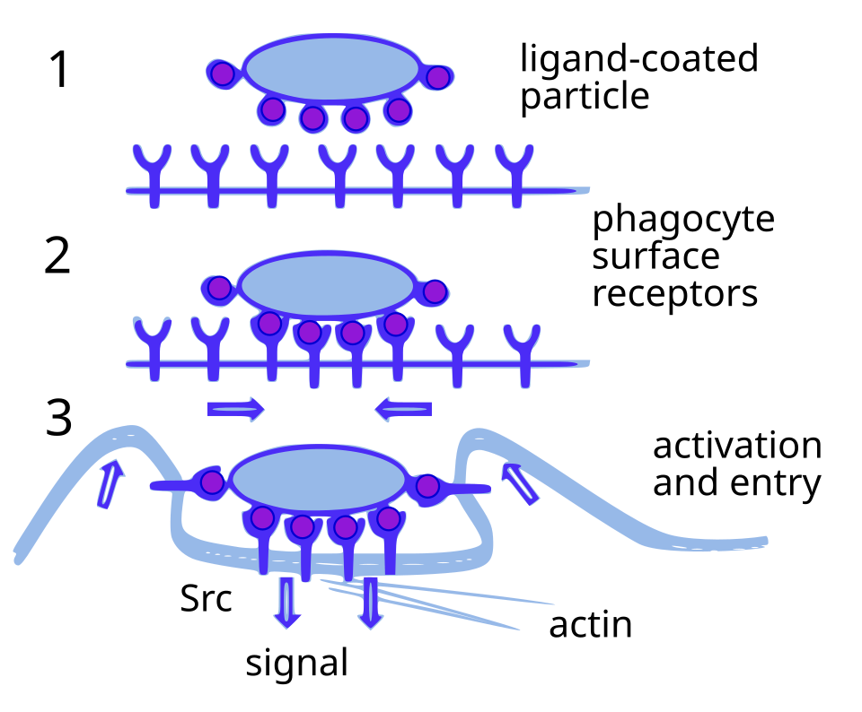
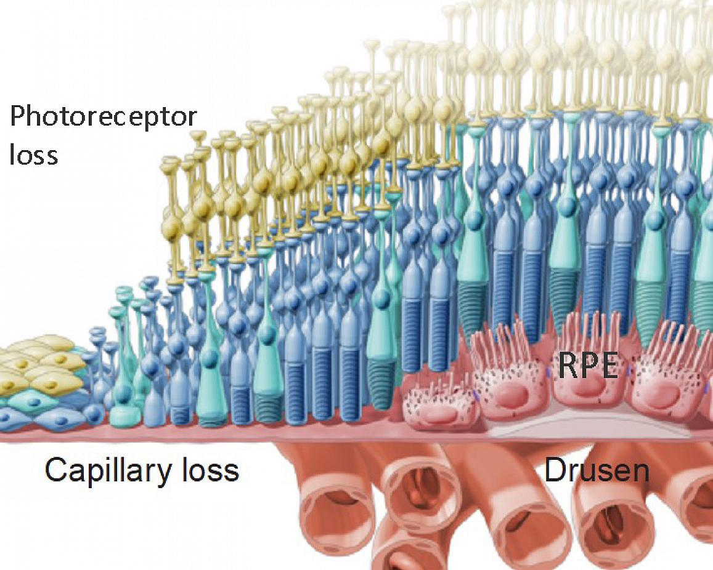
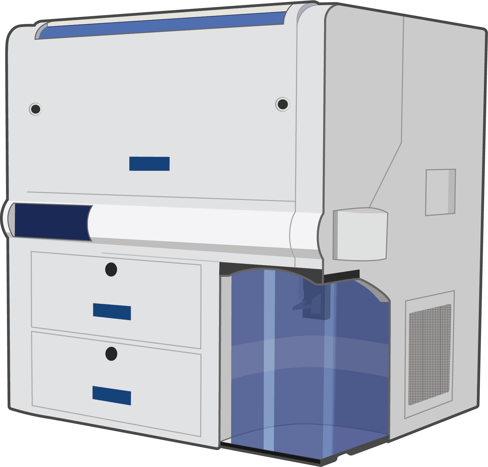

# A Multi-Agent AI Picked a Drug Candidate for Blindness

_Robin picked a dry AMD drug candidate on its own—yet the last word still belonged to humans_

## Executive Summary

> [!callout]
> For the first time, AI agents autonomously completed the full intellectual arc of scientific research: forming a hypothesis, designing the experiments, and interpreting the results. Robin, a multi-agent system built by FutureHouse, took dry age-related macular degeneration (dAMD), a blinding disease with almost no treatment options, as its input, read the literature, narrowed down candidate compounds, and named the glaucoma drug ripasudil as a candidate for a new indication. The only thing human scientists did was run the bench experiments. The result was published in **Nature** in 2026.

> But the same paper contains a more interesting number. The AI analysis module reported that ripasudil boosted phagocytosis to 7.5x the control. When humans re-analyzed the same data, the figure came out at 1.75x, a gap of more than fourfold. It is a signal that the faster AI pours out hypotheses, the heavier the burden of humans having to look back over those results becomes.

> How Robin picked a drug candidate on its own cannot be separated from the questions that process raised about data quality and verification. The faster the automation runs, the faster the pile of data humans have to check grows alongside it. That paradox of speed is the real lesson this case leaves behind.

<!-- stat-card -->
**500 papers / 30 min** — Literature review speed — Papers Robin read and synthesized from a single prompt

<!-- stat-card -->
**200x** — Research time saved — FutureHouse estimate vs. a conventional workflow

<!-- stat-card -->
**7.5x → 1.75x** — AI vs. human re-analysis — A 4x gap in interpreting the phagocytosis effect

<!-- stat-card -->
**0% → 45%** — Hallucinated references — When the search agent was swapped for o4-mini

## Three Agents Split the Research

Robin is not a single model but a system of three agents with distinct roles. **Crow** and **Falcon** search the literature, form hypotheses, and design experiments. **Finch** takes in biological data such as RNA sequencing or flow cytometry and analyzes and interprets it. The hypotheses, experimental plans, data analyses, and figures in the paper were all generated by these three agents. The part left to human scientists was the physical work that needs hands: holding a pipette, culturing cells.

The research started from a single phrase. Given the topic "dry age-related macular degeneration," Robin read and synthesized more than 500 papers in 30 minutes. From there it settled on strengthening phagocytosis in retinal pigment epithelium (RPE) cells as a treatment strategy, and designed the flow cytometry assay to measure that effect. It then narrowed a screening list down to 30 compounds and, as results came in, re-interpreted them to form the next hypothesis, running the cycle on its own.

*▲ Three-step phagocytosis mechanism — the biological basis for Robin's strategy of boosting RPE cell phagocytosis to clear retinal waste | Source: [Wikimedia Commons](https://commons.wikimedia.org/wiki/File:Phagocytosis_in_three_steps.svg)*

What stands out is exactly where the human dropped out. AI took on the entire "intellectual" part of research: hypothesis generation, experimental design, result interpretation. FutureHouse reports that the work took 2.5 months from planning to manuscript submission, and estimates that, compared with conventional methods, it cut researcher time by roughly 200x. The result was published in **Nature** in 2026, and FutureHouse released it at the same time as an [official announcement](https://www.futurehouse.org/research-announcements/demonstrating-end-to-end-scientific-discovery-with-robin-a-multi-agent-system).

## From 30 Candidates to Ripasudil

Dry age-related macular degeneration is a leading cause of irreversible blindness in developed countries. In the United States alone, 1.5 million people are in a vision-threatening state and 600,000 are legally blind, with the patient population expected to triple by 2050. Yet effective treatment options are scarce. One axis of the disease is retinal cells failing to clear waste, which then accumulates, so Robin set its strategy on raising that waste clearance, the phagocytosis of RPE cells.

*▲ Dry AMD retinal pathology — drusen accumulate beneath RPE cells while photoreceptors deteriorate, causing progressive vision loss | Source: [National Eye Institute / Wikimedia Commons](https://commons.wikimedia.org/wiki/File:Illustration_of_Dry_AMD_(48608255362).jpg)*

After narrowing 30 candidates, the drug Robin ultimately named was **ripasudil**. Ripasudil inhibits Rho-associated kinase (ROCK) and is already approved and in use as a glaucoma treatment in Japan. This is the first time it has been proposed as a candidate for dry AMD. Because it is a repurposing approach (linking an already-marketed, safety-tested drug to a new indication), it is also well positioned to move straight into follow-up experiments.

Beyond ripasudil, Robin confirmed that KL001, a compound that modulates the circadian clock, enhances phagocytosis, and it pinpointed a molecular mechanism in which ABCA1 (a pump that exports lipids out of the cell) is upregulated roughly threefold. It did not stop at throwing out a single candidate; it also offered the pathway for why that candidate might work. That AI went beyond "what to test" to generate hypotheses about "why" is the reason this study drew attention.

## Where 7.5x Fell to 1.75x

Behind the headline is a limit the same paper records honestly. Finch, the agent handling data analysis, reported that ripasudil boosted phagocytosis to 7.5x the control (DMSO). But when human scientists re-analyzed the same flow cytometry data, the figure came down to 1.75x. The paper explains the difference as a difference in analytical methodology, yet a gap of more than fourfold is the size that decides whether a candidate gets prioritized at all.

Look at where the gap came from and you find a scene familiar to any data professional. To turn flow cytometry results into a number like a fold-change, you first have to set the baseline for which cells count as "having phagocytosed." With the same raw data, shifting that threshold even slightly swings the fold-change considerably. The place where AI and humans split into 7.5x and 1.75x is exactly here. Who sets the rule for converting data into a number, and how, governed the size of the conclusion.

*▲ Flow Cytometer — the instrument used by Finch agent to measure phagocytosis. The 7.5x vs. 1.75x divergence arose from different gating thresholds applied to the same raw data | Source: [NIH BioArt / Wikimedia Commons](https://commons.wikimedia.org/wiki/File:Flow_Cytometer_(NIH_BioArt_160).png)*

> [!callout]
> That the direction agreed is meaningful. Both AI and humans reached the conclusion that "ripasudil works." But the **magnitude of the effect** diverged more than fourfold depending on who did the analysis. In drug development, effect size is the number that decides how much resource goes into the next experiment. If that number wobbles, it means you cannot take the AI analysis at face value.

It also became clear how the quality of the agent itself steers the result. When the team swapped the literature-search agent Crow for OpenAI's o4-mini, hallucinated references (citations that do not exist) jumped from 0% in the original to 45%. That means nearly half of the literature underpinning a hypothesis could be made up. Which model you use directly determined the trustworthiness of the data.

An analysis by [The Conversation](https://theconversation.com/new-ai-scientists-are-improving-but-reveal-their-fundamental-limits-283281) generalizes this limit further. Finch underperformed on statistics and bioinformatics tasks; it navigates "knowledge expressed in language" well but showed its limits in the face of nature's actual mechanisms. The gap is that language is vague and loose, while science has to be precise. AI reading the literature fast to produce a plausible hypothesis is one thing; whether that hypothesis is actually correct is another.

## Speed Is the Verification Burden

Here is a paradox familiar to data professionals. Robin can generate dozens of hypotheses in a week. But the speed at which those hypotheses can actually be verified in a test tube does not rise to match. As the gap widens between the volume of hypotheses AI produces and the volume humans can verify, the bottleneck moves from hypothesis generation to verification.

The 7.5x-vs-1.75x divergence and the jump in hallucinated references from 0% to 45% all point to the same place. **The bottleneck is, in the end, the quality of the data and the grounding of the experiments.** Without hallucination-free literature analysis, accurate numerical interpretation, and reproducible experimental design to back it up, no amount of hypotheses gets past the verification stage. The faster the "AI scientist" gets, the more the verification infrastructure and data quality that filter its output matter.

This structure is not specific to drug development. The same thing happens in every pipeline where AI agents automatically pour out analysis results or the grounds for a decision. As output speeds up, the work of checking whether that output keeps its feet on the facts grows in proportion. Contrary to the expectation that automation will reduce human work, it actually creates a new kind of work: verification.

So what Robin proved is two things. The possibility that AI agents can autonomously complete the intellectual process of scientific research, and the fact that trusting the result still requires human verification. The final judgment remained the human's job—and the faster automation gets, that share does not shrink but grows.

Thanks for reading. If you have thoughts or questions about AI automation and data verification, we'd love to hear them.

**Pebblous Data Communication Team**  
June 20, 2026

## References

- 1.Ghareeb, A.E., Chang, B., Mitchener, L. et al. (2026). "A multi-agent system for automating scientific discovery." _Nature_. [doi.org/10.1038/s41586-026-10652-y](https://doi.org/10.1038/s41586-026-10652-y)
- 2.FutureHouse (2026). "Demonstrating end-to-end scientific discovery with Robin, a multi-agent system." [futurehouse.org](https://www.futurehouse.org/research-announcements/demonstrating-end-to-end-scientific-discovery-with-robin-a-multi-agent-system)
- 3.The Conversation (2026). "New AI scientists are improving but reveal their fundamental limits." [theconversation.com](https://theconversation.com/new-ai-scientists-are-improving-but-reveal-their-fundamental-limits-283281)
